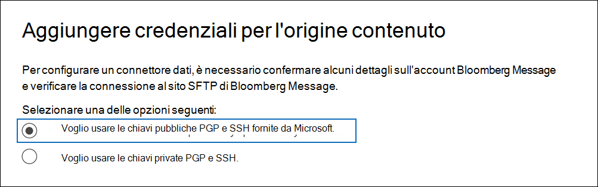
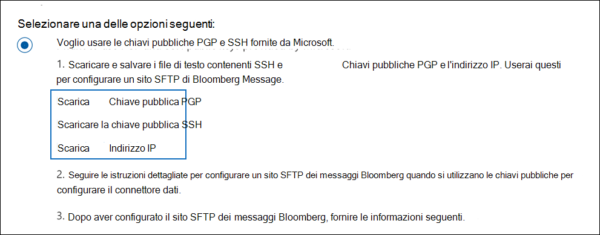
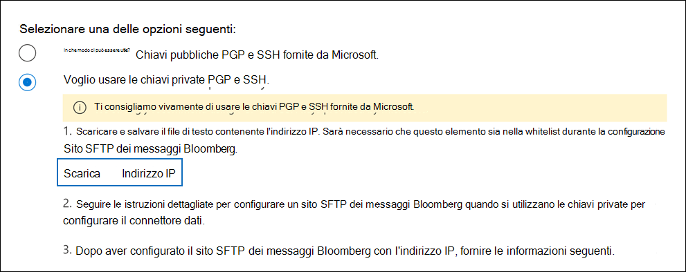
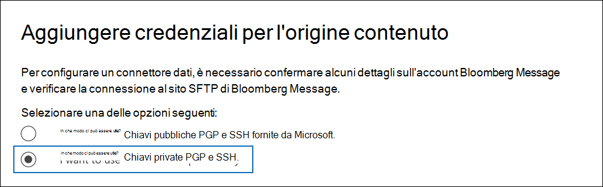

# Configurare un connettore per archiviare i dati dei messaggi bloombergSet up a connector to archive Bloomberg Message data

Utilizzare un connettore dati nel centro Microsoft 365 conformità per importare e archiviare i dati di posta elettronica dei servizi finanziari dallo strumento di collaborazione [Bloomberg Message.](https://www.bloomberg.com/professional/product/collaboration/)Use a data connector in the Microsoft 365 compliance center to import and archive financial services email data from the [Bloomberg Message](https://www.bloomberg.com/professional/product/collaboration/) collaboration tool. Dopo aver configurato e configurato un connettore, si connette al sito FTP protetto (SFTP) dell'organizzazione una volta al giorno e importa gli elementi di posta elettronica nelle cassette postali in Microsoft 365.After you set up and configure a connector, it connects to your organization's Bloomberg secure FTP (SFTP) site once every day, and imports email items to mailboxes in Microsoft 365.

Dopo l'archiviazione dei dati dei messaggi Bloomberg nelle cassette postali degli utenti, è possibile applicare ai dati dei messaggi bloomberg funzionalità di conformità Microsoft 365 quali conservazione per controversia legale, ricerca contenuto, archiviazione sul posto, controllo, conformità delle comunicazioni e criteri di conservazione Microsoft 365.After Bloomberg Message data is stored in user mailboxes, you can apply Microsoft 365 compliance features such as Litigation hold, content search, In-place archiving, auditing, Communication compliance, and Microsoft 365 retention policies to Bloomberg Message data. Ad esempio, è possibile cercare i messaggi di posta elettronica bloomberg utilizzando lo strumento di ricerca contenuto o associare la cassetta postale che contiene i dati del messaggio Bloomberg a un responsabile in un caso Advanced eDiscovery caso.For example, you can search Bloomberg Message emails using the content search tool or associate the mailbox that contains the Bloomberg Message data with a custodian in an Advanced eDiscovery case. L'utilizzo di un connettore di messaggi Bloomberg per importare e archiviare i dati in Microsoft 365 può aiutare l'organizzazione a rimanere conforme ai criteri governativi e normativi.Using a Bloomberg Message connector to import and archive data in Microsoft 365 can help your organization stay compliant with government and regulatory policies.

## Panoramica dell'archiviazione dei dati dei messaggi BloombergOverview of archiving Bloomberg Message data

Nella panoramica seguente viene illustrato il processo di utilizzo di un connettore per archiviare i dati dei messaggi Bloomberg in Microsoft 365.The following overview explains the process of using a connector to archive Bloomberg Message data in Microsoft 365.

1. L'organizzazione collabora con Bloomberg per configurare un sito SFTP bloomberg.Your organization works with Bloomberg to set up a Bloomberg SFTP site. Potrai inoltre collaborare con Bloomberg per configurare Bloomberg Message in modo da copiare i messaggi di posta elettronica nel sito SFTP di Bloomberg.You'll also work with Bloomberg to configure Bloomberg Message to copy email messages to the Bloomberg SFTP site.

2. Una volta ogni 24 ore, i messaggi di posta elettronica provenienti da Bloomberg Message vengono copiati nel sito SFTP di Bloomberg.Once every 24 hours, email messages from Bloomberg Message are copied to the Bloomberg SFTP site.

3. Il connettore di messaggi Bloomberg creato nel Centro conformità Microsoft 365 si connette ogni giorno al sito SFTP di Bloomberg e trasferisce i messaggi di posta elettronica dalle 24 ore precedenti a un'area di Archiviazione di Azure sicura in Microsoft Cloud.The Bloomberg Message connector that you create in the Microsoft 365 compliance center connects to the Bloomberg SFTP site every day and transfers the email messages from the previous 24 hours to a secure Azure Storage area in the Microsoft Cloud.

4. Il connettore importa gli elementi dei messaggi di posta elettronica nella cassetta postale di un utente specifico.The connector imports the email message items to the mailbox of a specific user. Viene creata una nuova cartella denominata BloombergMessage nella cassetta postale dell'utente specifico e gli elementi verranno importati in essa.A new folder named BloombergMessage is created in the specific user's mailbox and the items will be imported to it.

   Il connettore esegue questa operazione utilizzando il valore della proprietà CorporateEmailAddress.The connector does this by using the value of the CorporateEmailAddress property. Ogni messaggio di posta elettronica contiene questa proprietà, che viene popolata con l'indirizzo di posta elettronica di ogni partecipante del messaggio di posta elettronica.Every email message contains this property, which is populated with the email address of every participant of the email message. Oltre al mapping automatico degli utenti utilizzando il valore della *proprietà CorporateEmailAddress,* è anche possibile definire un mapping personalizzato caricando un file di mapping CSV.In addition to automatic user mapping using the value of the *CorporateEmailAddress* property, you can also define a custom mapping by uploading a CSV mapping file. Questo file di mapping contiene un UUID Bloomberg e l'indirizzo Microsoft 365 corrispondente per ogni utente dell'organizzazione.This mapping file contains a Bloomberg UUID and the corresponding Microsoft 365 mailbox address for each user in your organization. Se si abilita il mapping automatico degli utenti e si fornisce un mapping personalizzato, per ogni elemento di posta elettronica il connettore guarderà innanzitutto il file di mapping personalizzato.If you enable automatic user mapping and provide a custom mapping, for every email item the connector will first look at the custom-mapping file. Se non trova un utente Microsoft 365 valido che corrisponde all'UUID Bloomberg di un utente, il connettore utilizza la proprietà *CorporateEmailAddress* dell'elemento di posta elettronica.If it doesn't find a valid Microsoft 365 user that corresponds to a user's Bloomberg UUID, the connector uses the *CorporateEmailAddress* property of the email item. Se il connettore non trova un utente Microsoft 365 valido nel file di mapping personalizzato o nella proprietà *CorporateEmailAddress* dell'elemento di posta elettronica, l'elemento non verrà importato.If the connector doesn't find a valid Microsoft 365 user in either the custom-mapping file or the *CorporateEmailAddress* property of the email item, the item won't be imported.

## Prima di configurare un connettoreBefore you set up a connector

Alcuni dei passaggi di implementazione necessari per archiviare i dati dei messaggi bloomberg sono esterni a Microsoft 365 e devono essere completati prima di poter creare il connettore nel Centro conformità.Some of the implementation steps required to archive Bloomberg Message data are external to Microsoft 365 and must be completed before you can create the connector in the compliance center.

- Per configurare un connettore di messaggi Bloomberg, è necessario utilizzare chiavi e passphrase per Pretty Good Privacy (PGP) e Secure Shell (SSH).To set up a Bloomberg Message connector, you have to use keys and key passphrases for Pretty Good Privacy (PGP) and Secure Shell (SSH). Queste chiavi vengono utilizzate per configurare il sito SFTP di Bloomberg e utilizzate dal connettore per connettersi al sito SFTP di Bloomberg per importare i dati in Microsoft 365.These keys are used to configure the Bloomberg SFTP site and used by the connector to connect to the Bloomberg SFTP site to import data to Microsoft 365. La chiave PGP viene utilizzata per configurare la crittografia dei dati trasferiti dal sito SFTP bloomberg a Microsoft 365.The PGP key is used to configure the encryption of data that's transferred from the Bloomberg SFTP site to Microsoft 365. La chiave SSH viene utilizzata per configurare la shell sicura per abilitare un accesso remoto sicuro quando il connettore si connette al sito SFTP bloomberg.The SSH key is used to configure secure shell to enable a secure remote login when the connector connects to the Bloomberg SFTP site.

  Quando si configura un connettore, è possibile utilizzare le chiavi pubbliche e le passphrase fornite da Microsoft oppure è possibile utilizzare le proprie chiavi private e passphrase.When setting up a connector, you have the option to use public keys and key passphrases provided by Microsoft or you can use your own private keys and passphrases. Ti consigliamo di usare le chiavi pubbliche fornite da Microsoft.We recommend that you use the public keys provided by Microsoft. Tuttavia, se l'organizzazione ha già configurato un sito SFTP bloomberg utilizzando chiavi private, è possibile creare un connettore utilizzando le stesse chiavi private.However, if your organization has already configured a Bloomberg SFTP site using private keys, then you can create a connector using these same private keys.

- Iscriviti [a Bloomberg anywhere.](https://www.bloomberg.com/professional/product/remote-access/?bbgsum-page=DG-WS-PROF-PROD-BBA)Subscribe to [Bloomberg Anywhere](https://www.bloomberg.com/professional/product/remote-access/?bbgsum-page=DG-WS-PROF-PROD-BBA). Questa operazione è necessaria per poter accedere a Bloomberg via Internet per accedere al sito SFTP bloomberg che è necessario configurare.This is required so that you can log in to Bloomberg Anywhere to access the Bloomberg SFTP site that you have to set up and configure.

- Configurare un sito Bloomberg SFTP (Secure File Transfer Protocol).Set up a Bloomberg SFTP (Secure file transfer protocol) site. Dopo aver lavorato con Bloomberg per configurare il sito SFTP, i dati di Bloomberg Message vengono caricati ogni giorno nel sito SFTP.After working with Bloomberg to set up the SFTP site, data from Bloomberg Message is uploaded to the SFTP site every day. Il connettore creato nel passaggio 2 si connette a questo sito SFTP e trasferisce i dati di posta elettronica Microsoft 365 cassette postali.The connector you create in Step 2 connects to this SFTP site and transfers the email data to Microsoft 365 mailboxes. SFTP crittografa anche i dati del messaggio Bloomberg inviati alle cassette postali durante il processo di trasferimento.SFTP also encrypts the Bloomberg Message data that is sent to mailboxes during the transfer process.

  Per informazioni su Bloomberg SFTP (denominato anche *BB-SFTP):*For information about Bloomberg SFTP (also called *BB-SFTP*):

  - Vedere il documento "Standard di connettività SFTP" [all'indirizzo Bloomberg Support.](https://www.bloomberg.com/professional/support/documentation/)See the "SFTP Connectivity Standards" document at [Bloomberg Support](https://www.bloomberg.com/professional/support/documentation/).

  - Contattare [il supporto clienti Bloomberg.](https://service.bloomberg.com/portal/sessions/new?utm_source=bloomberg-menu&utm_medium=csc)Contact [Bloomberg customer support](https://service.bloomberg.com/portal/sessions/new?utm_source=bloomberg-menu&utm_medium=csc).

- Dopo aver collaborare con Bloomberg per configurare un sito SFTP, Bloomberg fornirà alcune informazioni dopo aver risposto al messaggio di posta elettronica di implementazione bloomberg.After you work with Bloomberg to set up an SFTP site, Bloomberg will provide some information to you after you respond to the Bloomberg implementation email message. Salvare una copia delle informazioni seguenti.Save a copy of the following information. Utilizzarlo per configurare un connettore nel passaggio 3.You use it to set up a connector in Step 3.

  - Codice della società, che è un ID per l'organizzazione e viene utilizzato per accedere al sito SFTP di Bloomberg.Firm code, which is an ID for your organization and is used to log in to the Bloomberg SFTP site.

  - Password per il sito SFTP bloombergPassword for your Bloomberg SFTP site

  - URL del sito SFTP bloomberg (ad esempio, sftp.bloomberg.com).URL for Bloomberg SFTP site (for example, sftp.bloomberg.com). Inoltre, Bloomberg può anche fornire un indirizzo IP corrispondente per il sito SFTP bloomberg, che può essere utilizzato anche per configurare il connettore.In addition, Bloomberg may also provide a corresponding IP address for the Bloomberg SFTP site, which also can be used to set up the connector.

  - Numero di porta per il sito SFTP bloombergPort number for Bloomberg SFTP site

- Il connettore Bloomberg Message può importare un totale di 200.000 elementi in un solo giorno.The Bloomberg Message connector can import a total of 200,000 items in a single day. Se nel sito SFTP sono presenti più di 200.000 elementi, nessuno di questi elementi verrà importato in Microsoft 365.If there are more than 200,000 items on the SFTP site, none of those items will be imported to Microsoft 365.

- All'utente che crea un connettore di messaggi Bloomberg nel passaggio 3 (e che scarica le chiavi pubbliche e l'indirizzo IP nel passaggio 1) deve essere assegnato il ruolo Esportazione importazione cassette postali in Exchange Online.The user who creates a Bloomberg Message connector in Step 3 (and who downloads the public keys and IP address in Step 1) must be assigned the Mailbox Import Export role in Exchange Online. Questa operazione è necessaria per aggiungere connettori nella pagina **Connettori** dati nel Centro Microsoft 365 conformità.This is required to add connectors in the **Data connectors** page in the Microsoft 365 compliance center. Per impostazione predefinita, questo ruolo non è assegnato ad alcun gruppo di ruoli in Exchange Online.By default, this role isn't assigned to any role group in Exchange Online. È possibile aggiungere il ruolo Esportazione importazione cassette postali al gruppo di ruoli Gestione organizzazione in Exchange Online.You can add the Mailbox Import Export role to the Organization Management role group in Exchange Online. In caso contrario, è possibile creare un gruppo di ruoli, assegnare il ruolo Importazione/Esportazione cassette postali e quindi aggiungere gli utenti appropriati come membri.Or you can create a role group, assign the Mailbox Import Export role, and then add the appropriate users as members. Per ulteriori informazioni, vedere le sezioni [Create role groups](/Exchange/permissions-exo/role-groups#create-role-groups) o Modify role [groups](/Exchange/permissions-exo/role-groups#modify-role-groups) nell'articolo "Manage role groups in Exchange Online".For more information, see the [Create role groups](/Exchange/permissions-exo/role-groups#create-role-groups) or [Modify role groups](/Exchange/permissions-exo/role-groups#modify-role-groups) sections in the article "Manage role groups in Exchange Online".

## Configurare un connettore con chiavi pubblicheSet up a connector using public keys

La procedura descritta in questa sezione illustra come configurare un connettore di messaggi Bloomberg utilizzando le chiavi pubbliche per Pretty Good Privacy (PGP) e Secure Shell (SSH).The steps in this section show you how to set up a Bloomberg Message connector using the public keys for Pretty Good Privacy (PGP) and Secure Shell (SSH).

### Passaggio 1: Ottenere le chiavi pubbliche PGP e SSHStep 1: Obtain PGP and SSH public keys

Il primo passaggio consiste nel ottenere una copia delle chiavi pubbliche PGP e SSH.The first step is to obtain a copy of the PGP and SSH public keys. Queste chiavi vengono utilizzate nel passaggio 2 per configurare il sito SFTP di Bloomberg in modo da consentire al connettore (creato nel passaggio 3) di connettersi al sito SFTP e trasferire i dati di posta elettronica del messaggio Bloomberg alle cassette postali di Microsoft 365.You use these keys in Step 2 to configure the Bloomberg SFTP site to allow the connector (that you create in Step 3) to connect to the SFTP site and transfer the Bloomberg Message email data to Microsoft 365 mailboxes. È inoltre possibile ottenere un indirizzo IP in questo passaggio, da utilizzare per la configurazione del sito SFTP bloomberg.You also obtain an IP address in this step, which you use when configuring the Bloomberg SFTP site.

1. Vai a <https://compliance.microsoft.com> e fai clic su **Connettori dati** nel riquadro di spostamento sinistro.Go to <https://compliance.microsoft.com> and click **Data connectors** in the left nav.

2. Nella pagina **Connettori dati** in **Messaggio Bloomberg** fare clic su **Visualizza.**On the **Data connectors** page under **Bloomberg Message**, click **View**.

3. Nella pagina **Bloomberg Message** product description fare clic su **Add connector**On the **Bloomberg Message** product description page, click **Add connector**

4. Nella pagina **Condizioni di servizio** fare clic su **Accetta.**On the **Terms of service** page, click **Accept**.

5. Nella pagina **Aggiungi credenziali per l'origine** contenuto fare clic su Voglio usare le chiavi pubbliche PGP e **SSH fornite da Microsoft.**On the **Add credentials for content source** page, click **I want to use PGP and SSH public keys provided by Microsoft**.

   

6. Nel passaggio 1, fare clic sulla chiave **Download SSH,** **download PGP key** e Download IP **address** links per salvare una copia di ogni file nel computer locale.Under step 1, click the **Download SSH key**, **Download PGP key**, and **Download IP address** links to save a copy of each file to your local computer.

   

   Questi file contengono gli elementi seguenti che vengono utilizzati per configurare il sito SFTP bloomberg nel passaggio 2:These files contain the following items that are used to configure the Bloomberg SFTP site in Step 2:

   - Chiave pubblica PGP: questa chiave viene utilizzata per configurare la crittografia dei dati trasferiti dal sito SFTP bloomberg a Microsoft 365.PGP public key: This key is used to configure the encryption of data that's transferred from the Bloomberg SFTP site to Microsoft 365.

   - Chiave pubblica SSH: questa chiave viene utilizzata per configurare la shell sicura per abilitare un accesso remoto sicuro quando il connettore si connette al sito SFTP bloomberg.SSH public key: This key is used to configure secure shell to enable a secure remote login when the connector connects to the Bloomberg SFTP site.

   - Indirizzo IP: il sito SFTP bloomberg è configurato per accettare le richieste di connessione da questo indirizzo IP.IP address: The Bloomberg SFTP site is configured to accept connection requests from this IP address. Lo stesso indirizzo IP viene utilizzato dal connettore Bloomberg Message per connettersi al sito SFTP e trasferire i dati del messaggio Bloomberg Microsoft 365.The same IP address is used by the Bloomberg Message connector to connect to the SFTP site and transfer Bloomberg Message data to Microsoft 365.

7. Fare **clic su** Annulla per chiudere la procedura guidata.Click **Cancel** to close the wizard. Si torna a questa procedura guidata nel passaggio 3 per creare il connettore.You come back to this wizard in Step 3 to create the connector.

### Passaggio 2: Configurare il sito SFTP bloombergStep 2: Configure the Bloomberg SFTP site

> [!NOTE]
> Se l'organizzazione ha precedentemente configurato un sito SFTP bloomberg per archiviare i dati di Instant Bloomberg utilizzando chiavi PGP e SSH pubbliche, non è necessario configurarne un altro.If your organization has previously set up a Bloomberg SFTP site to archive Instant Bloomberg data using public PGP and SSH keys, you don't have to set up another one. È possibile specificare lo stesso sito SFTP quando si crea il connettore nel passaggio 3.You can specify the same SFTP site when you create the connector in Step 3.

Il passaggio successivo consiste nell'usare le chiavi pubbliche PGP e SSH e l'indirizzo IP ottenuto nel passaggio 1 per configurare la crittografia PGP e l'autenticazione SSH per il sito SFTP bloomberg.The next step is to use the PGP and SSH public keys and the IP address that you obtained in Step 1 to configure PGP encryption and SSH authentication for the Bloomberg SFTP site. Ciò consente al connettore di messaggi Bloomberg creato nel passaggio 3 di connettersi al sito SFTP di Bloomberg e di trasferire i dati del messaggio Bloomberg Microsoft 365.This lets the Bloomberg Message connector that you create in Step 3 connect to the Bloomberg SFTP site and transfer Bloomberg Message data to Microsoft 365. È necessario collaborare con il supporto clienti Bloomberg per configurare il sito SFTP bloomberg.You need to work with Bloomberg customer support to set up your Bloomberg SFTP site. Contattare [il supporto clienti Bloomberg](https://service.bloomberg.com/portal/sessions/new?utm_source=bloomberg-menu&utm_medium=csc) per assistenza.Contact [Bloomberg customer support](https://service.bloomberg.com/portal/sessions/new?utm_source=bloomberg-menu&utm_medium=csc) for assistance.

> [!IMPORTANT]
> Bloomberg consiglia di allegare i tre file scaricati nel passaggio 1 a un messaggio di posta elettronica e inviarli al team di supporto dei clienti quando si lavora con loro per configurare il sito SfTP bloomberg.Bloomberg recommends that you attach the three files that you downloaded in Step 1 to an email message and send it to their customer support team when working with them to set up your Bloomberg SFTP site.

### Passaggio 3: Creare un connettore di messaggi BloombergStep 3: Create a Bloomberg Message connector

L'ultimo passaggio consiste nel creare un connettore di messaggi Bloomberg nel Centro Microsoft 365 conformità.The last step is to create a Bloomberg Message connector in the Microsoft 365 compliance center. Il connettore utilizza le informazioni fornite per connettersi al sito SFTP bloomberg e trasferire i messaggi di posta elettronica alle caselle delle cassette postali dell'utente corrispondenti in Microsoft 365.The connector uses the information you provide to connect to the Bloomberg SFTP site and transfer email messages to the corresponding user mailbox boxes in Microsoft 365.

1. Vai a <https://compliance.microsoft.com> e fai clic su **Connettori dati** nel riquadro di spostamento sinistro.Go to <https://compliance.microsoft.com> and click **Data connectors** in the left nav.

2. Nella pagina **Connettori dati** in **Messaggio Bloomberg** fare clic su **Visualizza.**On the **Data connectors** page under **Bloomberg Message**, click **View**.

3. Nella pagina **Bloomberg Message** product description fare clic su **Add connector**On the **Bloomberg Message** product description page, click **Add connector**

4. Nella pagina **Condizioni di servizio** fare clic su **Accetta.**On the **Terms of service** page, click **Accept**.

5. Nella pagina **Aggiungi credenziali per l'origine** contenuto fare clic su Voglio usare le chiavi pubbliche PGP e **SSH fornite da Microsoft.**On the **Add credentials for content source** page, click **I want to use PGP and SSH public keys provided by Microsoft**.

6. In Passaggio 3 immettere le informazioni necessarie nelle caselle seguenti e quindi fare clic su **Convalida connessione**.Under Step 3, enter the required information in the following boxes and then click **Validate connection**.

      - **Nome:** Nome del connettore.**Name:** The name for the connector. Deve essere univoco nell'organizzazione.It must be unique in your organization.

      - **Codice fermo:** ID dell'organizzazione utilizzato come nome utente per il sito SFTP bloomberg.**Firm code:** The ID for your organization that is used as the username for the Bloomberg SFTP site.

      - **Password:** Password per il sito SFTP Bloomberg dell'organizzazione.**Password:** The password for your organization's Bloomberg SFTP site.

      - **URL SFTP:** L'URL per il sito SFTP di Bloomberg (ad esempio, `sftp.bloomberg.com` ).**SFTP URL:** The URL for the Bloomberg SFTP site (for example, `sftp.bloomberg.com`). È inoltre possibile utilizzare un indirizzo IP per questo valore.You can also use an IP address for this value.

      - **Porta SFTP:** Numero di porta per il sito SFTP bloomberg.**SFTP port:** The port number for the Bloomberg SFTP site. Il connettore utilizza questa porta per connettersi al sito SFTP.The connector uses this port to connect to the SFTP site.

7. Dopo aver convalidato correttamente la connessione, fare clic su **Avanti.**After the connection is successfully validated, click **Next**.

8. Nella pagina **Map Bloomberg Message users to Microsoft 365 users** abilita il mapping automatico degli utenti e fornisci il mapping utente personalizzato in base alle esigenze.On the **Map Bloomberg Message users to Microsoft 365 users** page, enable automatic user mapping and provide custom user mapping as required.

   > [!NOTE]
   > Il connettore importa gli elementi dei messaggi nella cassetta postale di un utente specifico.The connector imports message items to the mailbox of a specific user. Viene creata una **nuova cartella denominata BloombergMessage** nella cassetta postale dell'utente specifico e gli elementi verranno importati in essa.A new folder named **BloombergMessage** is created in the specific user's mailbox and the items will be imported to it. Il connettore utilizza il valore della *proprietà CorporateEmailAddress.*The connector does by using the value of the *CorporateEmailAddress* property. Ogni messaggio di chat contiene questa proprietà e la proprietà viene popolata con l'indirizzo di posta elettronica di ogni partecipante del messaggio di chat.Every chat message contains this property, and the property is populated with the email address of every participant of the chat message. Oltre al mapping automatico degli utenti utilizzando il valore della *proprietà CorporateEmailAddress,* è anche possibile definire il mapping personalizzato caricando un file di mapping CSV.In addition to automatic user mapping using the value of the *CorporateEmailAddress* property, you can also define custom mapping by uploading a CSV mapping file. Il file di mapping deve contenere l'UUID Bloomberg e l'indirizzo Microsoft 365 corrispondente per ogni utente.The mapping file should contain the Bloomberg UUID and corresponding Microsoft 365 mailbox address for each user. Se si abilita il mapping automatico degli utenti e si fornisce un mapping personalizzato, per ogni elemento del messaggio il connettore guarderà innanzitutto il file di mapping personalizzato.If you enable automatic user mapping and provide a custom mapping, for every message item the connector will first look at custom mapping file. Se non trova un utente Microsoft 365 valido che corrisponde all'UUID Bloomberg di un utente, il connettore utilizzerà la proprietà *CorporateEmailAddress* dell'elemento di chat.If it doesn't find a valid Microsoft 365 user that corresponds to a user's Bloomberg UUID, the connector will use the *CorporateEmailAddress* property of the chat item. Se il connettore non trova un utente Microsoft 365 valido nel file di mapping personalizzato o nella proprietà *CorporateEmailAddress* dell'elemento del messaggio, l'elemento non verrà importato.If the connector doesn't find a valid Microsoft 365 user in either the custom mapping file or the *CorporateEmailAddress* property of the message item, the item won't be imported.

9. Fare **clic su** Avanti, rivedere le impostazioni e quindi fare clic su **Fine** per creare il connettore.Click **Next**, review your settings, and then click **Finish** to create the connector.

10. Passare alla **pagina Connettori dati** per visualizzare l'avanzamento del processo di importazione per il nuovo connettore.Go to the **Data connectors** page to see the progress of the import process for the new connector. Fare clic sul connettore per visualizzare la pagina a comparsa, che contiene informazioni sul connettore.Click the connector to display the flyout page, which contains information about the connector.

## Configurare un connettore con chiavi privateSet up a connector using private keys

La procedura descritta in questa sezione illustra come configurare un connettore di messaggi Bloomberg utilizzando le chiavi private PGP e SSH.The steps in this section show you how to set up a Bloomberg Message connector using PGP and SSH private keys. Questa opzione di configurazione del connettore è destinata alle organizzazioni che hanno già configurato un sito SFTP Bloomberg utilizzando chiavi private.This connector setup option is intended for organizations that have already configured a Bloomberg SFTP site using private keys.

### Passaggio 1: Ottenere un indirizzo IP per configurare il sito SFTP bloombergStep 1: Obtain an IP address to configure the Bloomberg SFTP site

> [!NOTE]
> Se l'organizzazione ha precedentemente configurato un sito SFTP bloomberg per archiviare i dati di Instant Bloomberg utilizzando le chiavi private PGP e SSH, non è necessario configurarne un altro.If your organization has previously configured a Bloomberg SFTP site to archive Instant Bloomberg data using PGP and SSH private keys, you don't have to configure another one. È possibile specificare lo stesso sito SFTP quando si crea il connettore nel passaggio 2.You can specify the same SFTP site when you create the connector in Step 2.

Se l'organizzazione ha utilizzato le chiavi private PGP e SSH per configurare un sito SFTP bloomberg, è necessario ottenere un indirizzo IP e fornirlo al supporto clienti Bloomberg.If your organization has used PGP and SSH private keys to set up a Bloomberg SFTP site, then you have to obtain an IP address and provide it to Bloomberg customer support. Il sito SFTP Bloomberg deve essere configurato per accettare richieste di connessione da questo indirizzo IP.The Bloomberg SFTP site must be configured to accept  connection requests from this IP address. Lo stesso indirizzo IP viene utilizzato dal connettore Bloomberg Message per connettersi al sito SFTP e trasferire i dati del messaggio Bloomberg Microsoft 365.The same IP address is used by the Bloomberg Message connector to connect to the SFTP site and transfer Bloomberg Message data to Microsoft 365.

Per ottenere l'indirizzo IP:To obtain the IP address:

1. Vai a <https://compliance.microsoft.com> e fai clic su **Connettori dati** nel riquadro di spostamento sinistro.Go to <https://compliance.microsoft.com> and click **Data connectors** in the left nav.

2. Nella pagina **Connettori dati** in **Messaggio Bloomberg** fare clic su **Visualizza.**On the **Data connectors** page under **Bloomberg Message**, click **View**.

3. Nella pagina **Bloomberg Message** product description fare clic su **Add connector**On the **Bloomberg Message** product description page, click **Add connector**

4. Nella pagina **Condizioni di servizio** fare clic su **Accetta.**On the **Terms of service** page, click **Accept**.

5. Nella pagina **Aggiungi credenziali per l'origine contenuto** fare clic su Voglio usare le chiavi private **PGP e SSH.**On the **Add credentials for content source** page, click **I want to use PGP and SSH private keys**.

6. Nel passaggio 1 fare clic **su Scarica indirizzo IP** per salvare una copia del file dell'indirizzo IP nel computer locale.Under step 1, click **Download IP address** to save a copy of the IP address file to your local computer.

   

7. Fare **clic su** Annulla per chiudere la procedura guidata.Click **Cancel** to close the wizard. Si torna a questa procedura guidata nel passaggio 2 per creare il connettore.You come back to this wizard in Step 2 to create the connector.

È necessario collaborare con il supporto clienti Bloomberg per configurare il sito SFTP bloomberg per accettare le richieste di connessione da questo indirizzo IP.You need to work with Bloomberg customer support to configure your Bloomberg SFTP site to accept connection requests from this IP address. Contattare [il supporto clienti Bloomberg](https://service.bloomberg.com/portal/sessions/new?utm_source=bloomberg-menu&utm_medium=csc) per assistenza.Contact [Bloomberg customer support](https://service.bloomberg.com/portal/sessions/new?utm_source=bloomberg-menu&utm_medium=csc) for assistance.

### Passaggio 2: Creare un connettore di messaggi BloombergStep 2: Create a Bloomberg Message connector

Dopo aver configurato il sito SFTP bloomberg, il passaggio successivo consiste nel creare un connettore di messaggi Bloomberg nel Centro Microsoft 365 conformità.After your Bloomberg SFTP site is configured, the next step is to create a Bloomberg Message connector in the Microsoft 365 compliance center. Il connettore utilizza le informazioni fornite per connettersi al sito SFTP bloomberg e trasferire i messaggi di posta elettronica alle caselle delle cassette postali dell'utente corrispondenti in Microsoft 365.The connector uses the information you provide to connect to the Bloomberg SFTP site and transfer email messages to the corresponding user mailbox boxes in Microsoft 365. Per completare questo passaggio, assicurarsi di disporre di copie delle stesse passphrase e delle stesse chiavi private utilizzate per configurare il sito SFTP di Bloomberg.To complete this step, be sure to have copies of the same private keys and key passphrases that you used to set up your Bloomberg SFTP site.

1. Vai a <https://compliance.microsoft.com> e fai clic su **Connettori dati** nel riquadro di spostamento sinistro.Go to <https://compliance.microsoft.com> and click **Data connectors** in the left nav.

2. Nella pagina **Connettori dati** in **Messaggio Bloomberg** fare clic su **Visualizza.**On the **Data connectors** page under **Bloomberg Message**, click **View**.

3. Nella pagina **Bloomberg Message** product description fare clic su **Add connector**On the **Bloomberg Message** product description page, click **Add connector**

4. Nella pagina **Condizioni di servizio** fare clic su **Accetta.**On the **Terms of service** page, click **Accept**.

5. Nella pagina **Aggiungi credenziali per l'origine contenuto** fare clic su Voglio usare le chiavi private **PGP e SSH.**On the **Add credentials for content source** page, click **I want to use PGP and SSH private keys**.

   

6. In Passaggio 3 immettere le informazioni necessarie nelle caselle seguenti e quindi fare clic su **Convalida connessione**.Under Step 3, enter the required information in the following boxes and then click **Validate connection**.

      - **Nome:** Nome del connettore.**Name:** The name for the connector. Deve essere univoco nell'organizzazione.It must be unique in your organization.

      - **Codice fermo:** ID dell'organizzazione utilizzato come nome utente per il sito SFTP bloomberg.**Firm code:** The ID for your organization that is used as the username for the Bloomberg SFTP site.

      - **Password:** Password per il sito SFTP Bloomberg dell'organizzazione.**Password:** The password for your organization's Bloomberg SFTP site.

      - **URL SFTP:** L'URL per il sito SFTP di Bloomberg (ad esempio, `sftp.bloomberg.com` ).**SFTP URL:** The URL for the Bloomberg SFTP site (for example, `sftp.bloomberg.com`). È inoltre possibile utilizzare un indirizzo IP per questo valore.You can also use an IP address for this value.

      - **Porta SFTP:** Numero di porta per il sito SFTP bloomberg.**SFTP port:** The port number for the Bloomberg SFTP site. Il connettore utilizza questa porta per connettersi al sito SFTP.The connector uses this port to connect to the SFTP site.

      - **Chiave privata PGP:** Chiave privata PGP per il sito SFTP bloomberg.**PGP private key:** The PGP private key for the Bloomberg SFTP site. Assicurarsi di includere l'intero valore della chiave privata, incluse le righe iniziale e finale del blocco di chiavi.Be sure to include the entire private key value, including the beginning and ending lines of the key block.

      - **Passphrase chiave PGP:** Passphrase per la chiave privata PGP.**PGP key passphrase:** The passphrase for the PGP private key.

      - **Chiave privata SSH:** Chiave privata SSH per il sito SFTP bloomberg.**SSH private key:** The SSH private key for the Bloomberg SFTP site. Assicurarsi di includere l'intero valore della chiave privata, incluse le righe iniziale e finale del blocco di chiavi.Be sure to include the entire private key value, including the beginning and ending lines of the key block.

      - **Passphrase chiave SSH:** Passphrase per la chiave privata SSH.**SSH key passphrase:** The passphrase for the SSH private key.

7. Dopo aver convalidato correttamente la connessione, fare clic su **Avanti.**After the connection is successfully validated, click **Next**.

8. Nella pagina **Map Bloomberg Message users to Microsoft 365 users** abilita il mapping automatico degli utenti e fornisci il mapping utente personalizzato in base alle esigenze.On the **Map Bloomberg Message users to Microsoft 365 users** page, enable automatic user mapping and provide custom user mapping as required.

   > [!NOTE]
   > Il connettore importa gli elementi dei messaggi nella cassetta postale di un utente specifico.The connector imports message items to the mailbox of a specific user. Viene creata una **nuova cartella denominata BloombergMessage** nella cassetta postale dell'utente specifico e gli elementi verranno importati in essa.A new folder named **BloombergMessage** is created in the specific user's mailbox and the items will be imported to it. Il connettore utilizza il valore della *proprietà CorporateEmailAddress.*The connector does by using the value of the *CorporateEmailAddress* property. Ogni messaggio di chat contiene questa proprietà e la proprietà viene popolata con l'indirizzo di posta elettronica di ogni partecipante del messaggio di chat.Every chat message contains this property, and the property is populated with the email address of every participant of the chat message. Oltre al mapping automatico degli utenti utilizzando il valore della *proprietà CorporateEmailAddress,* è anche possibile definire il mapping personalizzato caricando un file di mapping CSV.In addition to automatic user mapping using the value of the *CorporateEmailAddress* property, you can also define custom mapping by uploading a CSV mapping file. Il file di mapping deve contenere l'UUID Bloomberg e l'indirizzo Microsoft 365 corrispondente per ogni utente.The mapping file should contain the Bloomberg UUID and corresponding Microsoft 365 mailbox address for each user. Se si abilita il mapping automatico degli utenti e si fornisce un mapping personalizzato, per ogni elemento del messaggio il connettore guarderà innanzitutto il file di mapping personalizzato.If you enable automatic user mapping and provide a custom mapping, for every message item the connector will first look at custom mapping file. Se non trova un utente Microsoft 365 valido che corrisponde all'UUID Bloomberg di un utente, il connettore utilizzerà la proprietà *CorporateEmailAddress* dell'elemento di chat.If it doesn't find a valid Microsoft 365 user that corresponds to a user's Bloomberg UUID, the connector will use the *CorporateEmailAddress* property of the chat item. Se il connettore non trova un utente Microsoft 365 valido nel file di mapping personalizzato o nella proprietà *CorporateEmailAddress* dell'elemento del messaggio, l'elemento non verrà importato.If the connector doesn't find a valid Microsoft 365 user in either the custom mapping file or the *CorporateEmailAddress* property of the message item, the item won't be imported.

9. Fare **clic su** Avanti, rivedere le impostazioni e quindi fare clic su **Fine** per creare il connettore.Click **Next**, review your settings, and then click **Finish** to create the connector.

10. Passare alla **pagina Connettori dati** per visualizzare l'avanzamento del processo di importazione per il nuovo connettore.Go to the **Data connectors** page to see the progress of the import process for the new connector. Fare clic sul connettore per visualizzare la pagina a comparsa, che contiene informazioni sul connettore.Click the connector to display the flyout page, which contains information about the connector.

## Problemi notiKnown issues

- Il threading dei messaggi bloomberg importati in Microsoft 365 non è supportato.Threading of Bloomberg Message email imported to Microsoft 365 isn't supported. I singoli messaggi inviati a una persona vengono importati, ma non vengono presentati in una conversazione a thread.Individual messages sent to a person are imported, but they aren't presented in a threaded conversation. Microsoft sta lavorando per supportare il threading nelle versioni successive del connettore dati Bloomberg Message.Microsoft is working to support threading in later versions of the Bloomberg Message data connector.
