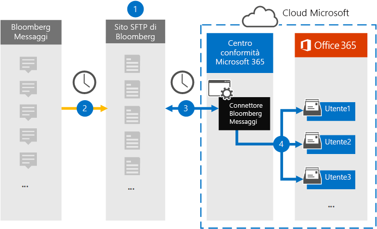

# Configurare un connettore per archiviare i dati dei messaggi di Bloomberg

Utilizzare un connettore di dati nel centro conformità di Microsoft 365 per importare e archiviare i dati di posta elettronica dei servizi finanziari dallo strumento di collaborazione del [messaggio Bloomberg](https://www.bloomberg.com/professional/product/collaboration/) . Dopo aver configurato e configurato un connettore, la connessione viene eseguita una volta al giorno sul sito di Bloomberg Secure FTP (SFTP) dell'organizzazione e gli elementi di posta elettronica vengono importati nelle cassette postali in Microsoft 365.

Dopo che i dati dei messaggi di Bloomberg sono archiviati nelle cassette postali degli utenti, è possibile applicare le funzionalità di conformità di Microsoft 365, ad esempio il blocco per controversia legale, la ricerca di contenuto, l'archiviazione sul posto, il controllo, la conformità alla comunicazione e i criteri di conservazione di Microsoft 365 ai dati Ad esempio, è possibile eseguire ricerche nei messaggi di posta elettronica di Bloomberg utilizzando lo strumento di ricerca contenuto o associare la cassetta postale contenente i dati del messaggio Bloomberg a un custode in un caso di eDiscovery avanzato. L'utilizzo di un connettore di messaggi Bloomberg per l'importazione e l'archiviazione dei dati in Microsoft 365 può aiutare l'organizzazione a rimanere conforme ai criteri governativi e normativi.

## Panoramica dell'archiviazione dei dati del messaggio Bloomberg

Nella panoramica seguente viene illustrato il processo di utilizzo di un connettore per archiviare i dati dei messaggi Bloomberg in Microsoft 365.

1. L'organizzazione collabora con Bloomberg per configurare un sito Bloomberg SFTP. È inoltre possibile collaborare con Bloomberg per configurare il messaggio Bloomberg per copiare i messaggi di posta elettronica nel sito Bloomberg SFTP.

2. Una volta ogni 24 ore, i messaggi di posta elettronica provenienti dal messaggio Bloomberg vengono copiati nel sito Bloomberg SFTP.

3. Il connettore del messaggio Bloomberg creato nel centro conformità Microsoft 365 si connette al sito Bloomberg SFTP ogni giorno e trasferisce i messaggi di posta elettronica dalle 24 ore precedenti a un'area di archiviazione di Azure sicura nel cloud Microsoft.

4. Il connettore importa gli elementi del messaggio di posta elettronica nella cassetta postale di un utente specifico. Verrà creata una nuova cartella denominata BloombergMessage nella cassetta postale dell'utente specifico e gli elementi verranno importati. 

   Il connettore esegue questa operazione utilizzando il valore della proprietà CorporateEmailAddress. Ogni messaggio di posta elettronica contiene questa proprietà, che viene popolata con l'indirizzo di posta elettronica di ogni partecipante del messaggio di posta elettronica. Oltre a eseguire il mapping automatico degli utenti utilizzando il valore della proprietà *CorporateEmailAddress* , è anche possibile definire un mapping personalizzato caricando un file di mapping CSV. Questo file di mapping contiene un UUID di Bloomberg e l'indirizzo della cassetta postale di Microsoft 365 corrispondente per ogni utente dell'organizzazione. Se si Abilita il mapping automatico degli utenti e si fornisce un mapping personalizzato, per ogni elemento di posta elettronica il connettore osserverà per la prima volta il file di mapping personalizzato. Se non trova un utente valido di Microsoft 365 che corrisponde all'UUID di Bloomberg di un utente, il connettore utilizza la proprietà *CorporateEmailAddress* dell'elemento di posta elettronica. Se il connettore non trova un utente valido di Microsoft 365 nel file di mapping personalizzato o nella proprietà *CorporateEmailAddress* dell'elemento di posta elettronica, l'elemento non verrà importato.

## Prima di iniziare

Alcuni dei passaggi di implementazione necessari per archiviare i dati dei messaggi di Bloomberg sono esterni a Microsoft 365 e devono essere completati prima di poter creare il connettore nel centro conformità.

- L'organizzazione deve autorizzare il servizio di importazione di Office 365 per accedere ai dati delle cassette postali nell'organizzazione. Per acconsentire a questa richiesta, accedere a [Questa pagina](https://login.microsoftonline.com/common/oauth2/authorize?client_id=570d0bec-d001-4c4e-985e-3ab17fdc3073&response_type=code&redirect_uri=https://portal.azure.com/&nonce=1234&prompt=admin_consent), accedere con le credenziali di un amministratore globale di Office 365 e quindi accettare la richiesta. È necessario completare questo passaggio prima di poter creare correttamente il connettore del messaggio Bloomberg nel passaggio 3.

- Eseguire la sottoscrizione a [Bloomberg Anywhere](https://www.bloomberg.com/professional/product/remote-access/?bbgsum-page=DG-WS-PROF-PROD-BBA). Questa operazione è necessaria per consentire l'accesso a Bloomberg Anywhere per accedere al sito Bloomberg SFTP che è necessario impostare e configurare.

- Configurare un sito Bloomberg SFTP (Secure File Transfer Protocol). Dopo aver lavorato con Bloomberg per configurare il sito SFTP, i dati provenienti dal messaggio Bloomberg vengono caricati nel sito SFTP ogni giorno. Il connettore creato nel passaggio 2 si connette a questo sito SFTP e trasferisce i dati di posta elettronica alle cassette postali di Microsoft 365. SFTP crittografa anche i dati del messaggio Bloomberg inviati alle cassette postali durante il processo di trasferimento.

  Per informazioni su Bloomberg SFTP (denominato anche *BB-SFTP*):

  - Vedere il documento "standard di connettività SFTP" sul [supporto di Bloomberg](https://www.bloomberg.com/professional/support/documentation/).

  - Contattare il servizio di [assistenza clienti Bloomberg](https://service.bloomberg.com/portal/sessions/new?utm_source=bloomberg-menu&utm_medium=csc).

   > [!NOTE]
   > Se l'organizzazione ha già distribuito un connettore per archiviare i dati di Bloomberg istantanei, non è necessario configurare un altro sito SFTP. È possibile utilizzare lo stesso sito SFTP per il connettore del messaggio Bloomberg.

- Dopo aver collaborato con Bloomberg per configurare un sito SFTP, Bloomberg fornirà alcune informazioni all'utente dopo aver risposto al messaggio di posta elettronica di implementazione Bloomberg. Salvare una copia delle informazioni seguenti. È possibile utilizzarlo per configurare un connettore nel passaggio 3.

  - Codice fermo, che è un ID per l'organizzazione e che viene utilizzato per accedere al sito Bloomberg SFTP.

  - Password per il sito Bloomberg SFTP

  - URL per il sito Bloomberg SFTP (ad esempio, sftp.bloomberg.com). Inoltre, Bloomberg può anche fornire un indirizzo IP corrispondente per il sito Bloomberg SFTP, che può anche essere utilizzato per configurare il connettore.

  - Numero di porta per il sito Bloomberg SFTP

- L'utente che crea un connettore del messaggio Bloomberg nel passaggio 3 (e che Scarica le chiavi pubbliche e l'indirizzo IP nel passaggio 1) deve essere assegnato al ruolo di esportazione delle cassette postali in Exchange Online. Questa operazione è necessaria per aggiungere connettori nella pagina **connettori dati** del centro conformità di Microsoft 365. Per impostazione predefinita, questo ruolo non è assegnato ad alcun gruppo di ruoli in Exchange Online. È possibile aggiungere il ruolo import export delle cassette postali al gruppo di ruoli Gestione organizzazione in Exchange Online. In alternativa, è possibile creare un gruppo di ruoli, assegnare il ruolo di esportazione delle cassette postali e quindi aggiungere gli utenti corretti come membri. Per ulteriori informazioni, vedere la sezione creare gruppi di [ruoli](https://docs.microsoft.com/Exchange/permissions-exo/role-groups#create-role-groups) o [modificare gruppi di ruoli](https://docs.microsoft.com/Exchange/permissions-exo/role-groups#modify-role-groups) nell'articolo "gestire i gruppi di ruoli in Exchange Online".

## Passaggio 1: ottenere le chiavi pubbliche di SSH e PGP

Il primo passaggio consiste nell'ottenere una copia delle chiavi pubbliche per Secure Shell (SSH) e la Pretty Good Privacy (PGP). È possibile utilizzare questi tasti nel passaggio 2 per configurare il sito Bloomberg SFTP per consentire il connettore (creato nel passaggio 3) per connettersi al sito SFTP e trasferire i dati della posta elettronica dei messaggi di Bloomberg alle cassette postali di Microsoft 365. È inoltre possibile ottenere un indirizzo IP in questo passaggio, che viene utilizzato per la configurazione del sito Bloomberg SFTP.

1. Andare a [ https://compliance.microsoft.com\ ] ( https://compliance.microsoft.com) e fare clic su **connettori dati** nel NAV sinistro.

2. Nella pagina **connettori dati** sotto **messaggio Bloomberg**fare clic su **Visualizza**.

3. Nella pagina Descrizione del prodotto del **messaggio Bloomberg** fare clic su **Aggiungi connettore**

4. Nella pagina **condizioni del servizio** fare clic su **Accetto**.

5. Nel **sito Add credentials for Bloomberg SFTP** al passaggio 1, fare clic sul pulsante **Scarica SSH Key**, **scaricare PGP Key**e scaricare i collegamenti agli **indirizzi IP** per salvare una copia di ogni file nel computer locale. Questi file contengono gli elementi seguenti che vengono utilizzati per configurare il sito Bloomberg SFTP nel passaggio 2:

   - Chiave pubblica SSH: questa chiave viene utilizzata per configurare Secure Shell (SSH) per abilitare un account di accesso remoto sicuro quando il connettore si connette al sito Bloomberg SFTP.

   - Chiave pubblica PGP: questa chiave viene utilizzata per configurare la crittografia dei dati trasferiti dal sito Bloomberg SFTP a Microsoft 365.

   - Indirizzo IP: il sito Bloomberg SFTP è configurato per accettare una richiesta di connessione solo da questo indirizzo IP, che viene utilizzato dal connettore del messaggio Bloomberg creato nel passaggio 3.

6. Fare clic su **Annulla** per chiudere la procedura guidata. Per creare il connettore, è possibile tornare a questa procedura guidata nel passaggio 3.

## Passaggio 2: configurare il sito Bloomberg SFTP

> [!NOTE]
> Come indicato in precedenza, se l'organizzazione ha precedentemente configurato un sito Bloomberg SFTP per archiviare i dati di Bloomberg istantanei, non è necessario impostarne un altro. È possibile specificare lo stesso sito SFTP quando si crea il connettore nel passaggio 3.

Il passaggio successivo consiste nell'utilizzare le chiavi pubbliche SSH e PGP e l'indirizzo IP ottenuto nel passaggio 1 per configurare l'autenticazione SSH e la crittografia PGP per il sito Bloomberg SFTP. In questo modo, il connettore del messaggio Bloomberg creato nel passaggio 3 si connette al sito Bloomberg SFTP e trasferisce i dati dei messaggi Bloomberg a Microsoft 365. È necessario collaborare con il supporto clienti di Bloomberg per configurare il sito Bloomberg SFTP. Contattare il [supporto clienti di Bloomberg](https://service.bloomberg.com/portal/sessions/new?utm_source=bloomberg-menu&utm_medium=csc) per assistenza.

> [!IMPORTANT]
> Bloomberg consiglia di collegare i tre file scaricati nel passaggio 1 a un messaggio di posta elettronica e inviarlo al proprio team di supporto clienti quando si lavora con loro per configurare il sito Bloomberg SFTP.

## Passaggio 3: creare un connettore di messaggi Bloomberg

L'ultimo passaggio consiste nel creare un connettore di messaggi Bloomberg nel centro conformità di Microsoft 365. Il connettore utilizza le informazioni fornite per la connessione al sito Bloomberg SFTP e trasferisce i messaggi di posta elettronica alle caselle della cassetta postale dell'utente corrispondente in Microsoft 365.

1. Andare a [https://compliance.microsoft.com](https://compliance.microsoft.com) e fare clic su **connettori dati** nel NAV sinistro.

2. Nella pagina **connettori dati** sotto **messaggio Bloomberg**fare clic su **Visualizza**.

3. Nella pagina Descrizione del prodotto del **messaggio Bloomberg** fare clic su **Aggiungi connettore**

4. Nella pagina **condizioni del servizio** fare clic su **Accetto**.

5. Nella pagina **Aggiungi credenziali per il sito Bloomberg SFTP** , in passaggio 3, immettere le informazioni necessarie nelle caselle seguenti e quindi fare clic su **Avanti**.

      - **Codice azienda:** ID dell'organizzazione utilizzato come nome utente per il sito Bloomberg SFTP.

      - **Password:** La password per il sito Bloomberg SFTP dell'organizzazione.

      - **URL sftp:** URL per il sito Bloomberg SFTP (ad esempio, sftp.bloomberg.com).

      - **Porta SFTP:** Il numero di porta per il sito Bloomberg SFTP. Il connettore utilizza questa porta per la connessione al sito SFTP.

6. Nella pagina **mapping utenti** abilitare il mapping automatico degli utenti e fornire il mapping degli utenti personalizzato come richiesto

7. Fare clic su **Avanti**, rivedere le impostazioni e quindi fare clic su prepara per creare il connettore.

8. Passare alla pagina **connettori dati** per visualizzare lo stato di avanzamento del processo di importazione per il nuovo connettore.

## Problemi noti

- Il threading del messaggio di posta elettronica di Bloomberg importato in Microsoft 365 non è supportato. I singoli messaggi inviati a una persona vengono importati, ma non vengono presentati in una conversazione filettata. Microsoft sta lavorando per supportare il threading nelle versioni successive del connettore dati del messaggio Bloomberg.
