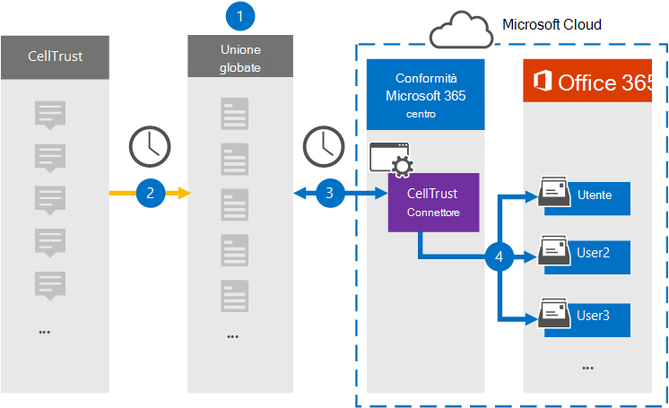

# Configurare un connettore per archiviare i dati di CellTrustSet up a connector to archive CellTrust data

Utilizzare un connettore Veritas nel Centro conformità Microsoft 365 per importare e archiviare i dati dalla piattaforma CellTrust alle cassette postali degli utenti nell'organizzazione di Microsoft 365.Use a Veritas connector in the Microsoft 365 compliance center to import and archive data from the CellTrust platform to user mailboxes in your Microsoft 365 organization. Veritas fornisce un [connettore CellTrust](https://globanet.com/celltrust/) che acquisisce gli elementi dall'origine dati di terze parti e importa tali elementi in Microsoft 365.Veritas provides a [CellTrust](https://globanet.com/celltrust/) connector that captures items from the third-party data source and imports those items to Microsoft 365. Il connettore converte il contenuto dei messaggi SMS dagli account CellTrust in un formato di messaggio di posta elettronica e quindi importa tali elementi nella cassetta postale dell'utente in Microsoft 365.The connector converts the content of SMS messages from CellTrust accounts to an email message format and then imports those items to the user's mailbox in Microsoft 365.

Dopo aver archiviato i dati cellTrust nelle cassette postali degli utenti, è possibile applicare le funzionalità di conformità di Microsoft 365, ad esempio conservazione per controversia legale, eDiscovery, criteri di conservazione ed etichette di conservazione e conformità delle comunicazioni.After CellTrust data is stored in user mailboxes, you can apply Microsoft 365 compliance features such as Litigation Hold, eDiscovery, retention policies and retention labels, and communication compliance. L'utilizzo di un connettore CellTrust per importare e archiviare i dati in Microsoft 365 può aiutare l'organizzazione a rimanere conforme ai criteri governativi e normativi.Using a CellTrust connector to import and archive data in Microsoft 365 can help your organization stay compliant with government and regulatory policies.

## Panoramica dell'archiviazione dei dati CellTrustOverview of archiving CellTrust data

Nella panoramica seguente viene illustrato il processo di utilizzo di un connettore per archiviare i dati cellTrust in Microsoft 365.The following overview explains the process of using a connector to archive CellTrust data in Microsoft 365.

1. L'organizzazione collabora con CellTrust per configurare un sito CellTrust.Your organization works with CellTrust to set up and configure a CellTrust site.

2. Una volta ogni 24 ore, gli elementi CellTrust vengono copiati nel sito Veritas Merge1.Once every 24 hours, CellTrust items are copied to the Veritas Merge1 site. Il connettore converte anche il contenuto di un messaggio in un formato di messaggio di posta elettronica.The connector also converts the content of a message to an email message format.

3. Il connettore CellTrust creato nel Centro conformità Microsoft 365 si connette ogni giorno al sito Veritas Merge1 e trasferisce i messaggi in una posizione sicura di Archiviazione di Azure nel cloud Microsoft.The CellTrust connector that you create in the Microsoft 365 compliance center connects to the Veritas Merge1 site every day and transfers the messages to a secure Azure Storage location in the Microsoft cloud.

4. Il mapping automatico degli utenti come connettore importa gli elementi nelle cassette postali di utenti specifici utilizzando il valore della *proprietà Email* di descritta nel [passaggio 3.](#step-3-map-users-and-complete-the-connector-setup)The automatic user mapping as connector imports items to the mailboxes of specific users by using the value of the *Email* property of the described in [Step 3](#step-3-map-users-and-complete-the-connector-setup). Nelle cassette postali degli utenti viene creata una sottocartella nella cartella Posta in arrivo denominata **CellTrust** e gli elementi del messaggio vengono importati in tale cartella.A subfolder in the Inbox folder named **CellTrust** is created in the user mailboxes, and the message items are imported to that folder. Il connettore determina in quale cassetta postale importare gli elementi utilizzando il valore della *proprietà Email.*The connector determines which mailbox to import items to by using the value of the *Email* property. Ogni elemento CellTrust contiene questa proprietà, che viene popolata con l'indirizzo di posta elettronica di ogni partecipante.Every CellTrust item contains this property, which is populated with the email address of every participant.

## Prima di iniziareBefore you begin

- Creare un account Merge1 per i connettori Microsoft.Create a Merge1 account for Microsoft connectors. Per creare un account, contattare il [Supporto clienti Veritas.](https://www.veritas.com/content/support/)To create an account, contact [Veritas Customer Support](https://www.veritas.com/content/support/). È necessario accedere a questo account quando si crea il connettore nel passaggio 1.You need to sign into this account when you create the connector in Step 1.

- L'utente che crea il connettore CellTrust nel passaggio 1 (e lo completa nel passaggio 3) deve essere assegnato al ruolo Esportazione importazione cassette postali in Exchange Online.The user who creates the CellTrust connector in Step 1 (and completes it in Step 3) must be assigned to the Mailbox Import Export role in Exchange Online. Questo ruolo è necessario per aggiungere connettori nella pagina **Connettori dati** nel Centro conformità Microsoft 365.This role is required to add connectors on the **Data connectors** page in the Microsoft 365 compliance center. Per impostazione predefinita, questo ruolo non è assegnato ad alcun gruppo di ruoli in Exchange Online.By default, this role isn't assigned to any role group in Exchange Online. È possibile aggiungere il ruolo Esportazione importazione cassette postali al gruppo di ruoli Gestione organizzazione in Exchange Online.You can add the Mailbox Import Export role to the Organization Management role group in Exchange Online. In caso contrario, è possibile creare un gruppo di ruoli, assegnare il ruolo Importazione/Esportazione cassette postali e quindi aggiungere gli utenti appropriati come membri.Or you can create a role group, assign the Mailbox Import Export role, and then add the appropriate users as members. Per ulteriori informazioni, vedere le sezioni [Create role groups](/Exchange/permissions-exo/role-groups#create-role-groups) o Modify role [groups](/Exchange/permissions-exo/role-groups#modify-role-groups) nell'articolo "Manage role groups in Exchange Online".For more information, see the [Create role groups](/Exchange/permissions-exo/role-groups#create-role-groups) or [Modify role groups](/Exchange/permissions-exo/role-groups#modify-role-groups) sections in the article "Manage role groups in Exchange Online".

## Passaggio 1: Configurare il connettore CellTrustStep 1: Set up the CellTrust connector

Il primo passaggio consiste  nell'accedere ai connettori dati nel Centro conformità Microsoft 365 e creare un connettore per i dati cellTrust.The first step is to access to the **Data Connectors** in the Microsoft 365 compliance center and create a connector for CellTrust data.

1. Passare a [https://compliance.microsoft.com](https://compliance.microsoft.com/) e quindi fare clic su **Connettori dati** \> **CellTrust**.Go to [https://compliance.microsoft.com](https://compliance.microsoft.com/) and then click **Data connectors** \> **CellTrust**.

2. Nella pagina **Descrizione prodotto CellTrust** fare clic su **Aggiungi connettore.**On the **CellTrust** product description page, click **Add connector**.

3. Nella pagina **Condizioni di servizio** fare clic su **Accetta.**On the **Terms of service** page, click **Accept**.

4. Immettere un nome univoco che identifichi il connettore e quindi fare clic su **Avanti.**Enter a unique name that identifies the connector and then click **Next**.

5. Accedere all'account Merge1 per configurare il connettore.Sign in to your Merge1 account to configure the connector.

## Passaggio 2: Configurare il connettore CellTrust nel sito Veritas Merge1Step 2: Configure the CellTrust connector on the Veritas Merge1 site

Il secondo passaggio consiste nel configurare il connettore CellTrust nel sito Veritas Merge1.The second step is to configure the CellTrust connector on the Veritas Merge1 site. Per informazioni su come configurare il connettore CellTrust, vedere [Merge1 Third-Party Connectors User Guide](https://docs.ms.merge1.globanetportal.com/Merge1%20Third-Party%20Connectors%20CellTrust%20User%20Guide%20.pdf).For information about how to configure the CellTrust connector, see [Merge1 Third-Party Connectors User Guide](https://docs.ms.merge1.globanetportal.com/Merge1%20Third-Party%20Connectors%20CellTrust%20User%20Guide%20.pdf).

Dopo aver fatto **clic su Salva & fine,** viene visualizzata la pagina **Mapping** utenti nella procedura guidata del connettore nel Centro conformità Microsoft 365.After you click **Save & Finish**, the **User mapping** page in the connector wizard in the Microsoft 365 compliance center is displayed.

## Passaggio 3: mappare gli utenti e completare la configurazione del connettoreStep 3: Map users and complete the connector setup

Per mappare gli utenti e completare la configurazione del connettore nel Centro conformità Microsoft 365, attenersi alla seguente procedura:To map users and complete the connector set up in the Microsoft 365 compliance center, follow these steps:

1. Nella pagina Mapping utenti CellTrust agli utenti **di Microsoft 365** abilitare il mapping automatico degli utenti.On the **Map CellTrust users to Microsoft 365 users** page, enable automatic user mapping. Gli elementi CellTrust includono una proprietà denominata *Email*, che contiene gli indirizzi di posta elettronica per gli utenti dell'organizzazione.The CellTrust items include a property called *Email*, which contains email addresses for users in your organization. Se il connettore può associare questo indirizzo a un utente di Microsoft 365, gli elementi vengono importati nella cassetta postale dell'utente.If the connector can associate this address with a Microsoft 365 user, the items are imported to that user’s mailbox.

2. Fare **clic** su Avanti, rivedere le impostazioni e passare alla pagina **Connettori** dati per visualizzare l'avanzamento del processo di importazione per il nuovo connettore.Click **Next**, review your settings, and go to the **Data connectors** page to see the progress of the import process for the new connector.

## Passaggio 4: Monitorare il connettore CellTrustStep 4: Monitor the CellTrust connector

Dopo aver creato il connettore CellTrust, è possibile visualizzare lo stato del connettore nel Centro conformità Microsoft 365.After you create the CellTrust connector, you can view the connector status in the Microsoft 365 compliance center.

1. Vai a [https://compliance.microsoft.com](https://compliance.microsoft.com/) e fai clic su **Connettori dati** nel riquadro di spostamento sinistro.Go to [https://compliance.microsoft.com](https://compliance.microsoft.com/) and click **Data connectors** in the left nav.

2. Fare clic **sulla scheda Connettori** e quindi selezionare il **connettore CellTrust** per visualizzare la pagina a comparsa, contenente le proprietà e le informazioni sul connettore.Click the **Connectors** tab and then select the **CellTrust** connector to display the flyout page, which contains the properties and information about the connector.

3. In **Stato connettore con origine** fare clic sul collegamento Scarica **registro** per aprire (o salvare) il registro di stato per il connettore.Under **Connector status with source**, click the **Download log** link to open (or save) the status log for the connector. Questo registro contiene i dati importati nel cloud Microsoft.This log contains data that has been imported to the Microsoft cloud.

## Problemi notiKnown issues

- Al momento non è possibile importare allegati o elementi di dimensioni superiori a 10 MB.At this time, we don't support importing attachments or items that are larger than 10 MB. Il supporto per gli elementi più grandi sarà disponibile in un secondo momento.Support for larger items will be available at a later date.