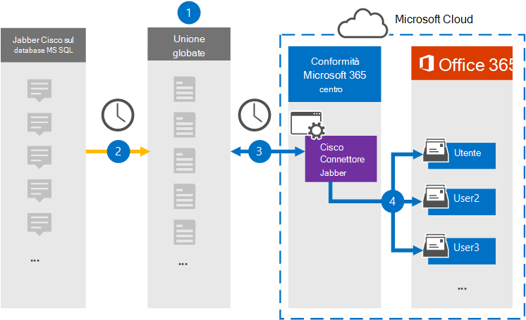

# Configurare un connettore per archiviare i dati Cisco JabberSet up a connector to archive Cisco Jabber data

Utilizzare un connettore Globanet nel Centro conformità Microsoft 365 per importare e archiviare i dati dalla piattaforma Cisco Jabber alle cassette postali degli utenti nell'organizzazione di Microsoft 365.Use a Globanet connector in the Microsoft 365 compliance center to import and archive data from the Cisco Jabber platform to user mailboxes in your Microsoft 365 organization. Globanet fornisce un connettore [Cisco Jabber](https://globanet.com/jabber/) configurato per acquisire elementi dal database MS SQL di Jabber, ad esempio messaggi di chat 1:1 e chat di gruppo e quindi importare tali elementi in Microsoft 365.Globanet provides you with a [Cisco Jabber](https://globanet.com/jabber/) connector that is configured to capture items from the Jabber’s MS SQL Database, such as 1:1 chat messages and group chats and then import those items to Microsoft 365. Il connettore recupera i dati dal database MS SQL di Cisco Jabber, lo elabora e converte il contenuto dall'account Cisco Jabber di un utente in un formato di messaggio di posta elettronica e quindi importa tali elementi nella cassetta postale dell'utente in Microsoft 365.The connector retrieves data from the Cisco Jabber’s MS SQL Database, processes it, and the converts the content from a user's Cisco Jabber account to an email message format and then imports those items to the user's mailbox in Microsoft 365.

Dopo aver archiviato i dati di Cisco Jabber nelle cassette postali degli utenti, è possibile applicare le funzionalità di conformità di Microsoft 365, ad esempio conservazione per controversia legale, eDiscovery, criteri di conservazione ed etichette di conservazione e conformità delle comunicazioni.After Cisco Jabber data is stored in user mailboxes, you can apply Microsoft 365 compliance features such as Litigation Hold, eDiscovery, retention policies and retention labels, and communication compliance. L'utilizzo di un connettore Cisco Jabber per importare e archiviare i dati in Microsoft 365 può aiutare l'organizzazione a rimanere conforme ai criteri normativi e governativi.Using a Cisco Jabber connector to import and archive data in Microsoft 365 can help your organization stay compliant with government and regulatory policies.

## Panoramica dell'archiviazione dei dati Cisco JabberOverview of archiving Cisco Jabber data

Nella panoramica seguente viene illustrato il processo di utilizzo di un connettore per archiviare i dati di Cisco Jabber in Microsoft 365.The following overview explains the process of using a connector to archive Cisco Jabber data in Microsoft 365.

1. L'organizzazione collabora con Cisco per configurare un Cisco Jabber in MS SQL Database.Your organization works with Cisco to set up and configure a Cisco Jabber on MS SQL Database.

2. Una volta ogni 24 ore, gli elementi Cisco Jabber vengono copiati dal database ms SQL al sito Globanet Merge1.Once every 24 hours, Cisco Jabber items are copied from the MS SQL Database to the Globanet Merge1 site. Il connettore converte anche il contenuto dei messaggi di chat in un formato di messaggio di posta elettronica.The connector also converts the content of chat messages to an email message format.

3. Il connettore Cisco Jabber creato nel Centro conformità Microsoft 365 si connette ogni giorno al sito Globanet Merge1 e trasferisce gli elementi in una posizione sicura di Archiviazione di Azure nel cloud Microsoft.The Cisco Jabber connector that you create in the Microsoft 365 compliance center connects to the Globanet Merge1 site every day and transfers the items to a secure Azure Storage location in the Microsoft cloud.

4. Il mapping automatico degli utenti come connettore importa gli elementi nelle cassette postali di utenti specifici utilizzando il valore della *proprietà Email* di descritta nel [passaggio 3.](#step-3-map-users-and-complete-the-connector-setup)The automatic user mapping as connector imports items to the mailboxes of specific users by using the value of the *Email* property of the described in [Step 3](#step-3-map-users-and-complete-the-connector-setup). Nelle cassette postali degli utenti viene creata una sottocartella nella cartella Posta in arrivo denominata **Cisco Jabber su MS SQL** e gli elementi del messaggio vengono importati in tale cartella.A subfolder in the Inbox folder named **Cisco Jabber on MS SQL** is created in the user mailboxes, and the message items are imported to that folder. Il connettore determina in quale cassetta postale importare gli elementi utilizzando il valore della *proprietà Email.*The connector determines which mailbox to import items to by using the value of the *Email* property. Ogni elemento Cisco Jabber contiene questa proprietà, che viene popolata con l'indirizzo di posta elettronica di ogni partecipante.Every Cisco Jabber item contains this property, which is populated with the email address of every participant.

## Prima di iniziareBefore you begin

- Creare un account Globanet Merge1 per i connettori Microsoft.Create a Globanet Merge1 account for Microsoft connectors. Per creare questo account, contattare il [Supporto clienti Globanet.](https://globanet.com/ms-connectors-contact/)To create this account, contact [Globanet Customer Support](https://globanet.com/ms-connectors-contact/). Si accederà a questo account quando si crea il connettore nel passaggio 1.You will sign into this account when you create the connector in Step 1.

- Configurare un database ms SQL per recuperare gli elementi jabber da prima di creare il connettore nel passaggio 1.Set up an MS SQL Database to retrieve Jabber items from before creating the connector in Step 1. Durante la configurazione del connettore Cisco Jabber nel passaggio 2, è necessario specificare le impostazioni di connessione per il database ms SQL.You will specify the connection settings for the MS SQL Database when configuring the Cisco Jabber connector in Step 2. Per ulteriori informazioni, vedere [merge1 Third-Party Connectors User Guide](https://docs.ms.merge1.globanetportal.com/Merge1%20Third-Party%20Connectors%20Cisco%20Jabber%20on%20MS%20SQL%20User%20Guide%20.pdf).For more information, see the [Merge1 Third-Party Connectors User Guide](https://docs.ms.merge1.globanetportal.com/Merge1%20Third-Party%20Connectors%20Cisco%20Jabber%20on%20MS%20SQL%20User%20Guide%20.pdf).

- L'utente che crea il connettore Cisco Jabber nel passaggio 1 (e lo completa nel passaggio 3) deve essere assegnato al ruolo Esportazione importazione cassette postali in Exchange Online.The user who creates the Cisco Jabber connector in Step 1 (and completes it in Step 3) must be assigned to the Mailbox Import Export role in Exchange Online. Questo ruolo è necessario per aggiungere connettori nella pagina **Connettori dati** nel Centro conformità Microsoft 365.This role is required to add connectors on the **Data connectors** page in the Microsoft 365 compliance center. Per impostazione predefinita, questo ruolo non viene assegnato a un gruppo di ruoli in Exchange Online.By default, this role is not assigned to a role group in Exchange Online. È possibile aggiungere il ruolo Esportazione importazione cassette postali al gruppo di ruoli Gestione organizzazione in Exchange Online.You can add the Mailbox Import Export role to the Organization Management role group in Exchange Online. In caso contrario, è possibile creare un gruppo di ruoli, assegnare il ruolo Importazione/Esportazione cassette postali e quindi aggiungere gli utenti appropriati come membri.Or you can create a role group, assign the Mailbox Import Export role, and then add the appropriate users as members. Per ulteriori informazioni, vedere le sezioni [Create role groups](/Exchange/permissions-exo/role-groups#create-role-groups) o Modify role [groups](/Exchange/permissions-exo/role-groups#modify-role-groups) nell'articolo "Manage role groups in Exchange Online".For more information, see the [Create role groups](/Exchange/permissions-exo/role-groups#create-role-groups) or [Modify role groups](/Exchange/permissions-exo/role-groups#modify-role-groups) sections in the article "Manage role groups in Exchange Online".

## Passaggio 1: Configurare il connettore Cisco JabberStep 1: Set up the Cisco Jabber connector

Il primo passaggio consiste  nell'accedere ai connettori dati nel Centro conformità Microsoft 365 e creare un connettore per Cisco Jabber nei dati SQL MS.The first step is to access to the **Data Connectors** in the Microsoft 365 compliance center and create a connector for Cisco Jabber on MS SQL data.

1. Passare a [https://compliance.microsoft.com](https://compliance.microsoft.com/) e quindi fare clic su **Connettori dati**  >  **Cisco Jabber su MS SQL**.Go to [https://compliance.microsoft.com](https://compliance.microsoft.com/)and then click **Data connectors** > **Cisco Jabber on MS SQL**.

2. Nella pagina **Cisco Jabber on MS SQL** product description fare clic **su Add connector**.On the **Cisco Jabber on MS SQL** product description page, click **Add connector**.

3. Nella pagina **Condizioni di servizio** fare clic su **Accetta.**On the **Terms of service** page, click **Accept**.

4. Immettere un nome univoco che identifichi il connettore e quindi fare clic su **Avanti.**Enter a unique name that identifies the connector and then click **Next**.

5. Accedere all'account Merge1 per configurare il connettore.Sign in to your Merge1 account to configure the connector.

## Passaggio 2: Configurare il connettore Cisco Jabber nel sito Globanet Merge1Step 2: Configure the Cisco Jabber connector on the Globanet Merge1 site

Il secondo passaggio consiste nel configurare Cisco Jabber in MS SQL connettore nel sito Globanet Merge1.The second step is to configure the Cisco Jabber on MS SQL connector on the Globanet Merge1 site. Per informazioni su come configurare Cisco Jabber sul connettore SQL MS, vedere [Merge1 Third-Party Connectors User Guide](https://docs.ms.merge1.globanetportal.com/Merge1%20Third-Party%20Connectors%20Cisco%20Jabber%20on%20MS%20SQL%20User%20Guide%20.pdf).For information about how to configure the Cisco Jabber on MS SQL connector, see [Merge1 Third-Party Connectors User Guide](https://docs.ms.merge1.globanetportal.com/Merge1%20Third-Party%20Connectors%20Cisco%20Jabber%20on%20MS%20SQL%20User%20Guide%20.pdf).

Dopo aver fatto **clic su Salva & fine,** viene visualizzata la pagina **Mapping** utenti nella procedura guidata del connettore nel Centro conformità Microsoft 365.After you click **Save & Finish**, the **User mapping** page in the connector wizard in the Microsoft 365 compliance center is displayed.

## Passaggio 3: mappare gli utenti e completare la configurazione del connettoreStep 3: Map users and complete the connector setup

Per mappare gli utenti e completare la configurazione del connettore nel Centro conformità Microsoft 365, attenersi alla seguente procedura:To map users and complete the connector set up in the Microsoft 365 compliance center, follow these steps:

1. Nella pagina **Mappa Cisco Jabber in MS SQL utenti a utenti di Microsoft 365,** abilitare il mapping automatico degli utenti.On the **Map Cisco Jabber on MS SQL users to Microsoft 365 users** page, enable automatic user mapping. Gli elementi Cisco Jabber on MS SQL includono una proprietà denominata *Email*, che contiene gli indirizzi di posta elettronica per gli utenti dell'organizzazione.The Cisco Jabber on MS SQL items include a property called *Email*, which contains email addresses for users in your organization. Se il connettore può associare questo indirizzo a un utente di Microsoft 365, gli elementi vengono importati nella cassetta postale dell'utente.If the connector can associate this address with a Microsoft 365 user, the items are imported to that user’s mailbox.

2. Fare **clic** su Avanti, rivedere le impostazioni e passare alla pagina **Connettori** dati per visualizzare l'avanzamento del processo di importazione per il nuovo connettore.Click **Next**, review your settings, and go to the **Data connectors** page to see the progress of the import process for the new connector.

## Passaggio 4: Monitorare il connettore Cisco JabberStep 4: Monitor the Cisco Jabber connector

Dopo aver creato il connettore Cisco Jabber su MS SQL, è possibile visualizzare lo stato del connettore nel Centro conformità Microsoft 365.After you create the Cisco Jabber on MS SQL connector, you can view the connector status in the Microsoft 365 compliance center.

1. Vai a [https://compliance.microsoft.com](https://compliance.microsoft.com) e fai clic su **Connettori dati** nel riquadro di spostamento sinistro.Go to [https://compliance.microsoft.com](https://compliance.microsoft.com) and click **Data connectors** in the left nav.

2. Fare clic **sulla scheda Connettori** e quindi selezionare **Cisco Jabber in MS SQL** connettore per visualizzare la pagina a comparsa.Click the **Connectors** tab and then select the **Cisco Jabber on MS SQL** connector to display the flyout page. Questa pagina contiene le proprietà e le informazioni sul connettore.This page contains the properties and information about the connector.

3. In **Stato connettore con origine** fare clic sul collegamento Scarica **registro** per aprire (o salvare) il registro di stato per il connettore.Under **Connector status with source**, click the **Download log** link to open (or save) the status log for the connector. Questo registro contiene i dati importati nel cloud Microsoft.This log contains data that has been imported to the Microsoft cloud.

## Problemi notiKnown issues

- Al momento non è possibile importare allegati o elementi di dimensioni superiori a 10 MB.At this time, we don't support importing attachments or items that are larger than 10 MB. Il supporto per gli elementi più grandi sarà disponibile in un secondo momento.Support for larger items will be available at a later date.