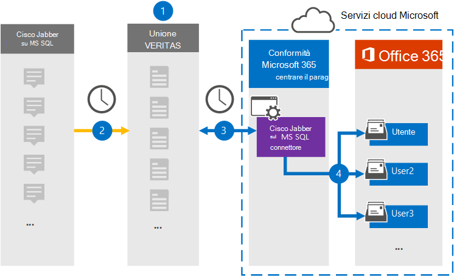

# Configurare un connettore per l'archiviazione dei dati di Jabber CiscoSet up a connector to archive Cisco Jabber data

Utilizzare un connettore di Globanet nel centro conformità di Microsoft 365 per importare e archiviare i dati dalla piattaforma Cisco Jabber alle cassette postali degli utenti nell'organizzazione Microsoft 365.Use a Globanet connector in the Microsoft 365 compliance center to import and archive data from the Cisco Jabber platform to user mailboxes in your Microsoft 365 organization. Globanet fornisce un connettore [Cisco Jabber](https://globanet.com/jabber/) configurato per acquisire elementi dal database MS SQL di Jabber, ad esempio i messaggi di chat di 1:1 e le chat di gruppo e quindi importare tali elementi in Microsoft 365.Globanet provides you with a [Cisco Jabber](https://globanet.com/jabber/) connector that is configured to capture items from the Jabber’s MS SQL database, such as 1:1 chat messages and group chats and then import those items to Microsoft 365. Il connettore recupera i dati dal database MS SQL di Cisco Jabber, lo elabora e converte i contenuti dall'account Jabber Cisco di un utente in un formato di messaggio di posta elettronica e quindi importa tali elementi nella cassetta postale dell'utente in Microsoft 365.The connector retrieves data from the Cisco Jabber’s MS SQL database, processes it, and the converts the content from a user's Cisco Jabber account to an email message format and then imports those items to the user's mailbox in Microsoft 365.

Dopo che i dati di Jabber Cisco sono archiviati nelle cassette postali degli utenti, è possibile applicare le funzionalità di conformità di Microsoft 365 come il blocco per controversia legale, eDiscovery, criteri di conservazione e etichette di conservazione e conformità alla comunicazione.After Cisco Jabber data is stored in user mailboxes, you can apply Microsoft 365 compliance features such as Litigation Hold, eDiscovery, retention policies and retention labels, and communication compliance. L'utilizzo di un connettore Jabber Cisco per l'importazione e l'archiviazione dei dati in Microsoft 365 può aiutare l'organizzazione a rimanere conforme ai criteri governativi e normativi.Using a Cisco Jabber connector to import and archive data in Microsoft 365 can help your organization stay compliant with government and regulatory policies.

## Panoramica dell'archiviazione dei dati di Cisco JabberOverview of archiving Cisco Jabber data

Nella panoramica seguente viene illustrato il processo di utilizzo di un connettore per l'archiviazione dei dati di Jabber Cisco in Microsoft 365.The following overview explains the process of using a connector to archive Cisco Jabber data in Microsoft 365.

1. L'organizzazione collabora con Cisco per impostare e configurare un Jabber Cisco sul database MS SQL.Your organization works with Cisco to set up and configure a Cisco Jabber on MS SQL database.

2. Una volta ogni 24 ore, gli elementi Jabber Cisco vengono copiati dal database MS SQL al sito di Globanet Merge1.Once every 24 hours, Cisco Jabber items are copied from the MS SQL database to the Globanet Merge1 site. Il connettore converte anche il contenuto dei messaggi di chat in un formato di messaggio di posta elettronica.The connector also converts the content of chat messages to an email message format.

3. Il connettore di Jabber Cisco creato nel centro conformità Microsoft 365 si connette al sito di Globanet Merge1 ogni giorno e trasferisce gli elementi in una posizione di archiviazione sicura di Azure nel cloud Microsoft.The Cisco Jabber connector that you create in the Microsoft 365 compliance center connects to the Globanet Merge1 site every day and transfers the items to a secure Azure Storage location in the Microsoft cloud.

4. Il mapping utente automatico come connettore importa gli elementi nelle cassette postali di utenti specifici utilizzando il valore della proprietà di *posta elettronica* descritta nel [passaggio 3](#step-3-map-users-and-complete-the-connector-setup).The automatic user mapping as connector imports items to the mailboxes of specific users by using the value of the *Email* property of the described in [Step 3](#step-3-map-users-and-complete-the-connector-setup). Una sottocartella della cartella posta in arrivo denominata **Cisco Jabber su MS SQL** viene creata nelle cassette postali degli utenti e gli elementi del messaggio vengono importati in tale cartella.A subfolder in the Inbox folder named **Cisco Jabber on MS SQL** is created in the user mailboxes, and the message items are imported to that folder. Il connettore esegue questa operazione utilizzando il valore della proprietà di *posta elettronica* .The connector does this by using the value of the *Email* property. Ogni elemento Jabber Cisco contiene questa proprietà, che viene popolata con l'indirizzo di posta elettronica di ogni partecipante dei messaggi.Every Cisco Jabber item contains this property, which is populated with the email address of every participant of the messages.

## Informazioni preliminariBefore you begin

- Creare un account Merge1 di Globanet per i connettori Microsoft.Create a Globanet Merge1 account for Microsoft connectors. A tale scopo, contattare il [supporto clienti di Globanet](https://globanet.com/ms-connectors-contact/).To do this, contact [Globanet Customer Support](https://globanet.com/ms-connectors-contact/). È necessario accedere a questo account quando si crea il connettore nel passaggio 1.You need to sign into this account when you create the connector in Step 1.

- È necessario configurare un database MS SQL per recuperare gli elementi Jabber prima di creare il connettore nel passaggio 1.You must set up an MS SQL database to retrieve Jabber items from before creating the connector in Step 1. È possibile specificare le impostazioni di connessione per il database MS SQL quando si configura il connettore Cisco Jabber nel passaggio 2.You will specify the connection settings for the MS SQL database when configuring the Cisco Jabber connector in Step 2. Per ulteriori informazioni, vedere la [Guida per l'utente dei connettori di terze parti di Merge1](https://docs.ms.merge1.globanetportal.com/Merge1%20Third-Party%20Connectors%20Cisco%20Jabber%20on%20MS%20SQL%20User%20Guide%20.pdf).For more information, see the [Merge1 Third-Party Connectors User Guide](https://docs.ms.merge1.globanetportal.com/Merge1%20Third-Party%20Connectors%20Cisco%20Jabber%20on%20MS%20SQL%20User%20Guide%20.pdf).

- L'utente che crea il connettore di Jabber Cisco nel passaggio 1 (e lo completa nel passaggio 3) deve essere assegnato al ruolo di importazione/esportazione delle cassette postali in Exchange Online.The user who creates the Cisco Jabber connector in Step 1 (and completes it in Step 3) must be assigned to the Mailbox Import Export role in Exchange Online. Questo ruolo è necessario per aggiungere connettori nella pagina **dei connettori dati** nel centro conformità di Microsoft 365.This role is required to add connectors on the **Data connectors** page in the Microsoft 365 compliance center. Per impostazione predefinita, questo ruolo non è assegnato a nessun gruppo di ruoli in Exchange Online.By default, this role is not assigned to any role group in Exchange Online. È possibile aggiungere il ruolo import export delle cassette postali al gruppo di ruoli Gestione organizzazione in Exchange Online.You can add the Mailbox Import Export role to the Organization Management role group in Exchange Online. In alternativa, è possibile creare un gruppo di ruoli, assegnare il ruolo di esportazione delle cassette postali e quindi aggiungere gli utenti corretti come membri.Or you can create a role group, assign the Mailbox Import Export role, and then add the appropriate users as members. Per ulteriori informazioni, vedere la sezione creare gruppi di [ruoli](https://docs.microsoft.com/Exchange/permissions-exo/role-groups#create-role-groups) o [modificare gruppi di ruoli](https://docs.microsoft.com/Exchange/permissions-exo/role-groups#modify-role-groups) nell'articolo "gestire i gruppi di ruoli in Exchange Online".For more information, see the [Create role groups](https://docs.microsoft.com/Exchange/permissions-exo/role-groups#create-role-groups) or [Modify role groups](https://docs.microsoft.com/Exchange/permissions-exo/role-groups#modify-role-groups) sections in the article "Manage role groups in Exchange Online".

## Passaggio 1: configurare il connettore Jabber CiscoStep 1: Set up the Cisco Jabber connector

Il primo passaggio consiste nell'accedere ai **connettori di dati** nel centro conformità di Microsoft 365 e creare un connettore per Cisco Jabber sui dati MS SQL.The first step is to access to the **Data Connectors** in the Microsoft 365 compliance center and create a connector for Cisco Jabber on MS SQL data.

1. Andare a [https://compliance.microsoft.com](https://compliance.microsoft.com/) e quindi fare clic su **connettori dati**  >  **Cisco Jabber su MS SQL** .Go to [https://compliance.microsoft.com](https://compliance.microsoft.com/)and then click **Data connectors** > **Cisco Jabber on MS SQL** .

2. Nella pagina di descrizione del prodotto **Cisco Jabber su MS SQL** fare clic su **Aggiungi connettore** .On the **Cisco Jabber on MS SQL** product description page, click **Add connector** .

3. Nella pagina **condizioni del servizio** fare clic su **Accetto** .On the **Terms of service** page, click **Accept** .

4. Immettere un nome univoco che identifichi il connettore e quindi fare clic su **Avanti** .Enter a unique name that identifies the connector and then click **Next** .

5. Accedere al proprio account di Merge1 per configurare il connettore.Sign in to your Merge1 account to configure the connector.

## Passaggio 2: configurare il connettore di Jabber Cisco sul sito di Merge1 di GlobanetStep 2: Configure the Cisco Jabber connector on the Globanet Merge1 site

Il secondo passaggio consiste nel configurare il Jabber Cisco sul connettore MS SQL sul sito di Merge1 di Globanet.The second step is to configure the Cisco Jabber on MS SQL connector on the Globanet Merge1 site. Per informazioni su come configurare la Jabber Cisco sul connettore MS SQL, vedere [Merge1 di terze parti connettori utente](https://docs.ms.merge1.globanetportal.com/Merge1%20Third-Party%20Connectors%20Cisco%20Jabber%20on%20MS%20SQL%20User%20Guide%20.pdf).For information about how to configure the Cisco Jabber on MS SQL connector, see [Merge1 Third-Party Connectors User Guide](https://docs.ms.merge1.globanetportal.com/Merge1%20Third-Party%20Connectors%20Cisco%20Jabber%20on%20MS%20SQL%20User%20Guide%20.pdf).

Dopo aver fatto clic su **salva & fine** , è possibile tornare al centro conformità di Microsoft 365 alla pagina **mapping utenti** nella procedura guidata del connettore.After you click **Save & Finish** , you are directed back to the Microsoft 365 compliance center, to the **User mapping** page in the connector wizard.

## Passaggio 3: mappare gli utenti e completare la configurazione del connettoreStep 3: Map users and complete the connector setup

Per eseguire il mapping degli utenti e completare il connettore configurato nel centro conformità Microsoft 365, attenersi alla seguente procedura:To map users and complete the connector set up in the Microsoft 365 compliance center, follow these steps:

1. Sulla pagina **Cisco Jabber della mappa degli utenti di MS SQL alla pagina Microsoft 365** Users, abilitare il mapping automatico degli utenti.On the **Map Cisco Jabber on MS SQL users to Microsoft 365 users** page, enable automatic user mapping. La Jabber Cisco sugli elementi di MS SQL include una proprietà chiamata *posta elettronica* , che contiene gli indirizzi di posta elettronica per gli utenti dell'organizzazione.The Cisco Jabber on MS SQL items include a property called *Email* , which contains email addresses for users in your organization. Se il connettore può associare questo indirizzo a un utente di Microsoft 365, gli elementi vengono importati nella cassetta postale dell'utente.If the connector can associate this address with a Microsoft 365 user, the items are imported to that user’s mailbox.

2. Nella pagina **consenso amministratore** fare clic su **Fornisci consenso** .On the **Admin Consent** page, click **Provide Consent** . L'utente verrà reindirizzato al sito Microsoft.You will be redirected to the Microsoft site. Fare clic su **accetta** per fornire il consenso.Click **Accept** to provide the consent.

   L'organizzazione deve autorizzare il servizio di importazione di Office 365 per accedere ai dati delle cassette postali nell'organizzazione.Your organization must consent to allow the Office 365 Import service to access mailbox data in your organization. Per fornire il consenso dell'amministratore, è necessario essere connessi con le credenziali di un amministratore globale di Microsoft 365 e quindi accettare la richiesta di consenso.To provide admin consent, you must be signed in with the credentials of a Microsoft 365 global admin, and then accept the consent request. Se non è stato eseguito l'accesso come amministratore globale, è possibile accedere a [Questa pagina](https://login.microsoftonline.com/common/oauth2/authorize?client_id=570d0bec-d001-4c4e-985e-3ab17fdc3073&response_type=code&redirect_uri=https://portal.azure.com/&nonce=1234&prompt=admin_consent) ed eseguire l'accesso con le credenziali di amministratore globale per accettare la richiesta.If you aren't signed in as a global admin, you can go to [this page](https://login.microsoftonline.com/common/oauth2/authorize?client_id=570d0bec-d001-4c4e-985e-3ab17fdc3073&response_type=code&redirect_uri=https://portal.azure.com/&nonce=1234&prompt=admin_consent) and sign in using global admin credentials to accept the request.

3. Fare clic su **Avanti** , rivedere le impostazioni e passare alla pagina **connettori dati** per visualizzare lo stato di avanzamento del processo di importazione per il nuovo connettore.Click **Next** , review your settings, and go to the **Data connectors** page to see the progress of the import process for the new connector.

## Passaggio 4: monitorare il connettore Jabber CiscoStep 4: Monitor the Cisco Jabber connector

Dopo aver creato la Jabber Cisco sul connettore MS SQL, è possibile visualizzare lo stato del connettore nel centro conformità di Microsoft 365.After you create the Cisco Jabber on MS SQL connector, you can view the connector status in the Microsoft 365 compliance center.

1. Andare a [https://compliance.microsoft.com](https://compliance.microsoft.com) e fare clic su **connettori dati** nel NAV sinistro.Go to [https://compliance.microsoft.com](https://compliance.microsoft.com) and click **Data connectors** in the left nav.

2. Fare clic sulla scheda **connettori** e quindi selezionare il connettore **Cisco Jabber su MS SQL** per visualizzare la pagina a comparsa, che contiene le proprietà e le informazioni sul connettore.Click the **Connectors** tab and then select the **Cisco Jabber on MS SQL** connector to display the flyout page, which contains the properties and information about the connector.

3. In **stato connettore con origine** fare clic sul collegamento **Scarica log** per aprire o salvare il registro di stato del connettore.Under **Connector status with source** , click the **Download log** link to open (or save) the status log for the connector. Questo log contiene dati che sono stati importati nel cloud Microsoft.This log contains data that has been imported to the Microsoft cloud.

## Problemi notiKnown issues

- Al momento, non è supportato l'importazione di allegati o elementi di dimensioni superiori a 10 MB.At this time, we don't support importing attachments or items that are larger than 10 MB. Il supporto per gli elementi di grandi dimensioni sarà disponibile in un secondo momento.Support for larger items will be available at a later date.
