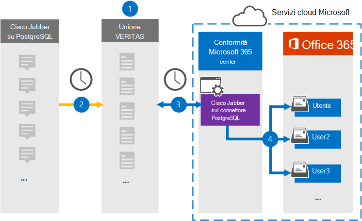

# Configurare un connettore per archiviare Cisco Jabber nei dati PostgreSQL (anteprima)

Utilizzare un connettore Veritas nel Centro conformità Microsoft 365 per importare e archiviare i dati dalla piattaforma Cisco Jabber alle cassette postali degli utenti nell'organizzazione Microsoft 365 locale. Veritas fornisce un [connettore Cisco Jabber su PostgreSQL](https://www.veritas.com/insights/merge1/jabber) configurato per acquisire elementi dall'origine dati di terze parti (a intervalli regolari) e importare tali elementi in Microsoft 365. Il connettore converte il contenuto, ad esempio messaggi, chat e contenuto condiviso da Cisco Jabber in PostgreSQL in un formato di messaggio di posta elettronica e quindi importa tali elementi nella cassetta postale dell'utente in Microsoft 365.

Dopo l'archiviazione dei dati Cisco Jabber in PostgreSQL nelle cassette postali degli utenti, è possibile applicare funzionalità di conformità Microsoft 365 quali conservazione per controversia legale, eDiscovery, criteri di conservazione ed etichette di conservazione. L'utilizzo di un connettore Cisco Jabber su PostgreSQL per importare e archiviare i dati in Microsoft 365 può aiutare l'organizzazione a rimanere conforme ai criteri governativi e normativi.

## Panoramica dell'archiviazione di Cisco Jabber sui dati PostgreSQL

Nella panoramica seguente viene illustrato il processo di utilizzo di un connettore per archiviare i dati Cisco Jabber su PostgreSQL in Microsoft 365.

1. L'organizzazione collabora con Cisco Jabber su PostgreSQL per configurare un Cisco Jabber nel sito PostgreSQL.

2. Una volta ogni 24 ore, gli elementi Cisco Jabber on PostgreSQL vengono copiati nel sito Veritas Merge1. Il connettore converte anche Cisco Jabber su elementi PostgreSQL in un formato di messaggio di posta elettronica.

3. Il connettore Cisco Jabber on PostgreSQL creato nel Centro conformità Microsoft 365, si connette al sito Veritas Merge1 ogni giorno e trasferisce il contenuto di Jabber in una posizione Archiviazione di Azure sicura nel cloud Microsoft.

4. Il connettore importa gli elementi convertiti nelle cassette postali di utenti specifici utilizzando il valore della proprietà *Email* del mapping automatico degli utenti, come descritto nel [passaggio 3.](#step-3-map-users-and-complete-the-connector-setup) Nelle cassette postali degli utenti viene creata una sottocartella nella cartella Posta in arrivo denominata **Cisco Jabber on PostgreSQL** e gli elementi vengono importati in tale cartella. Il connettore esegue questa operazione utilizzando il valore della *proprietà Email.* Ogni elemento Jabber contiene questa proprietà, che viene popolata con l'indirizzo di posta elettronica di ogni partecipante dell'elemento.

## Prima di iniziare

- Creare un account Merge1 per i connettori Microsoft. A tale scopo, contattare [il supporto tecnico Veritas.](https://www.veritas.com/content/support/en_US) È necessario accedere a questo account quando si crea il connettore nel passaggio 1.

- L'utente che crea il connettore Cisco Jabber su PostgreSQL nel passaggio 1 (e lo completa nel passaggio 3) deve essere assegnato al ruolo Esportazione importazione cassette postali in Exchange Online. Questo ruolo è necessario per aggiungere connettori nella pagina **Connettori** dati nel Centro Microsoft 365 conformità. Per impostazione predefinita, questo ruolo non viene assegnato ad alcun gruppo di ruoli in Exchange Online. È possibile aggiungere il ruolo Esportazione importazione cassette postali al gruppo di ruoli Gestione organizzazione in Exchange Online. In caso contrario, è possibile creare un gruppo di ruoli, assegnare il ruolo Importazione/Esportazione cassette postali e quindi aggiungere gli utenti appropriati come membri. Per ulteriori informazioni, vedere le sezioni [Create role groups](/Exchange/permissions-exo/role-groups#create-role-groups) o Modify role [groups](/Exchange/permissions-exo/role-groups#modify-role-groups) nell'articolo "Manage role groups in Exchange Online".

## Passaggio 1: Configurare Cisco Jabber sul connettore PostgreSQL

Il primo passaggio consiste nell'accedere alla pagina **Connettori** dati nel Centro conformità Microsoft 365 e creare un connettore per i dati jabber.

1. Passare a <https://compliance.microsoft.com> e quindi fare clic su **Connettori dati** &gt; **Cisco Jabber in PostgreSQL**.

2. Nella pagina Descrizione del prodotto **Cisco Jabber on PostgreSQL** fare clic **su Aggiungi connettore**.

3. Nella pagina **Condizioni di servizio** fare clic su **Accetta.**

4. Immettere un nome univoco che identifichi il connettore e quindi fare clic su **Avanti.**

5. Accedere all'account Merge1 per configurare il connettore.

## Passaggio 2: Configurare Cisco Jabber in PostgreSQL nel sito Veritas Merge1

Il secondo passaggio consiste nel configurare il connettore Cisco Jabber on PostgreSQL nel sito Veritas Merge1. Per informazioni su come configurare il connettore Cisco Jabber on PostgreSQL, vedere [Merge1 Third-Party Connectors User Guide](https://docs.ms.merge1.globanetportal.com/Merge1%20Third-Party%20Connectors%20Cisco%20Jabber%20on%20PostgreSQL%20User%20Guide.pdf).

Dopo aver fatto **clic su Salva & fine,** viene visualizzata la pagina **Mapping** utenti nella procedura guidata del connettore nel Centro Microsoft 365 conformità.

## Passaggio 3: mappare gli utenti e completare la configurazione del connettore

Per mappare gli utenti e completare la configurazione del connettore nel Centro Microsoft 365 conformità, attenersi alla seguente procedura:

1. Nella pagina **Mappa Cisco Jabber su Utenti PostgreSQL** Microsoft 365 utenti, abilitare il mapping automatico degli utenti. Gli elementi Cisco Jabber on PostgreSQL includono una proprietà denominata *Email*, che contiene gli indirizzi di posta elettronica per gli utenti dell'organizzazione. Se il connettore può associare questo indirizzo a un Microsoft 365 utente, gli elementi vengono importati nella cassetta postale dell'utente.

2. Fare **clic** su Avanti, rivedere le impostazioni e quindi passare alla pagina **Connettori** dati per visualizzare l'avanzamento del processo di importazione per il nuovo connettore.

## Passaggio 4: monitorare Cisco Jabber sul connettore PostgreSQL

Dopo aver creato il connettore Cisco Jabber su PostgreSQL, è possibile visualizzare lo stato del connettore nel Centro Microsoft 365 conformità.

1. Vai a <https://compliance.microsoft.com/> e fai clic su **Connettori dati** nel riquadro di spostamento sinistro.

2. Fare clic **sulla scheda Connettori** e quindi selezionare **Cisco Jabber sul** connettore PostgreSQL per visualizzare la pagina a comparsa, contenente le proprietà e le informazioni sul connettore.

3. In **Stato connettore con origine** fare clic sul collegamento Scarica **registro** per aprire (o salvare) il registro di stato per il connettore. Questo registro contiene i dati importati nel cloud Microsoft.

## Problemi noti

- Al momento non è possibile importare allegati o elementi di dimensioni superiori a 10 MB, ma il supporto per elementi di dimensioni maggiori sarà disponibile in un secondo momento.
