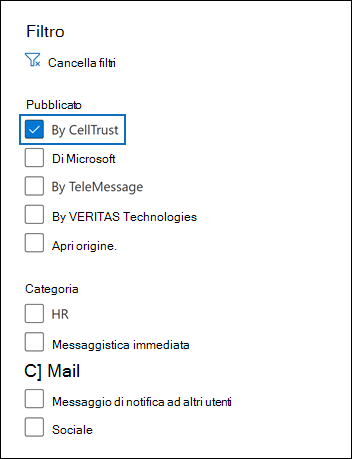

# Archiviare i dati da CellTrust SL2 a Microsoft 365 (anteprima)Archive data from CellTrust SL2 to Microsoft 365 (preview)

CellTrust SL2 acquisisce i dati delle comunicazioni mobili e si integra con le tecnologie di archiviazione leader per soddisfare i requisiti di individuazione elettronica per normative come FINRA, HIPAA, FOIA e TCPA.CellTrust SL2 captures mobile communications data and integrates with the leading archiving technologies to meet the electronic discovery requirements for regulations such as FINRA, HIPAA, FOIA, and TCPA. Il connettore dati SL2 importa gli elementi di comunicazione mobile Microsoft 365.The SL2 Data Connector imports mobile communication items to Microsoft 365. In questo articolo viene descritto il processo di integrazione di SL2 con Microsoft 365 utilizzando cellTrust SL2 Data Connector per l'archiviazione.This article describes the process for integrating SL2 with Microsoft 365 by using the CellTrust SL2 Data Connector for archiving. Il completamento di questo processo presuppone che tu abbia sottoscritto il servizio CellTrust SL2 e abbia familiarità con l'architettura SL2.Completing this process assumes that you have subscribed to CellTrust SL2 service and are familiar with the SL2 architecture. Per informazioni su SL2, vedere <www.celltrust.com>.For information about SL2, see <www.celltrust.com>.

Dopo l'importazione dei dati nelle cassette postali degli utenti in Microsoft 365, è possibile applicare funzionalità di conformità Microsoft 365 quali conservazione per controversia legale, eDiscovery, criteri di conservazione Microsoft 365 e conformità delle comunicazioni.After data is imported to user mailboxes in Microsoft 365, you can apply Microsoft 365 compliance features such as Litigation Hold, eDiscovery, Microsoft 365 retention policies, and communication compliance. L'utilizzo di CellTrust SL2 Data Connector per importare e archiviare i dati in Microsoft 365 può aiutare l'organizzazione a rimanere conforme ai criteri governativi e normativi.Using the CellTrust SL2 Data Connector to import and archive data in Microsoft 365 can help your organization stay compliant with government and regulatory policies.

## Panoramica dell'archiviazione con cellTrust SL2 Data ConnectorOverview of archiving with the CellTrust SL2 Data Connector

La piattaforma SL2 di CellTrust acquisisce i dati di comunicazione da più origini.CellTrust's SL2 platform captures communication data from multiple sources. Le origini dati SL2 sono P2P (Person-to-Person) o Application-to-Person (A2P).SL2 data sources are either Person-to-Person (P2P) or Application-to-Person (A2P). Il processo descritto in questo articolo riguarda solo le origini dati P2P.The process described in this article pertains only to P2P data sources. Per tutte le origini dati P2P, almeno una parte della collaborazione è un utente SL2 sottoscritto al servizio SL2.For all P2P data sources, at least one party in the collaboration is an SL2 user who is subscribed to the SL2 service. Nella panoramica seguente viene illustrato il processo di utilizzo del connettore dati SL2 CellTrust in Microsoft 365.The following overview explains the process of using the CellTrust SL2 Data Connector in Microsoft 365.

1. Gli utenti SL2 inviano e ricevono dati da e verso i servizi SL2 nel cloud Microsoft Azure cloud.SL2 users send and receive data to and from SL2 services in the Microsoft Azure cloud.

2. L'organizzazione ha un dominio SL2 nell'ambiente del servizio cloud SL2 di CellTrust.Your organization has an SL2 domain in CellTrust's SL2 Cloud Service environment. Il dominio può avere una o più unità organizzative.Your domain may have one or more organizational units (OUs). Il servizio cloud SL2 trasferisce i dati in un'area altamente sicura nella piattaforma Microsoft Azure, in modo che i dati non lascino mai l'Microsoft Azure ambiente.The SL2 Cloud Service transfers your data to a highly secure area in the Microsoft Azure platform, so that your data never leaves the Microsoft Azure environment. A seconda del piano SL2 (Enterprise, SMB o Government), il dominio è ospitato in Microsoft Azure Global o Microsoft Azure Government.Depending on your SL2 plan (Enterprise, SMB, or Government), your domain is either hosted on Microsoft Azure Global or Microsoft Azure Government.

3. Dopo aver creato il connettore dati SL2 CellTrust, il dominio e le unità organizzative (indipendentemente dal piano SL2), iniziare a inviare dati Microsoft 365.After you create the CellTrust SL2 Data Connector, your domain and OUs (regardless of your SL2 plan), begin sending data to Microsoft 365. Il feed di dati è strutturato per supportare la creazione di report in base alle origini dati, alle unità organizzative o al dominio da solo.The data feed is structured to support reporting based on data sources, OUs, or the domain by itself. Di conseguenza, l'organizzazione ha bisogno di un solo connettore per alimentare tutte le origini dati Microsoft 365.As a result, your organization needs only one connector to feed all your data sources to Microsoft 365.

4. Il connettore crea una cartella in ogni utente mappato con una licenza Office 365 appropriata intitolata **CellTrust SL2.**The connector creates a folder under each mapped user with an appropriate Office 365 license titled **CellTrust SL2**. Questo mapping connette un utente di CellTrust SL2 a una Office 365 cassetta postale utilizzando un indirizzo di posta elettronica.This mapping connects a CellTrust SL2 user to an Office 365 mailbox by using an email address. Se un ID utente in CellTrust SL2 non ha alcuna corrispondenza in Office 365, i dati dell'utente non verranno archiviati.If a user ID in CellTrust SL2 has no match in Office 365, the user's data will not be archived.

## Prima di configurare un connettoreBefore you set up a connector

- Verificare di disporre di un dominio nell'ambiente del servizio cloud CellTrust SL2.Verify that you have a domain in the CellTrust SL2 cloud service environment. Per ulteriori informazioni su come ottenere un dominio SL2 di produzione o di prova, [contattare CellTrust.](https://www.celltrust.com/contact-us/#form)For additional information on obtaining a production or trial SL2 domain, [Contact CellTrust](https://www.celltrust.com/contact-us/#form).

- Ottenere le credenziali per accedere all'account amministratore per il dominio SL2.Obtain the credentials to access the administrator account for your SL2 domain.

- L'utente che crea il connettore di dati CellTrust SL2 nel passaggio 1 (e lo completa nel passaggio 3) deve essere assegnato al ruolo Esportazione importazione cassette postali in Exchange Online.The user who creates the CellTrust SL2 data connector in Step 1 (and completes it in Step 3) must be assigned to the Mailbox Import Export role in Exchange Online. Questo ruolo è necessario per aggiungere connettori nella pagina **Connettori** dati nell'Centro conformità Microsoft 365.This role is required to add connectors on the **Data connectors** page in the Microsoft 365 compliance center. Per impostazione predefinita, questo ruolo non viene assegnato a un gruppo di ruoli in Exchange Online.By default, this role is not assigned to a role group in Exchange Online. È possibile aggiungere il ruolo Esportazione importazione cassette postali al gruppo di ruoli Gestione organizzazione in Exchange Online.You can add the Mailbox Import Export role to the Organization Management role group in Exchange Online. In caso contrario, è possibile creare un gruppo di ruoli, assegnare il ruolo Importazione/Esportazione cassette postali e quindi aggiungere gli utenti appropriati come membri.Or you can create a role group, assign the Mailbox Import Export role, and then add the appropriate users as members. Per ulteriori informazioni, vedere le sezioni [Create role groups](/Exchange/permissions-exo/role-groups#create-role-groups) o Modify role [groups](/Exchange/permissions-exo/role-groups#modify-role-groups) nell'articolo "Manage role groups in Exchange Online".For more information, see the [Create role groups](/Exchange/permissions-exo/role-groups#create-role-groups) or [Modify role groups](/Exchange/permissions-exo/role-groups#modify-role-groups) sections in the article "Manage role groups in Exchange Online".

## Passaggio 1: Creare un connettore SL2 CellTrustStep 1: Create a CellTrust SL2 connector

Il primo passaggio consiste nel creare un connettore dati nell'Centro conformità Microsoft 365.The first step is to create a data connector in the Microsoft 365 compliance center.

1. Passare a <https://compliance.microsoft.com> e fare clic su **Connettori dati** nel riquadro di spostamento sinistro.Go to <https://compliance.microsoft.com> and click **Data connectors** on the left navigation pane.

2. Nella scheda **Panoramica** fare clic su **Filtro** e selezionare **Per CellTrust** e quindi applicare il filtro.On the **Overview** tab, click **Filter** and select **By CellTrust**, and then apply the filter.

   

3. Fare **clic su CellTrust SL2 (anteprima).**Click **CellTrust SL2 (preview**).

4. Nella pagina **Descrizione del prodotto CellTrust SL2 (anteprima)** fare clic **su Aggiungi connettore**.On the **CellTrust SL2 (preview**) product description page, click **Add connector**.

5. Nella pagina **Condizioni di servizio** fare clic su **Accetta.**On the **Terms of service** page, click **Accept**.

6. Immettere un nome univoco che identifichi il connettore e quindi fare clic su **Avanti.**Enter a unique name that identifies the connector and then click **Next**. Il nome immesso identificherà il connettore nella **pagina Connettori dati** dopo la creazione.The name you enter will identify the connector on the **Data connectors** page after you create it.

7. Nella pagina **Accedi al tuo account CellTrust** fai clic su Accedi a **CellTrust.**On the **Sign in to your CellTrust account** page, click **Sign into CellTrust**. Verrà reindirizzato al portale **CellTrust** per Microsoft 365 in una nuova finestra del browser.You'll be redirected to the **CellTrust Portal for Microsoft 365** in a new browser window.

## Passaggio 2: Selezionare i domini o le unità organizzative da archiviareStep 2: Select the domains or OUs to archive

Il passaggio successivo consiste nell'accedere a un account amministratore per il dominio CellTrust SL2 e selezionare i domini e le unità organizzative da archiviare in Microsoft 365.The next step is to sign into an administrator account for your CellTrust SL2 domain and select the domains and OUs to archive in Microsoft 365.

1. Nella pagina CellTrust **Microsoft 365 Connector** selezionare l'ambiente nel servizio cloud SL2 per visualizzare una pagina di accesso.On the CellTrust **Microsoft 365 Connector** page, select your environment in the SL2 cloud service to display a sign-in page.

   In genere dovrebbe essere visualizzata un'opzione che rappresenta l'ambiente.Typically, you should see one option representing your environment. Tuttavia, se si dispone di domini in più di un ambiente, saranno disponibili opzioni per ogni ambiente.However, if you have domains in more than one environment, you will see options for each environment. Dopo aver fatto una selezione, sarai reindirizzato alla pagina di accesso SL2.After you make a selection, you'll be redirected to the SL2 login page.

2. Accedere con le credenziali dell'account di amministratore di dominio o di unità organizzativa.Sign in with your Domain or OU Administrator account credentials.

   Se si accede come amministratore di dominio SL2, verranno visualizzati il nome del dominio e le unità organizzative in tale dominio.If you sign in as an SL2 domain administrator, you will see the name of your domain and the OUs in that domain. Se non si dispone di unità organizzative, viene visualizzato solo il nome del dominio.If you do not have OUs, you only see the name of your domain. Se si accede come amministratore dell'unità organizzativa, viene visualizzato solo il nome dell'unità organizzativa.If you log in as OU Administrator, you only see the name of your OU.

3. Abilitare le unità aziendali che si desidera archiviare.Enable the business units you wish to archive. La selezione del dominio non selezionerà automaticamente le unità organizzative.Selecting the domain will not automatically select the OUs. È necessario abilitare separatamente ogni unità organizzativa per archiviarla.You must enable each OU separately to archive it.

   

4. Al termine delle selezioni, chiudere la finestra del browser e tornare alla pagina della procedura guidata in Centro conformità Microsoft 365.When you're finished with your selections, close the browser window and return to the wizard page in Microsoft 365 compliance center. Dopo alcuni secondi, la procedura guidata passa automaticamente al passaggio successivo del mapping degli utenti.After a few seconds, the wizard automatically advances to the next step of mapping users.

## Passaggio 3: mappare gli utenti e completare la configurazione del connettoreStep 3: Map users and complete the connector setup

L'ultimo passaggio consiste nel mappare gli utenti e completare la configurazione del connettore nella Centro conformità Microsoft 365.The last step is to map users and complete the connector setup in the Microsoft 365 compliance center.

1. Nella pagina **Mapping utenti** selezionare **Abilita** mapping automatico utenti se l'indirizzo di posta elettronica per gli utenti è lo stesso sia in SL2 che Microsoft 365.On the **User mapping** page, select **Enable automatic user mapping** if the email address for users is the same in both SL2 and  Microsoft 365. In caso contrario, è consigliabile caricare manualmente gli indirizzi di posta elettronica degli utenti caricando un file CSV che mappa l'indirizzo SL2 degli utenti al Microsoft 365 indirizzo.Otherwise, you should manually user email addresses by uploading a CSV file that maps users' SL2 address to their Microsoft 365 address.

2. Fare **clic su** Avanti, rivedere le impostazioni e quindi fare clic su **Fine** per creare il connettore.Click **Next**, review your settings, and then click **Finish** to create the connector.

   Il nuovo connettore viene aggiunto all'elenco nella **pagina Connettori dati.**The new connector is added to the list on the **Data connectors** page.

## Ottenere assistenza da CellTrustGet help from CellTrust

Per informazioni dettagliate sulla configurazione di un connettore dati CellTrust SL2, vedere la pagina [CellTrust Customer Support.](https://www.celltrust.com/contact-us/#support)See the [CellTrust Customer Support page](https://www.celltrust.com/contact-us/#support) for details about contacting CellTrust for help with setting up a CellTrust SL2 data connector.

## Ulteriori informazioniMore information

- Un amministratore di dominio può configurare un connettore per il dominio o qualsiasi unità organizzativa in tale dominio.A domain administrator can set up a connector for the domain or any OUs in that domain. Se si utilizza l'account amministratore dell'unità organizzativa, è possibile configurare solo un connettore per tale unità organizzativa specifica.If you use the OU Administrator account, you can only set up a connector for that specific OU.

- Per completare correttamente i passaggi precedenti, devi disporre di una licenza Microsoft 365 E5 e disporre dei diritti di amministratore Microsoft Office appropriati.To successfully complete the steps above, you must be assigned a Microsoft 365 E5 license and have the proper Microsoft Office admin rights.

- Per testare il nuovo connettore, invia un SMS usando l'app per dispositivi mobili SL2 o dal portale SL2.To test the new connector, send a text message using your SL2 mobile app or from your SL2 portal. Passare alla cassetta Microsoft 365 e aprire la **cartella CellTrust SL2** nella cartella Posta in arrivo.Go to your Microsoft 365 mailbox and open the **CellTrust SL2** folder in your Inbox. La visualizzazione dei messaggi di testo nella cassetta postale potrebbe richiedere alcuni minuti.It may take a few minutes for the text messages to show up in your mailbox.

- Molte leggi e normative richiedono che la comunicazione elettronica sia conservata in modo tale che, quando richiesto, possa essere prodotto come prova.Many laws and regulations require electronic communication to be preserved in such a way that, when requested, it can be produced as evidence. Electronic Discovery (eDiscovery) viene utilizzato per conformarsi alla produzione di comunicazioni elettroniche.Electronic Discovery (eDiscovery) is used to comply with the production of electronic communication. Enterprise Le soluzioni di archiviazione delle informazioni sono progettate per eseguire eDiscovery e offrono funzionalità quali la gestione dei criteri di conservazione, la classificazione dei dati e la supervisione del contenuto.Enterprise Information Archiving (EIA) solutions are designed to perform eDiscovery, and provide features such as retention policy management, data classification, and content supervision. Microsoft 365 offre una soluzione di conservazione a lungo termine per la conformità alle normative e agli standard che influiscono sull'organizzazione.Microsoft 365 offers a long-term retention solution for compliance with the regulations and standards that affect your organization.

- Il termine *archiviazione* utilizzato in questo documento si riferisce all'archiviazione nel contesto di utilizzo all'interno di una soluzione Enterprise Information Archiving (EIA).The term *archiving* as used in this document refers to archiving in the context of use within an Enterprise Information Archiving (EIA) solution. Le soluzioni EIA dispongono di funzionalità di eDiscovery che producono documenti per procedimenti legali, controversie legali, controlli e indagini.EIA solutions have eDiscovery features that produce documents for legal proceedings, litigation, audits, and investigations. L'archiviazione nel contesto del backup e del ripristino utilizzato per il ripristino di emergenza e la continuità aziendale non è l'uso previsto del termine in questo documento.Archiving in the context of backup and restore used for disaster recovery and business continuity isn't the intended use of the term within this document.
