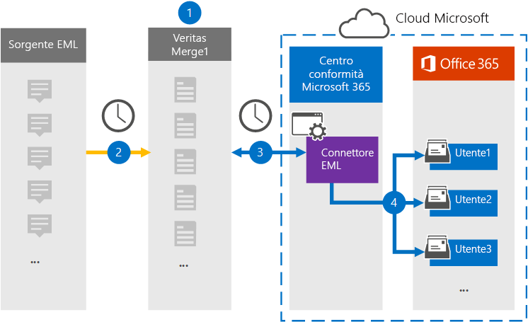

# Configurare un connettore per archiviare i dati EML

Utilizzare un connettore di Globanet nel centro conformità di Microsoft 365 per importare e archiviare i dati EML nelle cassette postali degli utenti nell'organizzazione Microsoft 365. EML è l'estensione di file per un messaggio di posta elettronica salvato in un file. Il connettore converte il contenuto di un elemento dal formato di origine in un formato di messaggio di posta elettronica e quindi importa l'elemento in una cassetta postale utente.

Dopo che i messaggi EML sono archiviati nelle cassette postali degli utenti, è possibile applicare le funzionalità di conformità di Microsoft 365 come la conservazione per controversia legale, eDiscovery e i criteri di conservazione e le etichette di mantenimento. L'utilizzo di un connettore EML per l'importazione e l'archiviazione dei dati in Microsoft 365 può aiutare l'organizzazione a rimanere conforme ai criteri governativi e normativi.

## Panoramica dell'archiviazione dei dati EML

Nella panoramica seguente viene illustrato il processo di utilizzo di un connettore per archiviare i dati EML in Microsoft 365.

1. L'organizzazione funziona con l'origine EML per impostare e configurare un sito EML.

2. Una volta ogni 24 ore, gli elementi di contenuto provenienti dall'origine EML vengono copiati nel sito Merge1 di Globanet. Durante questo processo, il contenuto di un file EML viene convertito in un formato di messaggio di posta elettronica.

3. Il connettore EML creato nel centro conformità di Microsoft 365, si connette al sito di Globanet Merge1 ogni giorno e trasferisce i messaggi a una posizione di archiviazione sicura di Azure nel cloud Microsoft.

4. Il connettore importa gli elementi del messaggio convertiti nelle cassette postali di utenti specifici utilizzando il valore della proprietà di *posta elettronica* del processo di mapping degli utenti automatico descritto nel [passaggio 3](#step-3-map-users-and-complete-the-connector-setup). Durante questo processo, viene creata una sottocartella nella cartella posta in arrivo denominata **EML**nelle cassette postali degli utenti e gli elementi eml vengono importati nella cartella. Il connettore esegue questa operazione utilizzando il valore della proprietà di *posta elettronica* . Ogni messaggio contiene questa proprietà, che viene popolata con l'indirizzo di posta elettronica di tutti i partecipanti all'elemento di contenuto.

## Prima di iniziare

- Creare un account Merge1 di Globanet per i connettori Microsoft. A tale scopo, contattare il [supporto clienti di Globanet](https://globanet.com/ms-connectors-contact). È necessario accedere a questo account quando si crea il connettore nel passaggio 1.

- L'utente che crea il connettore EML nel passaggio 1 (e lo completa nel passaggio 3) deve essere assegnato al ruolo di importazione/esportazione delle cassette postali in Exchange Online. Questo ruolo è necessario per aggiungere connettori nella pagina **dei connettori dati** nel centro conformità di Microsoft 365. Per impostazione predefinita, questo ruolo non è assegnato a nessun gruppo di ruoli in Exchange Online. È possibile aggiungere il ruolo import export delle cassette postali al gruppo di ruoli Gestione organizzazione in Exchange Online. In alternativa, è possibile creare un gruppo di ruoli, assegnare il ruolo di esportazione delle cassette postali e quindi aggiungere gli utenti corretti come membri. Per ulteriori informazioni, vedere la sezione creare gruppi di [ruoli](https://docs.microsoft.com/Exchange/permissions-exo/role-groups#create-role-groups) o [modificare gruppi di ruoli](https://docs.microsoft.com/Exchange/permissions-exo/role-groups#modify-role-groups) nell'articolo "gestire i gruppi di ruoli in Exchange Online".

## Passaggio 1: configurare un connettore EML

Il primo passaggio consiste nell'accedere alla pagina **dei connettori dati** nel centro conformità di Microsoft 365 e creare un connettore per i dati EML.

1. Andare a [https://compliance.microsoft.com](https://compliance.microsoft.com/) e quindi fare clic su **connettori dati**  >  **EML**.

2. Nella pagina Descrizione prodotto **EML** fare clic su **Aggiungi connettore**.

3. Nella pagina **condizioni del servizio** fare clic su **Accetto**.

4. Immettere un nome univoco che identifichi il connettore e quindi fare clic su **Avanti**.

5. Accedere al proprio account di Merge1 per configurare il connettore.

## Passaggio 2: configurare il connettore EML nel sito Merge1 di Globanet

Il secondo passaggio consiste nel configurare il connettore EML nel sito Merge1 di Globanet. Per informazioni sulla configurazione del connettore EML, vedere [Merge1 di terze parti dei connettori utente](https://docs.ms.merge1.globanetportal.com/Merge1%20Third-Party%20Connectors%20EML%20User%20Guide%20.pdf).

Dopo aver fatto clic su **salva & fine**, tornare al centro conformità Microsoft 365 alla pagina **mapping utenti** della procedura guidata del connettore.

## Passaggio 3: mappare gli utenti e completare la configurazione del connettore

Per eseguire il mapping degli utenti e completare la configurazione del connettore nel centro conformità di Microsoft 365, eseguire la procedura seguente:

1. Nella pagina mapping **utenti esterni a Microsoft 365** , abilitare il mapping automatico degli utenti. Gli elementi di origine EML includono una proprietà denominata *posta elettronica*, che contiene gli indirizzi di posta elettronica per gli utenti dell'organizzazione. Se il connettore può associare questo indirizzo a un utente di Microsoft 365, gli elementi EML vengono importati nella cassetta postale dell'utente.

2. Nella pagina **consenso amministratore** fare clic su **Fornisci consenso**. L'utente verrà reindirizzato al sito Microsoft. Fare clic su **accetta** per fornire il consenso.

   L'organizzazione deve autorizzare il servizio di importazione di Office 365 per accedere ai dati delle cassette postali nell'organizzazione. Per fornire il consenso dell'amministratore, è necessario essere connessi con le credenziali di un amministratore globale di Microsoft 365 e quindi accettare la richiesta di consenso. Se non è stato eseguito l'accesso come amministratore globale, è possibile accedere a [Questa pagina](https://login.microsoftonline.com/common/oauth2/authorize?client_id=570d0bec-d001-4c4e-985e-3ab17fdc3073&response_type=code&redirect_uri=https://portal.azure.com/&nonce=1234&prompt=admin_consent) ed eseguire l'accesso con le credenziali di amministratore globale per accettare la richiesta.

3. Fare clic su **Avanti**, esaminare le impostazioni, quindi passare alla pagina **connettori dati** per visualizzare lo stato di avanzamento del processo di importazione per il nuovo connettore.

## Passaggio 4: monitorare il connettore EML

Dopo aver creato il connettore EML, è possibile visualizzare lo stato del connettore nel centro conformità di Microsoft 365.

1. Andare a [https://compliance.microsoft.com](https://compliance.microsoft.com) e fare clic su **connettori dati** nel NAV sinistro.

2. Fare clic sulla scheda **connettori** e quindi selezionare il connettore **EML** per visualizzare la pagina del riquadro a comparsa, che contiene le proprietà e le informazioni sul connettore.

3. In **stato connettore con origine**fare clic sul collegamento **Scarica log** per aprire o salvare il registro di stato del connettore. Questo log contiene informazioni sui dati che sono stati importati nel cloud Microsoft.

## Problemi noti

- Al momento, non è supportato l'importazione di allegati o elementi di dimensioni superiori a 10 MB. Il supporto per gli elementi di grandi dimensioni sarà disponibile in un secondo momento.
