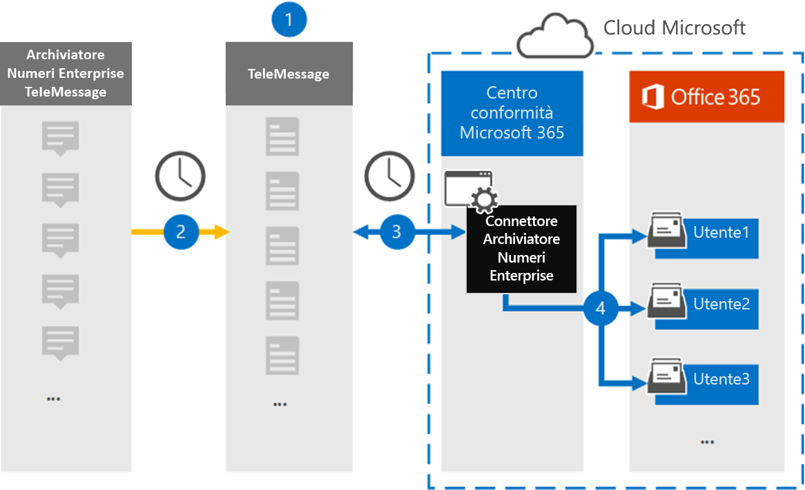

# Configurare un connettore per archiviare i Enterprise numericiSet up a connector to archive Enterprise Number data

Utilizzare un connettore TeleMessage nel Centro conformità Microsoft 365 per importare e archiviare i messaggi del servizio di messaggistica breve (SMS) e mms (Multimedia Messaging Service), i messaggi di chat, le registrazioni delle chiamate vocali e i registri delle chiamate vocali dall'utilità di archiviazione numeri di Enterprise.Use a TeleMessage connector in the Microsoft 365 compliance center to import and archive Short Messaging Service (SMS) and Multimedia Messaging Service (MMS) messages, chat messages, voice call recordings, and voice call logs from the Enterprise Number Archiver. Dopo aver configurato e configurato un connettore, il connettore si connette all'account TeleMessage dell'organizzazione una volta al giorno e importa i dati di comunicazione mobile dei dipendenti utilizzando l'archivio numeri telemessage Enterprise per le cassette postali in Microsoft 365.After you set up and configure a connector, it connects to your organization's TeleMessage account once every day and imports the mobile communication data of employees using the TeleMessage Enterprise Number Archiver to mailboxes in Microsoft 365.

Dopo aver archiviato i dati del connettore TeleMessage Enterprise Number Archiver nelle cassette postali degli utenti, è possibile applicare funzionalità di conformità Microsoft 365 quali conservazione per controversia legale, ricerca contenuto, archiviazione In-Place, controllo, conformità delle comunicazioni e criteri di conservazione Microsoft 365 ai dati di Enterprise Number Archiver.After the TeleMessage Enterprise Number Archiver connector data is stored in user mailboxes, you can apply Microsoft 365 compliance features such as Litigation Hold, Content Search, In-Place Archiving, Auditing, Communication compliance, and Microsoft 365 retention policies to Enterprise Number Archiver data. Ad esempio, è possibile eseguire una ricerca nel SMS, MMS e Voice Call di TeleMessage Enterprise Number Archiver utilizzando Ricerca contenuto o associare la cassetta postale che contiene i dati del connettore di archiviazione dei numeri di Enterprise a un responsabile in un caso Advanced eDiscovery.For example, you can search the TeleMessage Enterprise Number Archiver SMS, MMS, and Voice Call using Content Search or associate the mailbox that contains the Enterprise Number Archiver connector data with a custodian in an Advanced eDiscovery case. L'utilizzo Enterprise connettore Number Archiver per importare e archiviare i dati in Microsoft 365 può aiutare l'organizzazione a rimanere conforme ai criteri normativi e governativi.Using an Enterprise Number Archiver connector to import and archive data in Microsoft 365 can help your organization stay compliant with government and regulatory policies.

## Panoramica dell'archiviazione Enterprise dati numericiOverview of archiving Enterprise Number data

Nella panoramica seguente viene illustrato il processo di utilizzo di un connettore per archiviare Enterprise di rete in Microsoft 365.The following overview explains the process of using a connector to archive Enterprise Network data in Microsoft 365.

1. L'organizzazione collabora con TeleMessage per configurare un connettore di archiviazione Enterprise numero.Your organization works with TeleMessage to set up an Enterprise Number Archiver connector. Per ulteriori dettagli, vedere [qui](https://www.telemessage.com/office365-activation-for-enterprise-number-archiver/).For more details refer to [here](https://www.telemessage.com/office365-activation-for-enterprise-number-archiver/).

2. Il connettore Enterprise Number Archiver creato nel Centro conformità Microsoft 365 si connette ogni giorno al sito TeleMessage e trasferisce i messaggi di posta elettronica dalle 24 ore precedenti a un'area Archiviazione di Azure sicura nel cloud Microsoft.The Enterprise Number Archiver connector that you create in the Microsoft 365 compliance center connects to the TeleMessage site every day and transfers the email messages from the previous 24 hours to a secure Azure Storage area in the Microsoft Cloud.

3. Il connettore importa gli elementi di comunicazione mobile nella cassetta postale di un utente specifico.The connector imports the mobile communication items to the mailbox of a specific user. Una nuova cartella denominata Enterprise Number Archiver viene creata nella cassetta postale dell'utente specifico e gli elementi vengono importati in essa.A new folder named Enterprise Number Archiver is created in the specific user's mailbox and the items are imported to it. Il connettore esegue il mapping utilizzando il valore della proprietà Indirizzo di posta elettronica *dell'utente.*The connector does mapping by using the value of the *User’s Email address* property. Ogni messaggio di posta elettronica contiene questa proprietà, che viene popolata con l'indirizzo di posta elettronica di ogni partecipante del messaggio di posta elettronica.Every email message contains this property, which is populated with the email address of every participant of the email message. Oltre al mapping automatico degli utenti utilizzando il valore della proprietà Indirizzo di posta elettronica *dell'utente,* è anche possibile definire un mapping personalizzato caricando un file di mapping CSV.In addition to automatic user mapping using the value of the *User’s Email address* property, you can also define a custom mapping by uploading a CSV mapping file. Questo file di mapping deve contenere il numero di cellulare dell'utente e l'indirizzo Microsoft 365 corrispondente per ogni utente.This mapping file should contain User’s mobile Number and the corresponding Microsoft 365 mailbox address for each user. Se si abilita il mapping automatico degli utenti e si fornisce un mapping personalizzato, per ogni elemento di posta elettronica il connettore guarderà innanzitutto il file di mapping personalizzato.If you enable automatic user mapping and provide a custom mapping, for every email item the connector will first look at custom mapping file. Se non trova un utente Microsoft 365 valido corrispondente al numero di cellulare di un utente, il connettore utilizzerà la proprietà Dell'indirizzo di posta elettronica dell'utente dell'elemento di posta elettronica.If it doesn't find a valid Microsoft 365 user that corresponds to a user's mobile number, the connector will use the User ‘s email address property of the email item. Se il connettore non trova un utente Microsoft 365 valido nel file di mapping personalizzato o nella proprietà dell'indirizzo di posta elettronica dell'utente dell'elemento di posta elettronica, *l'elemento* non verrà importato.If the connector doesn't find a valid Microsoft 365 user in either the custom mapping file or the *user’s email address* property of the email item, the item won't be imported.

## Prima di configurare un connettoreBefore you set up a connector

Alcuni dei passaggi di implementazione necessari per archiviare i Enterprise number archiver sono esterni a Microsoft 365 e devono essere completati prima di poter creare il connettore nel Centro conformità.Some of the implementation steps required to archive Enterprise Number Archiver data are external to Microsoft 365 and must be completed before you can create the connector in the compliance center.

- Ordinare [il Enterprise Number Archiver da TeleMessage](https://www.telemessage.com/mobile-archiver/order-mobile-archiver-for-o365) e ottenere un account di amministrazione valido per l'organizzazione.Order the [Enterprise Number Archiver service from TeleMessage](https://www.telemessage.com/mobile-archiver/order-mobile-archiver-for-o365) and get a valid administration account for your organization. Sarà necessario accedere a questo account quando si crea il connettore nel Centro conformità.You'll need to sign into this account when you create the connector in the compliance center.

- Registrare tutti gli utenti che richiedono Enterprise archiviazione SMS/MMS Network nell'account TeleMessage.Register all users that require Enterprise Number SMS/MMS Network archiving in the TeleMessage account. Quando si registrano gli utenti, assicurarsi di usare lo stesso indirizzo di posta elettronica utilizzato per l'account Microsoft 365 account.When registering users, be sure to use the same email address that's used for their Microsoft 365 account.

- Installare e attivare l'app TeleMessage Enterprise Number Archiver sui telefoni cellulari dei dipendenti.Install and activate the TeleMessage Enterprise Number Archiver app on the mobile phones of your employees.

- All'utente che crea un Enterprise di archiviazione dei numeri deve essere assegnato il ruolo Esportazione importazione cassette postali in Exchange Online.The user who creates a Enterprise Number Archiver connector must be assigned the Mailbox Import Export role in Exchange Online. Questa operazione è necessaria per aggiungere connettori nella pagina **Connettori** dati nel Centro Microsoft 365 conformità.This is required to add connectors in the **Data connectors** page in the Microsoft 365 compliance center. Per impostazione predefinita, questo ruolo non è assegnato ad alcun gruppo di ruoli in Exchange Online.By default, this role isn't assigned to any role group in Exchange Online. È possibile aggiungere il ruolo Esportazione importazione cassette postali al gruppo di ruoli Gestione organizzazione in Exchange Online.You can add the Mailbox Import Export role to the Organization Management role group in Exchange Online. In caso contrario, è possibile creare un gruppo di ruoli, assegnare il ruolo Importazione/Esportazione cassette postali e quindi aggiungere gli utenti appropriati come membri.Or you can create a role group, assign the Mailbox Import Export role, and then add the appropriate users as members. Per ulteriori informazioni, vedere le sezioni [Create role groups](/Exchange/permissions-exo/role-groups#create-role-groups) o Modify role [groups](/Exchange/permissions-exo/role-groups#modify-role-groups) nell'articolo "Manage role groups in Exchange Online".For more information, see the [Create role groups](/Exchange/permissions-exo/role-groups#create-role-groups) or [Modify role groups](/Exchange/permissions-exo/role-groups#modify-role-groups) sections in the article "Manage role groups in Exchange Online".

- Questo connettore dati è disponibile in GCC nel cloud Microsoft 365 us government.This data connector is available in GCC environments in the Microsoft 365 US Government cloud. Le applicazioni e i servizi di terze parti possono comportare l'archiviazione, la trasmissione e l'elaborazione dei dati dei clienti dell'organizzazione in sistemi di terze parti esterni all'infrastruttura di Microsoft 365 e pertanto non coperti dagli impegni di conformità e protezione dei dati di Microsoft 365.Third-party applications and services might involve storing, transmitting, and processing your organization's customer data on third-party systems that are outside of the Microsoft 365 infrastructure and therefore are not covered by the Microsoft 365 compliance and data protection commitments. Microsoft non fa alcuna rappresentazione che utilizzi questo prodotto per connettersi ad applicazioni di terze parti implica che tali applicazioni di terze parti siano conformi a FEDRAMP.Microsoft makes no representation that use of this product to connect to third-party applications implies that those third-party applications are FEDRAMP compliant.

## Creare un connettore Enterprise archivio numeriCreate an Enterprise Number Archiver connector

Dopo aver completato i prerequisiti descritti nella sezione precedente, è possibile creare un connettore Enterprise Number Archiver nel Centro Microsoft 365 conformità.After you've completed the prerequisites described in the previous section, you can create an Enterprise Number Archiver connector in the Microsoft 365 compliance center. Il connettore utilizza le informazioni fornite per connettersi al sito TeleMessage e trasferire i messaggi di SMS, MMS e chiamate vocali alle caselle delle cassette postali dell'utente corrispondenti in Microsoft 365.The connector uses the information you provide to connect to the TeleMessage site and transfer SMS, MMS, and voice call messages to the corresponding user mailbox boxes in Microsoft 365.

1. Passare a [https://compliance.microsoft.com](https://compliance.microsoft.com/) e quindi fare clic su **Connettori** \> **dati Enterprise Archivio numeri**.Go to [https://compliance.microsoft.com](https://compliance.microsoft.com/) and then click **Data connectors** \> **Enterprise Number Archiver**.

2. Nella pagina **Enterprise descrizione del prodotto Number Archiver** fare clic **su Aggiungi connettore**On the **Enterprise Number Archiver** product description page, click **Add connector**

3. Nella pagina **Condizioni di servizio** fare clic su **Accetta.**On the **Terms of service** page, click **Accept**.

4. Nella pagina **Accesso a TeleMessage,** in Passaggio 3, immettere le informazioni necessarie nelle caselle seguenti e quindi fare clic su **Avanti.**On the **Login to TeleMessage** page, under Step 3, enter the required information in the following boxes and then click **Next**.

   - **Nome utente:** Nome utente TeleMessage.**Username:** Your TeleMessage username.

   - **Password:** Password TeleMessage.**Password:** Your TeleMessage password.

5. Dopo aver creato il connettore, è possibile chiudere la finestra popup e passare alla pagina successiva.After the connector is created, you can close the pop-up window and go to the next page.

6. Nella pagina **Mapping utenti** abilitare il mapping automatico degli utenti.On the **User mapping** page, enable automatic user mapping. Per abilitare il mapping personalizzato, caricare un file CSV contenente le informazioni sul mapping degli utenti e quindi fare clic su **Avanti.**To enable custom mapping, upload a CSV file that contains the user mapping information, and then click **Next**.

7. Rivedere le impostazioni e quindi fare clic **su Fine** per creare il connettore.Review your settings, and then click **Finish** to create the connector.

8. Passare alla scheda Connettori nella **pagina Connettori dati** per visualizzare l'avanzamento del processo di importazione per il nuovo connettore.Go to the Connectors tab in **Data connectors** page to see the progress of the import process for the new connector.

## Problemi notiKnown issues

- Al momento non è possibile importare allegati o elementi di dimensioni superiori a 10 MB.At this time, we don't support importing attachments or items that are larger than 10 MB. Il supporto per gli elementi più grandi sarà disponibile in un secondo momento.Support for larger items will be available at a later date.