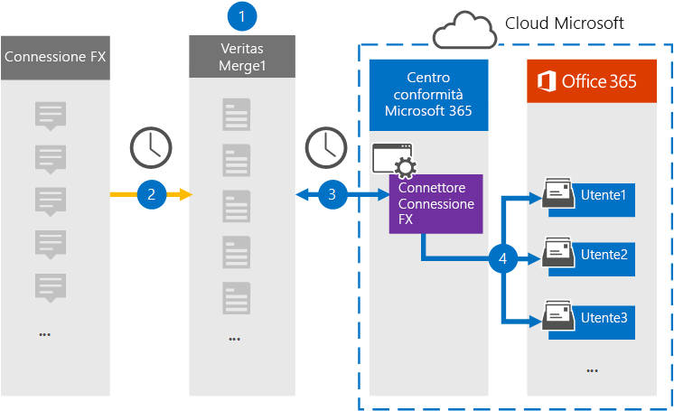

# Configurare un connettore per l'archiviazione dei dati di connessione FXSet up a connector to archive FX Connect data

Utilizzare un connettore di Globanet nel centro conformità di Microsoft 365 per importare e archiviare i dati dalla piattaforma di collaborazione FX Connect alle cassette postali degli utenti nell'organizzazione Microsoft 365.Use a Globanet connector in the Microsoft 365 compliance center to import and archive data from the FX Connect collaboration platform to user mailboxes in your Microsoft 365 organization. Globanet fornisce un connettore [FX Connect](https://globanet.com/fx-connect/) configurato per acquisire gli elementi di connessione FX e importare tali elementi in Microsoft 365.Globanet provides an [FX Connect](https://globanet.com/fx-connect/) connector that is configured to capture FX Connect items and import those items to Microsoft 365. Il connettore converte il contenuto da FX Connect, ad esempio mestieri, messaggi e altri dettagli dall'account di connessione FX dell'organizzazione, a un formato di messaggio di posta elettronica e quindi importa tali elementi nella cassetta postale dell'utente in Microsoft 365.The connector converts the content from FX Connect, such as  trades, messages, and other details from your organization's FX Connect account, to an email message format and then imports those items to the user's mailbox in Microsoft 365.

Dopo che i dati di connessione FX sono archiviati nelle cassette postali degli utenti, è possibile applicare le funzionalità di conformità di Microsoft 365 come conservazione per controversia legale, eDiscovery, criteri di conservazione e etichette per il mantenimento e conformità della comunicazione.After FX Connect data is stored in user mailboxes, you can apply Microsoft 365 compliance features such as Litigation Hold, eDiscovery, retention policies and retention labels, and communication compliance. L'utilizzo di un connettore FX Connect per l'importazione e l'archiviazione dei dati in Microsoft 365 può aiutare l'organizzazione a rimanere conforme ai criteri governativi e normativi.Using an FX Connect connector to import and archive data in Microsoft 365 can help your organization stay compliant with government and regulatory policies.

## Panoramica dell'archiviazione dei dati di connessione FXOverview of archiving FX Connect data

Nella panoramica seguente viene illustrato il processo di utilizzo di un connettore per archiviare le informazioni su FX Connect in Microsoft 365.The following overview explains the process of using a connector to archive the FX Connect information in Microsoft 365.

1. L'organizzazione è compatibile con FX Connect per impostare e configurare un sito FX Connect.Your organization works with FX Connect to set up and configure an FX Connect site.

2. Una volta ogni 24 ore, gli elementi provenienti da account di connessione FX vengono copiati nel sito Merge1 di Globanet.Once every 24 hours, items from FX Connect accounts are copied to the Globanet Merge1 site. Il connettore converte gli elementi FX Connect anche in un formato di messaggio di posta elettronica.The connector also converts the FX Connect items to an email message format.

3. Il connettore FX Connect creato nel centro conformità Microsoft 365, si connette al sito di Globanet Merge1 ogni giorno e trasferisce gli elementi FX Connect in una posizione di archiviazione sicura di Azure nel cloud Microsoft.The FX Connect connector that you create in the Microsoft 365 compliance center, connects to the Globanet Merge1 site every day and transfers the FX Connect items to a secure Azure Storage location in the Microsoft cloud.

4. Il connettore consente di importare gli elementi nelle cassette postali di utenti specifici utilizzando il valore della proprietà di *posta elettronica* del mapping automatico degli utenti, come descritto nel [passaggio 3](#step-3-map-users-and-complete-the-connector-setup).The connector imports items to the mailboxes of specific users by using the value of the *Email* property of the automatic user mapping as described in [Step 3](#step-3-map-users-and-complete-the-connector-setup). Una sottocartella della cartella posta in arrivo denominata **FX Connect** viene creata nelle cassette postali degli utenti e gli elementi vengono importati in tale cartella.A subfolder in the Inbox folder named **FX Connect** is created in the user mailboxes, and the items are imported to that folder. Il connettore esegue questa operazione utilizzando il valore della proprietà di *posta elettronica* .The connector does this by using the value of the *Email* property. Ogni elemento FX Connect contiene questa proprietà, che viene popolata con l'indirizzo di posta elettronica di tutti i partecipanti all'elemento.Every FX Connect item contains this property, which is populated with the email address of every participant of the item.

## Informazioni preliminariBefore you begin

- Creare un account Merge1 di Globanet per i connettori Microsoft.Create a Globanet Merge1 account for Microsoft connectors.  Per creare un account, contattare il [supporto clienti di Globanet](https://globanet.com/ms-connectors-contact).To create an account, contact [Globanet Customer Support](https://globanet.com/ms-connectors-contact). Si eseguirà l'accesso a questo account quando si crea il connettore nel passaggio 1.You will sign into this account when you create the connector in Step 1.

- L'utente che crea il connettore FX Connect nel passaggio 1 (e lo completa nel passaggio 3) deve essere assegnato al ruolo di importazione/esportazione delle cassette postali in Exchange Online.The user who creates the FX Connect connector in Step 1 (and completes it in Step 3) must be assigned to the Mailbox Import Export role in Exchange Online. Questo ruolo è necessario per aggiungere connettori nella pagina **dei connettori dati** nel centro conformità di Microsoft 365.This role is required to add connectors on the **Data connectors** page in the Microsoft 365 compliance center. Per impostazione predefinita, questo ruolo non è assegnato a un gruppo di ruoli in Exchange Online.By default, this role is not assigned to a role group in Exchange Online. È possibile aggiungere il ruolo import export delle cassette postali al gruppo di ruoli Gestione organizzazione in Exchange Online.You can add the Mailbox Import Export role to the Organization Management role group in Exchange Online. In alternativa, è possibile creare un gruppo di ruoli, assegnare il ruolo di esportazione delle cassette postali e quindi aggiungere gli utenti corretti come membri.Or you can create a role group, assign the Mailbox Import Export role, and then add the appropriate users as members. Per ulteriori informazioni, vedere la sezione creare gruppi di [ruoli](https://docs.microsoft.com/Exchange/permissions-exo/role-groups#create-role-groups) o [modificare gruppi di ruoli](https://docs.microsoft.com/Exchange/permissions-exo/role-groups#modify-role-groups) nell'articolo "gestire i gruppi di ruoli in Exchange Online".For more information, see the [Create role groups](https://docs.microsoft.com/Exchange/permissions-exo/role-groups#create-role-groups) or [Modify role groups](https://docs.microsoft.com/Exchange/permissions-exo/role-groups#modify-role-groups) sections in the article "Manage role groups in Exchange Online".

## Passaggio 1: configurare il connettore di connessione FXStep 1: Set up the FX Connect connector

Il primo passaggio consiste nell'accedere alla pagina **dei connettori dati** nel centro conformità di Microsoft 365 e creare un connettore per i dati di connessione FX.The first step is to access to the **Data Connectors** page in the Microsoft 365 compliance center and create a connector for FX Connect data.

1. Andare a [https://compliance.microsoft.com](https://compliance.microsoft.com/) e quindi fare clic su **connettori dati**  >  **FX Connect**.Go to [https://compliance.microsoft.com](https://compliance.microsoft.com/) and then click **Data connectors** > **FX Connect**.

2. Nella pagina Descrizione prodotto **FX Connect** fare clic su **Aggiungi connettore**.On the **FX Connect** product description page, click **Add connector**.

3. Nella pagina **condizioni del servizio** fare clic su **Accetto**.On the **Terms of service** page, click **Accept**.

4. Immettere un nome univoco che identifichi il connettore e quindi fare clic su **Avanti**.Enter a unique name that identifies the connector, and then click **Next**.

5. Accedere al proprio account di Merge1 per configurare il connettore.Sign in to your Merge1 account to configure the connector.

## Passaggio 2: configurare il connettore FX Connect nel sito Merge1 di GlobanetStep 2: Configure the FX Connect connector on the Globanet Merge1 site

Il secondo passaggio consiste nel configurare il connettore FX Connect nel sito Merge1.The second step is to configure the FX Connect connector on the Merge1 site. Per informazioni su come configurare il connettore FX Connect, vedere [Merge1 Third-Party Connectors user guide](https://docs.ms.merge1.globanetportal.com/Merge1%20Third-Party%20Connectors%20FX%20Connect%20User%20Guide%20.pdf).For information about how to configure the FX Connect connector, see [Merge1 Third-Party Connectors User Guide](https://docs.ms.merge1.globanetportal.com/Merge1%20Third-Party%20Connectors%20FX%20Connect%20User%20Guide%20.pdf).

Dopo aver fatto clic su **salva & fine**, viene visualizzata la pagina di **mapping degli utenti** nella procedura guidata del connettore nel centro conformità di Microsoft 365.After you click **Save & Finish**, the **User mapping** page in the connector wizard in the Microsoft 365 compliance center is displayed.

## Passaggio 3: mappare gli utenti e completare la configurazione del connettoreStep 3: Map users and complete the connector setup

Per eseguire il mapping degli utenti e completare la configurazione del connettore nel centro conformità di Microsoft 365, eseguire la procedura seguente:To map users and complete the connector setup in the Microsoft 365 compliance center, follow these steps:

1. Nella pagina mapping **FX Connect users to Microsoft 365** Users, abilitare la mappatura automatica degli utenti.On the **Map FX Connect users to Microsoft 365 users** page, enable automatic user mapping. Gli elementi FX Connect includono una proprietà denominata *posta elettronica*, che contiene gli indirizzi di posta elettronica per gli utenti dell'organizzazione.The FX Connect items include a property called *Email*, which contains email addresses for users in your organization. Se il connettore può associare questo indirizzo a un utente di Microsoft 365, gli elementi vengono importati nella cassetta postale dell'utente.If the connector can associate this address with a Microsoft 365 user, the items are imported to that user’s mailbox.

2. Fare clic su **Avanti**, esaminare le impostazioni, quindi passare alla pagina **connettori dati** per visualizzare lo stato di avanzamento del processo di importazione per il nuovo connettore.Click **Next**, review your settings, and then go to the **Data connectors** page to see the progress of the import process for the new connector.

## Passaggio 4: monitorare il connettore di connessione FXStep 4: Monitor the FX Connect connector

Dopo aver creato il connettore FX Connect, è possibile visualizzare lo stato del connettore nel centro conformità di Microsoft 365.After you create the FX Connect connector, you can view the connector status in the Microsoft 365 compliance center.

1. Andare a <https://compliance.microsoft.com/> e fare clic su **connettori dati** nel NAV sinistro.Go to <https://compliance.microsoft.com/> and click **Data connectors** in the left nav.

2. Fare clic sulla scheda **connettori** e quindi selezionare il connettore **FX Connect** per visualizzare la pagina del riquadro a comparsa.Click the **Connectors** tab and then select the **FX Connect** connector to display the flyout page. Questa pagina contiene le proprietà e le informazioni sul connettore.This page contains the properties and information about the connector.

3. In **stato connettore con origine** fare clic sul collegamento **Scarica log** per aprire o salvare il registro di stato del connettore.Under **Connector status with source**, click the **Download log** link to open (or save) the status log for the connector. Questo log contiene dati che sono stati importati nel cloud Microsoft.This log contains data that has been imported to the Microsoft cloud.

## Problemi notiKnown issues

- Al momento, non è supportato l'importazione di allegati o elementi di dimensioni superiori a 10 MB.At this time, we don't support importing attachments or items that are larger than 10 MB. Il supporto per gli elementi di grandi dimensioni sarà disponibile in un secondo momento.Support for larger items will be available at a later date.
