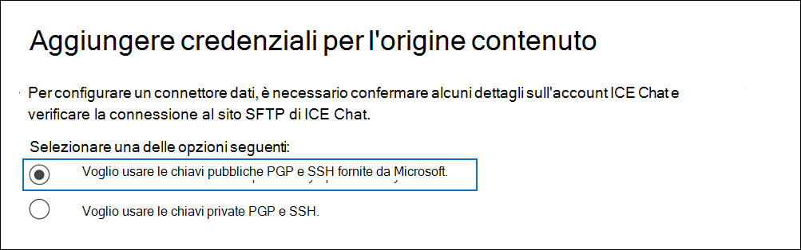
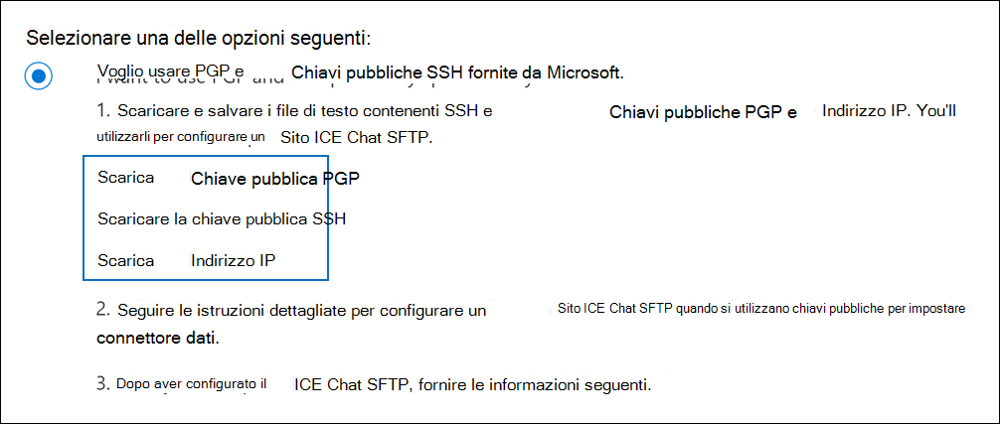
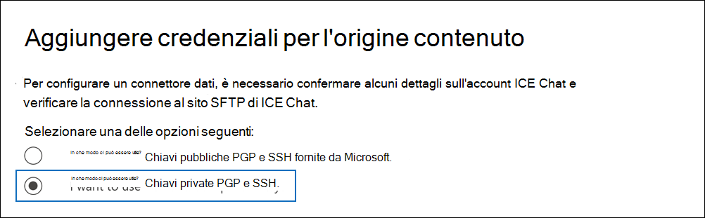
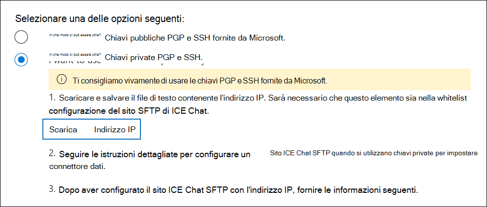

# Configurare un connettore per archiviare i dati di ICE ChatSet up a connector to archive ICE Chat data

Utilizzare un connettore nativo nel centro Microsoft 365 conformità per importare e archiviare i dati di chat dei servizi finanziari dallo strumento di collaborazione ICE Chat.Use a native connector in the Microsoft 365 compliance center to import and archive financial services chat data from the ICE Chat collaboration tool. Dopo aver configurato e configurato un connettore, si connette al sito FTP protetto (SFTP) ice chat dell'organizzazione una volta al giorno, converte il contenuto dei messaggi di chat in un formato di messaggio di posta elettronica e quindi importa tali elementi nelle cassette postali in Microsoft 365.After you set up and configure a connector, it connects to your organization's ICE Chat secure FTP (SFTP) site once every day, converts the content of chat messages to an email message format, and then import those items to mailboxes in Microsoft 365.

Dopo aver archiviato i dati della chat ICE nelle cassette postali degli utenti Microsoft 365, è possibile applicare ai dati di ICE Chat funzionalità di conformità come conservazione per controversia legale, eDiscovery, archiviazione, controllo, conformità delle comunicazioni e criteri di conservazione Microsoft 365.After ICE chat data is stored in user mailboxes, you can apply Microsoft 365 compliance features such as litigation hold, eDiscovery, archiving, auditing, communication compliance, and Microsoft 365 retention policies to ICE Chat data. Ad esempio, è possibile cercare i messaggi di ICE Chat utilizzando la ricerca di contenuto o associare la cassetta postale che contiene i dati di ICE Chat a un responsabile in un caso Advanced eDiscovery caso.For example, you can search ICE Chat messages using content search or associate the mailbox that contains the ICE Chat data with a custodian in an Advanced eDiscovery case. L'utilizzo di un connettore ice chat per importare e archiviare i dati in Microsoft 365 può aiutare l'organizzazione a rimanere conforme ai criteri governativi e normativi.Using an ICE Chat connector to import and archive data in Microsoft 365 can help your organization stay compliant with government and regulatory policies.

## Panoramica dell'archiviazione dei dati di ICE ChatOverview of archiving ICE Chat data

Nella panoramica seguente viene illustrato il processo di utilizzo di un connettore per archiviare i dati della chat ICE in Microsoft 365.The following overview explains the process of using a connector to archive ICE chat data in Microsoft 365.

1. L'organizzazione collabora con ICE Chat per configurare un sito ICE Chat SFTP.Your organization works with ICE Chat to set up an ICE Chat SFTP site. Sarà inoltre possibile utilizzare ICE Chat per configurare ICE Chat per copiare i messaggi di chat nel sito SFTP di ICE Chat.You'll also work with ICE Chat to configure ICE Chat to copy chat messages to your ICE Chat SFTP site.

2. Una volta ogni 24 ore, i messaggi di chat da ICE Chat vengono copiati nel sito SFTP di ICE Chat.Once every 24 hours, chat messages from ICE Chat are copied to your ICE Chat SFTP site.

3. Il connettore ICE Chat creato nel Centro conformità Microsoft 365 si connette al sito SFTP di ICE Chat ogni giorno e trasferisce i messaggi di chat dalle 24 ore precedenti a una posizione Archiviazione di Azure sicura nel cloud Microsoft.The ICE Chat connector that you create in the Microsoft 365 compliance center connects to the ICE Chat SFTP site every day and transfers the chat messages from the previous 24 hours to a secure Azure Storage location in the Microsoft cloud. Il connettore converte anche il contenuto di un messaggio di chat in un formato di messaggio di posta elettronica.The connector also converts the content of a chat massage to an email message format.

4. Il connettore importa gli elementi dei messaggi di chat nelle cassette postali di utenti specifici.The connector imports chat message items to the mailboxes of specific users. Viene creata una nuova **cartella denominata ICE Chat** nelle cassette postali degli utenti e gli elementi dei messaggi di chat vengono importati in tale cartella.A new folder named **ICE Chat** is created in the user mailboxes and the chat message items are imported to that folder. Il connettore utilizza il valore delle *proprietà SenderEmail* e *RecipientEmail.*The connector does by using the value of the *SenderEmail* and *RecipientEmail* properties. Ogni messaggio di chat contiene queste proprietà, che vengono popolate con l'indirizzo di posta elettronica del mittente e di ogni destinatario/partecipante del messaggio di chat.Every chat message contains these properties, which are populated with email address of the sender and every recipient/participant of the chat message.

   Oltre al mapping automatico degli utenti che utilizza i valori delle proprietà *SenderEmail* e *RecipientEmail* (che significa che il connettore importa un messaggio di chat nella cassetta postale del mittente e nelle cassette postali di ogni destinatario), è anche possibile definire il mapping utente personalizzato caricando un file di mapping CSV.In addition to automatic user mapping that uses the values of the *SenderEmail* and *RecipientEmail* property (which means that the connector imports a chat message to the sender's mailbox and the mailboxes of every recipient), you can also define custom user mapping by uploading a CSV mapping file. Questo file di mapping  contiene l'IMId di ICE Chat e l'indirizzo Microsoft 365 corrispondente per ogni utente dell'organizzazione.This mapping file contains the ICE Chat *ImId* and the corresponding Microsoft 365 mailbox address for every user in your organization. Se si abilita il mapping automatico degli utenti e si fornisce un file di mapping personalizzato, per ogni elemento di chat il connettore guarderà innanzitutto il file di mapping personalizzato.If you enable automatic user mapping and provide a custom-mapping file, for every chat item the connector will first look at the custom-mapping file. Se non viene trovato un account utente Microsoft 365 valido che corrisponde all'ID di chat ICE di un utente, il connettore utilizzerà le proprietà *SenderEmail* e *RecipientEmail* dell'elemento di chat per importare l'elemento nelle cassette postali dei partecipanti alla chat.If it doesn't find a valid Microsoft 365 user account that corresponds to a user's ICE Chat ImId, the connector will use the *SenderEmail* and *RecipientEmail* properties of the chat item to import the item to the mailboxes of the chat participants. Se il connettore non trova un utente Microsoft 365 valido nel file di mapping personalizzato o nelle proprietà *SenderEmail* e *RecipientEmail,* l'elemento non verrà importato.If the connector doesn't find a valid Microsoft 365 user in either the custom-mapping file or the *SenderEmail* and *RecipientEmail* properties, the item won't be imported.

## Prima di configurare un connettoreBefore you set up a connector

Alcuni dei passaggi di implementazione necessari per archiviare i dati di ICE Chat sono esterni a Microsoft 365 e devono essere completati prima di poter creare il connettore nel Centro conformità.Some of the implementation steps required to archive ICE Chat data are external to Microsoft 365 and must be completed before you can create the connector in the compliance center.

- ICE Chat addebita ai clienti una commissione per la conformità esterna.ICE Chat charges their customers a fee for external compliance. L'organizzazione deve contattare il gruppo di vendita ICE Chat per discutere e firmare il contratto di servizi dati ice chat, che è possibile ottenere all'indirizzo [https://www.theice.com/publicdocs/agreements/ICE\_Data\_Services\_Agreement.pdf](https://www.theice.com/publicdocs/agreements/ICE\_Data\_Services\_Agreement.pdf) .Your organization should contact the ICE Chat sales group to discuss, and to sign the ICE Chat data services agreement, which you can obtain at [https://www.theice.com/publicdocs/agreements/ICE\_Data\_Services\_Agreement.pdf](https://www.theice.com/publicdocs/agreements/ICE\_Data\_Services\_Agreement.pdf). Questo contratto è tra ICE Chat e l'organizzazione e non coinvolge Microsoft.This agreement is between ICE Chat and your organization and does not involve Microsoft. Dopo aver configurato un sito ICE Chat SFTP nel passaggio 2, ICE Chat fornisce le credenziali FTP direttamente all'organizzazione.After you set up an ICE Chat SFTP site in Step 2, ICE Chat provides the FTP credentials directly to your organization. L'utente che fornirà tali credenziali a Microsoft durante la configurazione del connettore nel passaggio 3.Then you who would provide those credentials to Microsoft when setting up the connector in Step 3.

- È necessario configurare un sito SFTP ice chat prima di creare il connettore nel passaggio 3.You must set up an ICE Chat SFTP site before creating the connector in Step 3. Dopo aver lavorato con ICE Chat per configurare il sito SFTP, i dati di ICE Chat vengono caricati ogni giorno nel sito SFTP.After working with ICE Chat to set up the SFTP site, data from ICE Chat is uploaded to the SFTP site every day. Il connettore creato nel passaggio 3 si connette a questo sito SFTP e trasferisce i dati della chat Microsoft 365 cassette postali.The connector you create in Step 3 connects to this SFTP site and transfers the chat data to Microsoft 365 mailboxes. SFTP crittografa anche i dati di ICE Chat inviati alle cassette postali durante il processo di trasferimento.SFTP also encrypts the ICE Chat data that's sent to mailboxes during the transfer process.

- Per configurare un connettore ice chat, è necessario utilizzare chiavi e passphrase per Pretty Good Privacy (PGP) e Secure Shell (SSH).To set up an ICE Chat connector, you have to use keys and key passphrases for Pretty Good Privacy (PGP) and Secure Shell (SSH). Queste chiavi vengono utilizzate per configurare il sito ICE Chat SFTP e utilizzate dal connettore per connettersi al sito SFTP di ICE Chat per importare i dati in Microsoft 365.These keys are used to configure the ICE Chat SFTP site and used by the connector to connect to the ICE Chat SFTP site to import data to Microsoft 365. La chiave PGP viene utilizzata per configurare la crittografia dei dati trasferiti dal sito ICE Chat SFTP a Microsoft 365.The PGP key is used to configure the encryption of data that's transferred from the ICE Chat SFTP site to Microsoft 365. La chiave SSH viene utilizzata per configurare la shell sicura per abilitare un accesso remoto sicuro quando il connettore si connette al sito ICE Chat SFTP.The SSH key is used to configure secure shell to enable a secure remote login when the connector connects to the ICE Chat SFTP site.

  Quando si configura un connettore, è possibile utilizzare le chiavi pubbliche e le passphrase fornite da Microsoft oppure è possibile utilizzare le proprie chiavi private e passphrase.When setting up a connector, you have the option to use public keys and key passphrases provided by Microsoft or you can use your own private keys and passphrases. Ti consigliamo di usare le chiavi pubbliche fornite da Microsoft.We recommend that you use the public keys provided by Microsoft. Tuttavia, se l'organizzazione ha già configurato un sito SFTP ice chat utilizzando chiavi private, è possibile creare un connettore utilizzando le stesse chiavi private.However, if your organization has already configured an ICE Chat SFTP site using private keys, then you can create a connector using these same private keys.

- Il connettore ICE Chat può importare un totale di 200.000 elementi in un solo giorno.The ICE Chat connector can import a total of 200,000 items in a single day. Se nel sito SFTP sono presenti più di 200.000 elementi, nessuno di questi elementi verrà importato in Microsoft 365.If there are more than 200,000 items on the SFTP site, none of those items will be imported to Microsoft 365.

- All'amministratore che crea il connettore ICE Chat nel passaggio 3 (e che scarica le chiavi pubbliche e l'indirizzo IP nel passaggio 1) deve essere assegnato il ruolo Esportazione importazione cassette postali in Exchange Online.The admin who creates the ICE Chat connector in Step 3 (and who downloads the public keys and IP address in Step 1) must be assigned the Mailbox Import Export role in Exchange Online. Questo ruolo è necessario per aggiungere connettori nella pagina **Connettori** dati nel Centro Microsoft 365 conformità.This role is required to add connectors on the **Data connectors** page in the Microsoft 365 compliance center. Per impostazione predefinita, questo ruolo non è assegnato ad alcun gruppo di ruoli in Exchange Online.By default, this role isn't assigned to any role group in Exchange Online. È possibile aggiungere il ruolo Esportazione importazione cassette postali al gruppo di ruoli Gestione organizzazione in Exchange Online.You can add the Mailbox Import Export role to the Organization Management role group in Exchange Online. In caso contrario, è possibile creare un gruppo di ruoli, assegnare il ruolo Importazione/Esportazione cassette postali e quindi aggiungere gli utenti appropriati come membri.Or you can create a role group, assign the Mailbox Import Export role, and then add the appropriate users as members. Per ulteriori informazioni, vedere le sezioni [Create role groups](/Exchange/permissions-exo/role-groups#create-role-groups) o Modify role [groups](/Exchange/permissions-exo/role-groups#modify-role-groups) nell'articolo "Manage role groups in Exchange Online".For more information, see the [Create role groups](/Exchange/permissions-exo/role-groups#create-role-groups) or [Modify role groups](/Exchange/permissions-exo/role-groups#modify-role-groups) sections in the article "Manage role groups in Exchange Online".

## Configurare un connettore con chiavi pubblicheSet up a connector using public keys

La procedura descritta in questa sezione illustra come configurare un connettore ice chat utilizzando le chiavi pubbliche per Pretty Good Privacy (PGP) e Secure Shell (SSH).The steps in this section show you how to set up an ICE Chat connector using the public keys for Pretty Good Privacy (PGP) and Secure Shell (SSH).

### Passaggio 1: Ottenere le chiavi pubbliche PGP e SSHStep 1: Obtain PGP and SSH public keys

Il primo passaggio consiste nel ottenere una copia delle chiavi pubbliche per Pretty Good Privacy (PGP) e Secure Shell (SSH).The first step is to obtain a copy of the public keys for Pretty Good Privacy (PGP) and Secure Shell (SSH). Queste chiavi vengono utilizzate nel passaggio 2 per configurare il sito ICE Chat SFTP in modo da consentire al connettore creato nel passaggio 3 di connettersi al sito SFTP e trasferire i dati di ICE Chat nelle cassette postali di Microsoft 365.You use these keys in Step 2 to configure the ICE Chat SFTP site to allow the connector (that you create in Step 3) to connect to the SFTP site and transfer the ICE Chat data to Microsoft 365 mailboxes. Verrà inoltre ottenuto un indirizzo IP in questo passaggio, che verrà utilizzato durante la configurazione del sito SFTP di ICE Chat.You will also obtain an IP address in this step, which you use when configuring the ICE Chat SFTP site.

1. Vai a [https://compliance.microsoft.com](https://compliance.microsoft.com) e fai clic su **Connettori dati** nel riquadro di spostamento sinistro.Go to [https://compliance.microsoft.com](https://compliance.microsoft.com) and click **Data connectors** in the left nav.

2. Nella pagina **Connettori dati** in **ICE Chat** fare clic su **Visualizza.**On the **Data connectors** page under **ICE Chat**, click **View**.

3. Nella pagina **ICE Chat** fare clic su **Aggiungi connettore.**On the **ICE Chat** page, click **Add connector**.

4. Nella pagina **Condizioni di servizio** fare clic su **Accetta.**On the **Terms of service** page, click **Accept**.

5. Nella pagina **Aggiungi credenziali per l'origine** contenuto fare clic su Voglio usare le chiavi pubbliche PGP e **SSH fornite da Microsoft.**On the **Add credentials for content source** page, click **I want to use PGP and SSH public keys provided by Microsoft**.

   

6. Nel passaggio 1, fare clic sulla chiave **Download SSH,** **download PGP key** e Download IP **address** links per salvare una copia di ogni file nel computer locale.Under step 1, click the **Download SSH key**, **Download PGP key**, and **Download IP address** links to save a copy of each file to your local computer.

   

   Questi file contengono gli elementi seguenti che vengono utilizzati per configurare il sito SFTP ice chat nel passaggio 2:These files contain the following items that are used to configure the ICE Chat SFTP site in Step 2:

   - Chiave pubblica PGP: questa chiave viene utilizzata per configurare la crittografia dei dati trasferiti dal sito ICE Chat SFTP a Microsoft 365.PGP public key: This key is used to configure the encryption of data that's transferred from the ICE Chat SFTP site to Microsoft 365.

   - Chiave pubblica SSH: questa chiave viene utilizzata per configurare Secure SSH per abilitare un accesso remoto sicuro quando il connettore si connette al sito ICE Chat SFTP.SSH public key: This key is used to configure Secure SSH to enable a secure remote login when the connector connects to the ICE Chat SFTP site.

   - Indirizzo IP: il sito ICE Chat SFTP è configurato per accettare una richiesta di connessione solo da questo indirizzo IP, che viene utilizzato dal connettore ICE Chat creato nel passaggio 3.IP address: The ICE Chat SFTP site is configured to accept a connection request only from this IP address, which is used by the ICE Chat connector that you create in Step 3.

7. Fare **clic su** Annulla per chiudere la procedura guidata.Click **Cancel** to close the wizard. Si torna a questa procedura guidata nel passaggio 3 per creare il connettore.You come back to this wizard in Step 3 to create the connector.

### Passaggio 2: Configurare il sito SFTP di ICE ChatStep 2: Configure the ICE Chat SFTP site

Il passaggio successivo consiste nell'utilizzare le chiavi pubbliche PGP e SSH e l'indirizzo IP ottenuto nel passaggio 1 per configurare la crittografia PGP e l'autenticazione SSH per il sito SFTP di ICE Chat.The next step is to use the PGP and SSH public keys and the IP address that you obtained in Step 1 to configure PGP encryption and SSH authentication for the ICE Chat SFTP site. In questo modo il connettore ICE Chat creato nel passaggio 3 si connette al sito SFTP di ICE Chat e trasferisce i dati di ICE Chat Microsoft 365.This lets the ICE Chat connector that you create in Step 3 connect to the ICE Chat SFTP site and transfer ICE Chat data to Microsoft 365. Per configurare il sito ICE Chat SFTP, è necessario collaborare con il supporto tecnico ice chat.You need to work with ICE Chat customer support to set up your ICE Chat SFTP site.

### Passaggio 3: Creare un connettore ice chatStep 3: Create an ICE Chat connector

L'ultimo passaggio consiste nel creare un connettore ICE Chat nel centro Microsoft 365 conformità.The last step is to create an ICE Chat connector in the Microsoft 365 compliance center. Il connettore utilizza le informazioni fornite per connettersi al sito ICE Chat SFTP e trasferire i messaggi di chat alle caselle delle cassette postali dell'utente corrispondenti in Microsoft 365.The connector uses the information you provide to connect to the ICE Chat SFTP site and transfer chat messages to the corresponding user mailbox boxes in Microsoft 365.

1. Vai a [https://compliance.microsoft.com](https://compliance.microsoft.com) e fai clic su **Connettori dati** nel riquadro di spostamento sinistro.Go to [https://compliance.microsoft.com](https://compliance.microsoft.com) and click **Data connectors** in the left nav.

2. Nella pagina **Connettori dati** in **ICE Chat** fare clic su **Visualizza.**On the **Data connectors** page under **ICE Chat**, click **View**.

3. Nella pagina **ICE Chat** fare clic su **Aggiungi connettore.**On the **ICE Chat** page, click **Add connector**.

4. Nella pagina **Condizioni di servizio** fare clic su **Accetta.**On the **Terms of service** page, click **Accept**.

5. Nella pagina **Aggiungi credenziali per l'origine contenuto** fare clic su Voglio usare le chiavi pubbliche **PGP e SSH.**On the **Add credentials for content source** page, click **I want to use PGP and SSH public keys**.

6. In Passaggio 3 immettere le informazioni necessarie nelle caselle seguenti e quindi fare clic su **Convalida connessione**.Under Step 3, enter the required information in the following boxes and then click **Validate connection**.

   - **Codice fermo:** ID dell'organizzazione, utilizzato come nome utente per il sito SFTP di ICE Chat.**Firm code:** The ID for your organization, which is used as the username for the ICE Chat SFTP site.

   - **Password:** Password per il sito SFTP di ICE Chat.**Password:** The password for your ICE Chat SFTP site.

   - **URL SFTP:** URL per il sito SFTP di ICE Chat (ad esempio, `sftp.theice.com` ).**SFTP URL:** The URL for the ICE Chat SFTP site (for example, `sftp.theice.com`). È inoltre possibile utilizzare un indirizzo IP per questo valore.You can also use an IP address for this value.

   - **Porta SFTP:** Numero di porta per il sito SFTP ice chat.**SFTP port:** The port number for the ICE Chat SFTP site. Il connettore utilizza questa porta per connettersi al sito SFTP.The connector uses this port to connect to the SFTP site.

7. Dopo aver convalidato correttamente la connessione, fare clic su **Avanti.**After the connection is successfully validated, click **Next**.

8. Nella pagina **Mapping utenti esterni a Microsoft 365** utenti, abilitare il mapping automatico degli utenti e fornire il mapping utente personalizzato in base alle esigenze.On the **Map external users to Microsoft 365 users** page, enable automatic user mapping and provide custom user mapping as required. È possibile scaricare una copia del file CSV di mapping degli utenti in questa pagina.You can download a copy of the user-mapping CSV file on this page. È possibile aggiungere i mapping utente al file e quindi caricarlo.You can add the user mappings to the file and then upload it.

   > [!NOTE]
   > Come spiegato in precedenza, il file CSV del file di mapping personalizzato contiene l'imid ice chat e l'indirizzo Microsoft 365 corrispondente per ogni utente.As previously explained, custom mapping file CSV file contains the ICE Chat imid and corresponding Microsoft 365 mailbox address for each user. Se si abilita il mapping automatico degli utenti e si fornisce un mapping personalizzato, per ogni elemento di chat, il connettore guarderà innanzitutto il file di mapping personalizzato.If you enable automatic user mapping and provide a custom mapping, for every chat item, the connector will first look at custom mapping file. Se non viene trovato un utente Microsoft 365 valido che corrisponde all'imid ICE Chat di un utente, il connettore importerà l'elemento nelle cassette postali per gli utenti specificati nelle proprietà *SenderEmail* e *RecipientEmail* dell'elemento di chat.If it doesn't find a valid Microsoft 365 user that corresponds to a user's ICE Chat imid, the connector will import the item to the mailboxes for the users specified in the *SenderEmail* and *RecipientEmail* properties of the chat item. Se il connettore non trova un utente Microsoft 365 un mapping automatico o personalizzato, l'elemento non verrà importato.If the connector doesn't find a valid Microsoft 365 user by either automatic or custom user mapping, the item won't be imported.

9. Fare **clic su** Avanti, rivedere le impostazioni e quindi fare clic su **Fine** per creare il connettore.Click **Next**, review your settings, and then click **Finish** to create the connector.

10. Passare alla **pagina Connettori dati** per visualizzare l'avanzamento del processo di importazione per il nuovo connettore.Go to the **Data connectors** page to see the progress of the import process for the new connector.

## Configurare un connettore con chiavi privateSet up a connector using private keys

La procedura descritta in questa sezione illustra come configurare un connettore ice chat utilizzando le chiavi private PGP e SSH.The steps in this section show you how to set up an ICE Chat connector using PGP and SSH private keys. Questa opzione di configurazione del connettore è destinata alle organizzazioni che hanno già configurato un sito SFTP ice chat utilizzando chiavi private.This connector setup option is intended for organizations that have already configured an ICE Chat SFTP site using private keys.

### Passaggio 1: Ottenere un indirizzo IP per configurare il sito SFTP di ICE ChatStep 1: Obtain an IP address to configure the ICE Chat SFTP site

Se l'organizzazione ha utilizzato le chiavi private PGP e SSH per configurare un sito SFTP ice chat, è necessario ottenere un indirizzo IP e fornirlo al supporto clienti ice chat.If your organization has used PGP and SSH private keys to set up an ICE Chat SFTP site, then you have to obtain an IP address and provide it to ICE Chat customer support. Il sito ICE Chat SFTP deve essere configurato per accettare le richieste di connessione da questo indirizzo IP.The ICE Chat SFTP site must be configured to accept  connection requests from this IP address. Lo stesso indirizzo IP viene utilizzato dal connettore ICE Chat per connettersi al sito SFTP e trasferire i dati di ICE Chat Microsoft 365.The same IP address is used by the ICE Chat connector to connect to the SFTP site and transfer ICE Chat data to Microsoft 365.

Per ottenere l'indirizzo IP:To obtain the IP address:

1. Vai a <https://compliance.microsoft.com> e fai clic su **Connettori dati** nel riquadro di spostamento sinistro.Go to <https://compliance.microsoft.com> and click **Data connectors** in the left nav.

2. Nella pagina **Connettori dati** in **ICE Chat** fare clic su **Visualizza.**On the **Data connectors** page under **ICE Chat**, click **View**.

3. Nella pagina **Descrizione del prodotto ICE Chat** fare clic su Aggiungi **connettore**On the **ICE Chat** product description page, click **Add connector**

4. Nella pagina **Condizioni di servizio** fare clic su **Accetta.**On the **Terms of service** page, click **Accept**.

5. Nella pagina **Aggiungi credenziali per l'origine contenuto** fare clic su Voglio usare le chiavi private **PGP e SSH.**On the **Add credentials for content source** page, click **I want to use PGP and SSH private keys**.

   

6. Nel passaggio 1 fare clic **su Scarica indirizzo IP** per salvare una copia del file dell'indirizzo IP nel computer locale.Under step 1, click **Download IP address** to save a copy of the IP address file to your local computer.

   

7. Fare **clic su** Annulla per chiudere la procedura guidata.Click **Cancel** to close the wizard. Si torna a questa procedura guidata nel passaggio 2 per creare il connettore.You come back to this wizard in Step 2 to create the connector.

È necessario collaborare con il supporto clienti ice chat per configurare il sito SFTP ice chat in modo da accettare le richieste di connessione da questo indirizzo IP.You need to work with ICE Chat customer support to configure your ICE Chat SFTP site to accept connection requests from this IP address.

### Passaggio 2: Creare un connettore ice chatStep 2: Create an ICE Chat connector

Dopo aver configurato il sito ICE Chat SFTP, il passaggio successivo consiste nel creare un connettore ice chat nel Centro Microsoft 365 conformità.After your ICE Chat SFTP site is configured, the next step is to create an ICE Chat connector in the Microsoft 365 compliance center. Il connettore utilizza le informazioni fornite per connettersi al sito ICE Chat SFTP e trasferire i messaggi di posta elettronica alle caselle delle cassette postali dell'utente corrispondenti in Microsoft 365.The connector uses the information you provide to connect to the ICE Chat SFTP site and transfer email messages to the corresponding user mailbox boxes in Microsoft 365. Per completare questo passaggio, assicurarsi di disporre di copie delle stesse passphrase e delle stesse chiavi private utilizzate per configurare il sito SFTP di ICE Chat.To complete this step, be sure to have copies of the same private keys and key passphrases that you used to set up your ICE Chat SFTP site.

1. Vai a <https://compliance.microsoft.com> e fai clic su **Connettori dati** nel riquadro di spostamento sinistro.Go to <https://compliance.microsoft.com> and click **Data connectors** in the left nav.

2. Nella pagina **Connettori dati** in **ICE Chat** fare clic su **Visualizza.**On the **Data connectors** page under **ICE Chat**, click **View**.

3. Nella pagina **Descrizione del prodotto ICE Chat** fare clic su Aggiungi **connettore**On the **ICE Chat** product description page, click **Add connector**

4. Nella pagina **Condizioni di servizio** fare clic su **Accetta.**On the **Terms of service** page, click **Accept**.

5. Nella pagina **Aggiungi credenziali per l'origine contenuto** fare clic su Voglio usare le chiavi private **PGP e SSH.**On the **Add credentials for content source** page, click **I want to use PGP and SSH private keys**.

6. In Passaggio 3 immettere le informazioni necessarie nelle caselle seguenti e quindi fare clic su **Convalida connessione**.Under Step 3, enter the required information in the following boxes and then click **Validate connection**.

      - **Nome:** Nome del connettore.**Name:** The name for the connector. Deve essere univoco nell'organizzazione.It must be unique in your organization.

      - **Codice fermo:** ID dell'organizzazione utilizzato come nome utente per il sito SFTP di ICE Chat.**Firm code:** The ID for your organization that is used as the username for the ICE Chat SFTP site.

      - **Password:** Password per il sito SFTP ICE Chat dell'organizzazione.**Password:** The password for your organization's ICE Chat SFTP site.

      - **URL SFTP:** URL per il sito SFTP di ICE Chat (ad esempio, `sftp.theice.com` ).**SFTP URL:** The URL for the ICE Chat SFTP site (for example, `sftp.theice.com`). È inoltre possibile utilizzare un indirizzo IP per questo valore.You can also use an IP address for this value.

      - **Porta SFTP:** Numero di porta per il sito SFTP ice chat.**SFTP port:** The port number for the ICE Chat SFTP site. Il connettore utilizza questa porta per connettersi al sito SFTP.The connector uses this port to connect to the SFTP site.

      - **Chiave privata PGP:** Chiave privata PGP per il sito SFTP di ICE Chat.**PGP private key:** The PGP private key for the ICE Chat SFTP site. Assicurarsi di includere l'intero valore della chiave privata, incluse le righe iniziale e finale del blocco di chiavi.Be sure to include the entire private key value, including the beginning and ending lines of the key block.

      - **Passphrase chiave PGP:** Passphrase per la chiave privata PGP.**PGP key passphrase:** The passphrase for the PGP private key.

      - **Chiave privata SSH:** Chiave privata SSH per il sito SFTP di ICE Chat.**SSH private key:** The SSH private key for the ICE Chat SFTP site. Assicurarsi di includere l'intero valore della chiave privata, incluse le righe iniziale e finale del blocco di chiavi.Be sure to include the entire private key value, including the beginning and ending lines of the key block.

      - **Passphrase chiave SSH:** Passphrase per la chiave privata SSH.**SSH key passphrase:** The passphrase for the SSH private key.

7. Dopo aver convalidato correttamente la connessione, fare clic su **Avanti.**After the connection is successfully validated, click **Next**.

8. Nella pagina Mapping utenti ice chat Microsoft 365 **utenti,** abilitare il mapping automatico degli utenti e fornire il mapping utente personalizzato in base alle esigenze.On the **Map ICE Chat users to Microsoft 365 users** page, enable automatic user mapping and provide custom user mapping as required.

   > [!NOTE]
   > Come spiegato in precedenza, il file CSV del file di mapping personalizzato contiene l'imid ice chat e l'indirizzo Microsoft 365 corrispondente per ogni utente.As previously explained, custom mapping file CSV file contains the ICE Chat imid and corresponding Microsoft 365 mailbox address for each user. Se si abilita il mapping automatico degli utenti e si fornisce un mapping personalizzato, per ogni elemento di chat, il connettore guarderà innanzitutto il file di mapping personalizzato.If you enable automatic user mapping and provide a custom mapping, for every chat item, the connector will first look at custom mapping file. Se non viene trovato un utente Microsoft 365 valido che corrisponde all'imid ICE Chat di un utente, il connettore importerà l'elemento nelle cassette postali per gli utenti specificati nelle proprietà *SenderEmail* e *RecipientEmail* dell'elemento di chat.If it doesn't find a valid Microsoft 365 user that corresponds to a user's ICE Chat imid, the connector will import the item to the mailboxes for the users specified in the *SenderEmail* and *RecipientEmail* properties of the chat item. Se il connettore non trova un utente Microsoft 365 un mapping automatico o personalizzato, l'elemento non verrà importato.If the connector doesn't find a valid Microsoft 365 user by either automatic or custom user mapping, the item won't be imported.

9. Fare **clic su** Avanti, rivedere le impostazioni e quindi fare clic su **Fine** per creare il connettore.Click **Next**, review your settings, and then click **Finish** to create the connector.

10. Passare alla **pagina Connettori dati** per visualizzare l'avanzamento del processo di importazione per il nuovo connettore.Go to the **Data connectors** page to see the progress of the import process for the new connector. Fare clic sul connettore per visualizzare la pagina a comparsa, che contiene informazioni sul connettore.Click the connector to display the flyout page, which contains information about the connector.
