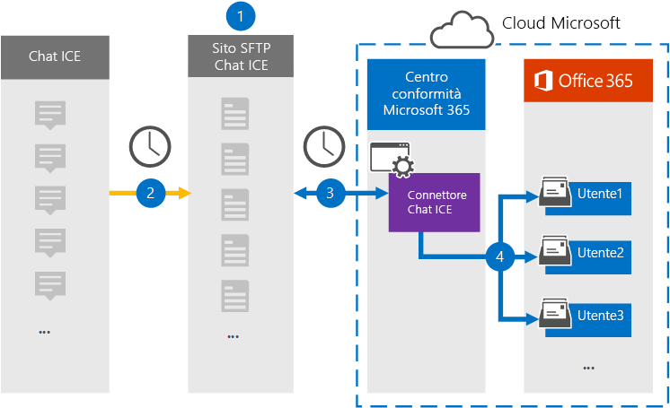

# Configurare un connettore per archiviare i dati della chat di ghiaccio

Utilizzare un connettore nativo nel centro conformità di Microsoft 365 per importare e archiviare i dati della chat dei servizi finanziari dallo strumento di collaborazione di ICE chat. Dopo aver configurato e configurato un connettore, si connette al sito di ICE chat Secure FTP (SFTP) dell'organizzazione una volta al giorno, converte il contenuto dei messaggi di chat in un formato di messaggio di posta elettronica e quindi importa tali elementi nelle cassette postali in Microsoft 365.

Dopo che i dati della chat su ghiaccio sono archiviati nelle cassette postali degli utenti, è possibile applicare le funzionalità di conformità di Microsoft 365, ad esempio conservazione per controversia legale, eDiscovery, archiviazione, controllo, conformità alla comunicazione e Microsoft 365 Retention Policies to ICE chat data. Ad esempio, è possibile cercare i messaggi di chat di ghiaccio utilizzando la ricerca contenuto o associare la cassetta postale contenente i dati della chat di ghiaccio con un custode in un caso di eDiscovery avanzato. L'utilizzo di un connettore ICE chat per l'importazione e l'archiviazione dei dati in Microsoft 365 può aiutare l'organizzazione a rimanere conforme ai criteri governativi e normativi.

## Panoramica dell'archiviazione dei dati di chat su ghiaccio

Nella panoramica seguente viene illustrato il processo di utilizzo di un connettore per archiviare i dati della chat di ghiaccio in Microsoft 365.

1. L'organizzazione funziona con ICE chat per configurare un sito di chat di ghiaccio. Lavorerete anche con ICE chat per configurare ICE chat per copiare i messaggi chat nel sito di ICE chat SFTP.

2. Una volta ogni 24 ore, i messaggi di chat provenienti da ICE chat vengono copiati nel sito ICE chat SFTP.

3. Il connettore ICE chat creato nel centro conformità Microsoft 365 si connette al sito ICE chat SFTP ogni giorno e trasferisce i messaggi di chat dalle 24 ore precedenti in una posizione di archiviazione sicura di Azure nel cloud Microsoft. Il connettore converte anche il contenuto di un massaggio chat in un formato di messaggio di posta elettronica.

4. Il connettore importa gli elementi dei messaggi di chat nelle cassette postali di utenti specifici. Viene creata una nuova cartella denominata **Ice chat** nelle cassette postali degli utenti e gli elementi del messaggio di chat vengono importati in tale cartella. Il connettore viene utilizzato utilizzando il valore delle proprietà *SenderEmail* e *RecipientEmail* . Ogni messaggio di chat contiene queste proprietà, che sono popolate con l'indirizzo di posta elettronica del mittente e di tutti i destinatari/partecipanti del messaggio di chat.

   Oltre al mapping automatico degli utenti che utilizza i valori della proprietà *SenderEmail* e *RecipientEmail* (il che significa che il connettore importa un messaggio di chat nella cassetta postale del mittente e nelle cassette postali di ogni destinatario), è anche possibile definire il mapping degli utenti personalizzato caricando un file di mapping CSV. Questo file di mapping contiene la chat di *ImId* e l'indirizzo della cassetta postale di Microsoft 365 corrispondente per ogni utente dell'organizzazione. Se si Abilita il mapping automatico degli utenti e si fornisce un file di mapping personalizzato, per ogni elemento di chat il connettore osserverà prima il file di mapping personalizzato. Se non è in grado di trovare un account utente valido di Microsoft 365 che corrisponde a una chat di ImId di un utente, il connettore utilizzerà le proprietà *SenderEmail* e *RecipientEmail* dell'elemento chat per importare l'elemento nelle cassette postali dei partecipanti alla chat. Se il connettore non trova un utente valido di Microsoft 365 nel file di mapping personalizzato o nelle proprietà *SenderEmail* e *RecipientEmail* , l'elemento non verrà importato.

## Prima di iniziare

Alcuni dei passaggi di implementazione necessari per archiviare i dati della chat di ghiaccio sono esterni a Microsoft 365 e devono essere completati prima di poter creare il connettore nel centro conformità.

- L'organizzazione deve autorizzare il servizio di importazione di Office 365 per accedere ai dati delle cassette postali nell'organizzazione. Per acconsentire a questa richiesta, accedere a [Questa pagina](https://login.microsoftonline.com/common/oauth2/authorize?client_id=570d0bec-d001-4c4e-985e-3ab17fdc3073&response_type=code&redirect_uri=https://portal.azure.com/&nonce=1234&prompt=admin_consent), accedere con le credenziali di un amministratore globale di Office 365 e quindi accettare la richiesta. È necessario completare questo passaggio prima di poter creare correttamente il connettore ICE chat nel passaggio 3.

- ICE chat addebita ai propri clienti una tariffa per la conformità esterna. L'organizzazione deve contattare il gruppo Sales di ICE chat per discutere e firmare il contratto ICE chat Data Services, che è possibile ottenere in [https://www.theice.com/publicdocs/agreements/ICE\_Data\_Services\_Agreement.pdf](https://www.theice.com/publicdocs/agreements/ICE\_Data\_Services\_Agreement.pdf) . Questo contratto è compreso tra ICE chat e l'organizzazione e non coinvolge Microsoft. Dopo aver configurato un sito di ICE chat SFTP nel passaggio 2, ICE chat fornisce le credenziali FTP direttamente all'organizzazione. Si desidera quindi fornire tali credenziali a Microsoft quando si configura il connettore nel passaggio 3.

- È necessario configurare un sito di ICE chat SFTP prima di creare il connettore nel passaggio 3. Dopo aver lavorato con ICE chat per configurare il sito SFTP, i dati provenienti da ICE chat vengono caricati nel sito SFTP ogni giorno. Il connettore creato nel passaggio 3 si connette a questo sito SFTP e trasferisce i dati della chat alle cassette postali di Microsoft 365. SFTP crittografa anche i dati della chat di ghiaccio inviati alle cassette postali durante il processo di trasferimento.

- L'amministratore che crea il connettore ICE chat nel passaggio 3 (e che Scarica le chiavi pubbliche e l'indirizzo IP nel passaggio 1) deve essere assegnato il ruolo di importazione/esportazione delle cassette postali in Exchange Online. Questo ruolo è necessario per aggiungere connettori nella pagina **dei connettori dati** nel centro conformità di Microsoft 365. Per impostazione predefinita, questo ruolo non è assegnato ad alcun gruppo di ruoli in Exchange Online. È possibile aggiungere il ruolo import export delle cassette postali al gruppo di ruoli Gestione organizzazione in Exchange Online. In alternativa, è possibile creare un gruppo di ruoli, assegnare il ruolo di esportazione delle cassette postali e quindi aggiungere gli utenti corretti come membri. Per ulteriori informazioni, vedere la sezione creare gruppi di [ruoli](https://docs.microsoft.com/Exchange/permissions-exo/role-groups#create-role-groups) o [modificare gruppi di ruoli](https://docs.microsoft.com/Exchange/permissions-exo/role-groups#modify-role-groups) nell'articolo "gestire i gruppi di ruoli in Exchange Online".

## Passaggio 1: ottenere le chiavi pubbliche di SSH e PGP

Il primo passaggio consiste nell'ottenere una copia delle chiavi pubbliche per Secure Shell (SSH) e la Pretty Good Privacy (PGP). È possibile utilizzare questi tasti nel passaggio 2 per configurare il sito di ICE chat SFTP per consentire il connettore (creato nel passaggio 3) per connettersi al sito SFTP e trasferire i dati di ICE chat nelle cassette postali di Microsoft 365. Si otterrà anche un indirizzo IP in questo passaggio, che viene utilizzato per configurare il sito ICE chat SFTP.

1. Andare a [https://compliance.microsoft.com](https://compliance.microsoft.com) e fare clic su **connettori dati** nel NAV sinistro.

2. Nella pagina **connettori dati** in **Ice chat**fare clic su **Visualizza**.

3. Nella pagina **chat di ghiaccio** fare clic su **Aggiungi connettore**.

4. Nella pagina **condizioni del servizio** fare clic su **Accetto**.

5. Nella pagina **Aggiungi credenziali per Ice chat SFTP del sito** al passaggio 1, fare clic **sulla chiave Scarica SSH**, **scaricare PGP Key**e scaricare i collegamenti agli **indirizzi IP** per salvare una copia di ogni file nel computer locale. Questi file contengono gli elementi seguenti che vengono utilizzati per configurare il sito di ICE chat SFTP nel passaggio 2:

   - Chiave pubblica SSH: questa chiave viene utilizzata per configurare Secure SSH per abilitare un account di accesso remoto sicuro quando il connettore si connette al sito ICE chat SFTP.

   - Chiave pubblica PGP: questa chiave viene utilizzata per configurare la crittografia dei dati trasferiti dal sito ICE chat SFTP a Microsoft 365.

   - Indirizzo IP: il sito ICE chat SFTP è configurato per accettare una richiesta di connessione solo da questo indirizzo IP, che viene utilizzato dal connettore ICE chat creato nel passaggio 3.

6. Fare clic su **Annulla** per chiudere la procedura guidata. Per creare il connettore, è possibile tornare a questa procedura guidata nel passaggio 3.

## Passaggio 2: configurare il sito di ICE chat SFTP

Il passaggio successivo consiste nell'utilizzare le chiavi pubbliche SSH e PGP e l'indirizzo IP ottenuto nel passaggio 1 per configurare l'autenticazione SSH e la crittografia PGP per il sito ICE chat SFTP. In questo modo, il connettore ICE chat creato nel passaggio 3 si connette al sito ICE chat SFTP e trasferisce i dati della chat di ghiaccio a Microsoft 365. È necessario collaborare con il supporto clienti di ICE chat per configurare il sito ICE chat SFTP.

## Passaggio 3: creare un connettore di chat di ghiaccio

L'ultimo passaggio consiste nel creare un connettore di chat di ghiaccio nel centro conformità di Microsoft 365. Il connettore utilizza le informazioni fornite per la connessione al sito di ICE chat SFTP e trasferisce i messaggi di chat nelle caselle della cassetta postale dell'utente corrispondente in Microsoft 365.

1. Andare a [https://compliance.microsoft.com](https://compliance.microsoft.com) e fare clic su **connettori dati** nel NAV sinistro.

2. Nella pagina **connettori dati** in **Ice chat**fare clic su **Visualizza**.

3. Nella pagina **chat di ghiaccio** fare clic su **Aggiungi connettore**.

4. Nella pagina **condizioni del servizio** fare clic su **Accetto**.

5. Nella pagina **Aggiungi credenziali per Ice chat SFTP** , in passaggio 3, immettere le informazioni necessarie nelle caselle seguenti e quindi fare clic su **convalida connessione**.

   - **Codice azienda:** ID dell'organizzazione, che viene utilizzato come nome utente per il sito di ICE chat SFTP.

   - **Password:** La password per il sito ICE chat SFTP.

   - **URL sftp:** L'URL del sito di ICE chat SFTP (ad esempio, sftp.theice.com).

   - **Porta SFTP:** Il numero di porta per il sito di ICE chat SFTP. Il connettore utilizza questa porta per la connessione al sito SFTP.

6. Dopo aver convalidato la connessione, fare clic su **Avanti**.

7. Nella pagina mapping **utenti esterni a Microsoft 365** , abilitare il mapping automatico degli utenti e fornire il mapping degli utenti personalizzato in base alle esigenze. È possibile scaricare una copia del file CSV di mapping degli utenti in questa pagina. È possibile aggiungere i mapping degli utenti al file e quindi caricarlo.

   > [!NOTE]
   > Come spiegato in precedenza, il file CSV del file di mapping personalizzato contiene l'indirizzo di chat di IMID e il corrispondente indirizzamento della cassetta postale di Microsoft 365 per ogni utente. Se si Abilita il mapping automatico degli utenti e si fornisce un mapping personalizzato, per ogni elemento di chat il connettore osserverà innanzitutto il file di mapping personalizzato. Se non trova un utente valido di Microsoft 365 che corrisponde a una chat di IMID di un utente, il connettore importerà l'elemento nelle cassette postali per gli utenti specificati nelle proprietà *SenderEmail* e *RecipientEmail* dell'elemento chat. Se il connettore non trova un utente valido di Microsoft 365 dal mapping automatico o personalizzato dell'utente, l'elemento non verrà importato.

8. Fare clic su **Avanti**, rivedere le impostazioni e quindi fare clic su **fine** per creare il connettore.

9. Passare alla pagina **connettori dati** per visualizzare lo stato di avanzamento del processo di importazione per il nuovo connettore.
