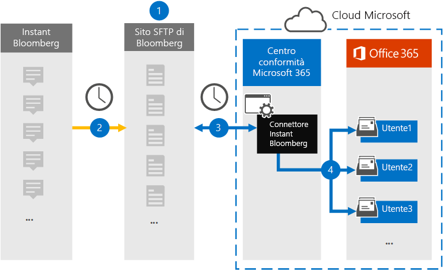
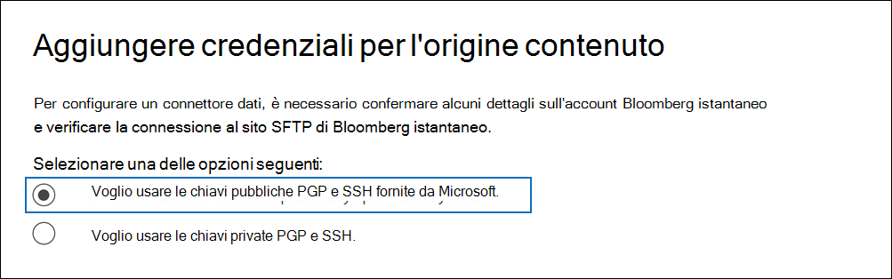
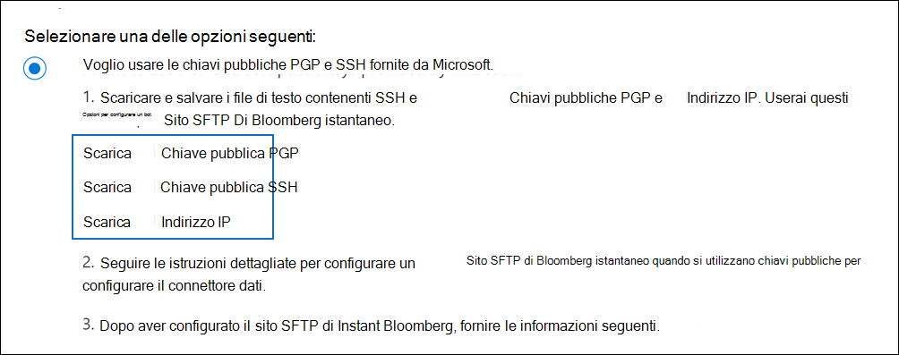
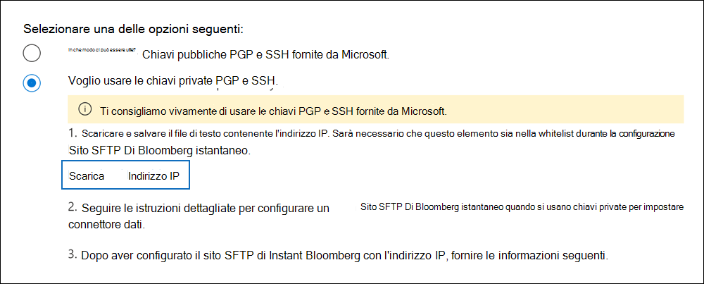
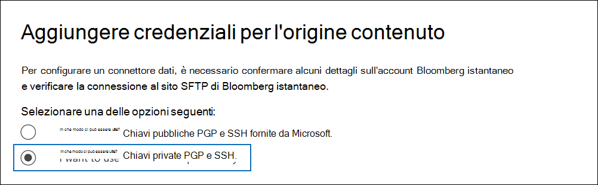

# Configurare un connettore per archiviare i dati di Instant BloombergSet up a connector to archive Instant Bloomberg data

Utilizzare un connettore nativo nel Centro conformità Microsoft 365 per importare e archiviare i dati di chat dei servizi finanziari dallo strumento di collaborazione [Instant Bloomberg.](https://www.bloomberg.com/professional/product/collaboration/)Use a native connector in the Microsoft 365 compliance center to import and archive financial services chat data from the [Instant Bloomberg](https://www.bloomberg.com/professional/product/collaboration/) collaboration tool. Dopo aver configurato e configurato un connettore, si connette al sito FTP protetto (SFTP) dell'organizzazione una volta al giorno, converte il contenuto dei messaggi di chat in un formato di messaggio di posta elettronica e quindi importa tali elementi nelle cassette postali in Microsoft 365.After you set up and configure a connector, it connects to your organization's Bloomberg secure FTP site (SFTP) once every day, converts the content of chat messages to an email message format, and then imports those items to mailboxes in Microsoft 365.

Dopo aver archiviato i dati di Instant Bloomberg nelle cassette postali degli utenti, è possibile applicare le funzionalità di conformità di Microsoft 365, ad esempio conservazione per controversia legale, ricerca contenuto, archiviazione In-Place, controllo, conformità delle comunicazioni e criteri di conservazione di Microsoft 365 ai dati di Bloomberg istantanei.After Instant Bloomberg data is stored in user mailboxes, you can apply Microsoft 365 compliance features such as Litigation Hold, Content Search, In-Place Archiving, Auditing, Communication compliance, and Microsoft 365 retention policies to Instant Bloomberg data. Ad esempio, è possibile eseguire ricerche nei messaggi di chat Di Bloomberg istantanei utilizzando Ricerca contenuto o associare la cassetta postale contenente i dati di Instant Bloomberg a un responsabile in un caso di Advanced eDiscovery.For example, you can search Instant Bloomberg chat messages using Content Search or associate the mailbox that contains the Instant Bloomberg data with a custodian in an Advanced eDiscovery case. L'utilizzo di un connettore Bloomberg istantaneo per importare e archiviare i dati in Microsoft 365 può aiutare l'organizzazione a rimanere conforme ai criteri normativi e governativi.Using an Instant Bloomberg connector to import and archive data in Microsoft 365 can help your organization stay compliant with government and regulatory policies.

## Panoramica dell'archiviazione dei dati di Instant BloombergOverview of archiving Instant Bloomberg data

Nella panoramica seguente viene illustrato il processo di utilizzo di un connettore per archiviare i dati delle chat di Bloomberg istantanee in Microsoft 365.The following overview explains the process of using a connector to archive Instant Bloomberg chat data in Microsoft 365. 

1. L'organizzazione collabora con Bloomberg per configurare un sito SFTP bloomberg.Your organization works with Bloomberg to set up a Bloomberg SFTP site. Potrai inoltre collaborare con Bloomberg per configurare Instant Bloomberg per copiare i messaggi di chat nel sito SFTP di Bloomberg.You'll also work with Bloomberg to configure Instant Bloomberg to copy chat messages to your Bloomberg SFTP site.

2. Una volta ogni 24 ore, i messaggi di chat di Instant Bloomberg vengono copiati nel sito SFTP di Bloomberg.Once every 24 hours, chat messages from Instant Bloomberg are copied to the Bloomberg SFTP site.

3. Il connettore Bloomberg istantaneo creato nel Centro conformità Microsoft 365 si connette al sito SFTP di Bloomberg ogni giorno e trasferisce i messaggi di chat dalle 24 ore precedenti a un'area di archiviazione sicura di Azure nel cloud Microsoft.The Instant Bloomberg connector that you create in the Microsoft 365 compliance center connects to the Bloomberg SFTP site every day and transfers the chat messages from the previous 24 hours to a secure Azure Storage area in the Microsoft Cloud. Il connettore converte anche il contenuto di un messaggio di chat in un formato di messaggio di posta elettronica.The connector also converts the content of a chat massage to an email message format.

4. Il connettore importa gli elementi dei messaggi di chat nella cassetta postale di un utente specifico.The connector imports the chat message items to the mailbox of a specific user. Viene creata una nuova cartella denominata InstantBloomberg nella cassetta postale dell'utente specifico e gli elementi verranno importati in essa.A new folder named InstantBloomberg is created in the specific user's mailbox and the items will be imported to it. Il connettore esegue questa operazione utilizzando il valore della *proprietà CorporateEmailAddress.*The connector does this by using the value of the *CorporateEmailAddress* property. Ogni messaggio di chat contiene questa proprietà, che viene popolata con l'indirizzo di posta elettronica di ogni partecipante del messaggio di chat.Every chat message contains this property, which is populated with the email address of every participant of the chat message. Oltre al mapping automatico degli utenti utilizzando il valore della *proprietà CorporateEmailAddress,* è anche possibile definire un mapping personalizzato caricando un file di mapping CSV.In addition to automatic user mapping using the value of the *CorporateEmailAddress* property, you can also define a custom mapping by uploading a CSV mapping file. Questo file di mapping deve contenere un UUID Bloomberg e l'indirizzo della cassetta postale di Microsoft 365 corrispondente per ogni utente.This mapping file should contain a Bloomberg UUID and the corresponding Microsoft 365 mailbox address for each user. Se si abilita il mapping automatico degli utenti e si fornisce un mapping personalizzato, per ogni elemento di chat il connettore guarderà innanzitutto il file di mapping personalizzato.If you enable automatic user mapping and provide a custom mapping, for every chat item the connector will first look at custom-mapping file. Se non trova un utente di Microsoft 365 valido che corrisponde all'UUID Bloomberg di un utente, il connettore utilizzerà la proprietà *CorporateEmailAddress* dell'elemento di chat.If it doesn't find a valid Microsoft 365 user that corresponds to a user's Bloomberg UUID, the connector will use the *CorporateEmailAddress* property of the chat item. Se il connettore non trova un utente di Microsoft 365 valido nel file di mapping personalizzato o nella proprietà *CorporateEmailAddress* dell'elemento di chat, l'elemento non verrà importato.If the connector doesn't find a valid Microsoft 365 user in either the custom-mapping file or the *CorporateEmailAddress* property of the chat item, the item won't be imported.

## Prima di configurare un connettoreBefore you set up a connector

Alcuni dei passaggi di implementazione necessari per archiviare i dati di Instant Bloomberg sono esterni a Microsoft 365 e devono essere completati prima di poter creare il connettore nel Centro conformità.Some of the implementation steps required to archive Instant Bloomberg data are external to Microsoft 365 and must be completed before you can create the connector in the compliance center.

- Per configurare un connettore Bloomberg istantaneo, è necessario utilizzare chiavi e passphrase per Pretty Good Privacy (PGP) e Secure Shell (SSH).To set up an Instant Bloomberg connector, you have to use keys and key passphrases for Pretty Good Privacy (PGP) and Secure Shell (SSH). Queste chiavi vengono utilizzate per configurare il sito SFTP di Bloomberg e utilizzate dal connettore per connettersi al sito SFTP di Bloomberg per importare dati in Microsoft 365.These keys are used to configure the Bloomberg SFTP site and used by the connector to connect to the Bloomberg SFTP site to import data to Microsoft 365. La chiave PGP viene utilizzata per configurare la crittografia dei dati trasferiti dal sito SFTP bloomberg a Microsoft 365.The PGP key is used to configure the encryption of data that's transferred from the Bloomberg SFTP site to Microsoft 365. La chiave SSH viene utilizzata per configurare la shell sicura per abilitare un accesso remoto sicuro quando il connettore si connette al sito SFTP bloomberg.The SSH key is used to configure secure shell to enable a secure remote login when the connector connects to the Bloomberg SFTP site.

  Quando si configura un connettore, è possibile utilizzare le chiavi pubbliche e le passphrase fornite da Microsoft oppure è possibile utilizzare le proprie chiavi private e passphrase.When setting up a connector, you have the option to use public keys and key passphrases provided by Microsoft or you can use your own private keys and passphrases. Ti consigliamo di usare le chiavi pubbliche fornite da Microsoft.We recommend that you use the public keys provided by Microsoft. Tuttavia, se l'organizzazione ha già configurato un sito SFTP bloomberg utilizzando chiavi private, è possibile creare un connettore utilizzando le stesse chiavi private.However, if your organization has already configured a Bloomberg SFTP site using private keys, then you can create a connector using these same private keys.

- Iscriviti [a Bloomberg anywhere.](https://www.bloomberg.com/professional/product/remote-access/?bbgsum-page=DG-WS-PROF-PROD-BBA)Subscribe to [Bloomberg Anywhere](https://www.bloomberg.com/professional/product/remote-access/?bbgsum-page=DG-WS-PROF-PROD-BBA). Questa operazione è necessaria per poter accedere a Bloomberg via Internet per accedere al sito SFTP bloomberg che è necessario configurare.This is required so that you can log in to Bloomberg Anywhere to access the Bloomberg SFTP site that you have to set up and configure.

- Configurare un sito Bloomberg SFTP (Secure File Transfer Protocol).Set up a Bloomberg SFTP (Secure file transfer protocol) site. Dopo aver lavorato con Bloomberg per configurare il sito SFTP, i dati di Instant Bloomberg vengono caricati ogni giorno nel sito SFTP.After working with Bloomberg to set up the SFTP site, data from Instant Bloomberg is uploaded to the SFTP site every day. Il connettore creato nel passaggio 2 si connette a questo sito SFTP e trasferisce i dati della chat alle cassette postali di Microsoft 365.The connector you create in Step 2 connects to this SFTP site and transfers the chat data to Microsoft 365 mailboxes. SFTP crittografa anche i dati della chat di Instant Bloomberg inviati alle cassette postali durante il processo di trasferimento.SFTP also encrypts the Instant Bloomberg chat data that is sent to mailboxes during the transfer process.

  Per informazioni su Bloomberg SFTP (denominato anche *BB-SFTP):*For information about Bloomberg SFTP (also called *BB-SFTP*):

  - Vedere il documento "Standard di connettività SFTP" [all'indirizzo Bloomberg Support.](https://www.bloomberg.com/professional/support/documentation/)See the "SFTP Connectivity Standards" document at [Bloomberg Support](https://www.bloomberg.com/professional/support/documentation/).

  - Contattare [il supporto clienti Bloomberg.](https://service.bloomberg.com/portal/sessions/new?utm_source=bloomberg-menu&utm_medium=csc)Contact [Bloomberg customer support](https://service.bloomberg.com/portal/sessions/new?utm_source=bloomberg-menu&utm_medium=csc).

  Dopo aver collaborare con Bloomberg per configurare un sito SFTP, Bloomberg fornirà alcune informazioni dopo aver risposto al messaggio di posta elettronica di implementazione bloomberg.After you work with Bloomberg to set up an SFTP site, Bloomberg will provide some information to you after you respond to the Bloomberg implementation email message. Salvare una copia delle informazioni seguenti.Save a copy of the following information. Utilizzarlo per configurare un connettore nel passaggio 3.You use it to set up a connector in Step 3.

  - Codice della società, che è un ID per l'organizzazione e viene utilizzato per accedere al sito SFTP di Bloomberg.Firm code, which is an ID for your organization and is used to log in to the Bloomberg SFTP site.

  - Password per il sito SFTP bloombergPassword for your Bloomberg SFTP site

  - URL per il sito SFTP bloomberg (ad esempio, sftp.bloomberg.com)URL for Bloomberg SFTP site (for example, sftp.bloomberg.com)

  - Numero di porta per il sito SFTP bloombergPort number for Bloomberg SFTP site

- Il connettore Bloomberg istantaneo può importare un totale di 200.000 elementi in un solo giorno.The Instant Bloomberg connector can import a total of 200,000 items in a single day. Se nel sito SFTP sono presenti più di 200.000 elementi, nessuno di questi elementi verrà importato in Microsoft 365.If there are more than 200,000 items on the SFTP site, none of those items will be imported to Microsoft 365.

- All'utente che crea un connettore Bloomberg istantaneo nel passaggio 3 (e che scarica le chiavi pubbliche e l'indirizzo IP nel passaggio 1) deve essere assegnato il ruolo Esportazione importazione cassette postali in Exchange Online.The user who creates an Instant Bloomberg connector in Step 3 (and who downloads the public keys and IP address in Step 1) must be assigned the Mailbox Import Export role in Exchange Online. Questa operazione è necessaria per aggiungere connettori nella pagina **Connettori dati** nel Centro conformità Microsoft 365.This is required to add connectors in the **Data connectors** page in the Microsoft 365 compliance center. Per impostazione predefinita, questo ruolo non è assegnato ad alcun gruppo di ruoli in Exchange Online.By default, this role isn't assigned to any role group in Exchange Online. È possibile aggiungere il ruolo Esportazione importazione cassette postali al gruppo di ruoli Gestione organizzazione in Exchange Online.You can add the Mailbox Import Export role to the Organization Management role group in Exchange Online. In caso contrario, è possibile creare un gruppo di ruoli, assegnare il ruolo Importazione/Esportazione cassette postali e quindi aggiungere gli utenti appropriati come membri.Or you can create a role group, assign the Mailbox Import Export role, and then add the appropriate users as members. Per ulteriori informazioni, vedere le sezioni [Create role groups](/Exchange/permissions-exo/role-groups#create-role-groups) o Modify role [groups](/Exchange/permissions-exo/role-groups#modify-role-groups) nell'articolo "Manage role groups in Exchange Online".For more information, see the [Create role groups](/Exchange/permissions-exo/role-groups#create-role-groups) or [Modify role groups](/Exchange/permissions-exo/role-groups#modify-role-groups) sections in the article "Manage role groups in Exchange Online".

## Configurare un connettore con chiavi pubblicheSet up a connector using public keys

La procedura descritta in questa sezione illustra come configurare un connettore Bloomberg istantaneo utilizzando le chiavi pubbliche per Pretty Good Privacy (PGP) e Secure Shell (SSH).The steps in this section show you how to set up an Instant Bloomberg connector using the public keys for Pretty Good Privacy (PGP) and Secure Shell (SSH).

### Passaggio 1: Ottenere PGP, SSH e chiavi pubblicheStep 1: Obtain PGP and SSH and public keys

Il primo passaggio consiste nel ottenere una copia delle chiavi pubbliche per Pretty Good Privacy (PGP) e Secure Shell (SSH).The first step is to obtain a copy of the public keys for Pretty Good Privacy (PGP) and Secure Shell (SSH). Queste chiavi vengono utilizzate nel passaggio 2 per configurare il sito SFTP bloomberg in modo da consentire al connettore (creato nel passaggio 3) di connettersi al sito SFTP e trasferire i dati della chat Di Bloomberg istantanea alle cassette postali di Microsoft 365.You use these keys in Step 2 to configure the Bloomberg SFTP site to allow the connector (that you create in Step 3) to connect to the SFTP site and transfer the Instant Bloomberg chat data to Microsoft 365 mailboxes. È inoltre possibile ottenere un indirizzo IP in questo passaggio, da utilizzare per la configurazione del sito SFTP bloomberg.You also obtain an IP address in this step, which you use when configuring the Bloomberg SFTP site.

1. Vai a <https://compliance.microsoft.com> e fai clic su **Connettori dati** nel riquadro di spostamento sinistro.Go to <https://compliance.microsoft.com> and click **Data connectors** in the left nav.

2. Nella pagina **Connettori dati** in **Instant Bloomberg** fare clic su **Visualizza.**On the **Data connectors** page under **Instant Bloomberg**, click **View**.

3. Nella pagina **Descrizione prodotto Instant Bloomberg** fare clic su **Aggiungi connettore**On the **Instant Bloomberg** product description page, click **Add connector**

4. Nella pagina **Condizioni di servizio** fare clic su **Accetta.**On the **Terms of service** page, click **Accept**.

5. Nella pagina **Aggiungi credenziali per l'origine** contenuto fare clic su Voglio usare le chiavi pubbliche PGP e **SSH fornite da Microsoft.**On the **Add credentials for content source** page, click **I want to use PGP and SSH public keys provided by Microsoft**.

   

6. Nel passaggio 1, fare clic sulla chiave **Download SSH,** **download PGP key** e Download IP **address** links per salvare una copia di ogni file nel computer locale.Under step 1, click the **Download SSH key**, **Download PGP key**, and **Download IP address** links to save a copy of each file to your local computer.

   

   Questi file contengono gli elementi seguenti che vengono utilizzati per configurare il sito SFTP bloomberg nel passaggio 2:These files contain the following items that are used to configure the Bloomberg SFTP site in Step 2:

   - Chiave pubblica PGP: questa chiave viene utilizzata per configurare la crittografia dei dati trasferiti dal sito SFTP bloomberg a Microsoft 365.PGP public key: This key is used to configure the encryption of data that's transferred from the Bloomberg SFTP site to Microsoft 365.

   - Chiave pubblica SSH: questa chiave viene utilizzata per configurare la shell sicura per abilitare un accesso remoto sicuro quando il connettore si connette al sito SFTP bloomberg.SSH public key: This key is used to configure secure shell to enable a secure remote login when the connector connects to the Bloomberg SFTP site.

   - Indirizzo IP: il sito SFTP bloomberg è configurato per accettare le richieste di connessione da questo indirizzo IP.IP address: The Bloomberg SFTP site is configured to accept connection requests from this IP address. Lo stesso indirizzo IP viene utilizzato dal connettore Bloomberg istantaneo per connettersi al sito SFTP e trasferire i dati di Instant Bloomberg a Microsoft 365.The same IP address is used by the Instant Bloomberg connector to connect to the SFTP site and transfer Instant Bloomberg data to Microsoft 365.

7. Fare **clic su** Annulla per chiudere la procedura guidata.Click **Cancel** to close the wizard. Si torna a questa procedura guidata nel passaggio 3 per creare il connettore.You come back to this wizard in Step 3 to create the connector.

### Passaggio 2: Configurare il sito SFTP bloombergStep 2: Configure the Bloomberg SFTP site

Il passaggio successivo consiste nell'usare le chiavi pubbliche PGP e SSH e l'indirizzo IP ottenuto nel passaggio 1 per configurare la crittografia PGP e l'autenticazione SSH per il sito SFTP bloomberg.The next step is to use the PGP and SSH public keys and the IP address that you obtained in Step 1 to configure PGP encryption and SSH authentication for the Bloomberg SFTP site. Ciò consente al connettore Bloomberg istantaneo creato nel passaggio 3 di connettersi al sito SFTP di Bloomberg e trasferire i dati di Instant Bloomberg a Microsoft 365.This lets the Instant Bloomberg connector that you create in Step 3 connect to the Bloomberg SFTP site and transfer Instant Bloomberg data to Microsoft 365. È necessario collaborare con il supporto clienti Bloomberg per configurare il sito SFTP bloomberg.You need to work with Bloomberg customer support to set up your Bloomberg SFTP site. Contattare [il supporto clienti Bloomberg](https://service.bloomberg.com/portal/sessions/new?utm_source=bloomberg-menu&utm_medium=csc) per assistenza.Contact [Bloomberg customer support](https://service.bloomberg.com/portal/sessions/new?utm_source=bloomberg-menu&utm_medium=csc) for assistance. 

> [!IMPORTANT]
> Bloomberg consiglia di allegare i tre file scaricati nel passaggio 1 a un messaggio di posta elettronica e inviarli al team di supporto dei clienti quando si lavora con loro per configurare il sito SfTP bloomberg.Bloomberg recommends that you attach the three files that you downloaded in Step 1 to an email message and send it to their customer support team when working with them to set up your Bloomberg SFTP site.

### Passaggio 3: Creare un connettore Bloomberg istantaneoStep 3: Create an Instant Bloomberg connector

L'ultimo passaggio consiste nel creare un connettore Bloomberg istantaneo nel Centro conformità Microsoft 365.The last step is to create an Instant Bloomberg connector in the Microsoft 365 compliance center. Il connettore utilizza le informazioni fornite per connettersi al sito SFTP bloomberg e trasferire i messaggi di chat alle caselle delle cassette postali utente corrispondenti in Microsoft 365.The connector uses the information you provide to connect to the Bloomberg SFTP site and transfer chat messages to the corresponding user mailbox boxes in Microsoft 365.

1. Passare a <https://compliance.microsoft.com> e quindi fare clic su **Connettori dati** Instant  >  **Bloomberg.**Go to <https://compliance.microsoft.com> and then click **Data connectors** > **Instant Bloomberg**.

2. Nella pagina **Descrizione prodotto Instant Bloomberg** fare clic su **Aggiungi connettore**On the **Instant Bloomberg** product description page, click **Add connector**

3. Nella pagina **Condizioni di servizio** fare clic su **Accetta.**On the **Terms of service** page, click **Accept**.

4. Nella pagina Aggiungi credenziali per il sito **Bloomberg SFTP,** in Passaggio 3, immettere le informazioni necessarie nelle caselle seguenti e quindi fare clic su **Avanti.**On the **Add credentials for Bloomberg SFTP site** page, under Step 3, enter the required information in the following boxes and then click **Next**.

    - **Codice fermo:** ID dell'organizzazione utilizzato come nome utente per il sito SFTP bloomberg.**Firm code:** The ID for your organization that is used as the username for the Bloomberg SFTP site.

    - **Password:** Password per il sito SFTP bloomberg.**Password:** Password for Bloomberg SFTP site.

    - **URL SFTP:** L'URL per il sito SFTP di Bloomberg (ad esempio, `sftp.bloomberg.com` ).**SFTP URL:** The URL for Bloomberg SFTP site (for example, `sftp.bloomberg.com`). È inoltre possibile utilizzare un indirizzo IP per questo valore.You can also use an IP address for this value.

    - **Porta SFTP:** Numero di porta per il sito SFTP di Bloomberg.**SFTP port:** The port number for Bloomberg SFTP site. Il connettore utilizza questa porta per connettersi al sito SFTP.The connector uses this port to connect to the SFTP site.

5. Nella pagina **Selezionare i tipi di dati** da importare selezionare i tipi di dati necessari da importare oltre a **Messaggi**On the **Select data types to import** page, select the required data types to be imported apart from **Messages**

6. Nella pagina Mappare gli utenti di Bloomberg istantanei agli utenti **di Microsoft 365,** abilitare il mapping automatico degli utenti e fornire il mapping utente personalizzato in base alle esigenzeOn the **Map Instant Bloomberg users to Microsoft 365 users** page, enable automatic user mapping and provide custom user mapping as required

   > [!NOTE]
   > Il connettore importa gli elementi dei messaggi di chat nella cassetta postale di un utente specifico.The connector imports the chat message items to the mailbox of a specific user. Viene creata una **nuova cartella denominata InstantBloomberg** nella cassetta postale dell'utente specifico e gli elementi verranno importati in essa.A new folder named **InstantBloomberg** is created in the specific user's mailbox and the items will be imported to it. Il connettore utilizza il valore della *proprietà CorporateEmailAddress.*The connector does by using the value of the *CorporateEmailAddress* property. Ogni messaggio di chat contiene questa proprietà e la proprietà viene popolata con l'indirizzo di posta elettronica di ogni partecipante del messaggio di chat.Every chat message contains this property, and the property is populated with the email address of every participant of the chat message. Oltre al mapping automatico degli utenti utilizzando il valore della *proprietà CorporateEmailAddress,* è anche possibile definire il mapping personalizzato caricando un file di mapping CSV.In addition to automatic user mapping using the value of the *CorporateEmailAddress* property, you can also define custom mapping by uploading a CSV mapping file. Il file di mapping deve contenere l'UUID Bloomberg e l'indirizzo della cassetta postale di Microsoft 365 corrispondente per ogni utente.The mapping file should contain the Bloomberg UUID and corresponding Microsoft 365 mailbox address for each user. Se si abilita il mapping automatico degli utenti e si fornisce un mapping personalizzato, per ogni elemento di chat il connettore guarderà innanzitutto il file di mapping personalizzato.If you enable automatic user mapping and provide a custom mapping, for every chat item the connector will first look at custom mapping file. Se non trova un utente di Microsoft 365 valido che corrisponde all'UUID Bloomberg di un utente, il connettore utilizzerà la proprietà *CorporateEmailAddress* dell'elemento di chat.If it doesn't find a valid Microsoft 365 user that corresponds to a user's Bloomberg UUID, the connector will use the *CorporateEmailAddress* property of the chat item. Se il connettore non trova un utente di Microsoft 365 valido nel file di mapping personalizzato o nella *proprietà CorporateEmailAddress* dell'elemento di chat, l'elemento non verrà importato.If the connector doesn't find a valid Microsoft 365 user in either the custom mapping file or the *CorporateEmailAddress* property of the chat item, the item won't be imported.

7. Fare **clic su** Avanti, rivedere le impostazioni e quindi fare clic su **Fine** per creare il connettore.Click **Next**, review your settings, and then click **Finish** to create the connector.

8. Passare alla **pagina Connettori dati** per visualizzare l'avanzamento del processo di importazione per il nuovo connettore.Go to the **Data connectors** page to see the progress of the import process for the new connector. Fare clic sul connettore per visualizzare la pagina a comparsa, che contiene informazioni sul connettore.Click the connector to display the flyout page, which contains information about the connector.

## Configurare un connettore con chiavi privateSet up a connector using private keys

La procedura descritta in questa sezione illustra come configurare un connettore Bloomberg istantaneo utilizzando le chiavi private PGP e SSH.The steps in this section show you how to set up an Instant Bloomberg connector using PGP and SSH private keys. Questa opzione di configurazione del connettore è destinata alle organizzazioni che hanno già configurato un sito SFTP Bloomberg utilizzando chiavi private.This connector setup option is intended for organizations that have already configured a Bloomberg SFTP site using private keys.

### Passaggio 1: Ottenere un indirizzo IP per configurare il sito SFTP bloombergStep 1: Obtain an IP address to configure the Bloomberg SFTP site

> [!NOTE]
> Se in precedenza l'organizzazione ha configurato un sito SFTP bloomberg per archiviare i dati dei messaggi Bloomberg utilizzando le chiavi private PGP e SSH, non è necessario configurarne un altro.If your organization has previously configured a Bloomberg SFTP site to archive Bloomberg Message data using PGP and SSH private keys, you don't have to configure another one. È possibile specificare lo stesso sito SFTP quando si crea il connettore nel passaggio 2.You can specify the same SFTP site when you create the connector in Step 2.

Se l'organizzazione ha utilizzato le chiavi private PGP e SSH per configurare un sito SFTP bloomberg, è necessario ottenere un indirizzo IP e fornirlo al supporto clienti Bloomberg.If your organization has used PGP and SSH private keys to set up a Bloomberg SFTP site, then you have to obtain an IP address and provide it to Bloomberg customer support. Il sito SFTP Bloomberg deve essere configurato per accettare richieste di connessione da questo indirizzo IP.The Bloomberg SFTP site must be configured to accept  connection requests from this IP address. Lo stesso indirizzo IP viene utilizzato dal connettore Bloomberg istantaneo per connettersi al sito SFTP e trasferire i dati di Instant Bloomberg a Microsoft 365.The same IP address is used by the Instant Bloomberg connector to connect to the SFTP site and transfer Instant Bloomberg data to Microsoft 365.

Per ottenere l'indirizzo IP:To obtain the IP address:

1. Vai a <https://compliance.microsoft.com> e fai clic su **Connettori dati** nel riquadro di spostamento sinistro.Go to <https://compliance.microsoft.com> and click **Data connectors** in the left nav.

2. Nella pagina **Connettori dati** in **Instant Bloomberg** fare clic su **Visualizza.**On the **Data connectors** page under **Instant Bloomberg**, click **View**.

3. Nella pagina **Descrizione prodotto Instant Bloomberg** fare clic su **Aggiungi connettore**On the **Instant Bloomberg** product description page, click **Add connector**

4. Nella pagina **Condizioni di servizio** fare clic su **Accetta.**On the **Terms of service** page, click **Accept**.

5. Nella pagina **Aggiungi credenziali per l'origine contenuto** fare clic su Voglio usare le chiavi private **PGP e SSH.**On the **Add credentials for content source** page, click **I want to use PGP and SSH private keys**.

6. Nel passaggio 1 fare clic **su Scarica indirizzo IP** per salvare una copia del file dell'indirizzo IP nel computer locale.Under step 1, click **Download IP address** to save a copy of the IP address file to your local computer.

   

7. Fare **clic su** Annulla per chiudere la procedura guidata.Click **Cancel** to close the wizard. Si torna a questa procedura guidata nel passaggio 2 per creare il connettore.You come back to this wizard in Step 2 to create the connector.

È necessario collaborare con il supporto clienti Bloomberg per configurare il sito SFTP bloomberg per accettare le richieste di connessione da questo indirizzo IP.You need to work with Bloomberg customer support to configure your Bloomberg SFTP site to accept connection requests from this IP address. Contattare [il supporto clienti Bloomberg](https://service.bloomberg.com/portal/sessions/new?utm_source=bloomberg-menu&utm_medium=csc) per assistenza.Contact [Bloomberg customer support](https://service.bloomberg.com/portal/sessions/new?utm_source=bloomberg-menu&utm_medium=csc) for assistance.

### Passaggio 2: Creare un connettore Bloomberg istantaneoStep 2: Create an Instant Bloomberg connector

Dopo aver configurato il sito SFTP bloomberg, il passaggio successivo consiste nel creare un connettore Bloomberg istantaneo nel Centro conformità Microsoft 365.After your Bloomberg SFTP site is configured, the next step is to create an Instant Bloomberg connector in the Microsoft 365 compliance center. Il connettore utilizza le informazioni fornite per connettersi al sito SFTP bloomberg e trasferire i messaggi di posta elettronica alle caselle delle cassette postali utente corrispondenti in Microsoft 365.The connector uses the information you provide to connect to the Bloomberg SFTP site and transfer email messages to the corresponding user mailbox boxes in Microsoft 365. Per completare questo passaggio, assicurarsi di disporre di copie delle stesse passphrase e delle stesse chiavi private utilizzate per configurare il sito SFTP di Bloomberg.To complete this step, be sure to have copies of the same private keys and key passphrases that you used to set up your Bloomberg SFTP site.

1. Vai a <https://compliance.microsoft.com> e fai clic su **Connettori dati** nel riquadro di spostamento sinistro.Go to <https://compliance.microsoft.com> and click **Data connectors** in the left nav.

2. Nella pagina **Connettori dati** in **Instant Bloomberg** fare clic su **Visualizza.**On the **Data connectors** page under **Instant Bloomberg**, click **View**.

3. Nella pagina **Descrizione prodotto Instant Bloomberg** fare clic su **Aggiungi connettore**On the **Instant Bloomberg** product description page, click **Add connector**

4. Nella pagina **Condizioni di servizio** fare clic su **Accetta.**On the **Terms of service** page, click **Accept**.

5. Nella pagina **Aggiungi credenziali per l'origine contenuto** fare clic su Voglio usare le chiavi private **PGP e SSH.**On the **Add credentials for content source** page, click **I want to use PGP and SSH private keys**.

   

6. In Passaggio 3 immettere le informazioni necessarie nelle caselle seguenti e quindi fare clic su **Convalida connessione**.Under Step 3, enter the required information in the following boxes and then click **Validate connection**.

      - **Nome:** Nome del connettore.**Name:** The name for the connector. Deve essere univoco nell'organizzazione.It must be unique in your organization.

      - **Codice fermo:** ID dell'organizzazione utilizzato come nome utente per il sito SFTP bloomberg.**Firm code:** The ID for your organization that is used as the username for the Bloomberg SFTP site.

      - **Password:** Password per il sito SFTP Bloomberg dell'organizzazione.**Password:** The password for your organization's Bloomberg SFTP site.

      - **URL SFTP:** L'URL per il sito SFTP di Bloomberg (ad esempio, `sftp.bloomberg.com` ).**SFTP URL:** The URL for the Bloomberg SFTP site (for example, `sftp.bloomberg.com`). È inoltre possibile utilizzare un indirizzo IP per questo valore.You can also use an IP address for this value.

      - **Porta SFTP:** Numero di porta per il sito SFTP bloomberg.**SFTP port:** The port number for the Bloomberg SFTP site. Il connettore utilizza questa porta per connettersi al sito SFTP.The connector uses this port to connect to the SFTP site.

      - **Chiave privata PGP:** Chiave privata PGP per il sito SFTP bloomberg.**PGP private key:** The PGP private key for the Bloomberg SFTP site. Assicurarsi di includere l'intero valore della chiave privata, incluse le righe iniziale e finale del blocco di chiavi.Be sure to include the entire private key value, including the beginning and ending lines of the key block.

      - **Passphrase chiave PGP:** Passphrase per la chiave privata PGP.**PGP key passphrase:** The passphrase for the PGP private key.

      - **Chiave privata SSH:** Chiave privata SSH per il sito SFTP bloomberg.**SSH private key:** The SSH private key for the Bloomberg SFTP site. Assicurarsi di includere l'intero valore della chiave privata, incluse le righe iniziale e finale del blocco di chiavi.Be sure to include the entire private key value, including the beginning and ending lines of the key block.

      - **Passphrase chiave SSH:** Passphrase per la chiave privata SSH.**SSH key passphrase:** The passphrase for the SSH private key.

7. Dopo aver convalidato correttamente la connessione, fare clic su **Avanti.**After the connection is successfully validated, click **Next**.

8. Nella pagina Mappare gli utenti di Bloomberg istantanei agli utenti **di Microsoft 365,** abilitare il mapping automatico degli utenti e fornire il mapping utente personalizzato in base alle esigenze.On the **Map Instant Bloomberg users to Microsoft 365 users** page, enable automatic user mapping and provide custom user mapping as required.

   > [!NOTE]
   > Il connettore importa gli elementi dei messaggi di chat nella cassetta postale di un utente specifico.The connector imports the chat message items to the mailbox of a specific user. Viene creata una **nuova cartella denominata InstantBloomberg** nella cassetta postale dell'utente specifico e gli elementi verranno importati in essa.A new folder named **InstantBloomberg** is created in the specific user's mailbox and the items will be imported to it. Il connettore utilizza il valore della *proprietà CorporateEmailAddress.*The connector does by using the value of the *CorporateEmailAddress* property. Ogni messaggio di chat contiene questa proprietà e la proprietà viene popolata con l'indirizzo di posta elettronica di ogni partecipante del messaggio di chat.Every chat message contains this property, and the property is populated with the email address of every participant of the chat message. Oltre al mapping automatico degli utenti utilizzando il valore della *proprietà CorporateEmailAddress,* è anche possibile definire il mapping personalizzato caricando un file di mapping CSV.In addition to automatic user mapping using the value of the *CorporateEmailAddress* property, you can also define custom mapping by uploading a CSV mapping file. Il file di mapping deve contenere l'UUID Bloomberg e l'indirizzo della cassetta postale di Microsoft 365 corrispondente per ogni utente.The mapping file should contain the Bloomberg UUID and corresponding Microsoft 365 mailbox address for each user. Se si abilita il mapping automatico degli utenti e si fornisce un mapping personalizzato, per ogni elemento di chat il connettore guarderà innanzitutto il file di mapping personalizzato.If you enable automatic user mapping and provide a custom mapping, for every chat item the connector will first look at custom mapping file. Se non trova un utente di Microsoft 365 valido che corrisponde all'UUID Bloomberg di un utente, il connettore utilizzerà la proprietà *CorporateEmailAddress* dell'elemento di chat.If it doesn't find a valid Microsoft 365 user that corresponds to a user's Bloomberg UUID, the connector will use the *CorporateEmailAddress* property of the chat item. Se il connettore non trova un utente di Microsoft 365 valido nel file di mapping personalizzato o nella *proprietà CorporateEmailAddress* dell'elemento di chat, l'elemento non verrà importato.If the connector doesn't find a valid Microsoft 365 user in either the custom mapping file or the *CorporateEmailAddress* property of the chat item, the item won't be imported.

9. Fare **clic su** Avanti, rivedere le impostazioni e quindi fare clic su **Fine** per creare il connettore.Click **Next**, review your settings, and then click **Finish** to create the connector.

10. Passare alla **pagina Connettori dati** per visualizzare l'avanzamento del processo di importazione per il nuovo connettore.Go to the **Data connectors** page to see the progress of the import process for the new connector. Fare clic sul connettore per visualizzare la pagina a comparsa, che contiene informazioni sul connettore.Click the connector to display the flyout page, which contains information about the connector.
