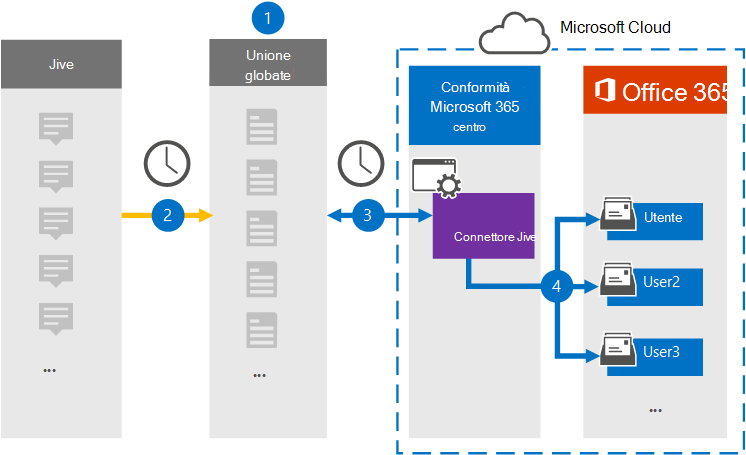

# Configurare un connettore per archiviare i dati di Jive (anteprima)Set up a connector to archive Jive data (preview)

Utilizzare un connettore di Globanet nel centro conformità di Microsoft 365 per importare e archiviare i dati dalla piattaforma di collaborazione alle cassette postali degli utenti nell'organizzazione Microsoft 365.Use a Globanet connector in the Microsoft 365 compliance center to import and archive data from the collaboration platform to user mailboxes in your Microsoft 365 organization. Globanet fornisce un connettore [Jive](https://globanet.com/jive/) configurato per acquisire elementi dall'origine dati di terze parti (su base regolare) e quindi importare tali elementi in Microsoft 365.Globanet provides a [Jive](https://globanet.com/jive/) connector that is configured to capture items from the third-party data source (on a regular basis) and then import those items to Microsoft 365. Il connettore converte il contenuto, ad esempio i messaggi di posta elettronica, le chat e gli allegati dall'account Jive di un utente a un formato di messaggio di posta elettronica e quindi importa tali elementi nella cassetta postale dell'utente in Microsoft 365.The connector converts content such as email messages, chats, and attachments from a user's Jive account to an email message format and then imports those items to the user's mailbox in Microsoft 365.

Dopo che i dati di Jive sono archiviati nelle cassette postali degli utenti, è possibile applicare le funzionalità di conformità di Microsoft 365 come il blocco per controversia legale, eDiscovery, criteri di conservazione e etichette di conservazione e conformità della comunicazione.After Jive data is stored in user mailboxes, you can apply Microsoft 365 compliance features such as Litigation Hold, eDiscovery, retention policies and retention labels, and communication compliance. L'utilizzo di un connettore Jive per l'importazione e l'archiviazione dei dati in Microsoft 365 può aiutare l'organizzazione a rimanere conforme ai criteri governativi e normativi.Using a Jive connector to import and archive data in Microsoft 365 can help your organization stay compliant with government and regulatory policies.

## Panoramica dell'archiviazione dei dati di JiveOverview of archiving Jive data

Nella panoramica seguente viene illustrato il processo di utilizzo di un connettore per archiviare i dati di Jive in Microsoft 365.The following overview explains the process of using a connector to archive the Jive data in Microsoft 365.

1. L'organizzazione collabora con Jive per impostare e configurare un sito di Jive.Your organization works with Jive to set up and configure a Jive site.

2. Una volta ogni 24 ore, gli elementi di Jive vengono copiati nel sito Merge1 di Globanet.Once every 24 hours, items from Jive are copied to the Globanet Merge1 site. Il connettore converte anche il contenuto degli elementi di Jive in un formato di messaggio di posta elettronica.The connector also converts the content of Jive items to an email message format.

3. Il connettore di Jive creato nel centro conformità di Microsoft 365 si connette al sito di Globanet Merge1 ogni giorno e trasferisce il contenuto in una posizione di archiviazione sicura di Azure nel cloud Microsoft.The Jive connector that you create in the Microsoft 365 compliance center connects to the Globanet Merge1 site every day and transfers the content to a secure Azure Storage location in the Microsoft cloud.

4. Il connettore importa gli elementi convertiti nelle cassette postali di utenti specifici utilizzando il valore della proprietà di *posta elettronica* del mapping automatico degli utenti, come descritto nel [passaggio 3](#step-3-map-users-and-complete-the-connector-setup).The connector imports the converted items to the mailboxes of specific users by using the value of the *Email* property of the automatic user mapping as described in [Step 3](#step-3-map-users-and-complete-the-connector-setup). Viene creata una nuova sottocartella nella cartella posta in arrivo denominata **Jive** nelle cassette postali degli utenti e gli elementi vengono importati in tale cartella.A new subfolder in the Inbox folder named **Jive** is created in the user mailboxes, and the items are imported to that folder. Il connettore esegue questa operazione utilizzando il valore della proprietà di *posta elettronica* .The connector does this by using the value of the *Email* property. Ogni elemento Jive contiene questa proprietà, che viene popolata con l'indirizzo di posta elettronica di tutti i partecipanti all'elemento.Every Jive item contains this property, which is populated with the email address of every participant of the item.

## Prima di iniziareBefore you begin

- Creare un account Merge1 di Globanet per i connettori Microsoft.Create a Globanet Merge1 account for Microsoft connectors. A tale scopo, contattare il [supporto clienti di globanet](https://globanet.com/ms-connectors-contact/).To do this, contact [globanet customer support](https://globanet.com/ms-connectors-contact/). È necessario accedere a questo account quando si crea il connettore nel passaggio 1.You need to sign into this account when you create the connector in Step 1.

- L'utente che crea il connettore Jive nel passaggio 1 (e lo completa nel passaggio 3) deve essere assegnato al ruolo di importazione/esportazione delle cassette postali in Exchange Online.The user who creates the Jive connector in Step 1 (and completes it in Step 3) must be assigned to the Mailbox Import Export role in Exchange Online. Questo ruolo è necessario per aggiungere connettori nella pagina **dei connettori dati** nel centro conformità di Microsoft 365.This role is required to add connectors on the **Data connectors** page in the Microsoft 365 compliance center. Per impostazione predefinita, questo ruolo non è assegnato a nessun gruppo di ruoli in Exchange Online.By default, this role is not assigned to any role group in Exchange Online. È possibile aggiungere il ruolo import export delle cassette postali al gruppo di ruoli Gestione organizzazione in Exchange Online.You can add the Mailbox Import Export role to the Organization Management role group in Exchange Online. In alternativa, è possibile creare un gruppo di ruoli, assegnare il ruolo di esportazione delle cassette postali e quindi aggiungere gli utenti corretti come membri.Or you can create a role group, assign the Mailbox Import Export role, and then add the appropriate users as members. Per ulteriori informazioni, vedere la sezione creare gruppi di [ruoli](https://docs.microsoft.com/Exchange/permissions-exo/role-groups#create-role-groups) o [modificare gruppi di ruoli](https://docs.microsoft.com/Exchange/permissions-exo/role-groups#modify-role-groups) nell'articolo "gestire i gruppi di ruoli in Exchange Online".For more information, see the [Create role groups](https://docs.microsoft.com/Exchange/permissions-exo/role-groups#create-role-groups) or [Modify role groups](https://docs.microsoft.com/Exchange/permissions-exo/role-groups#modify-role-groups) sections in the article "Manage role groups in Exchange Online".

## Passaggio 1: configurare il connettore JiveStep 1: Set up the Jive connector

Il primo passaggio consiste nell'accedere alla pagina **dei connettori dati** nel centro conformità di Microsoft 365 e creare un connettore per i dati di Jive.The first step is to access to the **Data Connectors** page in the Microsoft 365 compliance center and create a connector for Jive data.

1. Andare a [https://compliance.microsoft.com](https://compliance.microsoft.com/) e quindi fare clic su **connettori di dati**  >  **Jive**.Go to [https://compliance.microsoft.com](https://compliance.microsoft.com/) and then click **Data connectors** > **Jive**.

2. Nella pagina Descrizione prodotto **Jive** fare clic su **Aggiungi connettore**.On the **Jive** product description page, click **Add connector**.

3. Nella pagina **condizioni del servizio** fare clic su **Accetto**.On the **Terms of service** page, click **Accept**.

4. Immettere un nome univoco che identifichi il connettore e quindi fare clic su **Avanti**.Enter a unique name that identifies the connector, and then click **Next**.

5. Accedere al proprio account di Merge1 per configurare il connettore.Sign in to your Merge1 account to configure the connector.

## Passaggio 2: configurare il connettore JiveStep 2: Configure the Jive connector

Il secondo passaggio consiste nel configurare il connettore Jive nel sito di Merge1.The second step is to configure the Jive connector on the Merge1 site. Per informazioni su come configurare il connettore di Jive, vedere [Merge1 di terze parti dei connettori utente](https://docs.ms.merge1.globanetportal.com/Merge1%20Third-Party%20Connectors%20Jive%20User%20Guide.pdf).For information about how to configure the Jive connector, see [Merge1 Third-Party Connectors User Guide](https://docs.ms.merge1.globanetportal.com/Merge1%20Third-Party%20Connectors%20Jive%20User%20Guide.pdf).

Dopo aver fatto clic su **salva & fine**, è possibile tornare al centro conformità di Microsoft 365 alla pagina **mapping utenti** nella procedura guidata del connettore.After you click **Save & Finish**, you are directed back to the Microsoft 365 compliance center, to the **User mapping** page in the connector wizard.

## Passaggio 3: mappare gli utenti e completare la configurazione del connettoreStep 3: Map users and complete the connector setup

Per eseguire il mapping degli utenti e completare la configurazione del connettore nel centro conformità di Microsoft 365, attenersi alla procedura seguente:To map users and complete the connector setup in the Microsoft 365 compliance center, follow the steps below:

1. Nella pagina **Mappa utenti di Jive a Microsoft 365** , abilitare il mapping automatico degli utenti.On the **Map Jive users to Microsoft 365 users** page, enable automatic user mapping. Gli elementi di Jive includono una proprietà denominata *posta elettronica*, che contiene gli indirizzi di posta elettronica per gli utenti dell'organizzazione.The Jive items include a property called *Email*, which contains email addresses for users in your organization. Se il connettore può associare questo indirizzo a un utente di Microsoft 365, gli elementi vengono importati nella cassetta postale dell'utente.If the connector can associate this address with a Microsoft 365 user, the items are imported to that user's mailbox.

2. Nella pagina **consenso amministratore** fare clic su **Fornisci consenso**.On the **Admin Consent** page, click **Provide Consent**. L'utente verrà reindirizzato al sito Microsoft.You will be redirected to the Microsoft site. Fare clic su **accetta** per fornire il consenso.Click **Accept** to provide the consent.

   L'organizzazione deve autorizzare il servizio di importazione di Office 365 per accedere ai dati delle cassette postali nell'organizzazione.Your organization must consent to allow the Office 365 Import service to access mailbox data in your organization. Per fornire il consenso dell'amministratore, è necessario essere connessi con le credenziali di un amministratore globale di Microsoft 365 e quindi accettare la richiesta di consenso.To provide admin consent, you must be signed in with the credentials of a Microsoft 365 global admin, and then accept the consent request. Se non è stato eseguito l'accesso come amministratore globale, è possibile accedere a [Questa pagina](https://login.microsoftonline.com/common/oauth2/authorize?client_id=570d0bec-d001-4c4e-985e-3ab17fdc3073&response_type=code&redirect_uri=https://portal.azure.com/&nonce=1234&prompt=admin_consent) ed eseguire l'accesso con le credenziali di amministratore globale per accettare la richiesta.If you aren't signed in as a global admin, you can go to [this page](https://login.microsoftonline.com/common/oauth2/authorize?client_id=570d0bec-d001-4c4e-985e-3ab17fdc3073&response_type=code&redirect_uri=https://portal.azure.com/&nonce=1234&prompt=admin_consent) and sign in using global admin credentials to accept the request.

3. Fare clic su **Avanti**, rivedere le impostazioni e passare alla pagina **connettori dati** per visualizzare lo stato di avanzamento del processo di importazione per il nuovo connettore.Click **Next**, review your settings, and go to the **Data connectors** page to see the progress of the import process for the new connector.

## Passaggio 4: monitorare il connettore JiveStep 4: Monitor the Jive connector

Dopo aver creato il connettore Jive, è possibile visualizzare lo stato del connettore nel centro conformità di Microsoft 365.After you create the Jive connector, you can view the connector status in the Microsoft 365 compliance center.

1. Andare a [https://compliance.microsoft.com](https://compliance.microsoft.com) e fare clic su **connettori dati** nel NAV sinistro.Go to [https://compliance.microsoft.com](https://compliance.microsoft.com) and click **Data connectors** in the left nav.

2. Fare clic sulla scheda **connettori** e quindi selezionare il connettore **Jive** per visualizzare la pagina del riquadro a comparsa, che contiene le proprietà e le informazioni sul connettore.Click the **Connectors** tab and then select the **Jive** connector to display the flyout page, which contains the properties and information about the connector.

3. In **stato connettore con origine**fare clic sul collegamento **Scarica log** per aprire o salvare il registro di stato del connettore.Under **Connector status with source**, click the **Download log** link to open (or save) the status log for the connector. Questo log contiene informazioni sui dati che sono stati importati nel cloud Microsoft.This log contains information about the data that has been imported to the Microsoft cloud.

## Problemi notiKnown issues

- Al momento, non è supportato l'importazione di allegati o elementi di dimensioni superiori a 10 MB.At this time, we don't support importing attachments or items that are larger than 10 MB. Il supporto per gli elementi di grandi dimensioni sarà disponibile in un secondo momento.Support for larger items will be available at a later date.
