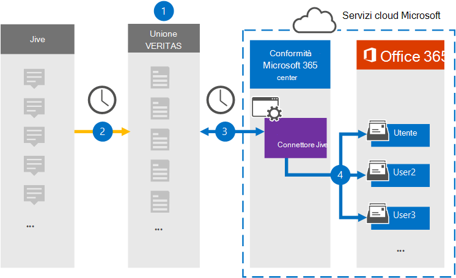

# Configurare un connettore per archiviare i dati JiveSet up a connector to archive Jive data

Usare un connettore Globanet nel Centro conformità Microsoft 365 per importare e archiviare i dati dalla piattaforma di collaborazione alle cassette postali degli utenti nell'organizzazione di Microsoft 365.Use a Globanet connector in the Microsoft 365 compliance center to import and archive data from the collaboration platform to user mailboxes in your Microsoft 365 organization. Globanet fornisce un connettore [Jive](https://globanet.com/jive/) configurato per acquisire elementi dall'origine dati di terze parti (regolarmente) e quindi importare tali elementi in Microsoft 365.Globanet provides a [Jive](https://globanet.com/jive/) connector that is configured to capture items from the third-party data source (on a regular basis) and then import those items to Microsoft 365. Il connettore converte contenuto come messaggi di posta elettronica, chat e allegati dall'account Jive di un utente in un formato di messaggio di posta elettronica e quindi importa tali elementi nella cassetta postale dell'utente in Microsoft 365.The connector converts content such as email messages, chats, and attachments from a user's Jive account to an email message format and then imports those items to the user's mailbox in Microsoft 365.

Dopo aver archiviato i dati Jive nelle cassette postali degli utenti, è possibile applicare le funzionalità di conformità di Microsoft 365, ad esempio il blocco per controversia legale, eDiscovery, i criteri di conservazione e le etichette di conservazione e la conformità delle comunicazioni.After Jive data is stored in user mailboxes, you can apply Microsoft 365 compliance features such as Litigation Hold, eDiscovery, retention policies and retention labels, and communication compliance. L'uso di un connettore Jive per importare e archiviare i dati in Microsoft 365 può aiutare l'organizzazione a rimanere conforme ai criteri normativi e governativi.Using a Jive connector to import and archive data in Microsoft 365 can help your organization stay compliant with government and regulatory policies.

## Panoramica dell'archiviazione dei dati JiveOverview of archiving Jive data

La seguente panoramica spiega il processo di utilizzo di un connettore per archiviare i dati Jive in Microsoft 365.The following overview explains the process of using a connector to archive the Jive data in Microsoft 365.

1. L'organizzazione collabora con Jive per configurare un sito Jive.Your organization works with Jive to set up and configure a Jive site.

2. Una volta ogni 24 ore, gli elementi di Jive vengono copiati nel sito Globanet Merge1.Once every 24 hours, items from Jive are copied to the Globanet Merge1 site. Il connettore converte anche il contenuto degli elementi Jive in un formato di messaggio di posta elettronica.The connector also converts the content of Jive items to an email message format.

3. Il connettore Jive creato nel Centro conformità Microsoft 365 si connette ogni giorno al sito Globanet Merge1 e trasferisce il contenuto in una posizione sicura di Archiviazione di Azure nel cloud Microsoft.The Jive connector that you create in the Microsoft 365 compliance center connects to the Globanet Merge1 site every day and transfers the content to a secure Azure Storage location in the Microsoft cloud.

4. Il connettore importa gli elementi convertiti nelle cassette postali di utenti specifici utilizzando il valore della proprietà *Email* del mapping automatico degli utenti, come descritto [nel passaggio 3.](#step-3-map-users-and-complete-the-connector-setup)The connector imports the converted items to the mailboxes of specific users by using the value of the *Email* property of the automatic user mapping as described in [Step 3](#step-3-map-users-and-complete-the-connector-setup). Nelle cassette postali degli utenti viene creata una nuova sottocartella nella cartella Posta in arrivo denominata **Jive** e gli elementi vengono importati in tale cartella.A new subfolder in the Inbox folder named **Jive** is created in the user mailboxes, and the items are imported to that folder. Il connettore esegue questa operazione utilizzando il valore della *proprietà Email.*The connector does this by using the value of the *Email* property. Ogni elemento Jive contiene questa proprietà, che viene popolata con l'indirizzo di posta elettronica di ogni partecipante dell'elemento.Every Jive item contains this property, which is populated with the email address of every participant of the item.

## Prima di iniziareBefore you begin

- Creare un account Globanet Merge1 per i connettori Microsoft.Create a Globanet Merge1 account for Microsoft connectors. Per creare questo account, contattare il [supporto tecnico di Globanet.](https://globanet.com/ms-connectors-contact/)To create this account, contact [globanet customer support](https://globanet.com/ms-connectors-contact/). Si accederà a questo account quando si crea il connettore nel passaggio 1.You will sign into this account when you create the connector in Step 1.

- L'utente che crea il connettore Jive nel passaggio 1 (e lo completa nel passaggio 3) deve essere assegnato al ruolo di importazione/esportazione delle cassette postali in Exchange Online.The user who creates the Jive connector in Step 1 (and completes it in Step 3) must be assigned to the Mailbox Import Export role in Exchange Online. Questo ruolo è necessario per aggiungere connettori nella pagina **Connettori** dati nel Centro conformità Microsoft 365.This role is required to add connectors on the **Data connectors** page in the Microsoft 365 compliance center. Per impostazione predefinita, questo ruolo non è assegnato a un gruppo di ruoli in Exchange Online.By default, this role is not assigned to a role group in Exchange Online. È possibile aggiungere il ruolo di importazione/esportazione delle cassette postali al gruppo di ruoli Gestione organizzazione in Exchange Online.You can add the Mailbox Import Export role to the Organization Management role group in Exchange Online. In or you can create a role group, assign the Mailbox Import Export role, and then add the appropriate users as members.Or you can create a role group, assign the Mailbox Import Export role, and then add the appropriate users as members. Per ulteriori informazioni, vedere le sezioni [Creazione](https://docs.microsoft.com/Exchange/permissions-exo/role-groups#create-role-groups) di gruppi di ruoli o Modifica gruppi [di](https://docs.microsoft.com/Exchange/permissions-exo/role-groups#modify-role-groups) ruoli nell'articolo "Gestire i gruppi di ruoli in Exchange Online".For more information, see the [Create role groups](https://docs.microsoft.com/Exchange/permissions-exo/role-groups#create-role-groups) or [Modify role groups](https://docs.microsoft.com/Exchange/permissions-exo/role-groups#modify-role-groups) sections in the article "Manage role groups in Exchange Online".

## Passaggio 1: Configurare il connettore JiveStep 1: Set up the Jive connector

Il primo passaggio consiste nell'accedere alla pagina **Connettori** dati nel Centro conformità Microsoft 365 e creare un connettore per i dati Jive.The first step is to access to the **Data Connectors** page in the Microsoft 365 compliance center and create a connector for Jive data.

1. Passare a [https://compliance.microsoft.com](https://compliance.microsoft.com/) e quindi fare clic su **Connettori dati**  >  **Jive.**Go to [https://compliance.microsoft.com](https://compliance.microsoft.com/) and then click **Data connectors** > **Jive**.

2. Nella pagina della descrizione del prodotto **Jive,** fare clic **su Aggiungi connettore.**On the **Jive** product description page, click **Add connector**.

3. Nella pagina **Condizioni per il servizio** fare clic su **Accetta.**On the **Terms of service** page, click **Accept**.

4. Immettere un nome univoco che identifichi il connettore, quindi fare clic su **Avanti.**Enter a unique name that identifies the connector, and then click **Next**.

5. Accedere all'account Merge1 per configurare il connettore.Sign in to your Merge1 account to configure the connector.

## Passaggio 2: Configurare il connettore JiveStep 2: Configure the Jive connector

Il secondo passaggio consiste nel configurare il connettore Jive nel sito Merge1.The second step is to configure the Jive connector on the Merge1 site. Per informazioni su come configurare il connettore Jive, vedere il manuale [dell'utente Merge1 Third-Party Connectors.](https://docs.ms.merge1.globanetportal.com/Merge1%20Third-Party%20Connectors%20Jive%20User%20Guide.pdf)For information about how to configure the Jive connector, see [Merge1 Third-Party Connectors User Guide](https://docs.ms.merge1.globanetportal.com/Merge1%20Third-Party%20Connectors%20Jive%20User%20Guide.pdf).

Dopo aver fatto **clic su & fine,** viene visualizzata la pagina **Mapping** utenti nella procedura guidata del connettore nel Centro conformità Microsoft 365.After you click **Save & Finish**, the **User mapping** page in the connector wizard in the Microsoft 365 compliance center is displayed.

## Passaggio 3: mappare gli utenti e completare la configurazione del connettoreStep 3: Map users and complete the connector setup

Per mappare gli utenti e completare la configurazione del connettore nel Centro conformità Microsoft 365, seguire la procedura seguente:To map users and complete the connector setup in the Microsoft 365 compliance center, follow the steps below:

1. Nella pagina **Mapping utenti Jive con utenti di Microsoft 365** abilitare il mapping automatico degli utenti.On the **Map Jive users to Microsoft 365 users** page, enable automatic user mapping. Gli elementi Jive includono una proprietà denominata *Email,* che contiene gli indirizzi di posta elettronica per gli utenti dell'organizzazione.The Jive items include a property called *Email*, which contains email addresses for users in your organization. Se il connettore può associare questo indirizzo a un utente di Microsoft 365, gli elementi vengono importati nella cassetta postale dell'utente.If the connector can associate this address with a Microsoft 365 user, the items are imported to that user's mailbox.

2. Fare **clic** su Avanti, rivedere le impostazioni e passare alla pagina **Connettori** dati per visualizzare l'avanzamento del processo di importazione per il nuovo connettore.Click **Next**, review your settings, and go to the **Data connectors** page to see the progress of the import process for the new connector.

## Passaggio 4: Monitorare il connettore JiveStep 4: Monitor the Jive connector

Dopo aver creato il connettore Jive, è possibile visualizzare lo stato del connettore nel Centro conformità Microsoft 365.After you create the Jive connector, you can view the connector status in the Microsoft 365 compliance center.

1. Andare a [https://compliance.microsoft.com](https://compliance.microsoft.com) e fare clic su **Connettori dati** nel riquadro di spostamento sinistro.Go to [https://compliance.microsoft.com](https://compliance.microsoft.com) and click **Data connectors** in the left nav.

2. Fare clic **sulla scheda Connettori** e quindi selezionare il **connettore Jive** per visualizzare la pagina del riquadro a comparsa.Click the **Connectors** tab and then select the **Jive** connector to display the flyout page. Questa pagina contiene le proprietà e le informazioni sul connettore.This page contains the properties and information about the connector.

3. In **Stato connettore con origine** fare clic sul collegamento Scarica **registro** per aprire (o salvare) il registro di stato per il connettore.Under **Connector status with source**, click the **Download log** link to open (or save) the status log for the connector. Questo log contiene informazioni sui dati importati nel cloud Microsoft.This log contains information about the data that has been imported to the Microsoft cloud.

## Problemi notiKnown issues

- Al momento, non è possibile importare allegati o elementi di dimensioni superiori a 10 MB.At this time, we don't support importing attachments or items that are larger than 10 MB. Il supporto per gli elementi più grandi sarà disponibile in un secondo momento.Support for larger items will be available at a later date.
