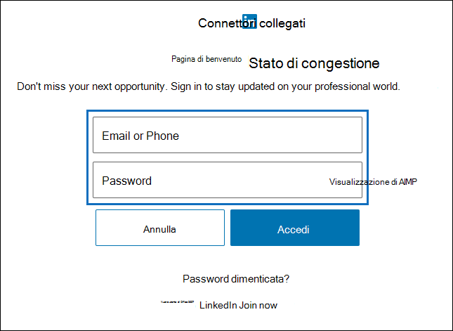
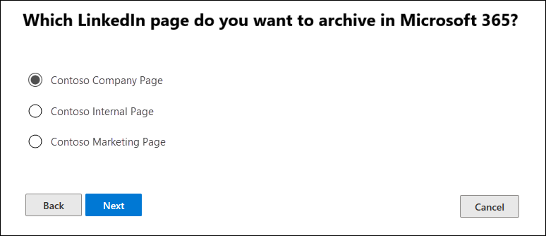

# Configurare un connettore per archiviare i dati di LinkedIn

Utilizzare un connettore nel centro conformità di Microsoft 365 per importare e archiviare i dati dalle pagine dell'azienda LinkedIn. Dopo aver configurato e configurato un connettore, l'utente si connette all'account della pagina della società specifica di LinkedIn una volta ogni 24 ore. Il connettore converte i messaggi inviati alla pagina della società in un messaggio di posta elettronica e quindi importa tali elementi in una cassetta postale in Microsoft 365.

Dopo che i dati della pagina della società LinkedIn sono archiviati in una cassetta postale, è possibile applicare le funzionalità di conformità di Microsoft 365 come il blocco per controversia legale, la ricerca di contenuto, la In-Place archiviazione, il controllo e i criteri di conservazione di Microsoft 365 ai dati di LinkedIn. Ad esempio, è possibile cercare questi elementi utilizzando la ricerca contenuto o associare la cassetta postale di archiviazione a un custode in un caso di eDiscovery avanzato. La creazione di un connettore per l'importazione e l'archiviazione dei dati di LinkedIn in Microsoft 365 può aiutare l'organizzazione a rimanere conforme ai criteri governativi e normativi.

## Prima di configurare un connettore

- All'utente che crea un connettore di pagina di LinkedIn Company deve essere assegnato il ruolo di importazione/esportazione delle cassette postali in Exchange Online. Questa operazione è necessaria per aggiungere connettori nella pagina **connettori dati** del centro conformità di Microsoft 365. Per impostazione predefinita, questo ruolo non è assegnato ad alcun gruppo di ruoli in Exchange Online. È possibile aggiungere il ruolo import export delle cassette postali al gruppo di ruoli Gestione organizzazione in Exchange Online. In alternativa, è possibile creare un gruppo di ruoli, assegnare il ruolo di esportazione delle cassette postali e quindi aggiungere gli utenti corretti come membri. Per ulteriori informazioni, vedere la sezione creare gruppi di [ruoli](https://docs.microsoft.com/Exchange/permissions-exo/role-groups#create-role-groups) o [modificare gruppi di ruoli](https://docs.microsoft.com/Exchange/permissions-exo/role-groups#modify-role-groups) nell'articolo "gestire i gruppi di ruoli in Exchange Online".

- È necessario disporre delle credenziali di accesso (indirizzo di posta elettronica o numero di telefono e password) di un account utente di LinkedIn che è un amministratore della pagina della società LinkedIn che si desidera archiviare. Queste credenziali vengono utilizzate per accedere a LinkedIn quando si configura il connettore.

- Il connettore LinkedIn è in grado di importare un totale di 200.000 elementi in un solo giorno. Se sono presenti più di 200.000 elementi di LinkedIn in un giorno, nessuno di questi elementi verrà importato in Microsoft 365.

## Creare un connettore LinkedIn

1. Andare a <https://compliance.microsoft.com> e quindi fare clic su **connettori dati**  >  **LinkedIn pagine società**.

2. Nella pagina **LinkedIn Company** Product Pages fare clic su **Aggiungi connettore**.

3. Nella pagina **condizioni del servizio** selezionare **accetta**.

4. Nella pagina **Accedi con LinkedIn** fare clic su **Accedi con LinkedIn**.

   Viene visualizzata la pagina di accesso di LinkedIn.

   

5. Nella pagina di accesso a LinkedIn, immettere l'indirizzo di posta elettronica (o il numero di telefono) e la password per l'account LinkedIn associato alla pagina società che si desidera archiviare e quindi fare clic su **Accedi**.

   Viene visualizzata una pagina della procedura guidata con un elenco di tutte le pagine società di LinkedIn associate all'account a cui è stato effettuato l'accesso. È possibile configurare un connettore solo per una pagina dell'azienda. Se nell'organizzazione sono presenti più pagine dell'azienda LinkedIn, è necessario creare un connettore per ognuno di essi.

   

6. Selezionare la pagina società da cui si desidera archiviare gli elementi, quindi fare clic su **Avanti**.

7. Nella pagina **Scegli percorso di archiviazione** , fare clic nella casella, selezionare l'indirizzo di posta elettronica di una cassetta postale di Microsoft 365 a cui verranno importati gli elementi di LinkedIn e quindi fare clic su **Avanti**. Gli elementi vengono importati nella cartella posta in arrivo in questa cassetta postale.

8. Fare clic su **Avanti** per esaminare le impostazioni del connettore e quindi fare clic su **fine** per completare la configurazione del connettore.

Dopo aver creato il connettore, è possibile tornare alla pagina **connettori dati** per visualizzare lo stato di avanzamento del processo di importazione per il nuovo connettore (selezionare **Aggiorna** , se necessario, per aggiornare l'elenco dei connettori). Il valore nella colonna **stato** è in **attesa di inizio**. L'avvio del processo di importazione iniziale richiede fino a 24 ore. Dopo la prima esecuzione del connettore e le importazioni degli elementi di LinkedIn, il connettore verrà eseguito una volta ogni 24 ore e importerà eventuali nuovi elementi creati nella pagina società di LinkedIn nelle 24 ore precedenti.

Per visualizzare ulteriori dettagli, selezionare il connettore nell'elenco nella pagina **connettori dati** per la visualizzazione della pagina a comparsa. In **stato**, l'intervallo di date visualizzato indica il filtro di età che è stato selezionato quando è stato creato il connettore.

## Ulteriori informazioni

Gli elementi di LinkedIn vengono importati nella sottocartella LinkedIn nella posta in arrivo della cassetta postale di archiviazione in Microsoft 365. Vengono visualizzati come messaggi di posta elettronica.
