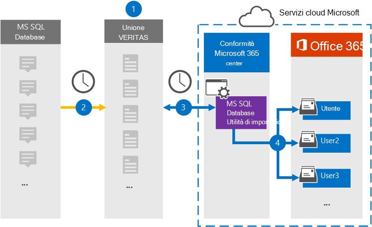

# Configurare un connettore per archiviare i dati da MS SQL DatabaseSet up a connector to archive data from MS SQL Database

Utilizzare un connettore Globanet nel Centro conformità Microsoft 365 per importare e archiviare i dati da MS SQL Database alle cassette postali degli utenti nell'organizzazione di Microsoft 365.Use a Globanet connector in the Microsoft 365 compliance center to import and archive data from MS SQL Database to user mailboxes in your Microsoft 365 organization. Globanet fornisce un connettore di importazione database di MS SQL configurato per acquisire elementi da un database utilizzando un file di configurazione XML e importare tali elementi in Microsoft 365.Globanet provides you with an MS SQL Database Importer connector that's configured to capture items from a database using an XML configuration file and import those items to Microsoft 365. Il connettore converte il contenuto da MS SQL Database in un formato di messaggio di posta elettronica e quindi importa tali elementi nelle cassette postali degli utenti in Microsoft 365.The connector converts content from MS SQL Database to an email message format and then imports those items to user mailboxes in Microsoft 365.

Dopo il contenuto di MS SQL Database archiviato nelle cassette postali degli utenti, è possibile applicare le funzionalità di conformità di Microsoft 365, ad esempio conservazione per controversia legale, eDiscovery, criteri di conservazione ed etichette di conservazione.After content from MS SQL Database stored in user mailboxes, you can apply Microsoft 365 compliance features such as Litigation Hold, eDiscovery, retention policies and retention labels. L'utilizzo di un connettore di database ms SQL per importare e archiviare i dati in Microsoft 365 può aiutare l'organizzazione a rimanere conforme ai criteri normativi e governativi.Using an MS SQL Database connector to import and archive data in Microsoft 365 can help your organization stay compliant with government and regulatory policies.

## Panoramica dell'archiviazione dei dati SQL msOverview of archiving the MS SQL data

Nella panoramica seguente viene illustrato il processo di utilizzo di un connettore per archiviare i dati SQL ms in Microsoft 365.The following overview explains the process of using a connector to archive MS SQL data in Microsoft 365.

1. L'organizzazione collabora con un provider di database ms SQL per impostare e configurare un sito di database ms SQL database.Your organization works with an MS SQL Database provider to set up and configure an MS SQL Database site.

2. Una volta ogni 24 ore, ms SQL gli elementi del database vengono copiati nel sito Globanet Merge1.Once every 24 hours, MS SQL Database items are copied to the Globanet Merge1 site. Il connettore converte anche questo contenuto in un formato di messaggio di posta elettronica.The connector also converts this content to an email message format.

3. Il connettore ms SQL Database Importer creato nel Centro conformità Microsoft 365, si connette al sito Globanet Merge1 ogni giorno e trasferisce i messaggi in una posizione sicura di Archiviazione di Azure nel cloud Microsoft.The MS SQL Database Importer connector that you create in the Microsoft 365 compliance center, connects to the Globanet Merge1 site every day and transfers the messages to a secure Azure Storage location in the Microsoft cloud.

4. Il connettore importa gli elementi del database MS SQL convertiti nelle cassette postali di utenti specifici utilizzando il valore della proprietà *Email* del mapping automatico degli utenti, come descritto nel [passaggio 3.](#step-3-map-users-and-complete-the-connector-setup)The connector imports the converted MS SQL Database items to the mailboxes of specific users using the value of the *Email* property of the automatic user mapping as described in [Step 3](#step-3-map-users-and-complete-the-connector-setup). Nelle cassette postali degli utenti viene creata una sottocartella nella cartella Posta in arrivo denominata **MS SQL Database Importer** e gli elementi vengono importati in tale cartella.A subfolder in the Inbox folder named **MS SQL Database Importer** is created in the user mailboxes, and the items are imported to that folder. Il connettore determina in quale cassetta postale importare gli elementi utilizzando il valore della *proprietà Email.*The connector determines which mailbox to import items to by using the value of the *Email* property. Ogni elemento del database ms SQL contiene questa proprietà, che viene popolata con l'indirizzo di posta elettronica di ogni partecipante dell'elemento.Every item from the MS SQL Database contains this property, which is populated with the email address of every participant of the item.

## Prima di iniziareBefore you begin

- Creare un account Globanet Merge1 per i connettori Microsoft.Create a Globanet Merge1 account for Microsoft connectors. Per creare un account, contattare il [Supporto clienti Globanet.](https://globanet.com/contact-us/)To create an account, contact [Globanet Customer Support](https://globanet.com/contact-us/). È necessario accedere a questo account quando si crea il connettore nel passaggio 1.You need to sign into this account when you create the connector in Step 1.

- L'utente che crea il connettore ms SQL Database Importer nel passaggio 1 (e lo completa nel passaggio 3) deve essere assegnato al ruolo Di esportazione importazione cassette postali in Exchange Online.The user who creates the MS SQL Database Importer connector in Step 1 (and completes it in Step 3) must be assigned to the Mailbox Import Export role in Exchange Online. Questo ruolo è necessario per aggiungere connettori nella pagina Connettori dati nel Centro conformità Microsoft 365.This role is required to add connectors on the Data connectors page in the Microsoft 365 compliance center. Per impostazione predefinita, questo ruolo non viene assegnato ad alcun gruppo di ruoli in Exchange Online.By default, this role is not assigned to any role group in Exchange Online. È possibile aggiungere il ruolo Esportazione importazione cassette postali al gruppo di ruoli Gestione organizzazione in Exchange Online.You can add the Mailbox Import Export role to the Organization Management role group in Exchange Online. In caso contrario, è possibile creare un gruppo di ruoli, assegnare il ruolo Importazione/Esportazione cassette postali e quindi aggiungere gli utenti appropriati come membri.Or you can create a role group, assign the Mailbox Import Export role, and then add the appropriate users as members. Per ulteriori informazioni, vedere le sezioni [Create role groups](/Exchange/permissions-exo/role-groups#create-role-groups) o Modify role [groups](/Exchange/permissions-exo/role-groups#modify-role-groups) nell'articolo "Manage role groups in Exchange Online".For more information, see the [Create role groups](/Exchange/permissions-exo/role-groups#create-role-groups) or [Modify role groups](/Exchange/permissions-exo/role-groups#modify-role-groups) sections in the article "Manage role groups in Exchange Online".

## Passaggio 1: Configurare il connettore dell'utilità di SQL database msStep 1: Set up the MS SQL Database Importer connector

Il primo passaggio consiste  nell'accedere alla pagina Connettori dati nel Centro conformità Microsoft365 e creare un connettore per ms SQL Database.The first step is to access to the **Data Connectors** page in the Microsoft365 compliance center and create a connector for the MS SQL Database.

1. Passare a [https://compliance.microsoft.com](https://compliance.microsoft.com) e quindi fare clic su **Connettori dati** MS SQL Database  >  **Importer**.Go to [https://compliance.microsoft.com](https://compliance.microsoft.com) and then click **Data connectors** > **MS SQL Database Importer**.

2. Nella pagina **MS SQL Descrizione prodotto Utilità** di importazione database fare clic su Aggiungi nuovo **connettore.**On the **MS SQL Database Importer** product description page, click **Add new connector**.

3. Nella pagina **Condizioni di servizio** fare clic su **Accetta.**On the **Terms of service** page, click **Accept**.

4. Immettere un nome univoco che identifichi il connettore e quindi fare clic su **Avanti.**Enter a unique name that identifies the connector, and then click **Next**.

5. Accedere all'account Merge1 per configurare il connettore.Sign in to your Merge1 account to configure the connector.

## Passaggio 2: Configurare il connettore di importazione SQL database ms nel sito Globanet Merge1Step 2: Configure the MS SQL Database Importer connector on the Globanet Merge1 site

Il secondo passaggio consiste nel configurare il connettore ms SQL Database Importer nel sito Merge1.The second step is to configure the MS SQL Database Importer connector on the Merge1 site. Per informazioni su come configurare l'utilità di SQL DATABASE DI MS, vedere [Merge1 Third-Party Connectors User Guide](https://docs.ms.merge1.globanetportal.com/Merge1%20Third-Party%20Connectors%20MS%20SQL%20Database%20Importer%20User%20Guide%20.pdf).For information about how to configure the MS SQL Database Importer, see [Merge1 Third-Party Connectors User Guide](https://docs.ms.merge1.globanetportal.com/Merge1%20Third-Party%20Connectors%20MS%20SQL%20Database%20Importer%20User%20Guide%20.pdf).

Dopo aver fatto **clic su Salva & fine,** viene visualizzata la pagina **Mapping** utenti nella procedura guidata del connettore nel Centro conformità Microsoft 365.After you click **Save & Finish**, the **User mapping** page in the connector wizard in the Microsoft 365 compliance center is displayed.

## Passaggio 3: mappare gli utenti e completare la configurazione del connettoreStep 3: Map users and complete the connector setup

Per mappare gli utenti e completare la configurazione del connettore, attenersi alla seguente procedura:To map users and complete the connector setup, follow these steps:

1. Nella pagina **Mappare gli utenti dell SQL'utilità** di importazione database agli utenti di Microsoft 365 abilitare il mapping automatico degli utenti.On the **Map MS SQL Database Importer users to Microsoft 365 users** page, enable automatic user mapping. Gli elementi SQL database ms includono una proprietà denominata *Email*, che contiene gli indirizzi di posta elettronica per gli utenti dell'organizzazione.The MS SQL Database items include a property called *Email*, which contains email addresses for users in your organization. Se il connettore può associare questo indirizzo a un utente di Microsoft 365, gli elementi vengono importati nella cassetta postale dell'utente.If the connector can associate this address with a Microsoft 365 user, the items are imported to that user’s mailbox.

2. Fare **clic** su Avanti, rivedere le impostazioni e passare alla pagina **Connettori** dati per visualizzare l'avanzamento del processo di importazione per il nuovo connettore.Click **Next**, review your settings, and go to the **Data connectors** page to see the progress of the import process for the new connector.

## Passaggio 4: Monitorare il connettore di importazione SQL database di MSStep 4: Monitor the MS SQL Database Importer connector

Dopo aver creato il connettore di importazione SQL database ms, è possibile visualizzare lo stato del connettore nel Centro conformità Microsoft 365.After you create the MS SQL Database Importer connector, you can view the connector status in the Microsoft 365 compliance center.

1. Vai a <https://compliance.microsoft.com/> e fai clic su **Connettori dati** nel riquadro di spostamento sinistro.Go to <https://compliance.microsoft.com/> and click **Data connectors** in the left nav.

2. Fare clic **sulla scheda Connettori** e quindi selezionare il connettore **DIS SQL Database** **Importer** per visualizzare la pagina a comparsa, contenente le proprietà e le informazioni sul connettore.Click the **Connectors** tab and then select the **MS SQL Database** **Importer** connector to display the flyout page, which contains the properties and information about the connector.

3. In **Stato connettore con origine** fare clic sul collegamento Scarica **registro** per aprire (o salvare) il registro di stato per il connettore.Under **Connector status with source**, click the **Download log** link to open (or save) the status log for the connector. Questo registro contiene i dati importati nel cloud Microsoft.This log contains data that has been imported to the Microsoft cloud.

## Problemi notiKnown issues

- Al momento non è possibile importare allegati o elementi di dimensioni superiori a 10 MB.At this time, we don't support importing attachments or items that are larger than 10 MB. Il supporto per gli elementi più grandi sarà disponibile in un secondo momento.Support for larger items will be available at a later date.