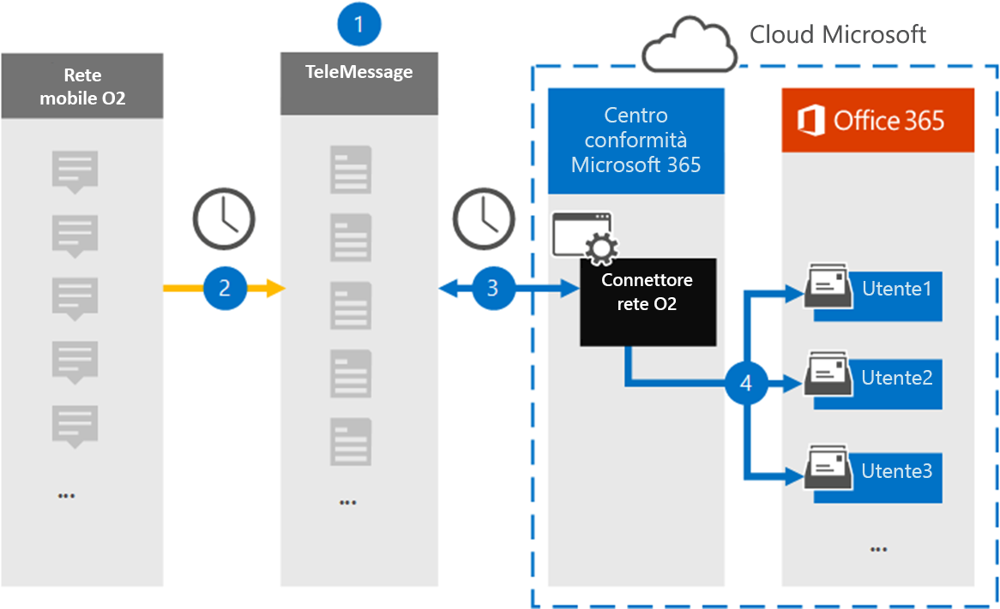

# Configurare un connettore per archiviare i dati di rete O2Set up a connector to archive O2 Network data

Utilizzare un connettore TeleMessage nel Centro conformità Microsoft 365 per importare e archiviare i messaggi del servizio di messaggistica breve (SMS) e le chiamate vocali dalla rete mobile O2.Use a TeleMessage connector in the Microsoft 365 compliance center to import and archive Short Messaging Service (SMS) messages and voice calls from the O2 mobile network. Dopo aver configurato e configurato un connettore, si connette alla rete O2 dell'organizzazione una volta al giorno e importa SMS e chiamate vocali alle cassette postali in Microsoft 365.After you set up and configure a connector, it connects to your organization's O2 Network once every day, and imports SMS and voice calls to mailboxes in Microsoft 365.

Dopo SMS i messaggi e le chiamate vocali vengono archiviati nelle cassette postali degli utenti, è possibile applicare ai dati di rete di O2 le funzionalità di conformità di Microsoft 365, ad esempio conservazione per controversia legale, ricerca contenuto e criteri di conservazione Microsoft 365.After SMS messages and voice calls are stored in user mailboxes, you can apply Microsoft 365 compliance features such as Litigation Hold, Content Search, and Microsoft 365 retention policies to O2 Network data. Ad esempio, è possibile cercare i messaggi SMS di rete O2 e le chiamate vocali utilizzando Ricerca contenuto o associare la cassetta postale che contiene i dati di rete O2 a un responsabile in un caso Advanced eDiscovery caso.For example, you can search O2 Network SMS messages and voice calls using Content Search or associate the mailbox that contains O2 Network data with a custodian in an Advanced eDiscovery case. L'utilizzo di un connettore di rete O2 per importare e archiviare i dati in Microsoft 365 può aiutare l'organizzazione a rimanere conforme ai criteri governativi e normativi.Using an O2 Network connector to import and archive data in Microsoft 365 can help your organization stay compliant with government and regulatory policies.

## Panoramica dell'archiviazione dei dati di rete O2Overview of archiving O2 Network data

Nella panoramica seguente viene illustrato il processo di utilizzo di un connettore per archiviare i dati di rete O2 in Microsoft 365.The following overview explains the process of using a connector to archive O2 Network data in Microsoft 365.

1. L'organizzazione collabora con TeleMessage e O2 per configurare un connettore di rete O2.Your organization works with TeleMessage and O2 to set up an O2 Network connector. Per ulteriori informazioni, vedere [O2 Network Archiver.](https://www.telemessage.com/office365-activation-for-o2-network-archiver)For more information, see [O2 Network Archiver](https://www.telemessage.com/office365-activation-for-o2-network-archiver).

2. Una volta ogni 24 ore, SMS messaggi e chiamate vocali dalla rete O2 dell'organizzazione vengono copiati nel sito TeleMessage.Once every 24 hours, SMS messages and voice calls from your organization’s O2 Network are copied to the TeleMessage site.

3. Il connettore di rete O2 creato nel Centro conformità Microsoft 365 si connette ogni giorno al sito TeleMessage e trasferisce i messaggi e le chiamate vocali di SMS dalle 24 ore precedenti a una posizione Archiviazione di Azure sicura nel cloud Microsoft.The O2 Network connector that you create in the Microsoft 365 compliance center connects to the TeleMessage site every day and transfers the SMS messages and voice calls from the previous 24 hours to a secure Azure Storage location in the Microsoft cloud. Il connettore converte inoltre il contenuto dei messaggi SMS e delle chiamate vocali in un formato di messaggio di posta elettronica.The connector also converts the content of SMS messages and voice calls to an email message format.

4. Il connettore importa gli elementi di comunicazione mobile nella cassetta postale di utenti specifici.The connector imports the mobile communication items to the mailbox of specific users. Una nuova cartella denominata **O2 SMS e Voice Network Archiver** viene creata nella cassetta postale di un utente specifico e gli elementi vengono importati in essa.A new folder named **O2 SMS and Voice Network Archiver** is created in a specific user's mailbox and the items are imported to it. Il connettore esegue questo mapping utilizzando il valore della proprietà Indirizzo di posta elettronica *dell'utente.*The connector does this mapping by using the value of the *User’s Email address* property. Ogni SMS messaggio e chiamata vocale contiene questa proprietà, che viene popolata con l'indirizzo di posta elettronica di ogni partecipante del messaggio.Every SMS message and voice call contains this property, which is populated with the email address of every participant of the message.

   Oltre al mapping automatico degli utenti utilizzando il valore della proprietà Indirizzo di posta elettronica *dell'utente,* è anche possibile definire un mapping personalizzato caricando un file di mapping CSV.In addition to automatic user mapping using the value of the *User’s Email address* property, you can also define a custom mapping by uploading a CSV mapping file. Questo file di mapping contiene il numero di telefono cellulare e l Microsoft 365 indirizzo di posta elettronica corrispondente per gli utenti dell'organizzazione.This mapping file contains the mobile phone number and corresponding Microsoft 365 email address for users in your organization. Se si abilita sia il mapping automatico degli utenti che il mapping personalizzato, per ogni elemento O2 il connettore esamina innanzitutto il file di mapping personalizzato.If you enable both automatic user mapping and custom mapping, for every O2 item the connector first looks at custom mapping file. Se non trova un utente Microsoft 365 valido corrispondente al numero di cellulare di un utente, il connettore utilizzerà i valori nella proprietà dell'indirizzo di posta elettronica dell'elemento che sta tentando di importare.If it doesn't find a valid Microsoft 365 user that corresponds to a user's mobile phone number, the connector will use the values in the email address property of the item it's trying to import. Se il connettore non trova un utente Microsoft 365 valido nel file di mapping personalizzato o nella proprietà dell'indirizzo di posta elettronica dell'elemento O2, l'elemento non verrà importato.If the connector doesn't find a valid Microsoft 365 user in either the custom mapping file or in the email address property of the O2 item, the item won't be imported.

## Prima di iniziareBefore you begin

Alcuni dei passaggi di implementazione necessari per archiviare i dati di rete di O2 sono esterni a Microsoft 365 e devono essere completati prima di poter creare un connettore nel Centro conformità.Some of the implementation steps required to archive O2 Network data are external to Microsoft 365 and must be completed before you can create a connector in the compliance center.

- Ordinare [il servizio O2 Network Archiver da TeleMessage](https://www.telemessage.com/mobile-archiver/order-mobile-archiver-for-o365/) e ottenere un account di amministrazione valido per l'organizzazione.Order the [O2 Network Archiver service from TeleMessage](https://www.telemessage.com/mobile-archiver/order-mobile-archiver-for-o365/) and get a valid administration account for your organization. Sarà necessario accedere a questo account quando si crea il connettore nel Centro conformità.You'll need to sign into this account when you create the connector in the compliance center.

- Ottenere l'account di rete O2 e i dettagli di contatto di fatturazione in modo da poter compilare i moduli di onboarding di TeleMessage e ordinare il servizio di archiviazione dei messaggi da O2.Obtain your O2 Network account and billing contact details so you can fill-out the TeleMessage onboarding forms and order the message archiving service from O2.

- Registrare tutti gli utenti che richiedono l'archiviazione SMS O2 e Voice Network nell'account TeleMessage.Register all users that require O2 SMS and Voice Network archiving in the TeleMessage account. Quando si registrano gli utenti, assicurarsi di usare lo stesso indirizzo di posta elettronica utilizzato per l'account Microsoft 365 account.When registering users, be sure to use the same email address that's used for their Microsoft 365 account.

- I dipendenti devono disporre di telefoni cellulari di proprietà aziendale e responsabili dell'azienda nella rete mobile O2.Your employees must have corporate-owned and corporate-liable mobile phones on the O2 mobile network. L'archiviazione dei messaggi Microsoft 365 non è disponibile per i dispositivi BYOD (Bring Your Own Devices) o di proprietà dei dipendenti.Archiving messages in Microsoft 365 isn't available for employee-owned or "Bring Your Own Devices (BYOD) devices.

- All'utente che crea un connettore di rete O2 deve essere assegnato il ruolo Esportazione importazione cassette postali in Exchange Online.The user who creates an O2 Network connector must be assigned the Mailbox Import Export role in Exchange Online. Questa operazione è necessaria per aggiungere connettori nella pagina **Connettori** dati nel Centro Microsoft 365 conformità.This is required to add connectors in the **Data connectors** page in the Microsoft 365 compliance center. Per impostazione predefinita, questo ruolo non è assegnato ad alcun gruppo di ruoli in Exchange Online.By default, this role isn't assigned to any role group in Exchange Online. È possibile aggiungere il ruolo Esportazione importazione cassette postali al gruppo di ruoli Gestione organizzazione in Exchange Online.You can add the Mailbox Import Export role to the Organization Management role group in Exchange Online. In caso contrario, è possibile creare un gruppo di ruoli, assegnare il ruolo Importazione/Esportazione cassette postali e quindi aggiungere gli utenti appropriati come membri.Or you can create a role group, assign the Mailbox Import Export role, and then add the appropriate users as members. Per ulteriori informazioni, vedere le sezioni [Create role groups](/Exchange/permissions-exo/role-groups#create-role-groups) o Modify role [groups](/Exchange/permissions-exo/role-groups#modify-role-groups) nell'articolo "Manage role groups in Exchange Online".For more information, see the [Create role groups](/Exchange/permissions-exo/role-groups#create-role-groups) or [Modify role groups](/Exchange/permissions-exo/role-groups#modify-role-groups) sections in the article "Manage role groups in Exchange Online".

## Creare un connettore di rete O2Create an O2 Network connector

Dopo aver completato i prerequisiti descritti nella sezione precedente, è possibile creare un connettore di rete O2 nel Centro Microsoft 365 conformità.After you've completed the prerequisites described in the previous section, you can create an O2 Network connector in the Microsoft 365 compliance center. Il connettore utilizza le informazioni fornite per connettersi al sito TeleMessage e trasferire SMS messaggi e chiamate vocali alle caselle delle cassette postali dell'utente corrispondenti in Microsoft 365.The connector uses the information you provide to connect to the TeleMessage site and transfer SMS messages and voice calls to the corresponding user mailbox boxes in Microsoft 365.

1. Passare a [https://compliance.microsoft.com](https://compliance.microsoft.com/) e quindi fare clic su **Connettori dati** \> **O2 Rete**.Go to [https://compliance.microsoft.com](https://compliance.microsoft.com/) and then click **Data connectors** \> **O2 Network**.

2. Nella pagina **Descrizione prodotto rete O2** fare clic su **Aggiungi connettore**On the **O2 Network** product description page, click **Add connector**

3. Nella pagina **Condizioni di servizio** fare clic su **Accetta.**On the **Terms of service** page, click **Accept**.

4. Nella pagina **Accesso a TeleMessage,** in Passaggio 3, immettere le informazioni necessarie nelle caselle seguenti e quindi fare clic su **Avanti.**On the **Login to TeleMessage** page, under Step 3, enter the required information in the following boxes and then click **Next**.

   - **Nome utente:** Nome utente TeleMessage.**Username:** Your TeleMessage username.

   - **Password:** Password TeleMessage.**Password:** Your TeleMessage password.

5. Dopo aver creato il connettore, è possibile chiudere la finestra popup e passare alla pagina successiva.After the connector is created, you can close the pop-up window and go to the next page.

6. Nella pagina **Mapping utenti** abilitare il mapping automatico degli utenti e fare clic su **Avanti.**On the **User mapping** page, enable automatic user mapping and click **Next**. Nel caso in cui sia necessario un mapping personalizzato caricare un file CSV e fare clic su **Avanti.**In case you need custom mapping upload a CSV file, and click **Next**.

7. Rivedere le impostazioni e quindi fare clic **su Fine** per creare il connettore.Review your settings, and then click **Finish** to create the connector.

8. Passare alla scheda Connettori nella **pagina Connettori dati** per visualizzare l'avanzamento del processo di importazione per il nuovo connettore.Go to the Connectors tab in **Data connectors** page to see the progress of the import process for the new connector.

## Problemi notiKnown issues

- Al momento non è possibile importare allegati o elementi di dimensioni superiori a 10 MB.At this time, we don't support importing attachments or items that are larger than 10 MB. Il supporto per gli elementi più grandi sarà disponibile in un secondo momento.Support for larger items will be available at a later date.