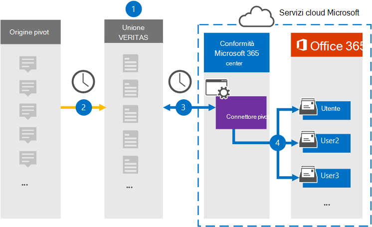

# Configurare un connettore per archiviare i dati pivot

Utilizzare un connettore Veritas nel centro Microsoft 365 conformità per importare e archiviare i dati dalla piattaforma Pivot alle cassette postali degli utenti nell'Microsoft 365 organizzazione. Veritas fornisce un connettore [pivot](https://globanet.com/pivot/) configurato per acquisire elementi dall'origine dati di terze parti (a intervalli regolari) e quindi importare tali elementi in Microsoft 365. Pivot è una piattaforma di messaggistica istantanea che consente la collaborazione con i partecipanti al mercato finanziario. Il connettore converte elementi come i messaggi di chat, dagli account pivot di un utente in un formato di messaggio di posta elettronica e quindi importa tali elementi nelle cassette postali degli utenti in Microsoft 365.

Dopo l'archiviazione dei dati pivot nelle cassette postali degli utenti, è possibile applicare Microsoft 365 funzionalità di conformità, ad esempio conservazione per controversia legale, eDiscovery, criteri di conservazione ed etichette di conservazione e conformità delle comunicazioni. L'utilizzo di un connettore pivot per importare e archiviare i dati in Microsoft 365 può aiutare l'organizzazione a rimanere conforme ai criteri governativi e normativi.

## Panoramica dell'archiviazione dei dati pivot

Nella panoramica seguente viene illustrato il processo di utilizzo di un connettore per archiviare i dati pivot in Microsoft 365.

1. L'organizzazione collabora con Pivot per configurare e configurare un sito di origine pivot.

2. Una volta ogni 24 ore, gli elementi pivot vengono copiati nel sito Veritas Merge1. Il connettore converte inoltre gli elementi pivot in un formato di messaggio di posta elettronica.

3. Il connettore pivot creato nel Centro conformità Microsoft 365 si connette ogni giorno al sito Veritas Merge1 e trasferisce gli elementi pivot in una posizione Archiviazione di Azure sicura nel cloud Microsoft.

4. Il connettore importa gli elementi pivot nelle cassette postali di utenti specifici utilizzando il valore della proprietà *Email* del mapping automatico degli utenti, come descritto nel [passaggio 3.](#step-3-map-users-and-complete-the-connector-setup) Nelle cassette postali degli utenti viene creata una sottocartella nella cartella Posta in arrivo denominata **Pivot** e gli elementi vengono importati in tale cartella. Il connettore esegue questa operazione utilizzando il valore della *proprietà Email.* Ogni elemento pivot contiene questa proprietà, che viene popolata con l'indirizzo di posta elettronica di ogni partecipante dell'elemento.

## Prima di iniziare

- Creare un account Veritas Merge1 per i connettori Microsoft. Per creare questo account, contattare il [supporto tecnico Veritas.](https://www.veritas.com/content/support/) Si accederà a questo account quando si crea il connettore nel passaggio 1.

- L'utente che crea il connettore pivot nel passaggio 1 (e lo completa nel passaggio 3) deve essere assegnato al ruolo Esportazione importazione cassette postali in Exchange Online. Questo ruolo è necessario per aggiungere connettori nella pagina Connettori dati nel Centro Microsoft 365 conformità. Per impostazione predefinita, questo ruolo non viene assegnato a un gruppo di ruoli in Exchange Online. È possibile aggiungere il ruolo Esportazione importazione cassette postali al gruppo di ruoli Gestione organizzazione in Exchange Online. In caso contrario, è possibile creare un gruppo di ruoli, assegnare il ruolo Importazione/Esportazione cassette postali e quindi aggiungere gli utenti appropriati come membri. Per ulteriori informazioni, vedere le sezioni [Create role groups](/Exchange/permissions-exo/role-groups#create-role-groups) o Modify role [groups](/Exchange/permissions-exo/role-groups#modify-role-groups) nell'articolo "Manage role groups in Exchange Online".

## Passaggio 1: Configurare il connettore pivot

Il primo passaggio consiste nell'accedere alla pagina **Connettori** dati nel Centro conformità Microsoft e creare un connettore per i dati pivot.

1. Passare a [https://compliance.microsoft.com](https://compliance.microsoft.com/) e quindi fare clic su **Connettori dati**  >  **Pivot.**

2. Nella pagina **Descrizione** prodotto pivot fare clic su **Aggiungi connettore.**

3. Nella pagina **Condizioni di servizio** fare clic su **Accetta.**

4. Immettere un nome univoco che identifichi il connettore e quindi fare clic su **Avanti.**

5. Accedere all'account Merge1 per configurare il connettore.

## Passaggio 2: Configurare il connettore pivot nel sito Veritas Merge1

Il secondo passaggio consiste nel configurare il connettore pivot nel sito Merge1. Per informazioni su come configurare il connettore pivot nel sito Veritas Merge1, vedere [Merge1 Third-Party Connectors User Guide](https://docs.ms.merge1.globanetportal.com/Merge1%20Third-Party%20Connectors%20Pivot%20User%20Guide%20.pdf).

Dopo aver fatto **clic su Salva & fine,** viene visualizzata la pagina **Mapping** utenti nella procedura guidata del connettore nel Centro Microsoft 365 conformità.

## Passaggio 3: mappare gli utenti e completare la configurazione del connettore

Per mappare gli utenti e completare la configurazione del connettore nel Centro conformità Microsoft 356, attenersi alla seguente procedura:

1. Nella pagina **Mapping utenti pivot a Microsoft 365 utenti,** abilitare il mapping automatico degli utenti. Gli elementi pivot includono una proprietà denominata *Email*, che contiene gli indirizzi di posta elettronica per gli utenti dell'organizzazione. Se il connettore può associare questo indirizzo a un Microsoft 365 utente, gli elementi vengono importati nella cassetta postale dell'utente.

2. Fare **clic** su Avanti, rivedere le impostazioni e passare alla pagina **Connettori** dati per visualizzare l'avanzamento del processo di importazione per il nuovo connettore.

## Passaggio 4: Monitorare il connettore pivot

Dopo aver creato il connettore pivot, è possibile visualizzare lo stato del connettore nel Centro Microsoft 365 conformità.

1. Vai a [https://compliance.microsoft.com](https://compliance.microsoft.com) e fai clic su **Connettori dati** nel riquadro di spostamento sinistro.

2. Fare clic **sulla scheda Connettori** e quindi selezionare il **connettore pivot** per visualizzare la pagina a comparsa. Questa pagina contiene le proprietà e le informazioni sul connettore.

3. In **Stato connettore con origine** fare clic sul collegamento Scarica **registro** per aprire (o salvare) il registro di stato per il connettore. Questo registro contiene i dati importati nel cloud Microsoft.

## Problemi noti

- Al momento non è possibile importare allegati o elementi di dimensioni superiori a 10 MB. Il supporto per gli elementi più grandi sarà disponibile in un secondo momento.