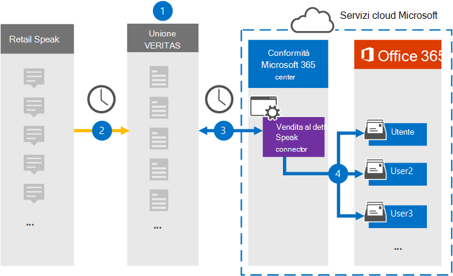

# Configurare un connettore per archiviare i dati di Redtail SpeakSet up a connector to archive Redtail Speak data

Usare un connettore Globanet nel Centro conformità Microsoft 365 per importare e archiviare i dati da Redtail Speak alle cassette postali degli utenti nell'organizzazione di Microsoft 365.Use a Globanet connector in the Microsoft 365 compliance center to import and archive data from the Redtail Speak to user mailboxes in your Microsoft 365 organization. Globanet fornisce un [connettore Redtail Speak](https://globanet.com/redtail/) configurato per acquisire elementi dal server SFTP dell'organizzazione da cui gli elementi vengono ricevuti da Redtail.Globanet provides you with a [Redtail Speak](https://globanet.com/redtail/) connector that's configured to capture items from your organization’s SFTP server where the items are received from Redtail. Il connettore converte il contenuto da Redtail Speak in un formato di messaggio di posta elettronica e quindi importa tali elementi nella cassetta postale dell'utente in Microsoft 365.The connector converts the content from Redtail Speak to an email message format and then imports those items to the user's mailbox in Microsoft 365.

Dopo aver archiviato i dati di Redtail Speak nelle cassette postali degli utenti, è possibile applicare le funzionalità di conformità di Microsoft 365, ad esempio conservazione per controversia legale, eDiscovery, criteri di conservazione ed etichette di conservazione.After Redtail Speak data is stored in user mailboxes, you can apply Microsoft 365 compliance features such as Litigation Hold, eDiscovery, retention policies, and retention labels. L'uso di un connettore Redtail Speak per importare e archiviare i dati in Microsoft 365 può aiutare l'organizzazione a rimanere conforme ai criteri normativi e governativi.Using a Redtail Speak connector to import and archive data in Microsoft 365 can help your organization stay compliant with government and regulatory policies.

## Panoramica dell'archiviazione dei dati di Redtail SpeakOverview of archiving the Redtail Speak data

La seguente panoramica spiega il processo di utilizzo di un connettore per archiviare i dati di Redtail Speak in Microsoft 365.The following overview explains the process of using a connector to archive the Redtail Speak data in Microsoft 365.

1. L'organizzazione collabora con Redtail Speak per configurare e configurare un gateway SMTP in cui i messaggi vengono inoltrati da Redtail Speak al server SFTP dell'organizzazione su base giornaliera.Your organization works with Redtail Speak to set up and configure an SMTP gateway where messages are forwarded from Redtail Speak to your organization's SFTP server on a daily basis.

2. Una volta ogni 24 ore, gli elementi redtail Speak vengono copiati nel sito Globanet Merge1.Once every 24 hours, the Redtail Speak items are copied to the Globanet Merge1 site. Il connettore converte inoltre gli elementi redtail Speak in un formato di messaggio di posta elettronica.The connector also converts the Redtail Speak items to an email message format.

3. Il connettore Redtail Speak creato nel Centro conformità Microsoft 365 si connette ogni giorno al sito Globanet Merge1 e trasferisce i messaggi in una posizione sicura di Archiviazione di Azure nel cloud Microsoft.The Redtail Speak connector that you create in the Microsoft 365 compliance center connects to the Globanet Merge1 site every day and transfers the messages to a secure Azure Storage location in the Microsoft cloud.

4. Il connettore importa gli elementi Redtail Speak convertiti nelle cassette postali di utenti specifici utilizzando il valore della proprietà *Email* del mapping automatico degli utenti, come descritto nel [passaggio 3.](#step-3-map-users-and-complete-the-connector-setup)The connector imports the converted Redtail Speak items to the mailboxes of specific users using the value of the *Email* property of the automatic user mapping as described in [Step 3](#step-3-map-users-and-complete-the-connector-setup). Nelle cassette postali degli utenti viene creata una sottocartella nella cartella Posta in arrivo denominata **Redtail Speak** e gli elementi vengono importati in tale cartella.A subfolder in the Inbox folder named **Redtail Speak** is created in the user mailboxes, and the items are imported to that folder. Il connettore determina in quale cassetta postale importare gli elementi utilizzando il valore della proprietà *Email.*The connector determines which mailbox to import items to by using the value of the *Email* property. Ogni elemento Redtail Speak contiene questa proprietà, che viene popolata con l'indirizzo di posta elettronica di ogni partecipante dell'elemento.Every Redtail Speak item contains this property, which is populated with the email address of every participant of the item.

## Prima di iniziareBefore you begin

- Creare un account Globanet Merge1 per i connettori Microsoft.Create a Globanet Merge1 account for Microsoft connectors. Per creare un account, contattare [il supporto clienti Di Globanet.](https://globanet.com/contact-us/)To create an account, contact [Globanet Customer Support](https://globanet.com/contact-us/). È necessario accedere a questo account quando si crea il connettore nel passaggio 1.You need to sign into this account when you create the connector in Step 1.

- Nel passaggio 2 è necessario specificare il server SFTP dell'organizzazione.In Step 2, you need to specify your organization's SFTP server. Questo passaggio è necessario in modo che Globanet Merge1 possa contattarlo per raccogliere dati Redtail Speak tramite SFTP.This step is necessary so that Globanet Merge1 can contact it to collect Redtail Speak data via SFTP.

- L'utente che crea il connettore di importazione Redtail Speak nel passaggio 1 (e lo completa nel passaggio 3) deve essere assegnato al ruolo di importazione/esportazione delle cassette postali in Exchange Online.The user who creates the Redtail Speak Importer connector in Step 1 (and completes it in Step 3) must be assigned to the Mailbox Import Export role in Exchange Online. Questo ruolo è necessario per aggiungere connettori nella pagina Connettori dati nel Centro conformità Microsoft 365.This role is required to add connectors on the Data connectors page in the Microsoft 365 compliance center. Questo ruolo non è assegnato ad alcun gruppo di ruoli in Exchange Online per impostazione predefinita.This role is not assigned to any role group in Exchange Online by default. È possibile aggiungere il ruolo di importazione/esportazione delle cassette postali al gruppo di ruoli Gestione organizzazione in Exchange Online.You can add the Mailbox Import Export role to the Organization Management role group in Exchange Online. In or you can create a role group, assign the Mailbox Import Export role, and then add the appropriate users as members.Or you can create a role group, assign the Mailbox Import Export role, and then add the appropriate users as members. Per ulteriori informazioni, vedere le sezioni [Creazione](https://docs.microsoft.com/Exchange/permissions-exo/role-groups#create-role-groups) di gruppi di ruoli o Modifica gruppi [di](https://docs.microsoft.com/Exchange/permissions-exo/role-groups#modify-role-groups) ruoli nell'articolo "Gestire i gruppi di ruoli in Exchange Online".For more information, see the [Create role groups](https://docs.microsoft.com/Exchange/permissions-exo/role-groups#create-role-groups) or [Modify role groups](https://docs.microsoft.com/Exchange/permissions-exo/role-groups#modify-role-groups) sections in the article "Manage role groups in Exchange Online".

## Passaggio 1: Configurare il connettore Redtail SpeakStep 1: Set up the Redtail Speak connector

Il primo passaggio consiste  nell'accedere alla pagina Connettori dati nel Centro conformità Microsoft 365 e creare un connettore per i dati Redtail Speak.The first step is to access to the **Data Connectors** page in the Microsoft 365 compliance center and create a connector for the Redtail Speak data.

1. Andare a [https://compliance.microsoft.com](https://compliance.microsoft.com/) e selezionare **Connettori dati** &gt; **Redtail Speak.**Go to [https://compliance.microsoft.com](https://compliance.microsoft.com/) and select **Data connectors** &gt; **Redtail Speak**.

2. Nella pagina **Redtail Speak** product description selezionare **Add new connector.**On the **Redtail Speak** product description page, select **Add new connector**.

3. Nella pagina **Condizioni per il servizio** selezionare **Accetta.**On the **Terms of service** page, select **Accept**.

4. Immettere un nome univoco che identifichi il connettore, quindi selezionare **Avanti.**Enter a unique name that identifies the connector, and then select **Next**.

5. Accedere all'account Merge1 per configurare il connettore.Sign in to your Merge1 account to configure the connector.

## Passaggio 2: Configurare il connettore Redtail Speak nel sito Globanet Merge1Step 2: Configure the Redtail Speak connector on the Globanet Merge1 site

Il secondo passaggio consiste nel configurare il connettore Redtail Speak nel sito Merge1.The second step is to configure the Redtail Speak connector on the Merge1 site. Per informazioni su come configurare il connettore Redtail Speak, vedere il manuale [dell'utente Merge1 Third-Party Connectors.](https://docs.ms.merge1.globanetportal.com/Merge1%20Third-Party%20Connectors%20Redtail%20Speak%20User%20Guide%20.pdf)For information about how to configure the Redtail Speak connector, see [Merge1 Third-Party Connectors User Guide](https://docs.ms.merge1.globanetportal.com/Merge1%20Third-Party%20Connectors%20Redtail%20Speak%20User%20Guide%20.pdf).

Dopo aver selezionato **Salva &,** viene visualizzata la **pagina Mapping** utenti nella procedura guidata del connettore nel Centro conformità Microsoft 365.After you select **Save & Finish**, the **User mapping** page in the connector wizard in the Microsoft 365 compliance center is displayed.

## Passaggio 3: mappare gli utenti e completare la configurazione del connettoreStep 3: Map users and complete the connector setup

Per mappare gli utenti e completare la configurazione del connettore, attenersi alla seguente procedura:To map users and complete the connector setup, follow these steps:

1. Nella pagina **Map Redtail Speak users to Microsoft 365 users** abilitare il mapping automatico degli utenti.On the **Map Redtail Speak users to Microsoft 365 users** page, enable automatic user mapping. Gli elementi Redtail Speak includono una proprietà denominata *Email,* che contiene gli indirizzi di posta elettronica per gli utenti dell'organizzazione.The Redtail Speak items include a property called *Email*, which contains email addresses for users in your organization. Se il connettore può associare questo indirizzo a un utente di Microsoft 365, gli elementi vengono importati nella cassetta postale dell'utente.If the connector can associate this address with a Microsoft 365 user, the items are imported to that user’s mailbox.

2. Selezionare **Avanti,** rivedere le impostazioni e passare alla pagina **Connettori** dati per visualizzare l'avanzamento del processo di importazione per il nuovo connettore.Select **Next**, review your settings, and go to the **Data connectors** page to see the progress of the import process for the new connector.

## Passaggio 4: Monitorare il connettore Redtail SpeakStep 4: Monitor the Redtail Speak connector

Dopo aver creato il connettore Redtail Speak, è possibile visualizzare lo stato del connettore nel Centro conformità Microsoft 365.After you create the Redtail Speak connector, you can view the connector status in the Microsoft 365 compliance center.

1. Andare a [https://compliance.microsoft.com](https://compliance.microsoft.com/) e selezionare **i connettori di dati** nel riquadro di spostamento sinistro.Go to [https://compliance.microsoft.com](https://compliance.microsoft.com/) and select **Data connectors** in the left nav.

2. Selezionare la **scheda Connettori,** quindi selezionare il **connettore Redtail Speak** per visualizzare la pagina a comparsa.Select the **Connectors** tab and then select the **Redtail Speak** connector to display the flyout page. In questa pagina vengono visualizzate le proprietà e le informazioni sul connettore.This page displays properties and information about the connector.

3. In **Stato connettore con origine,** selezionare il **collegamento Scarica registro** per aprire (o salvare) il registro di stato per il connettore.Under **Connector status with source**, select the **Download log** link to open (or save) the status log for the connector. Questo log contiene i dati che sono stati importati nel cloud Microsoft.This log contains data that has been imported to the Microsoft cloud.

## Problemi notiKnown issues

- Al momento, non è possibile importare allegati o elementi di dimensioni superiori a 10 MB.At this time, we don't support importing attachments or items that are larger than 10 MB. Il supporto per gli elementi più grandi sarà disponibile in un secondo momento.Support for larger items will be available at a later date.
