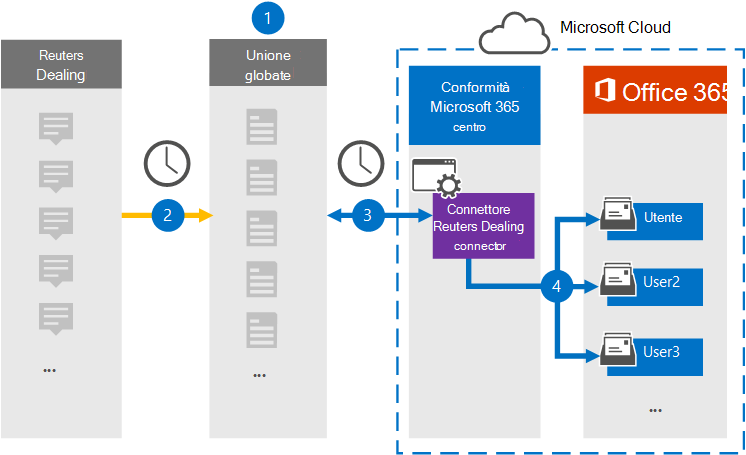

# Configurare un connettore per l'archiviazione dei dati relativi a Reuters DealingSet up a connector to archive Reuters Dealing data

Utilizzare un connettore di Globanet nel centro conformità di Microsoft 365 per importare e archiviare i dati dalla piattaforma di gestione Reuters alle cassette postali degli utenti nell'organizzazione Microsoft 365.Use a Globanet connector in the Microsoft 365 compliance center to import and archive data from the Reuters Dealing platform to user mailboxes in your Microsoft 365 organization. Globanet fornisce un connettore [Reuters Dealing](https://globanet.com/reuters-dealing/) configurato per acquisire elementi dall'origine dati di terze parti (su base regolare) e quindi importare tali elementi in Microsoft 365.Globanet provides you with a [Reuters Dealing](https://globanet.com/reuters-dealing/) connector that's configured to capture items from the third-party data source (on a regular basis) and then import those items to Microsoft 365. Il connettore converte la gestione delle comunicazioni dall'account Reuters dealing a un formato di messaggio di posta elettronica e quindi importa tali elementi nella cassetta postale dell'utente in Microsoft 365.The connector converts Dealing communications from the Reuters Dealing account to an email message format and then imports those items to the user's mailbox in Microsoft 365.

Dopo che la Reuters Dealing data viene memorizzata nelle cassette postali degli utenti, è possibile applicare le funzionalità di conformità di Microsoft 365 come la conservazione per controversia legale, eDiscovery, i criteri di conservazione e le etichette e la conformità della comunicazioneAfter Reuters Dealing data is stored in user mailboxes, you can apply Microsoft 365 compliance features such as Litigation Hold, eDiscovery, retention policies and retention labels, and communication compliance. L'utilizzo di un connettore Reuters dealing per l'importazione e l'archiviazione dei dati in Microsoft 365 può aiutare l'organizzazione a rimanere conforme ai criteri governativi e normativi.Using a Reuters Dealing connector to import and archive data in Microsoft 365 can help your organization stay compliant with government and regulatory policies.

## Panoramica dell'archiviazione dei dati per la distribuzione di ReutersOverview of archiving Reuters Dealing data

Nella panoramica seguente viene illustrato il processo di utilizzo di un connettore per archiviare i dati di Reuters dealing in Microsoft 365.The following overview explains the process of using a connector to archive the Reuters Dealing data in Microsoft 365.

1. L'organizzazione lavora con Reuters Dealing to set up and Configure a Reuters Dealing site.Your organization works with Reuters Dealing to set up and configure a Reuters Dealing site.

2. Una volta ogni 24 ore, la Reuters Dealing Items viene copiata nel sito Merge1 di Globanet.Once every 24 hours, Reuters Dealing items are copied to the Globanet Merge1 site. Il connettore converte anche gli elementi in un formato di messaggio di posta elettronica.The connector also converts the items to an email message format.

3. Il connettore Reuters Dealing creato nel centro conformità Microsoft 365 si connette al sito di Globanet Merge1 ogni giorno e trasferisce il contenuto in una posizione di archiviazione sicura di Azure nel cloud Microsoft.The Reuters Dealing connector that you create in the Microsoft 365 compliance center connects to the Globanet Merge1 site every day and transfers the content to a secure Azure Storage location in the Microsoft cloud.

4. Il connettore consente di importare gli elementi nelle cassette postali di utenti specifici utilizzando il valore della proprietà di *posta elettronica* del mapping automatico degli utenti, come descritto nel [passaggio 3](#step-3-map-users-and-complete-the-connector-setup).The connector imports items to the mailboxes of specific users by using the value of the *Email* property of the automatic user mapping as described in [Step 3](#step-3-map-users-and-complete-the-connector-setup). Una sottocartella della cartella posta in arrivo denominata **Reuters Dealing** viene creata nelle cassette postali degli utenti e gli elementi vengono importati in tale cartella.A subfolder in the Inbox folder named **Reuters Dealing** is created in the user mailboxes, and the items are imported to that folder. Il connettore determina la cassetta postale a cui importare gli elementi utilizzando il valore della proprietà di *posta elettronica* .The connector determines which mailbox to import items to by using the value of the *Email* property. Ogni elemento di gestione Reuters contiene questa proprietà, che viene popolata con l'indirizzo di posta elettronica di tutti i partecipanti all'elemento.Every Reuters Dealing item contains this property, which is populated with the email address of every participant of the item.

## Informazioni preliminariBefore you begin

- Creare un account Merge1 di Globanet per i connettori Microsoft.Create a Globanet Merge1 account for Microsoft connectors. Per creare un account, contattare il [supporto clienti di Globanet](https://globanet.com/contact-us).To create an account, contact [Globanet Customer Support](https://globanet.com/contact-us). È necessario accedere a questo account quando si crea il connettore nel passaggio 1.You need to sign into this account when you create the connector in Step 1.

- L'utente che crea il connettore Reuters dealing nel passaggio 1 (e lo completa nel passaggio 3) deve essere assegnato al ruolo di importazione/esportazione delle cassette postali in Exchange Online.The user who creates the Reuters Dealing connector in Step 1 (and completes it in Step 3) must be assigned to the Mailbox Import Export role in Exchange Online. Questo ruolo è necessario per aggiungere connettori nella pagina **dei connettori dati** nel centro conformità di Microsoft 365.This role is required to add connectors on the **Data connectors** page in the Microsoft 365 compliance center. Per impostazione predefinita, questo ruolo non è assegnato a nessun gruppo di ruoli in Exchange Online.By default, this role is not assigned to any role group in Exchange Online. È possibile aggiungere il ruolo import export delle cassette postali al gruppo di ruoli Gestione organizzazione in Exchange Online.You can add the Mailbox Import Export role to the Organization Management role group in Exchange Online. In alternativa, è possibile creare un gruppo di ruoli, assegnare il ruolo di esportazione delle cassette postali e quindi aggiungere gli utenti corretti come membri.Or you can create a role group, assign the Mailbox Import Export role, and then add the appropriate users as members. Per ulteriori informazioni, vedere la sezione creare gruppi di [ruoli](https://docs.microsoft.com/Exchange/permissions-exo/role-groups#create-role-groups) o [modificare gruppi di ruoli](https://docs.microsoft.com/Exchange/permissions-exo/role-groups#modify-role-groups) nell'articolo "gestire i gruppi di ruoli in Exchange Online".For more information, see the [Create role groups](https://docs.microsoft.com/Exchange/permissions-exo/role-groups#create-role-groups) or [Modify role groups](https://docs.microsoft.com/Exchange/permissions-exo/role-groups#modify-role-groups) sections in the article “Manage role groups in Exchange Online”.

## Passaggio 1: configurare il connettore Reuters DealingStep 1: Set up the Reuters Dealing connector

Il primo passaggio consiste nell'accedere alla pagina **dei connettori dati** in Microsoft 365 e creare un connettore per la distribuzione di dati di Reuters.The first step is to access to the **Data Connectors** page in the Microsoft 365 and create a connector for Reuters Dealing data.

1. Andare a [https://compliance.microsoft.com](https://compliance.microsoft.com/) e quindi fare clic su **connettori dati**  >  **Reuters Dealing**.Go to [https://compliance.microsoft.com](https://compliance.microsoft.com/) and then click **Data connectors** > **Reuters Dealing**.

2. Nella pagina **Reuters Dealing** Product Description fare clic su **Aggiungi connettore**.On the **Reuters Dealing** product description page, click **Add connector**.

3. Nella pagina **condizioni del servizio** fare clic su **Accetto**.On the **Terms of service** page, click **Accept**.

4. Immettere un nome univoco che identifichi il connettore e quindi fare clic su **Avanti**.Enter a unique name that identifies the connector, and then click **Next**.

5. Accedere al proprio account di Merge1 per configurare il connettore.Sign to your Merge1 account to configure the connector.

## Passaggio 2: configurare il connettore Reuters Dealing sul sito di Merge1 di GlobanetStep 2: Configure the Reuters Dealing connector on the Globanet Merge1 site

Il secondo passaggio consiste nel configurare il connettore Reuters Dealing su Globanet nel sito Merge1.The second step is to configure the Reuters Dealing connector on Globanet the Merge1 site. Per informazioni sulla configurazione del connettore Reuters Dealing, vedere [Merge1 Third-Party Connectors user guide](https://docs.ms.merge1.globanetportal.com/Merge1%20Third-Party%20Connectors%20Reuters%20Dealing%20User%20Guide%20.pdf).For information about configuring the Reuters Dealing connector, see [Merge1 Third-Party Connectors User Guide](https://docs.ms.merge1.globanetportal.com/Merge1%20Third-Party%20Connectors%20Reuters%20Dealing%20User%20Guide%20.pdf).

Dopo aver fatto clic su **salva & fine**, viene visualizzata la pagina di **mapping degli utenti** nella procedura guidata del connettore nel centro conformità di Microsoft 365.After you click **Save & Finish**, the **User mapping** page in the connector wizard in the Microsoft 365 compliance center is displayed.

## Passaggio 3: mappare gli utenti e completare la configurazione del connettoreStep 3: Map users and complete the connector setup

Per eseguire il mapping degli utenti e completare la configurazione del connettore nel centro conformità di Microsoft 365, eseguire la procedura seguente:To map users and complete the connector setup in the Microsoft 365 compliance center, follow these steps:

1. Nella pagina **mappa Reuters Dealing users to Microsoft 365** Users, abilitare il mapping automatico degli utenti.On the **Map Reuters Dealing users to Microsoft 365 users** page, enable automatic user mapping.

   Gli elementi che si occupano di Reuters includono una proprietà denominata *posta elettronica*, che contiene gli indirizzi di posta elettronica per gli utenti dell'organizzazione.Reuters Dealing items include a property called *Email*, which contains email addresses for users in your organization. Se il connettore può associare questo indirizzo a un utente di Microsoft 365, gli elementi vengono importati nella cassetta postale dell'utente.If the connector can associate this address with a Microsoft 365 user, the items are imported to that user’s mailbox.

2. Fare clic su **Avanti**, rivedere le impostazioni e passare alla pagina **connettori dati** per visualizzare lo stato di avanzamento del processo di importazione per il nuovo connettore.Click **Next**, review your settings, and go to the **Data connectors** page to see the progress of the import process for the new connector.

## Passaggio 4: monitorare il connettore Reuters DealingStep 4: Monitor the Reuters Dealing connector

Dopo aver creato il connettore Reuters Dealing, è possibile visualizzare lo stato del connettore nel centro conformità di Microsoft 365.After you create the Reuters Dealing connector, you can view the connector status in the Microsoft 365 compliance center.

1. Andare a [https://compliance.microsoft.com](https://compliance.microsoft.com/) e fare clic su **connettori dati** nel NAV sinistro.Go to [https://compliance.microsoft.com](https://compliance.microsoft.com/) and click **Data connectors** in the left nav.

2. Fare clic sulla scheda **connettori** e quindi selezionare il connettore **Reuters Dealing** per visualizzare la pagina del riquadro a comparsa, che contiene le proprietà e le informazioni sul connettore.Click the **Connectors** tab and then select the **Reuters Dealing** connector to display the flyout page, which contains the properties and information about the connector.

3. In **stato connettore con origine** fare clic sul collegamento **Scarica log** per aprire o salvare il registro di stato del connettore.Under **Connector status with source**, click the **Download log** link to open (or save) the status log for the connector. Questo log contiene dati che sono stati importati nel cloud Microsoft.This log contains data that has been imported to the Microsoft cloud.

## Problemi notiKnown issues

- Al momento, non è supportato l'importazione di allegati o elementi di dimensioni superiori a 10 MB.At this time, we don't support importing attachments or items that are larger than 10 MB. Il supporto per gli elementi di grandi dimensioni sarà disponibile in un secondo momento.Support for larger items will be available at a later date.
