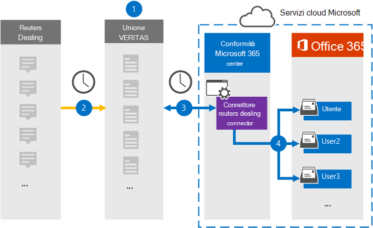

# Configurare un connettore per archiviare i dati di Reuters Dealing

Utilizzare un connettore Veritas nel Centro conformità Microsoft 365 per importare e archiviare i dati dalla piattaforma Reuters Dealing alle cassette postali degli utenti nell'organizzazione di Microsoft 365. Veritas fornisce un connettore [Reuters Dealing](https://globanet.com/reuters-dealing/) configurato per acquisire elementi dall'origine dati di terze parti (a intervalli regolari) e quindi importare tali elementi in Microsoft 365. Il connettore converte le comunicazioni di gestione dall'account Reuters Dealing in un formato di messaggio di posta elettronica e quindi importa tali elementi nella cassetta postale dell'utente in Microsoft 365.

Dopo l'archiviazione dei dati di Reuters Dealing nelle cassette postali degli utenti, è possibile applicare le funzionalità di conformità di Microsoft 365, ad esempio conservazione per controversia legale, eDiscovery, criteri di conservazione ed etichette di conservazione e conformità delle comunicazioni. L'utilizzo di un connettore reuters dealing per importare e archiviare i dati in Microsoft 365 può aiutare l'organizzazione a rimanere conforme ai criteri normativi e governativi.

## Panoramica dell'archiviazione dei dati reuters

Nella panoramica seguente viene illustrato il processo di utilizzo di un connettore per archiviare i dati reuters dealing in Microsoft 365.

1. L'organizzazione collabora con Reuters Dealing per configurare un sito reuters Dealing.

2. Una volta ogni 24 ore, gli elementi reuters dealing vengono copiati nel sito Veritas Merge1. Il connettore converte inoltre gli elementi in un formato di messaggio di posta elettronica.

3. Il connettore Reuters Dealing creato nel Centro conformità Microsoft 365 si connette ogni giorno al sito Veritas Merge1 e trasferisce il contenuto in una posizione sicura di Archiviazione di Azure nel cloud Microsoft.

4. Il connettore importa gli elementi nelle cassette postali di utenti specifici utilizzando il valore della proprietà *Email* del mapping automatico degli utenti, come descritto [nel passaggio 3.](#step-3-map-users-and-complete-the-connector-setup) Nelle cassette postali degli utenti viene creata una sottocartella nella cartella Posta in arrivo denominata **Reuters Dealing** e gli elementi vengono importati in tale cartella. Il connettore determina in quale cassetta postale importare gli elementi utilizzando il valore della *proprietà Email.* Ogni elemento Reuters Dealing contiene questa proprietà, che viene popolata con l'indirizzo di posta elettronica di ogni partecipante dell'elemento.

## Prima di iniziare

- Creare un account Veritas Merge1 per i connettori Microsoft. Per creare un account, contattare il [Supporto clienti Veritas.](https://globanet.com/contact-us) È necessario accedere a questo account quando si crea il connettore nel passaggio 1.

- L'utente che crea il connettore reuters dealing nel passaggio 1 (e lo completa nel passaggio 3) deve essere assegnato al ruolo Esportazione importazione cassette postali in Exchange Online. Questo ruolo è necessario per aggiungere connettori nella pagina **Connettori dati** nel Centro conformità Microsoft 365. Per impostazione predefinita, questo ruolo non viene assegnato ad alcun gruppo di ruoli in Exchange Online. È possibile aggiungere il ruolo Esportazione importazione cassette postali al gruppo di ruoli Gestione organizzazione in Exchange Online. In caso contrario, è possibile creare un gruppo di ruoli, assegnare il ruolo Importazione/Esportazione cassette postali e quindi aggiungere gli utenti appropriati come membri. Per ulteriori informazioni, vedere le sezioni [Create role groups](/Exchange/permissions-exo/role-groups#create-role-groups) o Modify role [groups](/Exchange/permissions-exo/role-groups#modify-role-groups) nell'articolo "Manage role groups in Exchange Online".

## Passaggio 1: Configurare il connettore reuters dealing

Il primo passaggio consiste nell'accedere alla pagina **Connettori** dati in Microsoft 365 e creare un connettore per i dati reuters dealing.

1. Passare a [https://compliance.microsoft.com](https://compliance.microsoft.com/) e quindi fare clic su **Connettori dati**  >  **Reuters Dealing**.

2. Nella pagina **Reuters Dealing product** description fare clic su **Add connector.**

3. Nella pagina **Condizioni di servizio** fare clic su **Accetta.**

4. Immettere un nome univoco che identifichi il connettore e quindi fare clic su **Avanti.**

5. Accedere all'account Merge1 per configurare il connettore.

## Passaggio 2: Configurare il connettore reuters dealing nel sito Veritas Merge1

Il secondo passaggio consiste nel configurare il connettore reuters dealing su Veritas nel sito Merge1. Per informazioni sulla configurazione del connettore reuters Dealing, vedere [Merge1 Third-Party Connectors User Guide](https://docs.ms.merge1.globanetportal.com/Merge1%20Third-Party%20Connectors%20Reuters%20Dealing%20User%20Guide%20.pdf).

Dopo aver fatto **clic su Salva & fine,** viene visualizzata la pagina **Mapping** utenti nella procedura guidata del connettore nel Centro conformità Microsoft 365.

## Passaggio 3: mappare gli utenti e completare la configurazione del connettore

Per mappare gli utenti e completare la configurazione del connettore nel Centro conformità Microsoft 365, attenersi alla seguente procedura:

1. Nella pagina **Mapping degli utenti di Reuters agli utenti di Microsoft 365** abilitare il mapping automatico degli utenti.

   Gli elementi reuters includono una proprietà denominata *Email*, che contiene gli indirizzi di posta elettronica per gli utenti dell'organizzazione. Se il connettore può associare questo indirizzo a un utente di Microsoft 365, gli elementi vengono importati nella cassetta postale dell'utente.

2. Fare **clic** su Avanti, rivedere le impostazioni e passare alla pagina **Connettori** dati per visualizzare l'avanzamento del processo di importazione per il nuovo connettore.

## Passaggio 4: Monitorare il connettore reuters dealing

Dopo aver creato il connettore Reuters Dealing, è possibile visualizzare lo stato del connettore nel Centro conformità Microsoft 365.

1. Vai a [https://compliance.microsoft.com](https://compliance.microsoft.com/) e fai clic su **Connettori dati** nel riquadro di spostamento sinistro.

2. Fare clic **sulla scheda Connettori** e quindi selezionare il connettore **reuters dealing** per visualizzare la pagina a comparsa, che contiene le proprietà e le informazioni sul connettore.

3. In **Stato connettore con origine** fare clic sul collegamento Scarica **registro** per aprire (o salvare) il registro di stato per il connettore. Questo registro contiene i dati importati nel cloud Microsoft.

## Problemi noti

- Al momento non è possibile importare allegati o elementi di dimensioni superiori a 10 MB. Il supporto per gli elementi più grandi sarà disponibile in un secondo momento.