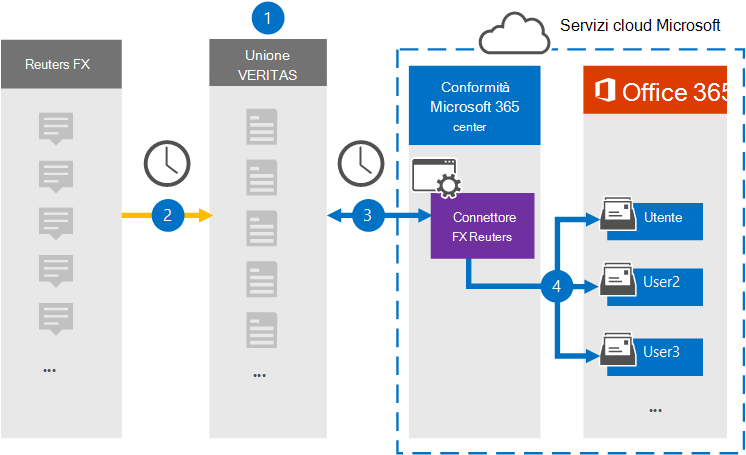

# Configurare un connettore per archiviare i dati FX di Reuters

Usare un connettore Globanet nel Centro conformità Microsoft 365 per importare e archiviare i dati dalla piattaforma Reuters FX alle cassette postali degli utenti nell'organizzazione di Microsoft 365. Globanet fornisce un connettore [FX Reuters](https://globanet.com/reuters-fx/) configurato per acquisire elementi dall'origine dati di terze parti (su base regolare) e quindi importare tali elementi in Microsoft 365. Il connettore converte le valute e i tassi di cambio dall'account Reuters FX in un formato di messaggio di posta elettronica e quindi importa tali elementi nella cassetta postale dell'utente in Microsoft 365.

Dopo aver archiviato i dati FX di Reuters nelle cassette postali degli utenti, è possibile applicare le funzionalità di conformità di Microsoft 365, ad esempio conservazione per controversia legale, eDiscovery, criteri di conservazione ed etichette di conservazione e conformità delle comunicazioni. L'uso di un connettore FX Reuters per importare e archiviare i dati in Microsoft 365 può aiutare l'organizzazione a rimanere conforme ai criteri normativi e governativi.

## Panoramica dell'archiviazione dei dati FX di Reuters

La seguente panoramica spiega il processo di utilizzo di un connettore per archiviare i dati FX di Reuters in Microsoft 365.

1. L'organizzazione collabora con Reuters FX per configurare un sito Reuters FX.

2. Una volta ogni 24 ore, gli elementi FX di Reuters vengono copiati nel sito Globanet Merge1. Il connettore converte inoltre gli elementi in un formato di messaggio di posta elettronica.

3. Il connettore Reuters FX creato nel Centro conformità Microsoft 365, si connette al sito Globanet Merge1 ogni giorno e trasferisce il contenuto in una posizione sicura di Archiviazione di Azure nel cloud Microsoft.

4. Il connettore importa gli elementi nelle cassette postali di utenti specifici utilizzando il valore della proprietà *Email* del mapping automatico degli utenti, come descritto [nel passaggio 3.](#step-3-map-users-and-complete-the-connector-setup) Nelle cassette postali degli utenti viene creata una sottocartella nella cartella Posta in arrivo denominata **Reuters FX** e gli elementi vengono importati in tale cartella. Il connettore determina in quale cassetta postale importare gli elementi utilizzando il valore della proprietà *Email.* Ogni elemento FX di Reuters contiene questa proprietà, che viene popolata con l'indirizzo di posta elettronica di ogni partecipante dell'elemento.

## Prima di iniziare

- Creare un account Globanet Merge1 per i connettori Microsoft. Per creare un account, contattare [il supporto clienti Di Globanet.](https://globanet.com/contact-us) È necessario accedere a questo account quando si crea il connettore nel passaggio 1.

- L'utente che crea il connettore Reuters FX nel passaggio 1 (e lo completa nel passaggio 3) deve essere assegnato al ruolo di importazione/esportazione delle cassette postali in Exchange Online. Questo ruolo è necessario per aggiungere connettori nella pagina **Connettori** dati nel Centro conformità Microsoft 365. Per impostazione predefinita, questo ruolo non è assegnato ad alcun gruppo di ruoli in Exchange Online. È possibile aggiungere il ruolo di importazione/esportazione delle cassette postali al gruppo di ruoli Gestione organizzazione in Exchange Online. In or you can create a role group, assign the Mailbox Import Export role, and then add the appropriate users as members. Per ulteriori informazioni, vedere le sezioni [Creazione](https://docs.microsoft.com/Exchange/permissions-exo/role-groups#create-role-groups) di gruppi di ruoli o Modifica gruppi [di](https://docs.microsoft.com/Exchange/permissions-exo/role-groups#modify-role-groups) ruoli nell'articolo "Gestire i gruppi di ruoli in Exchange Online".

## Passaggio 1: Configurare il connettore Fx reuters

Il primo passaggio consiste nell'accedere alla pagina **Connettori** dati in Microsoft 365 e creare un connettore per i dati FX di Reuters.

1. Passare a [https://compliance.microsoft.com](https://compliance.microsoft.com/) e quindi fare clic su **Connettori dati**  >  **Reuters FX.**

2. Nella pagina **di descrizione del prodotto Reuters FX,** fare clic **su Aggiungi connettore.**

3. Nella pagina **Condizioni per il servizio** fare clic su **Accetta.**

4. Immettere un nome univoco che identifichi il connettore, quindi fare clic su **Avanti.**

5. Accedere all'account Merge1 per configurare il connettore.

## Passaggio 2: Configurare il connettore Reuters FX nel sito Globanet Merge1

Il secondo passaggio consiste nel configurare il connettore Reuters FX nel sito Globanet Merge1. Per informazioni sulla configurazione del connettore Reuters FX, vedere la Guida dell'utente [Merge1 Third-Party Connectors.](https://docs.ms.merge1.globanetportal.com/Merge1%20Third-Party%20Connectors%20Reuters%20FX%20User%20Guide%20.pdf)

Dopo aver fatto **clic su & fine,** viene visualizzata la pagina **Mapping** utenti nella procedura guidata del connettore nel Centro conformità Microsoft 365.

## Passaggio 3: mappare gli utenti e completare la configurazione del connettore

Per mappare gli utenti e completare la configurazione del connettore nel Centro conformità Microsoft 365, seguire la procedura seguente:

1. Nella pagina Mapping utenti FX di Reuters agli utenti di **Microsoft 365** abilitare il mapping automatico degli utenti.

   Gli elementi FX di Reuters includono una proprietà denominata *Email,* che contiene gli indirizzi di posta elettronica per gli utenti dell'organizzazione. Se il connettore può associare questo indirizzo a un utente di Microsoft 365, gli elementi vengono importati nella cassetta postale dell'utente.

2. Fare **clic** su Avanti, rivedere le impostazioni e passare alla pagina **Connettori** dati per visualizzare l'avanzamento del processo di importazione per il nuovo connettore.

## Passaggio 4: monitorare il connettore FX reuters

Dopo aver creato il connettore Reuters FX, è possibile visualizzare lo stato del connettore nel Centro conformità Microsoft 365.

1. Andare a <https://compliance.microsoft.com/> e fare clic su **Connettori dati** nel riquadro di spostamento sinistro.

2. Fare clic **sulla scheda Connettori** e quindi selezionare il connettore **Reuters FX** per visualizzare la pagina a comparsa, che contiene le proprietà e le informazioni sul connettore.

3. In **Stato connettore con origine** fare clic sul collegamento Scarica **registro** per aprire (o salvare) il registro di stato per il connettore. Questo log contiene i dati che sono stati importati nel cloud Microsoft.

## Problemi noti

- Al momento, non è possibile importare allegati o elementi di dimensioni superiori a 10 MB. Il supporto per gli elementi più grandi sarà disponibile in un secondo momento.
