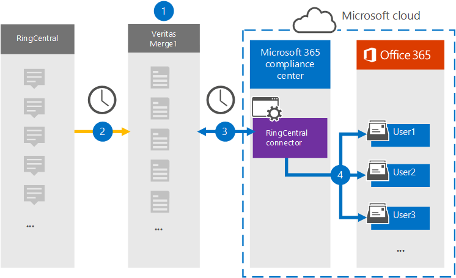

# Configurare un connettore per archiviare i dati ringcentralSet up a connector to archive RingCentral data

Utilizzare un connettore Veritas nel Centro conformità Microsoft 365 per importare e archiviare i dati dalla piattaforma RingCentral alle cassette postali degli utenti nell'Microsoft 365 organizzativa.Use a Veritas connector in the Microsoft 365 compliance center to import and archive data from the RingCentral platform to user mailboxes in your Microsoft 365 organization. Veritas fornisce un [connettore RingCentral](https://www.veritas.com/insights/merge1/ringcentral) configurato per acquisire elementi dall'origine dati di terze parti e importare tali elementi in Microsoft 365.Veritas provides a [RingCentral](https://www.veritas.com/insights/merge1/ringcentral) connector that is configured to capture items from the third-party data source and import those items to Microsoft 365. Il connettore converte contenuto come chat, allegati, attività, note e post da RingCentral in un formato di messaggio di posta elettronica e quindi importa tali elementi nelle cassette postali degli utenti in Microsoft 365.The connector converts content such as chats, attachments, tasks, notes, and posts from RingCentral to an email message format and then imports those items to the user mailboxes in Microsoft 365.

Dopo l'archiviazione dei dati di RingCentral nelle cassette postali degli utenti, è possibile applicare Microsoft 365 di conformità, ad esempio conservazione per controversia legale, eDiscovery, criteri di conservazione ed etichette di conservazione.After RingCentral data is stored in user mailboxes, you can apply Microsoft 365 compliance features such as Litigation Hold, eDiscovery, retention policies and retention labels. L'utilizzo di un connettore RingCentral per importare e archiviare i dati in Microsoft 365 può aiutare l'organizzazione a rimanere conforme ai criteri governativi e normativi.Using a RingCentral connector to import and archive data in Microsoft 365 can help your organization stay compliant with government and regulatory policies.

## Panoramica dell'archiviazione dei dati RingCentralOverview of archiving RingCentral data

Nella panoramica seguente viene illustrato il processo di utilizzo di un connettore per archiviare i dati ringcentral in Microsoft 365.The following overview explains the process of using a connector to archive the RingCentral data in Microsoft 365.

1. L'organizzazione collabora con RingCentral per configurare un sito RingCentral.Your organization works with RingCentral to set up and configure a RingCentral site.

2. Una volta ogni 24 ore, gli elementi RingCentral vengono copiati nel sito Veritas Merge1.Once every 24 hours, RingCentral items are copied to the Veritas Merge1 site. Il connettore converte anche gli elementi RingCentral in un formato di messaggio di posta elettronica.The connector also converts RingCentral items to an email message format.

3. Il connettore RingCentral creato nel Centro conformità Microsoft 365, si connette al sito Veritas Merge1 ogni giorno e trasferisce il contenuto ringcentral in una posizione Archiviazione di Azure sicura nel cloud Microsoft.The RingCentral connector that you create in the Microsoft 365 compliance center, connects to the Veritas Merge1 site every day, and transfers the RingCentral content to a secure Azure Storage location in the Microsoft cloud.

4. Il connettore importa gli elementi convertiti nelle cassette postali di utenti specifici utilizzando il valore della proprietà *Email* del mapping automatico degli utenti, come descritto nel [passaggio 3.](#step-3-map-users-and-complete-the-connector-setup)The connector imports the converted items to the mailboxes of specific users using the value of the *Email* property of the automatic user mapping as described in [Step 3](#step-3-map-users-and-complete-the-connector-setup). Nelle cassette postali degli utenti viene creata una sottocartella nella cartella Posta in arrivo denominata **RingCentral** e gli elementi vengono importati in tale cartella.A subfolder in the Inbox folder named **RingCentral** is created in the user mailboxes, and items are imported to that folder. Il connettore determina in quale cassetta postale importare gli elementi utilizzando il valore della *proprietà Email.*The connector determines which mailbox to import items to by using the value of the *Email* property. Ogni elemento RingCentral contiene questa proprietà, che viene popolata con l'indirizzo di posta elettronica di ogni partecipante dell'elemento.Every RingCentral item contains this property, which is populated with the email address of every participant of the item.

## Prima di configurare un connettoreBefore you set up a connector

- Creare un account Merge1 per i connettori Microsoft.Create a Merge1 account for Microsoft connectors. Per creare questo account, contattare il [supporto tecnico Veritas.](https://www.veritas.com/form/requestacall/ms-connectors-contact)To create this account, contact [Veritas Customer Support](https://www.veritas.com/form/requestacall/ms-connectors-contact). È necessario accedere a questo account quando si crea il connettore nel passaggio 1.You need to sign into this account when you create the connector in Step 1.

- Crea un'applicazione RingCentral per recuperare i dati dal tuo account RingCentral.Create a RingCentral application to fetch data from your RingCentral account. Per istruzioni dettagliate sulla creazione dell'applicazione, vedere [Merge1 Third-Party Connectors User Guide](https://docs.ms.merge1.globanetportal.com/Merge1%20Third-Party%20Connectors%20RingCentral%20User%20Guide.pdf).For step-by step instructions about creating the application, see [Merge1 Third-Party Connectors User Guide](https://docs.ms.merge1.globanetportal.com/Merge1%20Third-Party%20Connectors%20RingCentral%20User%20Guide.pdf).

- L'utente che crea il connettore RingCentral nel passaggio 1 (e lo completa nel passaggio 3) deve essere assegnato al ruolo Esportazione importazione cassette postali in Exchange Online.The user who creates the RingCentral connector in Step 1 (and completes it in Step 3) must be assigned to the Mailbox Import Export role in Exchange Online. Questo ruolo è necessario per aggiungere connettori nella pagina **Connettori** dati nell'Centro conformità Microsoft 365.This role is required to add connectors on the **Data connectors** page in the Microsoft 365 compliance center. Per impostazione predefinita, questo ruolo non viene assegnato ad alcun gruppo di ruoli in Exchange Online.By default, this role is not assigned to any role group in Exchange Online. È possibile aggiungere il ruolo Esportazione importazione cassette postali al gruppo di ruoli Gestione organizzazione in Exchange Online.You can add the Mailbox Import Export role to the Organization Management role group in Exchange Online. In caso contrario, è possibile creare un gruppo di ruoli, assegnare il ruolo Importazione/Esportazione cassette postali e quindi aggiungere gli utenti appropriati come membri.Or you can create a role group, assign the Mailbox Import Export role, and then add the appropriate users as members. Per ulteriori informazioni, vedere le sezioni [Create role groups](/Exchange/permissions-exo/role-groups#create-role-groups) o Modify role [groups](/Exchange/permissions-exo/role-groups#modify-role-groups) nell'articolo "Manage role groups in Exchange Online".For more information, see the [Create role groups](/Exchange/permissions-exo/role-groups#create-role-groups) or [Modify role groups](/Exchange/permissions-exo/role-groups#modify-role-groups) sections in the article "Manage role groups in Exchange Online".

## Passaggio 1: Configurare il connettore RingCentralStep 1: Set up the RingCentral connector

Il primo passaggio consiste nell'accedere alla pagina **Connettori** dati nell'Centro conformità Microsoft 365 e creare un connettore per i dati RingCentral.The first step is to access to the **Data Connectors** page in the Microsoft 365 compliance center and create a connector for RingCentral data.

1. Passare a <https://compliance.microsoft.com> e quindi fare clic su **Connettori dati**  >  **RingCentral**.Go to <https://compliance.microsoft.com> and then click **Data connectors** > **RingCentral**.

2. Nella pagina **Descrizione prodotto RingCentral** fare clic su **Aggiungi connettore.**On the **RingCentral** product description page, click **Add connector**.

3. Nella pagina **Condizioni di servizio** fare clic su **Accetta.**On the **Terms of service** page, click **Accept**.

4. Immettere un nome univoco che identifichi il connettore e quindi fare clic su **Avanti.**Enter a unique name that identifies the connector, and then click **Next**.

5. Accedere all'account Merge1 per configurare il connettore.Sign in to your Merge1 account to configure the connector.

## Passaggio 2: Configurare RingCentral nel sito Veritas Merge1Step 2: Configure the RingCentral on the Veritas Merge1 site

Il secondo passaggio consiste nel configurare il connettore RingCentral nel sito Veritas Merge1.The second step is to configure the RingCentral connector on the Veritas Merge1 site. Per informazioni su come configurare il connettore RingCentral, vedere [Merge1 Third-Party Connectors User Guide](https://docs.ms.merge1.globanetportal.com/Merge1%20Third-Party%20Connectors%20RingCentral%20User%20Guide.pdf).For information about how to configure the RingCentral connector, see [Merge1 Third-Party Connectors User Guide](https://docs.ms.merge1.globanetportal.com/Merge1%20Third-Party%20Connectors%20RingCentral%20User%20Guide.pdf).

Dopo aver fatto **clic su Salva & fine,** verrà visualizzata la pagina **Mapping** utenti nella procedura guidata del connettore Centro conformità Microsoft 365 visualizzata.After you click **Save & Finish,** the **User mapping** page in the connector wizard in the Microsoft 365 compliance center is displayed.

## Passaggio 3: mappare gli utenti e completare la configurazione del connettoreStep 3: Map users and complete the connector setup

Per mappare gli utenti e completare la configurazione del connettore Centro conformità Microsoft 365, attenersi alla seguente procedura:To map users and complete the connector setup in the Microsoft 365 compliance center, follow these steps:

1. Nella pagina **Mappa utenti ringcentrali** Microsoft 365 utenti, abilitare il mapping automatico degli utenti.On the **Map RingCentral users to Microsoft 365 users** page, enable automatic user mapping. Gli elementi RingCentral includono una proprietà denominata *Email*, che contiene gli indirizzi di posta elettronica per gli utenti dell'organizzazione.The RingCentral items include a property called *Email*, which contains email addresses for users in your organization. Se il connettore può associare questo indirizzo a un Microsoft 365 utente, gli elementi vengono importati nella cassetta postale dell'utente.If the connector can associate this address with a Microsoft 365 user, the items are imported to that user’s mailbox.

2. Fare **clic** su Avanti, rivedere le impostazioni e quindi passare alla pagina **Connettori** dati per visualizzare l'avanzamento del processo di importazione per il nuovo connettore.Click **Next**, review your settings, and then go to the **Data connectors** page to see the progress of the import process for the new connector.

## Passaggio 4: Monitorare il connettore RingCentralStep 4: Monitor the RingCentral connector

Dopo aver creato il connettore RingCentral, è possibile visualizzare lo stato del connettore nella Centro conformità Microsoft 365.After you create the RingCentral connector, you can view the connector status in the Microsoft 365 compliance center.

1. Vai a <https://compliance.microsoft.com/> e fai clic su **Connettori dati** nel riquadro di spostamento sinistro.Go to <https://compliance.microsoft.com/> and click **Data connectors** in the left nav.

2. Fare clic **sulla scheda Connettori** e quindi selezionare il **connettore RingCentral** per visualizzare la pagina a comparsa, contenente le proprietà e le informazioni sul connettore.Click the **Connectors** tab and then select the **RingCentral** connector to display the flyout page, which contains the properties and information about the connector.

3. In **Stato connettore con origine** fare clic sul collegamento Scarica **registro** per aprire (o salvare) il registro di stato per il connettore.Under **Connector status with source**, click the **Download log** link to open (or save) the status log for the connector. Questo registro contiene i dati importati nel cloud Microsoft.This log contains data that has been imported to the Microsoft cloud.

## Problemi notiKnown issues

- Al momento non è possibile importare allegati o elementi di dimensioni superiori a 10 MB.At this time, we don't support importing attachments or items that are larger than 10 MB. Il supporto per gli elementi più grandi sarà disponibile in un secondo momento.Support for larger items will be available at a later date.
