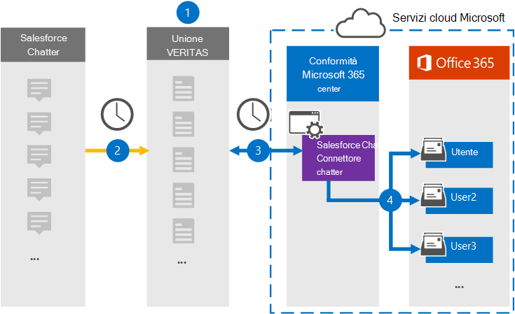

# Configurare un connettore per archiviare i dati di Salesforce Chatter

Utilizzare un connettore Veritas nel Centro conformità Microsoft 365 per importare e archiviare i dati dalla piattaforma Salesforce Chatter alle cassette postali degli utenti nell'organizzazione Microsoft 365 locale. Veritas fornisce un [connettore Salesforce Chatter](http://globanet.com/chatter/) che acquisisce gli elementi dall'origine dati di terze parti e importa tali elementi in Microsoft 365. Il connettore converte il contenuto, ad esempio chat, allegati e post da Salesforce Chatter in un formato di messaggio di posta elettronica e quindi importa tali elementi nella cassetta postale dell'utente in Microsoft 365.

Dopo aver archiviato i dati di Salesforce Chatter nelle cassette postali degli utenti, è possibile applicare Microsoft 365 funzionalità di conformità come conservazione per controversia legale, eDiscovery, criteri di conservazione ed etichette di conservazione. L'utilizzo di un connettore Salesforce Chatter per importare e archiviare i dati in Microsoft 365 può aiutare l'organizzazione a rimanere conforme ai criteri normativi e governativi.

## Panoramica dell'archiviazione dei dati di Salesforce Chatter

Nella panoramica seguente viene illustrato il processo di utilizzo di un connettore per archiviare i dati di Salesforce Chatter in Microsoft 365.

1. L'organizzazione collabora con Salesforce Chatter per configurare un sito Salesforce Chatter.

2. Una volta ogni 24 ore, gli elementi di Salesforce Chatter vengono copiati nel sito Veritas Merge1. Il connettore inoltre salesforce chatter elementi in un formato di messaggio di posta elettronica.

3. Il connettore Salesforce Chatter creato nel Centro conformità Microsoft 365, si connette ogni giorno al sito Veritas Merge1 e trasferisce il contenuto di Chatter in una posizione Archiviazione di Azure sicura nel cloud Microsoft.

4. Il connettore importa gli elementi convertiti nelle cassette postali di utenti specifici utilizzando il valore della proprietà *Email* del mapping automatico degli utenti, come descritto nel [passaggio 3.](#step-3-map-users-and-complete-the-connector-setup) Nelle cassette postali degli utenti viene creata una sottocartella nella cartella Posta in arrivo denominata **Salesforce Chatter** e gli elementi vengono importati in tale cartella. Il connettore determina in quale cassetta postale importare gli elementi utilizzando il valore della *proprietà Email.* Ogni elemento chatter contiene questa proprietà, che viene popolata con l'indirizzo di posta elettronica di ogni partecipante dell'elemento.

## Prima di iniziare

- Creare un account Merge1 per i connettori Microsoft. Per creare un account, contattare il [Supporto clienti Veritas.](https://www.veritas.com/content/support/) È necessario accedere a questo account quando si crea il connettore nel passaggio 1.

- Crea un'applicazione Salesforce e acquisisci un token in [https://salesforce.com](https://salesforce.com) . Dovrai accedere all'account Salesforce come amministratore e ottenere un token personale utente per importare i dati. Inoltre, i trigger devono essere pubblicati nel sito Chatter per acquisire aggiornamenti, eliminazioni e modifiche. Questi trigger creeranno un post su un canale e Merge1 acquisisce le informazioni dal canale. Per istruzioni dettagliate su come creare l'applicazione e acquisire il token, vedere [Merge1 Third-Party Connectors User Guide](https://docs.ms.merge1.globanetportal.com/Merge1%20Third-Party%20Connectors%20SalesForce%20Chatter%20User%20Guide%20.pdf).

- L'utente che crea il connettore Salesforce Chatter nel passaggio 1 (e lo completa nel passaggio 3) deve essere assegnato al ruolo Esportazione importazione cassette postali in Exchange Online. Questo ruolo è necessario per aggiungere connettori nella pagina **Connettori** dati nel Centro Microsoft 365 conformità. Per impostazione predefinita, questo ruolo non viene assegnato ad alcun gruppo di ruoli in Exchange Online. È possibile aggiungere il ruolo Esportazione importazione cassette postali al gruppo di ruoli Gestione organizzazione in Exchange Online. In caso contrario, è possibile creare un gruppo di ruoli, assegnare il ruolo Importazione/Esportazione cassette postali e quindi aggiungere gli utenti appropriati come membri. Per ulteriori informazioni, vedere le sezioni [Create role groups](/Exchange/permissions-exo/role-groups#create-role-groups) o Modify role [groups](/Exchange/permissions-exo/role-groups#modify-role-groups) nell'articolo "Manage role groups in Exchange Online".

## Passaggio 1: Configurare il connettore Salesforce Chatter

Il primo passaggio consiste nell'accedere alla pagina **Connettori** dati nel Centro Microsoft 365 conformità e creare un connettore per i dati di Chatter.

1. Passare a [https://compliance.microsoft.com](https://compliance.microsoft.com/) e quindi fare clic su **Connettori dati**  >  **Salesforce Chatter**.

2. Nella pagina **Descrizione prodotto Salesforce Chatter** fare clic su **Aggiungi connettore.**

3. Nella pagina **Condizioni di servizio** fare clic su **Accetta.**

4. Immettere un nome univoco che identifichi il connettore e quindi fare clic su **Avanti.**

5. Accedere all'account Merge1 per configurare il connettore.

## Passaggio 2: Configurare Salesforce Chatter nel sito Veritas Merge1

Il secondo passaggio consiste nel configurare il connettore Salesforce Chatter nel sito Veritas Merge1. Per informazioni su come configurare il connettore Salesforce Chatter, vedere [Merge1 Third-Party Connectors User Guide](https://docs.ms.merge1.globanetportal.com/Merge1%20Third-Party%20Connectors%20SalesForce%20Chatter%20User%20Guide%20.pdf).

Dopo aver fatto clic su Salva  **& fine,** viene visualizzata la pagina Mapping utenti nella procedura guidata del connettore nel Centro Microsoft 365 conformità.

## Passaggio 3: mappare gli utenti e completare la configurazione del connettore

Per mappare gli utenti e completare la configurazione del connettore nel Centro Microsoft 365 conformità, attenersi alla seguente procedura:

1. Nella pagina **Mappare gli utenti di Salesforce Chatter Microsoft 365 utenti,** abilitare il mapping automatico degli utenti. Gli elementi Salesforce Chatter includono una proprietà denominata *Email*, che contiene gli indirizzi di posta elettronica per gli utenti dell'organizzazione. Se il connettore può associare questo indirizzo a un Microsoft 365 utente, gli elementi vengono importati nella cassetta postale dell'utente.

2. fare **clic** su Avanti, rivedere le impostazioni e quindi passare alla pagina **Connettori** dati per visualizzare l'avanzamento del processo di importazione per il nuovo connettore.

## Passaggio 4: Monitorare il connettore Salesforce Chatter

Dopo aver creato il connettore Salesforce Chatter, è possibile visualizzare lo stato del connettore nel Centro Microsoft 365 conformità.

1. Vai a [https://compliance.microsoft.com](https://compliance.microsoft.com/) e fai clic su **Connettori dati** nel riquadro di spostamento sinistro.

2. fare clic **sulla scheda Connettori** e quindi sul connettore **Salesforce Chatter** per visualizzare la pagina a comparsa, contenente le proprietà e le informazioni sul connettore.

3. In **Stato connettore con origine** fare clic sul collegamento Scarica **registro** per aprire (o salvare) il registro di stato per il connettore. Questo registro contiene i dati importati nel cloud Microsoft.

## Problemi noti

- Al momento non è possibile importare allegati o elementi di dimensioni superiori a 10 MB. Il supporto per gli elementi più grandi sarà disponibile in un secondo momento.