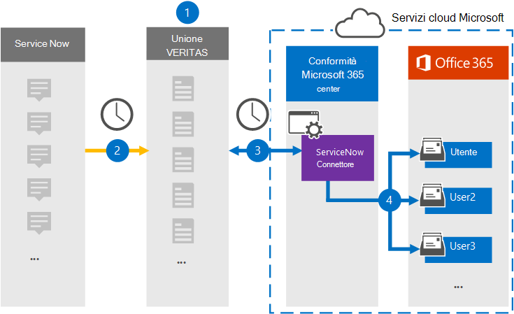

# Configurare un connettore per archiviare i dati di ServiceNowSet up a connector to archive ServiceNow data

Usare un connettore Globanet nel Centro conformità Microsoft 365 per importare e archiviare i dati dalla piattaforma ServiceNow alle cassette postali degli utenti nell'organizzazione di Microsoft 365.Use a Globanet connector in the Microsoft 365 compliance center to import and archive data from the ServiceNow platform to user mailboxes in your Microsoft 365 organization. Globanet fornisce un [connettore ServiceNow](https://globanet.com/servicenow/) che acquisisce gli elementi dall'origine dati di terze parti e importa tali elementi in Microsoft 365.Globanet provides a [ServiceNow](https://globanet.com/servicenow/) connector that captures items from the third-party data source and import those items to Microsoft 365. Il connettore converte il contenuto, ad esempio messaggi in tempo reale, allegati e post da ServiceNow in un formato di messaggio di posta elettronica e quindi importa tali elementi nelle cassette postali degli utenti in Microsoft 365.The connector converts the content such as live messages, attachments, and posts from ServiceNow to an email message format and then imports those items to user mailboxes in Microsoft 365.

Dopo aver archiviato i dati di ServiceNow nelle cassette postali degli utenti, è possibile applicare le funzionalità di conformità di Microsoft 365, ad esempio conservazione per controversia legale, eDiscovery, criteri di conservazione ed etichette di conservazione.After ServiceNow data is stored in user mailboxes, you can apply Microsoft 365 compliance features such as Litigation Hold, eDiscovery, retention policies, and retention labels. L'uso di un connettore ServiceNow per importare e archiviare i dati in Microsoft 365 può aiutare l'organizzazione a rimanere conforme ai criteri normativi e governativi.Using a ServiceNow connector to import and archive data in Microsoft 365 can help your organization stay compliant with government and regulatory policies.

## Panoramica dell'archiviazione dei dati di ServiceNowOverview of archiving ServiceNow data

Nella panoramica seguente viene illustrato il processo di utilizzo di un connettore per archiviare i dati ServiceNow in Microsoft 365.The following overview explains the process of using a connector to archive the ServiceNow data in Microsoft 365.

1. L'organizzazione collabora con ServiceNow per configurare un sito ServiceNow.Your organization works with ServiceNow to set up and configure a ServiceNow site.

2. Una volta ogni 24 ore, gli elementi ServiceNow vengono copiati nel sito Globanet Merge1.Once every 24 hours, ServiceNow items are copied to the Globanet Merge1 site. Il connettore converte inoltre gli elementi ServiceNow in un formato di messaggio di posta elettronica.The connector also converts ServiceNow items to an email message format.

3. Il connettore ServiceNow creato nel Centro conformità Microsoft 365 si connette ogni giorno al sito Globanet Merge1 e trasferisce il contenuto ServiceNow in una posizione sicura di Archiviazione di Azure nel cloud Microsoft.The ServiceNow connector that you create in the Microsoft 365 compliance center connects to the Globanet Merge1 site every day and transfers the ServiceNow content to a secure Azure Storage location in the Microsoft cloud.

4. Il connettore importa gli elementi convertiti nelle cassette postali di utenti specifici utilizzando il valore della proprietà *Email* del mapping automatico degli utenti, come descritto [nel passaggio 3.](#step-3-map-users-and-complete-the-connector-setup)The connector imports the converted items to the mailboxes of specific users using the value of the *Email* property of the automatic user mapping as described in [Step 3](#step-3-map-users-and-complete-the-connector-setup). Nelle cassette postali degli utenti viene creata una sottocartella nella cartella Posta in arrivo denominata **ServiceNow** e gli elementi vengono importati in tale cartella.A subfolder in the Inbox folder named **ServiceNow** is created in the user mailboxes, and items are imported to that folder. Il connettore determina in quale cassetta postale importare gli elementi utilizzando il valore della proprietà *Email.*The connector determines which mailbox to import items to by using the value of the *Email* property. Ogni elemento ServiceNow contiene questa proprietà, che viene popolata con l'indirizzo di posta elettronica di ogni partecipante dell'elemento.Every ServiceNow item contains this property, which is populated with the email address of every participant of the item.

## Prima di iniziareBefore you begin

- Creare un account Merge1 per i connettori Microsoft.Create a Merge1 account for Microsoft connectors. Per creare un account, contattare [il supporto clienti Di Globanet.](https://globanet.com/contact-us/)To create an account, contact [Globanet Customer Support](https://globanet.com/contact-us/). È necessario accedere a questo account quando si crea il connettore nel passaggio 1.You need to sign into this account when you create the connector in Step 1.

- Creare un'applicazione ServiceNow per recuperare i dati dall'account ServiceNow.Create a ServiceNow application to fetch data from your ServiceNow account. Per istruzioni dettagliate sulla creazione dell'applicazione, vedere il Manuale dell'utente di [Merge1 Third-Party Connectors.](https://docs.ms.merge1.globanetportal.com/Merge1%20Third-Party%20Connectors%20ServiceNow%20User%20Guide%20.pdf)For step-by step instructions about creating the application, see [Merge1 Third-Party Connectors User Guide](https://docs.ms.merge1.globanetportal.com/Merge1%20Third-Party%20Connectors%20ServiceNow%20User%20Guide%20.pdf).

- L'utente che crea il connettore ServiceNow nel passaggio 1 (e lo completa nel passaggio 3) deve essere assegnato al ruolo di importazione/esportazione delle cassette postali in Exchange Online.The user who creates the ServiceNow connector in Step 1 (and completes it in Step 3) must be assigned to the Mailbox Import Export role in Exchange Online. Questo ruolo è necessario per aggiungere connettori nella pagina **Connettori** dati nel Centro conformità Microsoft 365.This role is required to add connectors on the **Data connectors** page in the Microsoft 365 compliance center. Per impostazione predefinita, questo ruolo non è assegnato ad alcun gruppo di ruoli in Exchange Online.By default, this role isn't assigned to any role group in Exchange Online. È possibile aggiungere il ruolo di importazione/esportazione delle cassette postali al gruppo di ruoli Gestione organizzazione in Exchange Online.You can add the Mailbox Import Export role to the Organization Management role group in Exchange Online. In or you can create a role group, assign the Mailbox Import Export role, and then add the appropriate users as members.Or you can create a role group, assign the Mailbox Import Export role, and then add the appropriate users as members. Per ulteriori informazioni, vedere le sezioni [Creazione](https://docs.microsoft.com/Exchange/permissions-exo/role-groups#create-role-groups) di gruppi di ruoli o Modifica gruppi [di](https://docs.microsoft.com/Exchange/permissions-exo/role-groups#modify-role-groups) ruoli nell'articolo "Gestire i gruppi di ruoli in Exchange Online".For more information, see the [Create role groups](https://docs.microsoft.com/Exchange/permissions-exo/role-groups#create-role-groups) or [Modify role groups](https://docs.microsoft.com/Exchange/permissions-exo/role-groups#modify-role-groups) sections in the article "Manage role groups in Exchange Online".

## Passaggio 1: Configurare il connettore ServiceNowStep 1: Set up the ServiceNow connector

Il primo passaggio consiste nell'accedere alla pagina **Connettori** dati nel Centro conformità Microsoft 365 e creare un connettore per i dati di ServiceNow.The first step is to access to the **Data Connectors** page in the Microsoft 365 compliance center and create a connector for ServiceNow data.

1. Accedere a [https://compliance.microsoft.com](https://compliance.microsoft.com/) e quindi fare clic su **Connettori dati**  >  **ServiceNow.**Go to [https://compliance.microsoft.com](https://compliance.microsoft.com/) and then click **Data connectors** > **ServiceNow**.

2. Nella pagina **Descrizione prodotto ServiceNow** fare clic su **Aggiungi connettore.**On the **ServiceNow** product description page, click **Add connector**.

3. Nella pagina **Condizioni per il servizio** fare clic su **Accetta.**On the **Terms of service** page, click **Accept**.

4. Immettere un nome univoco che identifichi il connettore, quindi fare clic su **Avanti.**Enter a unique name that identifies the connector, and then click **Next**.

5. Accedere all'account Merge1 per configurare il connettore.Sign in to your Merge1 account to configure the connector.

## Passaggio 2: Configurare ServiceNow nel sito Globanet Merge1Step 2: Configure the ServiceNow on the Globanet Merge1 site

Il secondo passaggio consiste nel configurare il connettore ServiceNow nel sito Globanet Merge1.The second step is to configure the ServiceNow connector on the Globanet Merge1 site. Per informazioni su come configurare il connettore ServiceNow, vedere il Manuale dell'utente di [Merge1 Third-Party Connectors.](https://docs.ms.merge1.globanetportal.com/Merge1%20Third-Party%20Connectors%20ServiceNow%20User%20Guide%20.pdf)For information about how to configure the ServiceNow connector, see [Merge1 Third-Party Connectors User Guide](https://docs.ms.merge1.globanetportal.com/Merge1%20Third-Party%20Connectors%20ServiceNow%20User%20Guide%20.pdf).

Dopo aver fatto **clic su &,** viene visualizzata la **pagina Mapping** utenti nella procedura guidata del connettore nel Centro conformità Microsoft 365.After you click **Save & Finish,** the **User mapping** page in the connector wizard in the Microsoft 365 compliance center is displayed.

## Passaggio 3: mappare gli utenti e completare la configurazione del connettoreStep 3: Map users and complete the connector setup

Per mappare gli utenti e completare la configurazione del connettore nel Centro conformità Microsoft 365, attenersi alla seguente procedura:To map users and complete the connector setup in the Microsoft 365 compliance center, follow these steps:

1. Nella pagina Mapping utenti di ServiceNow agli utenti di **Microsoft 365** abilitare il mapping automatico degli utenti.On the **Map ServiceNow users to Microsoft 365 users** page, enable automatic user mapping. Gli elementi ServiceNow includono una proprietà denominata *Posta* elettronica, che contiene gli indirizzi di posta elettronica per gli utenti dell'organizzazione.The ServiceNow items include a property called *Email*, which contains email addresses for users in your organization. Se il connettore può associare questo indirizzo a un utente di Microsoft 365, gli elementi vengono importati nella cassetta postale dell'utente.If the connector can associate this address with a Microsoft 365 user, the items are imported to that user's mailbox.

2. Fare **clic** su Avanti, rivedere le  impostazioni e quindi passare alla pagina Connettori dati per visualizzare l'avanzamento del processo di importazione per il nuovo connettore.Click **Next**, review your settings, and then go to the **Data connectors** page to see the progress of the import process for the new connector.

## Passaggio 4: Monitorare il connettore ServiceNowStep 4: Monitor the ServiceNow connector

Dopo aver creato il connettore ServiceNow, è possibile visualizzare lo stato del connettore nel Centro conformità Microsoft 365.After you create the ServiceNow connector, you can view the connector status in the Microsoft 365 compliance center.

1. Andare a [https://compliance.microsoft.com](https://compliance.microsoft.com/) e fare clic su **Connettori dati** nel riquadro di spostamento sinistro.Go to [https://compliance.microsoft.com](https://compliance.microsoft.com/) and click **Data connectors** in the left nav.

2. Fare clic **sulla scheda Connettori** e quindi selezionare il connettore **ServiceNow** per visualizzare la pagina a comparsa, che contiene le proprietà e le informazioni sul connettore.Click the **Connectors** tab and then select the **ServiceNow** connector to display the flyout page, which contains the properties and information about the connector.

3. In **Stato connettore con origine** fare clic sul collegamento Scarica **registro** per aprire (o salvare) il registro di stato per il connettore.Under **Connector status with source**, click the **Download log** link to open (or save) the status log for the connector. Questo log contiene i dati che sono stati importati nel cloud Microsoft.This log contains data that has been imported to the Microsoft cloud.

## Problemi notiKnown issues

- Al momento, non è possibile importare allegati o elementi di dimensioni superiori a 10 MB.At this time, we don't support importing attachments or items that are larger than 10 MB. Il supporto per gli elementi più grandi sarà disponibile in un secondo momento.Support for larger items will be available at a later date.
