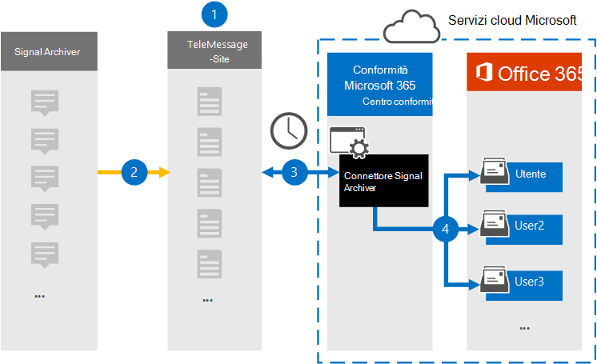

# Configurare un connettore per archiviare i dati delle comunicazioni segnale

Usa il connettore TeleMessage nel Centro conformità Microsoft 365 per importare e archiviare le chat, gli allegati, i file e i messaggi e le chiamate eliminati. Dopo aver configurato e configurato un connettore, si connette all'account TeleMessage dell'organizzazione e importa le comunicazioni mobili dei dipendenti che utilizzano l'archivio segnali TeleMessage nelle cassette postali in Microsoft 365.

Dopo l'archiviazione dei dati del connettore di Signal Archiver nelle cassette postali degli utenti, è possibile applicare funzionalità di conformità Microsoft 365 quali conservazione per controversia legale, ricerca contenuto e criteri di conservazione Microsoft 365 per segnalare i dati delle comunicazioni. Ad esempio, è possibile cercare La comunicazione del segnale utilizzando Ricerca contenuto o associare la cassetta postale che contiene i dati del connettore Signal Archiver a un responsabile in un caso Advanced eDiscovery caso. L'utilizzo di un connettore Signal Archiver per importare e archiviare i dati in Microsoft 365 può aiutare l'organizzazione a rimanere conforme alle normative di governance aziendale e ai criteri normativi.

## Panoramica dell'archiviazione dei dati sulle comunicazioni dei segnali

Nella panoramica seguente viene illustrato il processo di utilizzo di un connettore per archiviare i dati di comunicazione del segnale in Microsoft 365.

1. L'organizzazione collabora con TeleMessage per configurare un connettore signal archiver. Per ulteriori informazioni, vedere [Activating the TeleMessage Signal Archiver for Microsoft 365](https://www.telemessage.com/microsoft-365-activation-for-signal-archiver/).

2. In tempo reale, i dati signal dell'organizzazione vengono copiati nel sito TeleMessage.

3. Il connettore Signal Archiver creato nel Centro conformità Microsoft 365 si connette ogni giorno al sito TeleMessage e trasferisce i messaggi di posta elettronica dalle 24 ore precedenti a un'area Archiviazione di Azure sicura nel cloud Microsoft.

4. Il connettore importa gli elementi di comunicazione mobile nella cassetta postale di un utente specifico. Verrà creata una nuova cartella denominata Signal Archiver nella cassetta postale dell'utente specifico e gli elementi verranno importati in essa. Il connettore esegue il mapping utilizzando il valore della proprietà Indirizzo di posta elettronica *dell'utente.* Ogni messaggio di posta elettronica contiene questa proprietà, che viene popolata con l'indirizzo di posta elettronica di ogni partecipante del messaggio di posta elettronica.

> Oltre al mapping automatico degli utenti utilizzando il valore della proprietà Indirizzo di posta elettronica *dell'utente,* è anche possibile definire un mapping personalizzato caricando un file di mapping CSV. Questo file di mapping deve contenere il numero di cellulare dell'utente e l'indirizzo Microsoft 365 corrispondente per ogni utente. Se si abilita il mapping automatico degli utenti e si fornisce un mapping personalizzato, per ogni elemento di posta elettronica il connettore guarderà innanzitutto il file di mapping personalizzato. Se non trova un utente Microsoft 365 valido corrispondente al numero di cellulare di un utente, il connettore utilizzerà la proprietà Dell'indirizzo di posta elettronica dell'utente dell'elemento di posta elettronica. Se il connettore non trova un utente Microsoft 365 valido nel file di mapping personalizzato o nella proprietà dell'indirizzo di posta elettronica dell'utente dell'elemento di posta elettronica, *l'elemento* non verrà importato.

## Prima di configurare un connettore

- Ordinare [il servizio Signal Archiver da TeleMessage](https://www.telemessage.com/mobile-archiver/order-mobile-archiver-for-o365/) e ottenere un account di amministrazione valido per l'organizzazione. Sarà necessario accedere a questo account quando si crea il connettore nel Centro conformità.

- Registrare tutti gli utenti che richiedono l'archiviazione del segnale nell'account TeleMessage. Quando si registrano gli utenti, assicurarsi di usare lo stesso indirizzo di posta elettronica utilizzato per l'account Microsoft 365 account.

- Installa l'app Signal Archiver sui telefoni cellulari dei dipendenti e attivala. L'app Signal Archiver consente loro di comunicare e chattare con altri utenti di Signal.

- All'utente che crea un connettore signal archiver nel passaggio 3 deve essere assegnato il ruolo Esportazione importazione cassette postali in Exchange Online. Questa operazione è necessaria per aggiungere connettori nella pagina **Connettori** dati nell'Centro conformità Microsoft 365. Per impostazione predefinita, questo ruolo non è assegnato ad alcun gruppo di ruoli in Exchange Online. È possibile aggiungere il ruolo Esportazione importazione cassette postali al gruppo di ruoli Gestione organizzazione in Exchange Online. In caso contrario, è possibile creare un gruppo di ruoli, assegnare il ruolo Importazione/Esportazione cassette postali e quindi aggiungere gli utenti appropriati come membri. Per ulteriori informazioni, vedere le sezioni [Create role groups](/Exchange/permissions-exo/role-groups#create-role-groups) o Modify role [groups](/Exchange/permissions-exo/role-groups#modify-role-groups) nell'articolo "Manage role groups in Exchange Online".

## Creare un connettore di Signal Archiver

Dopo aver completato i prerequisiti descritti nella sezione precedente, è possibile creare il connettore Signal Archiver nel Centro conformità Microsoft 365. Il connettore utilizza le informazioni fornite per connettersi al sito TeleMessage e trasferisce i dati delle comunicazioni segnale alle caselle delle cassette postali dell'utente corrispondenti in Microsoft 365.

1. Vai a <https://compliance.microsoft.com> e quindi fai clic su **Connettori dati** Signal  >  **Archiver**.

2. Nella pagina **Descrizione prodotto Signal Archiver** fare clic su **Aggiungi connettore.**

3. Nella pagina **Condizioni di servizio** fare clic su **Accetta.**

4. Nella pagina **Accesso a TeleMessage,** in Passaggio 3, immettere le informazioni necessarie nelle caselle seguenti e quindi fare clic su **Avanti.**

    - **Nome utente:** Nome utente TeleMessage.

    - **Password:** Password TeleMessage.

5. Dopo aver creato il connettore, è possibile chiudere la finestra popup e passare alla pagina successiva.

6. Nella pagina **Mapping utenti** abilitare il mapping automatico degli utenti. Per abilitare il mapping personalizzato, caricare un file CSV contenente le informazioni sul mapping degli utenti e quindi fare clic su **Avanti.**

7. Rivedere le impostazioni e quindi fare clic **su Fine** per creare il connettore.

8. Passare alla scheda Connettori nella **pagina Connettori dati** per visualizzare l'avanzamento del processo di importazione per il nuovo connettore.

## Problemi noti

- Al momento non è possibile importare allegati o elementi di dimensioni superiori a 10 MB. Il supporto per gli elementi più grandi sarà disponibile in un secondo momento.
