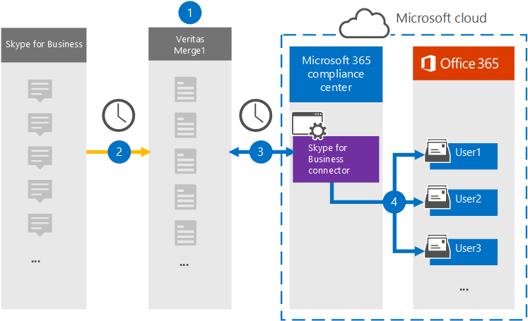

# Configurare un connettore per archiviare i Skype for Business datiSet up a connector to archive Skype for Business data

Utilizzare un connettore Veritas nell'Centro conformità Microsoft 365 per importare e archiviare i dati dalla piattaforma Skype for Business alle cassette postali degli utenti nell'Microsoft 365 organizzazione.Use a Veritas connector in the Microsoft 365 compliance center to import and archive data from the Skype for Business platform to user mailboxes in your Microsoft 365 organization. Veritas fornisce un [connettore di](https://www.veritas.com/en/au/insights/merge1/skype-for-business) Skype for Business configurato per acquisire elementi dall'origine dati di terze parti (a intervalli regolari) e importare tali elementi in Microsoft 365.Veritas provides a [Skype for Business](https://www.veritas.com/en/au/insights/merge1/skype-for-business) connector that is configured to capture items from the third-party data source (on a regular basis) and import those items to Microsoft 365. Il connettore converte il contenuto, ad esempio i messaggi tra utenti, chat persistenti e messaggi di conferenza da Skype for Business in un formato di messaggio di posta elettronica e quindi importa tali elementi nella cassetta postale dell'utente in Microsoft 365.The connector converts the content such as messages between users, persistent chats, and conference messages from Skype for Business to an email message format and then imports those items to the user’s mailbox in Microsoft 365.

Dopo Skype for Business dati archiviati nelle cassette postali degli utenti, è possibile applicare Microsoft 365 di conformità, ad esempio conservazione per controversia legale, eDiscovery, criteri di conservazione ed etichette di conservazione.After Skype for Business data is stored in user mailboxes, you can apply Microsoft 365 compliance features such as Litigation Hold, eDiscovery, retention policies and retention labels. L'utilizzo Skype for Business connettore per importare e archiviare i dati in Microsoft 365 può aiutare l'organizzazione a rimanere conforme ai criteri governativi e normativi.Using a Skype for Business connector to import and archive data in Microsoft 365 can help your organization stay compliant with government and regulatory policies.

## Panoramica dell'archiviazione Skype for Business datiOverview of archiving Skype for Business data

Nella panoramica seguente viene illustrato il processo di utilizzo di un connettore per archiviare i dati Skype for Business in Microsoft 365.The following overview explains the process of using a connector to archive the Skype for Business data in Microsoft 365.

1. L'organizzazione collabora con Skype for Business per configurare un sito Skype for Business locale.Your organization works with Skype for Business to set up and configure a Skype for Business site.

2. Una volta ogni 24 ore, Skype for Business elementi vengono copiati nel sito Veritas Merge1.Once every 24 hours, Skype for Business items are copied to the Veritas Merge1 site. Il connettore converte inoltre Skype for Business elementi in un formato di messaggio di posta elettronica.The connector also converts Skype for Business items to an email message format.

3. Il connettore di Skype for Business creato nel Centro conformità Microsoft 365, si connette ogni giorno al sito Veritas Merge1 e trasferisce il contenuto Skype for Business in una posizione Archiviazione di Azure sicura nel cloud Microsoft.The Skype for Business connector that you create in the Microsoft 365 compliance center, connects to the Veritas Merge1 site every day, and transfers the Skype for Business content to a secure Azure Storage location in the Microsoft cloud.

4. Il connettore importa gli elementi convertiti nelle cassette postali di utenti specifici utilizzando il valore della proprietà *Email* del mapping automatico degli utenti, come descritto nel [passaggio 3.](#step-3-map-users-and-complete-the-connector-setup)The connector imports the converted items to the mailboxes of specific users using the value of the *Email* property of the automatic user mapping as described in [Step 3](#step-3-map-users-and-complete-the-connector-setup). Una sottocartella nella cartella Posta **in arrivo** denominata Skype for Business viene creata nelle cassette postali degli utenti e gli elementi vengono importati in tale cartella.A subfolder in the Inbox folder named **Skype for Business** is created in the user mailboxes, and items are imported to that folder. Il connettore esegue questa operazione utilizzando il valore della *proprietà Email.*The connector does this by using the value of the *Email* property. Ogni Skype for Business contiene questa proprietà, che viene popolata con l'indirizzo di posta elettronica di ogni partecipante dell'elemento.Every Skype for Business item contains this property, which is populated with the email address of every participant of the item.

## Prima di configurare un connettoreBefore you set up a connector

- Creare un account Merge1 per i connettori Microsoft.Create a Merge1 account for Microsoft connectors. A tale scopo, contattare [il supporto tecnico Veritas.](https://www.veritas.com/form/requestacall/ms-connectors-contact.html)To do this, contact [Veritas Customer Support](https://www.veritas.com/form/requestacall/ms-connectors-contact.html). È necessario accedere a questo account quando si crea il connettore nel passaggio 1.You need to sign into this account when you create the connector in Step 1.

- L'utente che crea il connettore di Skype for Business nel passaggio 1 (e lo completa nel passaggio 3) deve essere assegnato al ruolo Di importazione delle cassette postali in Exchange Online.The user who creates the Skype for Business connector in Step 1 (and completes it in Step 3) must be assigned to the Mailbox Import Export role in Exchange Online. Questo ruolo è necessario per aggiungere connettori nella pagina **Connettori** dati nell'Centro conformità Microsoft 365.This role is required to add connectors on the **Data connectors** page in the Microsoft 365 compliance center. Per impostazione predefinita, questo ruolo non viene assegnato ad alcun gruppo di ruoli in Exchange Online.By default, this role is not assigned to any role group in Exchange Online. È possibile aggiungere il ruolo Esportazione importazione cassette postali al gruppo di ruoli Gestione organizzazione in Exchange Online.You can add the Mailbox Import Export role to the Organization Management role group in Exchange Online. In caso contrario, è possibile creare un gruppo di ruoli, assegnare il ruolo Importazione/Esportazione cassette postali e quindi aggiungere gli utenti appropriati come membri.Or you can create a role group, assign the Mailbox Import Export role, and then add the appropriate users as members. Per ulteriori informazioni, vedere le sezioni [Create role groups](/Exchange/permissions-exo/role-groups#create-role-groups) o Modify role [groups](/Exchange/permissions-exo/role-groups#modify-role-groups) nell'articolo "Manage role groups in Exchange Online".For more information, see the [Create role groups](/Exchange/permissions-exo/role-groups#create-role-groups) or [Modify role groups](/Exchange/permissions-exo/role-groups#modify-role-groups) sections in the article "Manage role groups in Exchange Online".

## Passaggio 1: Configurare il connettore di Skype for BusinessStep 1: Set up the Skype for Business connector

Il primo passaggio consiste nell'accedere alla pagina **Connettori** dati nell'Centro conformità Microsoft 365 e creare un connettore per Skype for Business dati.The first step is to access to the **Data Connectors** page in the Microsoft 365 compliance center and create a connector for Skype for Business data.

1. Passare a <https://compliance.microsoft.com> e fare clic su **Connettori**  >  **dati Skype for Business**.Go to <https://compliance.microsoft.com> and click **Data connectors** > **Skype for Business**.

2. Nella **pagina** Skype for Business descrizione del prodotto fare clic **su Aggiungi connettore.**On the **Skype for Business** product description page, click **Add connector**.

3. Nella pagina **Condizioni di servizio** fare clic su **Accetta.**On the **Terms of service** page, click **Accept**.

4. Immettere un nome univoco che identifichi il connettore e quindi fare clic su **Avanti.**Enter a unique name that identifies the connector, and then click **Next**.

5. Accedere all'account Merge1 per configurare il connettore.Sign in to your Merge1 account to configure the connector.

## Passaggio 2: Configurare la Skype for Business nel sito Veritas Merge1Step 2: Configure the Skype for Business on the Veritas Merge1 site

Il secondo passaggio consiste nel configurare il connettore Skype for Business nel sito Veritas Merge1.The second step is to configure the Skype for Business connector on the Veritas Merge1 site. Per informazioni su come configurare il connettore Skype for Business, vedere [Merge1 Third-Party Connectors User Guide](https://docs.ms.merge1.globanetportal.com/Merge1%20Third-Party%20Connectors%20Skype%20for%20Business%20%20User%20Guide.pdf).For information about how to configure the Skype for Business connector, see [Merge1 Third-Party Connectors User Guide](https://docs.ms.merge1.globanetportal.com/Merge1%20Third-Party%20Connectors%20Skype%20for%20Business%20%20User%20Guide.pdf).

Dopo aver fatto **clic su Salva & fine,** viene visualizzata la pagina **Mapping** utenti nella procedura guidata del connettore Centro conformità Microsoft 365 visualizzata.After you click **Save & Finish**, the **User mapping** page in the connector wizard in the Microsoft 365 compliance center is displayed.

## Passaggio 3: mappare gli utenti e completare la configurazione del connettoreStep 3: Map users and complete the connector setup

Per mappare gli utenti e completare la configurazione del connettore Centro conformità Microsoft 365, attenersi alla seguente procedura:To map users and complete the connector setup in the Microsoft 365 compliance center, follow these steps:

1. Nella pagina **Mapping Skype for Business utenti a Microsoft 365 utenti,** abilitare il mapping automatico degli utenti.On the **Map Skype for Business users to Microsoft 365 users** page, enable automatic user mapping. Gli Skype for Business includono una proprietà denominata *Email*, che contiene gli indirizzi di posta elettronica per gli utenti dell'organizzazione.The Skype for Business items include a property called *Email*, which contains email addresses for users in your organization. Se il connettore può associare questo indirizzo a un Microsoft 365 utente, gli elementi vengono importati nella cassetta postale dell'utente.If the connector can associate this address with a Microsoft 365 user, the items are imported to that user’s mailbox.

2. Fare **clic** su Avanti, rivedere le impostazioni e quindi passare alla pagina **Connettori** dati per visualizzare l'avanzamento del processo di importazione per il nuovo connettore.Click **Next**, review your settings, and then go to the **Data connectors** page to see the progress of the import process for the new connector.

## Passaggio 4: Monitorare il connettore Skype for BusinessStep 4: Monitor the Skype for Business connector

Dopo aver creato il Skype for Business, è possibile visualizzare lo stato del connettore nella Centro conformità Microsoft 365.After you create the Skype for Business connector, you can view the connector status in the Microsoft 365 compliance center.

1. Vai a <https://compliance.microsoft.com/> e fai clic su **Connettori dati** nel riquadro di spostamento sinistro.Go to <https://compliance.microsoft.com/> and click **Data connectors** in the left nav.

2. Fare clic **sulla scheda Connettori** e quindi selezionare il Skype for Business per visualizzare la pagina a comparsa, contenente le proprietà e le informazioni sul connettore. Click the **Connectors** tab and then select the **Skype for Business** connector to display the flyout page, which contains the properties and information about the connector.

3. In **Stato connettore con origine** fare clic sul collegamento Scarica **registro** per aprire (o salvare) il registro di stato per il connettore.Under **Connector status with source**, click the **Download log** link to open (or save) the status log for the connector. Questo registro contiene i dati importati nel cloud Microsoft.This log contains data that has been imported to the Microsoft cloud.

## Problemi notiKnown issues

- Al momento non è possibile importare allegati o elementi di dimensioni superiori a 10 MB.At this time, we don't support importing attachments or items that are larger than 10 MB. Il supporto per gli elementi più grandi sarà disponibile in un secondo momento.Support for larger items will be available at a later date.
