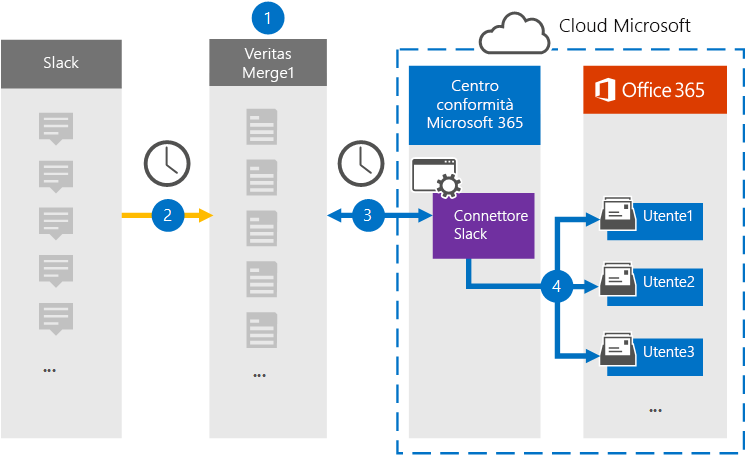

# Configurare un connettore per archiviare i dati di eDiscovery di SlackSet up a connector to archive Slack eDiscovery data

Usare un connettore Globanet nel Centro conformità Microsoft 365 per importare e archiviare dati di terze parti da social media, messaggistica istantanea e piattaforme di collaborazione documenti nelle cassette postali dell'organizzazione di Microsoft 365.Use a Globanet connector in the Microsoft 365 compliance center to import and archive third-party data from social media, instant messaging, and document collaboration platforms to mailboxes in your Microsoft 365 organization. Globanet fornisce un connettore [slack](https://globanet.com/slack/) configurato per acquisire elementi dall'origine dati di terze parti (regolarmente) e quindi importare tali elementi in Microsoft 365.Globanet provides a [Slack](https://globanet.com/slack/) connector that's configured to capture items from the third-party data source (on a regular basis) and then import those items to Microsoft 365. Slack estrae i messaggi e i file dall'API di Slack e li converte in un formato di messaggio di posta elettronica e quindi importa l'elemento nelle cassette postali degli utenti.Slack pulls messages and files from the Slack API and converts them to an email message format and then imports the item to user mailboxes.

Dopo aver archiviato i dati di eDiscovery di Slack nelle cassette postali degli utenti, è possibile applicare le funzionalità di conformità di Microsoft 365, ad esempio il blocco per controversia legale, eDiscovery, i criteri di conservazione e le etichette di conservazione e la conformità delle comunicazioni.After Slack eDiscovery data is stored in user mailboxes, you can apply Microsoft 365 compliance features such as Litigation Hold, eDiscovery, retention policies and retention labels, and communication compliance. L'uso di un connettore slack per importare e archiviare i dati in Microsoft 365 può aiutare l'organizzazione a rimanere conforme ai criteri normativi e governativi.Using a Slack connector to import and archive data in Microsoft 365 can help your organization stay compliant with government and regulatory policies.

## Panoramica dell'archiviazione dei dati di eDiscovery di SlackOverview of archiving Slack eDiscovery data

Nella panoramica seguente viene illustrato il processo di utilizzo di un connettore per archiviare le informazioni di Slack in Microsoft 365.The following overview explains the process of using a connector to archive the Slack information in Microsoft 365.

1. L'organizzazione collabora con Slack per impostare e configurare un sito di Slack.Your organization works with Slack to set up and configure a Slack site.

2. Una volta ogni 24 ore, i messaggi di chat di Slack eDiscovery vengono copiati nel sito Globanet Merge1.Once every 24 hours, chat messages from Slack eDiscovery are copied to the Globanet Merge1 site. Il connettore converte inoltre il contenuto di un messaggio di chat in un formato di messaggio di posta elettronica.The connector also converts the content of a chat message to an email message format.

3. Il connettore eDiscovery di Slack creato nel Centro conformità Microsoft 365, si connette al sito Globanet Merge1 ogni giorno e trasferisce i messaggi di chat in una posizione sicura di Archiviazione di Azure nel cloud Microsoft.The Slack eDiscovery connector that you create in the Microsoft 365 compliance center, connects to the Globanet Merge1 site every day and transfers the chat messages to a secure Azure Storage location in the Microsoft cloud.

4. Il connettore importa gli elementi dei messaggi di chat convertiti nelle cassette postali di utenti specifici utilizzando il valore della proprietà *Email* e il mapping automatico degli utenti, come descritto nel passaggio 3.The connector imports the converted chat message items to the mailboxes of specific users using the value of the *Email* property and automatic user mapping, as described in Step 3. Nelle cassette postali degli utenti viene creata una nuova sottocartella nella cartella Posta in arrivo denominata **Slack eDiscovery** e gli elementi dei messaggi di chat vengono importati in tale cartella.A new subfolder in the Inbox folder named **Slack eDiscovery** is created in the user mailboxes, and the chat message items are imported to that folder. Il connettore determina in quale cassetta postale importare gli elementi utilizzando il valore della proprietà *Email.*The connector determines which mailbox to import items to by using the value of the *Email* property. Ogni messaggio di chat contiene questa proprietà, che viene popolata con l'indirizzo di posta elettronica di ogni partecipante del messaggio di chat.Every chat message contains this property, which is populated with the email address of every participant of the chat message.

## Prima di iniziareBefore you begin

- Creare un account Globanet Merge1 per i connettori Microsoft.Create a Globanet Merge1 account for Microsoft connectors. Per creare un account, contattare [il supporto clienti Di Globanet.](https://globanet.com/ms-connectors-contact)To create an account, contact [Globanet Customer Support](https://globanet.com/ms-connectors-contact). Si accederà a questo account quando si crea il connettore nel passaggio 1.You will sign into this account when you create the connector in Step 1.

- Ottenere il nome utente e la password per l'account aziendale slack dell'organizzazione.Obtain the username and password for your organization's Slack enterprise account. Sarà necessario accedere a questo account nel passaggio 2 quando si configura Slack.You'll need to sign into this account in Step 2 when you configure Slack.

- L'utente che crea il connettore eDiscovery di Slack nel passaggio 1 (e lo completa nel passaggio 3) deve essere assegnato al ruolo di importazione/esportazione delle cassette postali in Exchange Online.The user who creates the Slack eDiscovery connector in Step 1 (and completes it in Step 3) must be assigned to the Mailbox Import Export role in Exchange Online. Questo ruolo è necessario per aggiungere connettori nella pagina **Connettori** dati nel Centro conformità Microsoft 365.This role is required to add connectors on the **Data connectors** page in the Microsoft 365 compliance center. Per impostazione predefinita, questo ruolo non è assegnato a un gruppo di ruoli in Exchange Online.By default, this role is not assigned to a role group in Exchange Online. È possibile aggiungere il ruolo di importazione/esportazione delle cassette postali al gruppo di ruoli Gestione organizzazione in Exchange Online.You can add the Mailbox Import Export role to the Organization Management role group in Exchange Online. In or you can create a role group, assign the Mailbox Import Export role, and then add the appropriate users as members.Or you can create a role group, assign the Mailbox Import Export role, and then add the appropriate users as members. Per ulteriori informazioni, vedere le sezioni [Creazione](https://docs.microsoft.com/Exchange/permissions-exo/role-groups#create-role-groups) di gruppi di ruoli o Modifica gruppi [di](https://docs.microsoft.com/Exchange/permissions-exo/role-groups#modify-role-groups) ruoli nell'articolo "Gestire i gruppi di ruoli in Exchange Online".For more information, see the [Create role groups](https://docs.microsoft.com/Exchange/permissions-exo/role-groups#create-role-groups) or [Modify role groups](https://docs.microsoft.com/Exchange/permissions-exo/role-groups#modify-role-groups) sections in the article "Manage role groups in Exchange Online".

## Passaggio 1: Configurare il connettore eDiscovery di SlackStep 1: Set up the Slack eDiscovery connector

Il primo passaggio consiste nell'accedere alla pagina **Connettori** dati nel Centro conformità Microsoft 365 e creare un connettore per i dati di Slack.The first step is to access to the **Data Connectors** page in the Microsoft 365 compliance center and create a connector for Slack data.

1. Accedere a [https://compliance.microsoft.com](https://compliance.microsoft.com/) e quindi fare clic su **Connettori dati** slack  >  **eDiscovery.**Go to [https://compliance.microsoft.com](https://compliance.microsoft.com/) and then click **Data connectors** > **Slack eDiscovery**.

2. Nella pagina **di descrizione del prodotto eDiscovery** di Slack fare clic **su Aggiungi connettore.**On the **Slack eDiscovery** product description page, click **Add connector**.

3. Nella pagina **Condizioni per il servizio** fare clic su **Accetta.**On the **Terms of service** page, click **Accept**.

4. Immettere un nome univoco che identifichi il connettore, quindi fare clic su **Avanti.**Enter a unique name that identifies the connector, and then click **Next**.

5. Accedere all'account Merge1 per configurare il connettore.Sign in to your Merge1 account to configure the connector.

## Passaggio 2: Configurare Slack eDiscoveryStep 2: Configure Slack eDiscovery

Il secondo passaggio consiste nel configurare il connettore eDiscovery di Slack nel sito Merge1.The second step is to configure the Slack eDiscovery connector on the Merge1 site. Per ulteriori informazioni su come configurare il connettore eDiscovery di Slack nel sito Globanet Merge1, vedere il Manuale dell'utente di [Merge1 Third-Party Connectors.](https://docs.ms.merge1.globanetportal.com/Merge1%20Third-Party%20Connectors%20Slack%20eDiscovery%20User%20Guide.pdf)For more information about how to configure the Slack eDiscovery connector on the Globanet Merge1 site, see [Merge1 Third-Party Connectors User Guide](https://docs.ms.merge1.globanetportal.com/Merge1%20Third-Party%20Connectors%20Slack%20eDiscovery%20User%20Guide.pdf).

Dopo aver fatto **clic su & fine,** viene visualizzata la pagina **Mapping** utenti nella procedura guidata del connettore nel Centro conformità Microsoft 365.After you click **Save & Finish**, the **User mapping** page in the connector wizard in the Microsoft 365 compliance center is displayed.

## Passaggio 3: mappare gli utenti e completare la configurazione del connettoreStep 3: Map users and complete the connector setup

1. Nella pagina **Mapping utenti esterni a utenti di Microsoft 365** abilitare il mapping automatico degli utenti.On the **Map external users to Microsoft 365 users** page, enable automatic user mapping.

   Gli elementi di eDiscovery di Slack includono una proprietà denominata *Posta* elettronica, che contiene gli indirizzi di posta elettronica per gli utenti dell'organizzazione.Slack eDiscovery items include a property called *Email*, which contains email addresses for users in your organization. Se il connettore può associare questo indirizzo a un utente di Microsoft 365, gli elementi vengono importati nella cassetta postale dell'utente.If the connector can associate this address with a Microsoft 365 user, the items are imported to that user's mailbox.

2. Fare **clic** su Avanti, rivedere le impostazioni e passare alla pagina **Connettori** dati per visualizzare l'avanzamento del processo di importazione per il nuovo connettore.Click **Next**, review your settings, and go to the **Data connectors** page to see the progress of the import process for the new connector.

## Passaggio 4: Monitorare il connettore eDiscovery di SlackStep 4: Monitor the Slack eDiscovery connector

Dopo aver creato il connettore eDiscovery di Slack, è possibile visualizzare lo stato del connettore nel Centro conformità Microsoft 365.After you create the Slack eDiscovery connector, you can view the connector status in the Microsoft 365 compliance center.

1. Andare a [https://compliance.microsoft.com](https://compliance.microsoft.com) e fare clic su **Connettori dati** nel riquadro di spostamento sinistro.Go to [https://compliance.microsoft.com](https://compliance.microsoft.com) and click **Data connectors** in the left nav.

2. Fare clic **sulla scheda Connettori** e quindi selezionare il **connettore eDiscovery di Slack** per visualizzare la pagina a comparsa.Click the **Connectors** tab and then select the **Slack eDiscovery** connector to display the flyout page. Questa pagina contiene le proprietà e le informazioni sul connettore.This page contains the properties and information about the connector.

3. In **Stato connettore con origine** fare clic sul collegamento Scarica **registro** per aprire (o salvare) il registro di stato per il connettore.Under **Connector status with source**, click the **Download log** link to open (or save) the status log for the connector. Questo log contiene informazioni sui dati importati nel cloud Microsoft.This log contains information about the data that has been imported to the Microsoft cloud.

## Problemi notiKnown issues

- Al momento, non è possibile importare allegati o elementi di dimensioni superiori a 10 MB.At this time, we don't support importing attachments or items that are larger than 10 MB. Il supporto per gli elementi più grandi sarà disponibile in un secondo momento.Support for larger items will be available at a later date.
