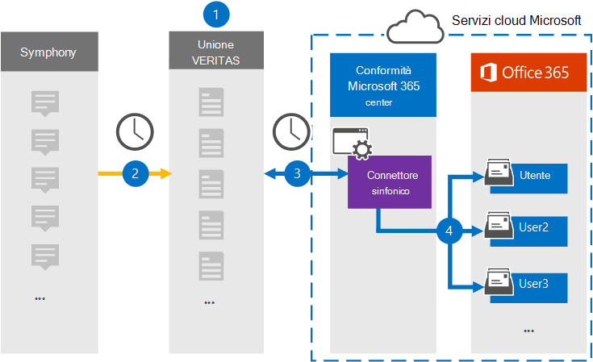

# Configurare un connettore per archiviare i dati di SymphonySet up a connector to archive Symphony data

Utilizzare un connettore Veritas nel Centro Microsoft 365 conformità per importare e archiviare i dati di Symphony nelle cassette postali degli utenti dell'Microsoft 365'organizzazione.Use a Veritas connector in the Microsoft 365 compliance center to import and archive Symphony data to user mailboxes in your Microsoft 365 organization. Sinfonia è una piattaforma di messaggistica e collaborazione utilizzata nel settore dei servizi finanziari.Symphony is a messaging and collaboration platform used in the financial services industry. Veritas fornisce un connettore dati [Disinfezione](https://globanet.com/symphony) nel Centro conformità di Microsoft 365 che è possibile configurare per acquisire gli elementi dall'origine dati di terze parti (a intervalli regolari) e quindi importare tali elementi nelle cassette postali degli utenti.Veritas provides a [Symphony](https://globanet.com/symphony) data connector in the Microsoft 365 compliance center that you can configure to capture items from the third-party data source (on a regular basis) and then import those items to user mailboxes. Il connettore converte il contenuto di un elemento dall'account sinfonico in un formato di messaggio di posta elettronica e quindi importa l'elemento in una cassetta postale in Microsoft 365.The connector converts the content of an item from the Symphony account to an email message format and then imports the item to a mailbox in Microsoft 365.

Dopo l'archiviazione delle comunicazioni di Sinfonia nelle cassette postali degli utenti, è possibile applicare funzionalità di conformità Microsoft 365 quali conservazione per controversia legale, eDiscovery, criteri di conservazione ed etichette di conservazione e conformità delle comunicazioni.After Symphony communications are stored in user mailboxes, you can apply Microsoft 365 compliance features such as Litigation Hold, eDiscovery, retention policies and retention labels, and communication compliance. L'utilizzo di un connettore di Sinfonia per importare e archiviare i dati in Microsoft 365 può aiutare l'organizzazione a rimanere conforme ai criteri governativi e normativi.Using a Symphony connector to import and archive data in Microsoft 365 can help your organization stay compliant with government and regulatory policies.

## Panoramica dell'archiviazione dei dati di SymphonyOverview of archiving Symphony data

Nella panoramica seguente viene illustrato il processo di utilizzo di un connettore dati per archiviare le comunicazioni di Symphony Microsoft 365.The following overview explains the process of using a data connector to archive Symphony communications in Microsoft 365.

1. L'organizzazione collabora con La sinfonia per configurare un sito di sinfonia.Your organization works with Symphony to set up and configure a Symphony site.

2. Una volta ogni 24 ore, i messaggi di chat di Symphony vengono copiati nel sito Veritas Merge1.Once every 24 hours, chat messages from Symphony are copied to the Veritas Merge1 site. Il connettore converte anche il contenuto di un messaggio di chat in un formato di messaggio di posta elettronica.The connector also converts the content of a chat message to an email message format.

3. Il connettore sinfonico creato nel Centro conformità Microsoft 365, si connette ogni giorno al sito Veritas Merge1 e trasferisce i messaggi in una posizione Archiviazione di Azure sicura nel cloud Microsoft.The Symphony connector that you create in the Microsoft 365 compliance center, connects to the Veritas Merge1 site every day and transfers the messages to a secure Azure Storage location in the Microsoft cloud.

4. Il connettore importa gli elementi dei messaggi convertiti nelle cassette postali di utenti specifici utilizzando il valore della proprietà *Email* del mapping automatico degli utenti, come descritto nel passaggio 3.The connector imports the converted message items to the mailboxes of specific users using the value of the *Email* property of the automatic user mapping as described in Step 3. Viene creata una nuova sottocartella nella cartella Posta in arrivo **denominata Sinfonia** nelle cassette postali degli utenti e gli elementi del messaggio vengono importati in tale cartella.A new subfolder in the Inbox folder named **Symphony** is created in the user mailboxes, and the message items are imported to that folder. Il connettore determina in quale cassetta postale importare gli elementi utilizzando il valore della *proprietà Email.*The connector determines which mailbox to import items to by using the value of the *Email* property. Ogni messaggio di chat contiene questa proprietà, che viene popolata con l'indirizzo di posta elettronica di ogni partecipante.Every chat message contains this property, which is populated with the email address for every participant.

## Prima di iniziareBefore you begin

- Creare un account Veritas Merge1 per i connettori Microsoft.Create a Veritas Merge1 account for Microsoft connectors. Per creare un account, contattare il [Supporto clienti Veritas.](https://globanet.com/ms-connectors-contact)To create an account, contact [Veritas Customer Support](https://globanet.com/ms-connectors-contact). Si accederà a questo account quando si crea il connettore nel passaggio 1.You will sign into this account when you create the connector in Step 1.

- L'utente che crea il connettore sinfonico nel passaggio 1 (e lo completa nel passaggio 3) deve essere assegnato al ruolo Esportazione importazione cassette postali in Exchange Online.The user who creates the Symphony connector in Step 1 (and completes it in Step 3) must be assigned to the Mailbox Import Export role in Exchange Online. Questo ruolo è necessario per aggiungere connettori nella pagina **Connettori** dati nel Centro Microsoft 365 conformità.This role is required to add connectors on the **Data connectors** page in the Microsoft 365 compliance center. Per impostazione predefinita, questo ruolo non viene assegnato a un gruppo di ruoli in Exchange Online.By default, this role is not assigned to a role group in Exchange Online. È possibile aggiungere il ruolo Esportazione importazione cassette postali al gruppo di ruoli Gestione organizzazione in Exchange Online.You can add the Mailbox Import Export role to the Organization Management role group in Exchange Online. In caso contrario, è possibile creare un gruppo di ruoli, assegnare il ruolo Importazione/Esportazione cassette postali e quindi aggiungere gli utenti appropriati come membri.Or you can create a role group, assign the Mailbox Import Export role, and then add the appropriate users as members. Per ulteriori informazioni, vedere le sezioni [Create role groups](/Exchange/permissions-exo/role-groups#create-role-groups) o Modify role [groups](/Exchange/permissions-exo/role-groups#modify-role-groups) nell'articolo "Manage role groups in Exchange Online".For more information, see the [Create role groups](/Exchange/permissions-exo/role-groups#create-role-groups) or [Modify role groups](/Exchange/permissions-exo/role-groups#modify-role-groups) sections in the article "Manage role groups in Exchange Online".

## Passaggio 1: Configurare il connettore sinfonicoStep 1: Set up the Symphony connector

Il primo passaggio consiste nell'accedere alla pagina **Connettori** dati nel Centro conformità Microsoft 365 e creare un connettore per i dati di Symphony.The first step is to access to the **Data Connectors** page in the Microsoft 365 compliance center and create a connector for Symphony data.

1. Passare a [https://compliance.microsoft.com](https://compliance.microsoft.com/) e quindi fare clic su **Connettori dati**  >  **sinfonia**.Go to [https://compliance.microsoft.com](https://compliance.microsoft.com/) and then click **Data connectors** > **Symphony**.

2. Nella pagina **Descrizione** prodotto Di sinfonia fare clic **su Aggiungi connettore.**On the **Symphony** product description page, click **Add connector**.

3. Nella pagina **Condizioni di servizio** fare clic su **Accetta.**On the **Terms of service** page, click **Accept**.

4. Immettere un nome univoco che identifichi il connettore e quindi fare clic su **Avanti.**Enter a unique name that identifies the connector, and then click **Next**.

5. Accedere all'account Merge1 per configurare il connettore.Sign in to your Merge1 account to configure the connector.

## Configurare il connettore Sinfonia nel sito Veritas Merge1Configure the Symphony connector on the Veritas Merge1 site

Il secondo passaggio consiste nel configurare il connettore sinfonico nel sito Merge1.The second step is to configure the Symphony connector on the Merge1 site. Per informazioni sulla configurazione del connettore sinfonico nel sito Veritas Merge1, vedere [Merge1 Third-Party Connectors User Guide](https://docs.ms.merge1.globanetportal.com/Merge1%20Third-Party%20Connectors%20Symphony%20User%20Guide%20.pdf).For information about configuring  the Symphony connector on the Veritas Merge1 site, see [Merge1 Third-Party Connectors User Guide](https://docs.ms.merge1.globanetportal.com/Merge1%20Third-Party%20Connectors%20Symphony%20User%20Guide%20.pdf).

Dopo aver fatto **clic su Salva & fine,** viene visualizzata la pagina **Mapping** utenti nella procedura guidata del connettore nel Centro Microsoft 365 conformità.After you click **Save & Finish**, the **User mapping** page in the connector wizard in the Microsoft 365 compliance center is displayed.

## Passaggio 3: mappare gli utenti e completare la configurazione del connettoreStep 3: Map users and complete the connector setup

Per mappare gli utenti e completare la configurazione del connettore nel Centro Microsoft 365 conformità, attenersi alla seguente procedura:To map users and complete the connector setup in the Microsoft 365 compliance center, follow these steps:

1. Nella pagina **Mapping utenti esterni a Microsoft 365** utenti, abilitare il mapping automatico degli utenti.On the **Map external users to Microsoft 365 users** page, enable automatic user mapping. Gli elementi di Symphony includono una proprietà denominata *Email*, che contiene gli indirizzi di posta elettronica per gli utenti dell'organizzazione.The Symphony items include a property called *Email*, which contains email addresses for users in your organization. Se il connettore può associare questo indirizzo a un Microsoft 365 utente, gli elementi vengono importati nella cassetta postale dell'utente.If the connector can associate this address with a Microsoft 365 user, the items are imported to that user’s mailbox.

2. Fare **clic** su Avanti, rivedere le impostazioni e quindi passare alla pagina **Connettori** dati per visualizzare l'avanzamento del processo di importazione per il nuovo connettore.Click **Next**, review your settings, and then go to the **Data connectors** page to see the progress of the import process for the new connector.

## Passaggio 4: Monitorare il connettore sinfonicoStep 4: Monitor the Symphony connector

Dopo aver creato il connettore sinfonico, è possibile visualizzare lo stato del connettore nel Centro Microsoft 365 conformità.After you create the Symphony connector, you can view the connector status in the Microsoft 365 compliance center.

1. Vai a [https://compliance.microsoft.com](https://compliance.microsoft.com) e fai clic su **Connettori dati** nel riquadro di spostamento sinistro.Go to [https://compliance.microsoft.com](https://compliance.microsoft.com) and click **Data connectors** in the left nav.

2. Fare clic **sulla scheda Connettori** e quindi selezionare il **connettore sinfonico** per visualizzare la pagina a comparsa.Click the **Connectors** tab and then select the **Symphony** connector to display the flyout page. Questa pagina contiene le proprietà e le informazioni sul connettore.This page contains the properties and information about the connector.

3. In **Stato connettore con origine** fare clic sul collegamento Scarica **registro** per aprire (o salvare) il registro di stato per il connettore.Under **Connector status with source**, click the **Download log** link to open (or save) the status log for the connector. Questo registro contiene informazioni sui dati importati nel cloud Microsoft.This log contains information about the data that has been imported to the Microsoft cloud.

## Problemi notiKnown issues

- Al momento non è possibile importare allegati o elementi di dimensioni superiori a 10 MB.At this time, we don't support importing attachments or items that are larger than 10 MB. Il supporto per gli elementi più grandi sarà disponibile in un secondo momento.Support for larger items will be available at a later date.