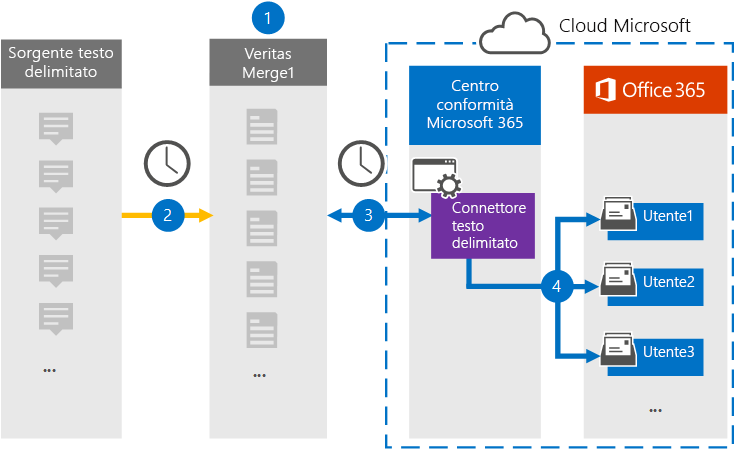

# Configurare un connettore per l'archiviazione dei dati delimitati da testoSet up a connector to archive text-delimited data

Utilizzare un connettore di Globanet nel centro conformità di Microsoft 365 per importare e archiviare i dati delimitati da testo nelle cassette postali degli utenti nell'organizzazione Microsoft 365.Use a Globanet connector in the Microsoft 365 compliance center to import and archive text-delimited data to user mailboxes in your Microsoft 365 organization. [Globanet](https://globanet.com/merge1/) fornisce un connettore delimitato da testo configurato per acquisire elementi da un'origine dati di terze parti (su base regolare) e importare tali elementi in Microsoft 365.[Globanet](https://globanet.com/merge1/) provides a Text-Delimited connector that is configured to capture items from a third-party data source (on a regular basis) and import those items to Microsoft 365. Il connettore converte il contenuto dall'origine dati delimitata da testo a un formato di messaggio di posta elettronica e quindi importa tali elementi nella cassetta postale dell'utente in Microsoft 365.The connector converts content from the text-delimited data source to an email message format and then imports those items to the user's mailbox in Microsoft 365.

Dopo che i dati delimitati da testo sono archiviati nelle cassette postali degli utenti, è possibile applicare funzionalità di conformità di Microsoft 365, ad esempio conservazione per controversia legale, eDiscovery, criteri di conservazione e etichette per il mantenimento e conformità della comunicazione.After text-delimited data is stored in user mailboxes, you can apply Microsoft 365 compliance features such as Litigation Hold, eDiscovery, retention policies and retention labels, and communication compliance. L'utilizzo di un connettore zoom meetings per l'importazione e l'archiviazione dei dati in Microsoft 365 può aiutare l'organizzazione a rimanere conforme ai criteri governativi e normativi.Using a Zoom Meetings connector to import and archive data in Microsoft 365 can help your organization stay compliant with government and regulatory policies.

Dopo l'archiviazione, le comunicazioni di origine delimitate da testo possono essere conservate, controllate per la conformità e recuperate per eDiscovery e per la governance delle informazioni interne.Once archived, the Text-Delimited source communications can be retained, supervised for compliance, and retrieved for eDiscovery and internal Information Governance.

## Panoramica dell'archiviazione dell'origine delimitata da testoOverview of archiving the Text-Delimited source

Nella panoramica seguente viene illustrato il processo di utilizzo di un connettore per archiviare le informazioni di origine delimitate da testo in Microsoft 365.The following overview explains the process of using a connector to archive the Text-Delimited source information in Microsoft 365.

1. L'organizzazione opera con l'origine delimitata da testo per impostare e configurare un sito delimitato da testo.Your organization works with the Text-Delimited source to set up and configure a Text-Delimited site.

2. Una volta ogni 24 ore, i messaggi di chat provenienti dall'origine delimitata da testo vengono copiati nel sito Merge1 di Globanet.Once every 24 hours, chat messages from the Text-Delimited source are copied to the Globanet Merge1 site. Il connettore converte anche il contenuto in un formato di messaggio di posta elettronica.The connector also converts the content to an email message format.

3. Il connettore delimitato da testo creato nel centro conformità di Microsoft 365, si connette al sito di Globanet Merge1 ogni giorno e trasferisce i messaggi a una posizione di archiviazione sicura di Azure nel cloud Microsoft.The Text-Delimited connector that you create in the Microsoft 365 compliance center, connects to the Globanet Merge1 site every day and transfers the messages to a secure Azure Storage location in the Microsoft cloud.

4. Il connettore importa gli elementi del messaggio convertiti nelle cassette postali di utenti specifici utilizzando il valore della proprietà di *posta elettronica* del mapping automatico degli utenti, come descritto nel passaggio 3.The connector imports the converted message items to the mailboxes of specific users using the value of the *Email* property of the automatic user mapping as described in Step 3. Verrà creata una nuova sottocartella nella cartella posta in arrivo denominata **Text-Delimited** nelle cassette postali degli utenti e gli elementi del messaggio verranno importati nella cartella.A new subfolder in the Inbox folder named **Text- Delimited** will be created in the user mailboxes, and the message items will be imported to that folder. Il connettore esegue questa operazione utilizzando il valore della proprietà di *posta elettronica* .The connector does this by using the value of the *Email* property. Ogni messaggio contiene questa proprietà, che viene popolata con l'indirizzo di posta elettronica di ogni partecipante del messaggio.Every message contains this property, which is populated with the email address of every participant of the message.

## Prima di iniziareBefore you begin

- Creare un account Merge1 di Globanet per i connettori Microsoft.Create a Globanet Merge1 account for Microsoft connectors. A tale scopo, contattare il [supporto clienti di Globanet](https://globanet.com/ms-connectors-contact).To do this, contact [Globanet Customer Support](https://globanet.com/ms-connectors-contact). È necessario accedere a questo account quando si crea il connettore nel passaggio 1.You need to sign into this account when you create the connector in Step 1.

- L'utente che crea il connettore delimitato da testo nel passaggio 1 (e lo completa nel passaggio 3) deve essere assegnato al ruolo di importazione/esportazione delle cassette postali in Exchange Online.The user who creates the Text-Delimited connector in Step 1 (and completes it in Step 3) must be assigned to the Mailbox Import Export role in Exchange Online. Questo ruolo è necessario per aggiungere connettori nella pagina **dei connettori dati** nel centro conformità di Microsoft 365.This role is required to add connectors on the **Data connectors** page in the Microsoft 365 compliance center. Per impostazione predefinita, questo ruolo non è assegnato a nessun gruppo di ruoli in Exchange Online.By default, this role is not assigned to any role group in Exchange Online. È possibile aggiungere il ruolo import export delle cassette postali al gruppo di ruoli Gestione organizzazione in Exchange Online.You can add the Mailbox Import Export role to the Organization Management role group in Exchange Online. In alternativa, è possibile creare un gruppo di ruoli, assegnare il ruolo di esportazione delle cassette postali e quindi aggiungere gli utenti corretti come membri.Or you can create a role group, assign the Mailbox Import Export role, and then add the appropriate users as members. Per ulteriori informazioni, vedere la sezione creare gruppi di [ruoli](https://docs.microsoft.com/Exchange/permissions-exo/role-groups#create-role-groups) o [modificare gruppi di ruoli](https://docs.microsoft.com/Exchange/permissions-exo/role-groups#modify-role-groups) nell'articolo "gestire i gruppi di ruoli in Exchange Online".For more information, see the [Create role groups](https://docs.microsoft.com/Exchange/permissions-exo/role-groups#create-role-groups) or [Modify role groups](https://docs.microsoft.com/Exchange/permissions-exo/role-groups#modify-role-groups) sections in the article "Manage role groups in Exchange Online".

## Passaggio 1: configurare il connettore delimitato da testoStep 1: Set up the Text-Delimited connector

Il primo passaggio consiste nell'accedere alla pagina **dei connettori dati** nel centro conformità di Microsoft 365 e creare un connettore per i dati delimitati da testo.The first step is to access to the **Data Connectors** page in the Microsoft 365 compliance center and create a connector for text-delimited data.

1. Andare a [https://compliance.microsoft.com](https://compliance.microsoft.com/) e quindi fare clic su **connettori dati**  >  **delimitati da testo**.Go to [https://compliance.microsoft.com](https://compliance.microsoft.com/) and then click **Data connectors** > **Text-Delimited**.

2. Nella pagina Descrizione prodotto **delimitato da testo** fare clic su **Aggiungi connettore**.On the **Text-Delimited** product description page, click **Add connector**.

3. Nella pagina **condizioni del servizio** fare clic su **Accetto**.On the **Terms of service** page, click **Accept**.

4. Immettere un nome univoco che identifichi il connettore e quindi fare clic su **Avanti**.Enter a unique name that identifies the connector, and then click **Next**.

5. Accedere al proprio account di Merge1 per configurare il connettore.Sign in to your Merge1 account to configure the connector.

## Passaggio 2: configurare il connettore delimitato da testo nel sito di Merge1 di GlobanetStep 2: Configure the Text-delimited connector on the Globanet Merge1 site

Il secondo passaggio consiste nel configurare il connettore delimitato da testo nel sito di Merge1.The second step is to configure the Text-Delimited connector in the Merge1 site. Per informazioni sulla configurazione del connettore delimitato da testo nel sito di Globanet Merge1, vedere [Merge1 di terze parti dei connettori utente](https://docs.ms.merge1.globanetportal.com/Merge1%20Third-Party%20Connectors%20Text-Delimited%20User%20Guide%20.pdf).For information about configuring  the Text-Delimited connector on the Globanet Merge1 site, see [Merge1 Third-Party Connectors User Guide](https://docs.ms.merge1.globanetportal.com/Merge1%20Third-Party%20Connectors%20Text-Delimited%20User%20Guide%20.pdf).

Dopo aver fatto clic su **salva & fine**, tornare al centro conformità Microsoft 365 alla pagina **mapping utenti** della procedura guidata del connettore.After you click **Save & Finish**, you are returned to the Microsoft 365 compliance center, to the **User mapping** page of the connector wizard.

## Passaggio 3: mappare gli utenti e completare la configurazione del connettoreStep 3: Map users and complete the connector setup

Per eseguire il mapping degli utenti e completare la configurazione del connettore nel centro conformità di Microsoft 365, eseguire la procedura seguente:To map users and complete the connector setup in the Microsoft 365 compliance center, follow these steps:

1. Nella pagina mapping **utenti esterni a Microsoft 365** , abilitare il mapping automatico degli utenti.On the **Map external users to Microsoft 365 users** page, enable automatic user mapping. Gli elementi di origine delimitati da testo includono una proprietà denominata *posta elettronica*, che contiene gli indirizzi di posta elettronica per gli utenti dell'organizzazione.The Text- Delimited source items include a property called *Email*, which contains email addresses for users in your organization. Se il connettore può associare questo indirizzo a un utente di Microsoft 365, gli elementi vengono importati nella cassetta postale dell'utente.If the connector can associate this address with a Microsoft 365 user, the items are imported to that user’s mailbox.

2. Nella pagina **consenso amministratore** fare clic sul pulsante **Fornisci consenso** .On the **Admin Consent** page, click the **Provide Consent** button. L'utente verrà reindirizzato al sito Microsoft.You will be redirected to the Microsoft site. Fare clic su **accetta** per fornire il consenso.Click **Accept** to provide the consent.

   L'organizzazione deve autorizzare il servizio di importazione di Office 365 per accedere ai dati delle cassette postali nell'organizzazione.Your organization must consent to allow the Office 365 Import service to access mailbox data in your organization. Per fornire il consenso dell'amministratore, è necessario essere connessi con le credenziali di un amministratore globale di Microsoft 365 e quindi accettare la richiesta di consenso.To provide admin consent, you must be signed in with the credentials of a Microsoft 365 global admin, and then accept the consent request. Se non è stato eseguito l'accesso come amministratore globale, è possibile accedere a [Questa pagina](https://login.microsoftonline.com/common/oauth2/authorize?client_id=570d0bec-d001-4c4e-985e-3ab17fdc3073&response_type=code&redirect_uri=https://portal.azure.com/&nonce=1234&prompt=admin_consent) ed eseguire l'accesso con le credenziali di amministratore globale per accettare la richiesta.If you aren't signed in as a global admin, you can go to [this page](https://login.microsoftonline.com/common/oauth2/authorize?client_id=570d0bec-d001-4c4e-985e-3ab17fdc3073&response_type=code&redirect_uri=https://portal.azure.com/&nonce=1234&prompt=admin_consent) and sign in using global admin credentials to accept the request.

3. Fare clic su **Avanti**, esaminare le impostazioni, quindi passare alla pagina **connettori dati** per visualizzare lo stato di avanzamento del processo di importazione per il nuovo connettore.Click **Next**, review your settings, and then go to the **Data connectors** page to see the progress of the import process for the new connector.

## Passaggio 4: monitorare il connettore delimitato da testoStep 4: Monitor the text-delimited connector

Dopo aver creato il connettore delimitato da testo, è possibile visualizzare lo stato del connettore nel centro conformità di Microsoft 365.After you create the Text- Delimited connector, you can view the connector status in the Microsoft 365 compliance center.

1. Andare a [https://compliance.microsoft.com](https://compliance.microsoft.com) e fare clic su **connettori dati** nel NAV sinistro.Go to [https://compliance.microsoft.com](https://compliance.microsoft.com) and click **Data connectors** in the left nav.

2. Fare clic sulla scheda **connettori** e quindi selezionare il connettore **delimitato da testo** per visualizzare la pagina del riquadro a comparsa, che contiene le proprietà e le informazioni sul connettore.Click the **Connectors** tab and then select the **Text- Delimited** connector to display the flyout page, which contains the properties and information about the connector.

3. In **stato connettore con origine**fare clic sul collegamento **Scarica log** per aprire o salvare il registro di stato del connettore.Under **Connector status with source**, click the **Download log** link to open (or save) the status log for the connector. Questo log contiene informazioni sui dati che sono stati importati nel cloud Microsoft.This log contains information about the data that has been imported to the Microsoft cloud.

## Problemi notiKnown issues

- Al momento, non è supportato l'importazione di allegati o elementi di dimensioni superiori a 10 MB.At this time, we don't support importing attachments or items that are larger than 10 MB. Il supporto per gli elementi di grandi dimensioni sarà disponibile in un secondo momento.Support for larger items will be available at a later date.
