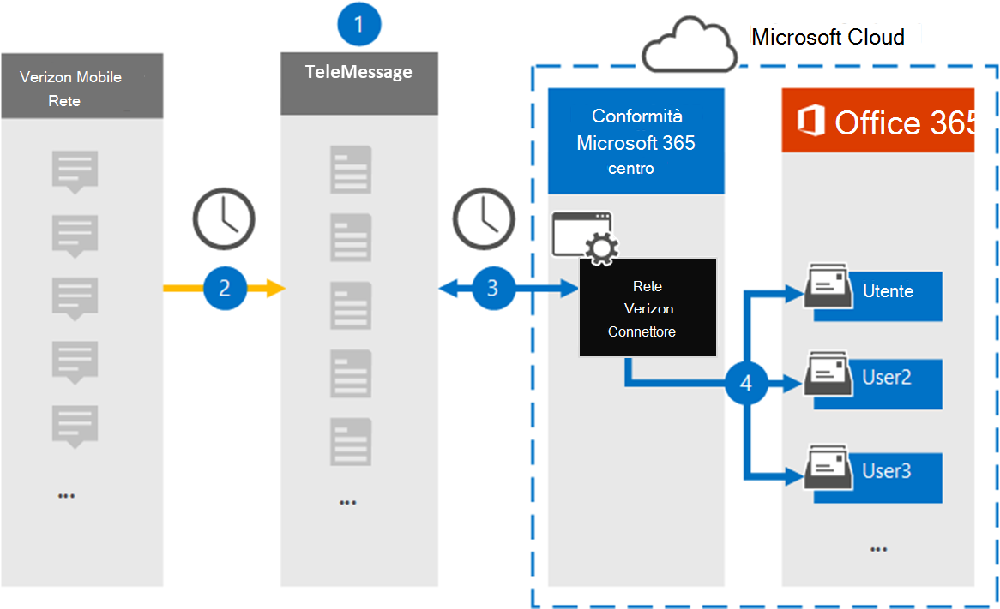

# Configurare un connettore per l'archiviazione dei dati di rete di Verizon

Utilizzare il connettore TeleMessage nel centro conformità di Microsoft 365 per importare e archiviare i dati del servizio di messaggistica breve (SMS) e del servizio di messaggistica multimediale (MMS) dalla rete Verizon. Dopo aver configurato e configurato un connettore, si connette alla rete Verizon dell'organizzazione una volta al giorno e importa i dati SMS e MMS nelle cassette postali in Microsoft 365.

Dopo che i dati del connettore di rete di Verizon sono archiviati nelle cassette postali degli utenti, è possibile applicare le funzionalità di conformità di Microsoft 365 come il blocco per controversia legale, la ricerca di contenuto e i criteri di conservazione di Microsoft 365 Ad esempio, è possibile cercare i messaggi SMS e MMS di Verizon utilizzando la ricerca contenuto o associare la cassetta postale che contiene i dati di rete Verizon con un custode in un caso avanzato di eDiscovery. L'utilizzo di un connettore di rete Verizon per l'importazione e l'archiviazione dei dati in Microsoft 365 può aiutare l'organizzazione a rimanere conforme ai criteri governativi e normativi.

## Panoramica dell'archiviazione dei dati di rete di Verizon

Nella panoramica seguente viene illustrato il processo di utilizzo di un connettore per l'archiviazione dei dati di rete di Verizon in Microsoft 365.

1. L'organizzazione funziona con TeleMessage e Verizon per configurare un connettore di rete Verizon. Per ulteriori informazioni, vedere [Verizon Network Archiver](https://www.telemessage.com/office365-activation-for-verizon-network-archiver/).

2. Una volta che ogni 24 ore, i messaggi SMS e MMS provenienti dalla rete Verizon dell'organizzazione vengono copiati nel sito di telemessaggio.

3. Il connettore di rete Verizon creato nel centro conformità Microsoft 365 si connette al sito di telemessaggio ogni giorno e trasferisce i messaggi SMS e MMS dalle 24 ore precedenti a una posizione di archiviazione sicura di Azure nel cloud Microsoft. Il connettore converte anche il contenuto dei messaggi SMS e MMS in un formato di messaggio di posta elettronica.

4. Il connettore importa gli elementi di comunicazione per dispositivi mobili sulla cassetta postale di un utente specifico. Una nuova cartella denominata **Verizon SMS/MMS Network Archiver** viene creata nella cassetta postale dell'utente specifico e gli elementi vengono importati. Il connettore esegue questo mapping utilizzando il valore della proprietà dell' *indirizzo di posta elettronica dell'utente* . Ogni messaggio SMS e MMS contiene questa proprietà, che viene popolata con l'indirizzo di posta elettronica di ogni partecipante del messaggio.

   Oltre a eseguire il mapping automatico degli utenti utilizzando il valore della proprietà dell' *indirizzo di posta elettronica dell'utente* , è inoltre possibile implementare il mapping personalizzato caricando un file di mapping CSV. Questo file di mapping contiene il numero di cellulare e l'indirizzo di posta elettronica Microsoft 365 corrispondente per gli utenti dell'organizzazione. Se si abilitano sia il mapping automatico degli utenti che il mapping personalizzato, per ogni elemento di Verizon il connettore analizza il file di mapping personalizzato. Se non trova un utente valido di Microsoft 365 che corrisponde al numero di cellulare di un utente, il connettore utilizzerà i valori della proprietà dell'indirizzo di posta elettronica dell'elemento che sta tentando di importare. Se il connettore non trova un utente valido di Microsoft 365 nel file di mapping personalizzato o nella proprietà dell'indirizzo di posta elettronica dell'elemento Verizon, l'elemento non verrà importato.

## Prima di iniziare

Alcuni dei passaggi di implementazione necessari per archiviare i dati di rete di Verizon sono esterni a Microsoft 365 e devono essere completati prima di poter creare un connettore nel centro conformità.

- Ordinare il [servizio di archiviazione Verizon Network da TeleMessage](https://www.telemessage.com/mobile-archiver/order-mobile-archiver-for-o365) e ottenere un account di amministrazione valido per l'organizzazione. Sarà necessario accedere a questo account quando si crea il connettore nel centro conformità.

- Ottenere l'account di rete Verizon e i dettagli dei contatti per la fatturazione in modo da poter compilare i moduli di onboarding del telemessaggio e ordinare il servizio di archiviazione dei messaggi da Verizon.

- Registrare tutti gli utenti che richiedono l'archiviazione di Verizon SMS e MMS nell'account TeleMessage. Quando si registrano gli utenti, assicurarsi di utilizzare lo stesso indirizzo di posta elettronica utilizzato per il proprio account Microsoft 365.

- I dipendenti devono disporre di telefoni cellulari aziendali e responsabili sulla rete mobile Verizon. L'archiviazione dei messaggi in Microsoft 365 non è disponibile per i dispositivi di proprietà dei dipendenti o per portare i propri dispositivi (BYOD).

- L'organizzazione deve autorizzare il servizio di importazione di Office 365 per accedere ai dati delle cassette postali nell'organizzazione. Sarà necessario fornire questo consenso quando si crea il connettore. Per acconsentire a questa richiesta, accedere a [Questa pagina](https://login.microsoftonline.com/common/oauth2/authorize?client_id=570d0bec-d001-4c4e-985e-3ab17fdc3073&response_type=code&redirect_uri=https://portal.azure.com/&nonce=1234&prompt=admin_consent), accedere con le credenziali di Microsoft 365 Global Admin e quindi accettare la richiesta. È necessario completare questo passaggio prima di poter creare correttamente Verizon Network Connector.

- All'utente che crea un connettore di rete Verizon deve essere assegnato il ruolo di importazione/esportazione delle cassette postali in Exchange Online. Questa operazione è necessaria per aggiungere connettori nella pagina **connettori dati** del centro conformità di Microsoft 365. Per impostazione predefinita, questo ruolo non è assegnato ad alcun gruppo di ruoli in Exchange Online. È possibile aggiungere il ruolo import export delle cassette postali al gruppo di ruoli Gestione organizzazione in Exchange Online. In alternativa, è possibile creare un gruppo di ruoli, assegnare il ruolo di esportazione delle cassette postali e quindi aggiungere gli utenti corretti come membri. Per ulteriori informazioni, vedere la sezione creare gruppi di [ruoli](https://docs.microsoft.com/Exchange/permissions-exo/role-groups#create-role-groups) o [modificare gruppi di ruoli](https://docs.microsoft.com/Exchange/permissions-exo/role-groups#modify-role-groups) nell'articolo "gestire i gruppi di ruoli in Exchange Online".

## Creare un connettore di rete Verizon

Dopo aver completato i prerequisiti descritti nella sezione precedente, è possibile creare il connettore di rete Verizon nel centro conformità di Microsoft 365. Il connettore utilizza le informazioni fornite per la connessione al sito di telemessaggio e il trasferimento dei messaggi SMS e MMS nelle caselle della cassetta postale dell'utente corrispondente in Microsoft 365.

1. Andare a [https://compliance.microsoft.com](https://compliance.microsoft.com) e quindi fare clic su **connettori dati**di  >  **rete Verizon**.

2. Nella pagina Descrizione prodotto **Verizon Network** fare clic su **Aggiungi connettore**

3. Nella pagina **condizioni del servizio** fare clic su **Accetto**.

4. Nella pagina **accesso a telemessaggio** , in passaggio 3, immettere le informazioni necessarie nelle caselle seguenti e quindi fare clic su **Avanti**.
  
   - **Nome utente:** Nome utente del telemessaggio.

   - **Password:** La password del telemessaggio.

5. Dopo aver creato il connettore, è possibile chiudere la finestra popup e passare alla pagina successiva.

6. Nella pagina **mapping utenti** abilitare il mapping automatico degli utenti e fare clic su **Avanti**. Nel caso in cui sia necessario un mapping personalizzato caricare un file CSV e fare clic su **Avanti**.

7. Fornire il consenso dell'amministratore e quindi fare clic su **Avanti**.

   Per fornire il consenso dell'amministratore, è necessario essere connessi con le credenziali di un amministratore globale di Office 365 e quindi accettare la richiesta di consenso. Se non è stato eseguito l'accesso come amministratore globale, è possibile accedere a [Questa pagina](https://login.microsoftonline.com/common/oauth2/authorize?client_id=570d0bec-d001-4c4e-985e-3ab17fdc3073&response_type=code&redirect_uri=https://portal.azure.com/&nonce=1234&prompt=admin_consent) ed eseguire l'accesso con le credenziali di amministratore globale per accettare la richiesta.

8. Esaminare le impostazioni e quindi fare clic su **fine** per creare il connettore.

9. Passare alla scheda Connettori della pagina **connettori dati** per visualizzare lo stato di avanzamento del processo di importazione per il nuovo connettore.

## Problemi noti

- Al momento, non è supportato l'importazione di allegati o elementi di dimensioni superiori a 10 MB. Il supporto per gli elementi di grandi dimensioni sarà disponibile in un secondo momento.
