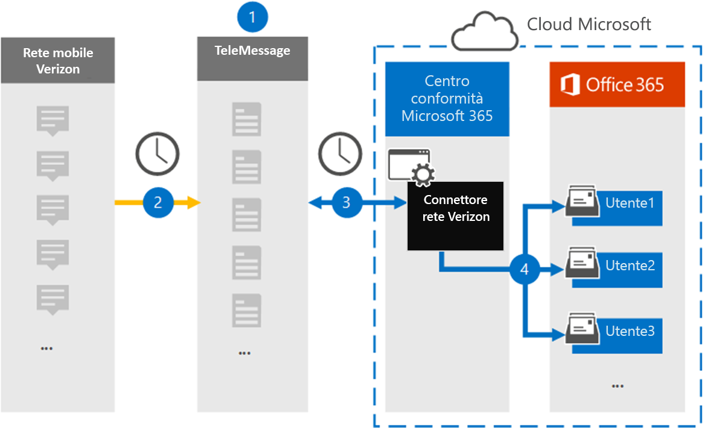

# Configurare un connettore per archiviare i dati di Verizon Network

Utilizzare il connettore TeleMessage nel Centro conformità Microsoft 365 per importare e archiviare i dati del servizio di messaggistica breve (SMS) e mms (Multimedia Messaging Service) da Verizon Network. Dopo aver configurato e configurato un connettore, si connette alla rete Verizon dell'organizzazione una volta al giorno e importa i dati di SMS e MMS nelle cassette postali in Microsoft 365.

Dopo aver archiviato i dati del connettore di rete Verizon nelle cassette postali degli utenti, è possibile applicare ai dati di Verizon funzionalità di conformità Microsoft 365 quali conservazione per controversia legale, Ricerca contenuto e criteri di conservazione Microsoft 365. Ad esempio, è possibile cercare i messaggi di Verizon SMS e MMS utilizzando Ricerca contenuto o associare la cassetta postale che contiene i dati di Verizon Network a un responsabile in un caso Advanced eDiscovery caso. L'utilizzo di un connettore di rete Verizon per importare e archiviare i dati in Microsoft 365 può aiutare l'organizzazione a rimanere conforme ai criteri governativi e normativi.

## Panoramica dell'archiviazione dei dati di Verizon Network

Nella panoramica seguente viene illustrato il processo di utilizzo di un connettore per archiviare i dati della rete Verizon in Microsoft 365.

1. L'organizzazione collabora con TeleMessage e Verizon per configurare un connettore di rete Verizon. Per ulteriori informazioni, vedere [Verizon Network Archiver.](https://www.telemessage.com/office365-activation-for-verizon-network-archiver/)

2. Una volta ogni 24 ore, i messaggi SMS mms dalla rete Verizon dell'organizzazione vengono copiati nel sito TeleMessage.

3. Il connettore di rete Verizon creato nel Centro conformità Microsoft 365 si connette ogni giorno al sito TeleMessage e trasferisce i messaggi SMS e MMS dalle 24 ore precedenti a una posizione Archiviazione di Azure sicura nel cloud Microsoft. Il connettore converte anche il contenuto dei messaggi SMS MMS in un formato di messaggio di posta elettronica.

4. Il connettore importa gli elementi di comunicazione mobile nella cassetta postale di un utente specifico. Viene creata una nuova cartella **denominata Verizon SMS/MMS Network Archiver** nella cassetta postale dell'utente specifico e gli elementi vengono importati in essa. Il connettore esegue questo mapping utilizzando il valore della proprietà Indirizzo di posta elettronica *dell'utente.* Ogni SMS e mms contiene questa proprietà, che viene popolata con l'indirizzo di posta elettronica di ogni partecipante del messaggio.

   Oltre al mapping automatico degli utenti tramite il valore della proprietà Indirizzo di posta elettronica *dell'utente,* è anche possibile implementare il mapping personalizzato caricando un file di mapping CSV. Questo file di mapping contiene il numero di telefono cellulare e l Microsoft 365 indirizzo di posta elettronica corrispondente per gli utenti dell'organizzazione. Se abiliti sia il mapping automatico degli utenti che il mapping personalizzato, per ogni elemento Verizon il connettore esamina innanzitutto il file di mapping personalizzato. Se non trova un utente Microsoft 365 valido corrispondente al numero di cellulare di un utente, il connettore utilizzerà i valori nella proprietà dell'indirizzo di posta elettronica dell'elemento che sta tentando di importare. Se il connettore non trova un utente Microsoft 365 valido nel file di mapping personalizzato o nella proprietà dell'indirizzo di posta elettronica dell'elemento Verizon, l'elemento non verrà importato.

## Prima di iniziare

Alcuni dei passaggi di implementazione necessari per archiviare i dati di Rete Verizon sono esterni a Microsoft 365 e devono essere completati prima di poter creare un connettore nel Centro conformità.

- Ordina il [servizio Verizon Network Archiver da TeleMessage](https://www.telemessage.com/mobile-archiver/order-mobile-archiver-for-o365) e ottieni un account di amministrazione valido per la tua organizzazione. Sarà necessario accedere a questo account quando si crea il connettore nel Centro conformità.

- Ottieni il tuo account Verizon Network e i dettagli di contatto di fatturazione in modo da poter compilare i moduli di onboarding di TeleMessage e ordinare il servizio di archiviazione dei messaggi da Verizon.

- Registrare tutti gli utenti che richiedono l'archiviazione SMS Verizon e MMS nell'account TeleMessage. Quando si registrano gli utenti, assicurarsi di usare lo stesso indirizzo di posta elettronica utilizzato per l'account Microsoft 365 account.

- I dipendenti devono disporre di telefoni cellulari di proprietà aziendale e responsabili dell'azienda nella rete mobile Verizon. L'archiviazione dei Microsoft 365 non è disponibile per i dispositivi BYOD (Bring Your Own Devices) o di proprietà dei dipendenti.

- All'utente che crea un connettore di rete Verizon deve essere assegnato il ruolo Esportazione importazione cassette postali in Exchange Online. Questa operazione è necessaria per aggiungere connettori nella pagina **Connettori** dati nel Centro Microsoft 365 conformità. Per impostazione predefinita, questo ruolo non è assegnato ad alcun gruppo di ruoli in Exchange Online. È possibile aggiungere il ruolo Esportazione importazione cassette postali al gruppo di ruoli Gestione organizzazione in Exchange Online. In caso contrario, è possibile creare un gruppo di ruoli, assegnare il ruolo Importazione/Esportazione cassette postali e quindi aggiungere gli utenti appropriati come membri. Per ulteriori informazioni, vedere le sezioni [Create role groups](/Exchange/permissions-exo/role-groups#create-role-groups) o Modify role [groups](/Exchange/permissions-exo/role-groups#modify-role-groups) nell'articolo "Manage role groups in Exchange Online".

## Creare un connettore di rete Verizon

Dopo aver completato i prerequisiti descritti nella sezione precedente, è possibile creare il connettore di rete Verizon nel Centro Microsoft 365 conformità. Il connettore utilizza le informazioni fornite per connettersi al sito TeleMessage e trasferire i messaggi SMS e MMS alle caselle delle cassette postali dell'utente corrispondenti in Microsoft 365.

1. Vai a [https://compliance.microsoft.com](https://compliance.microsoft.com) e quindi fai clic su **Connettori dati**  >  **Verizon Network**.

2. Nella pagina **Descrizione del prodotto Verizon Network,** fare clic **su Aggiungi connettore**

3. Nella pagina **Condizioni di servizio** fare clic su **Accetta.**

4. Nella pagina **Accesso a TeleMessage,** in Passaggio 3, immettere le informazioni necessarie nelle caselle seguenti e quindi fare clic su **Avanti.**
  
   - **Nome utente:** Nome utente TeleMessage.

   - **Password:** Password TeleMessage.

5. Dopo aver creato il connettore, è possibile chiudere la finestra popup e passare alla pagina successiva.

6. Nella pagina **Mapping utenti** abilitare il mapping automatico degli utenti e fare clic su **Avanti.** Nel caso in cui sia necessario un mapping personalizzato caricare un file CSV e fare clic su **Avanti.**

7. Rivedere le impostazioni e quindi fare clic **su Fine** per creare il connettore.

8. Passare alla scheda Connettori nella **pagina Connettori dati** per visualizzare l'avanzamento del processo di importazione per il nuovo connettore.

## Problemi noti

- Al momento non è possibile importare allegati o elementi di dimensioni superiori a 10 MB. Il supporto per gli elementi più grandi sarà disponibile in un secondo momento.