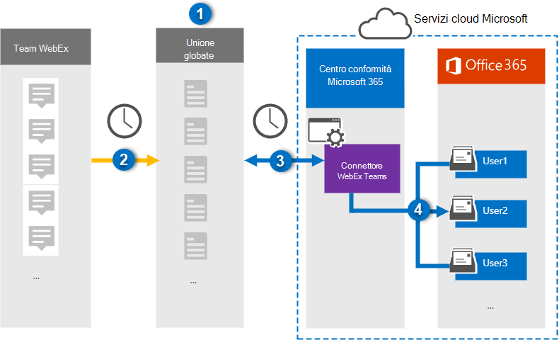

# Configurare un connettore per l'archiviazione dei dati di WebEx Teams (Preview)Set up a connector to archive Webex Teams data (preview)

Utilizzare un connettore di Globanet nel centro conformità di Microsoft 365 per importare e archiviare i dati da Team WebEx alle cassette postali degli utenti nell'organizzazione Microsoft 365.Use a Globanet connector in the Microsoft 365 compliance center to import and archive data from Webex Teams to user mailboxes in your Microsoft 365 organization. Globanet fornisce un connettore [WebEx teams](https://globanet.com/webex-teams/) configurato per acquisire gli elementi di comunicazione di Team WebEx e importarli in Microsoft 365.Globanet provides a [Webex Teams](https://globanet.com/webex-teams/) connector that is configured to capture Webex Teams communication items and import them to Microsoft 365. Il connettore converte i contenuti di Team WebEx, ad esempio 1:1 chat, conversazioni di gruppo, conversazioni di canale e allegati dall'account dei team WebEx dell'organizzazione, a un formato di messaggio di posta elettronica e quindi importa tali elementi nella cassetta postale dell'utente in Microsoft 365.The connector converts content from Webex Teams, such as 1:1 chats, group conversations, channel conversations, and attachments from your organization's Webex Teams account, to an email message format and then imports those items to the user's mailbox in Microsoft 365.

Dopo che i dati dei team di WebEx sono archiviati nelle cassette postali degli utenti, è possibile applicare funzionalità di conformità di Microsoft 365, ad esempio conservazione per controversia legale, eDiscovery, criteri di conservazione e etichette e conformità della comunicazione.After Webex Teams data is stored in user mailboxes, you can apply Microsoft 365 compliance features such as Litigation Hold, eDiscovery, retention policies and retention labels, and communication compliance. L'utilizzo di un connettore WebEx teams per l'importazione e l'archiviazione dei dati in Microsoft 365 può aiutare l'organizzazione a rimanere conforme ai criteri governativi e normativi.Using a Webex Teams connector to import and archive data in Microsoft 365 can help your organization stay compliant with government and regulatory policies.

## Panoramica dell'archiviazione dei team WebExOverview of archiving Webex Teams

Nella panoramica seguente viene illustrato il processo di utilizzo di un connettore per l'archiviazione dei dati di Team WebEx in Microsoft 365.The following overview explains the process of using a connector to archive Webex Teams data in Microsoft 365.

1. L'organizzazione lavora con i team WebEx per impostare e configurare un sito Team WebEx.Your organization works with Webex Teams to set up and configure a Webex Teams site.

2. Una volta ogni 24 ore, gli elementi di Team WebEx vengono copiati nel sito Merge1 di Globanet.Once every 24 hours, Webex Teams items are copied to the Globanet Merge1 site. Il connettore converte anche gli elementi di Team WebEx in un formato di messaggio di posta elettronica.The connector also converts the Webex Teams items to an email message format.

3. Il connettore di WebEx teams creato nel centro conformità Microsoft 365, si connette a Globanet Merge1 ogni giorno e trasferisce gli elementi del team WebEx in una posizione di archiviazione sicura di Azure nel cloud Microsoft.The Webex Teams connector that you create in the Microsoft 365 compliance center, connects to the Globanet Merge1 every day, and transfers the Webex Teams items to a secure Azure Storage location in the Microsoft cloud.

4. Il connettore consente di importare gli elementi nelle cassette postali di utenti specifici utilizzando il valore della proprietà di *posta elettronica* del mapping automatico degli utenti, come descritto nel [passaggio 3](#step-3-map-users-and-complete-the-connector-setup).The connector imports items to the mailboxes of specific users by using the value of the *Email* property of the automatic user mapping as described in [Step 3](#step-3-map-users-and-complete-the-connector-setup). Una sottocartella della cartella posta in arrivo denominata **Team WebEx** viene creata nelle cassette postali degli utenti e gli elementi vengono importati in tale cartella.A subfolder in the Inbox folder named **Webex Teams** is created in the user mailboxes, and the items are imported to that folder. Il connettore esegue questa operazione utilizzando il valore della proprietà di *posta elettronica* .The connector does this by using the value of the *Email* property. Ogni elemento di WebEx teams contiene questa proprietà, che viene popolata con l'indirizzo di posta elettronica di ogni partecipante all'elemento.Every Webex Teams item contains this property, which is populated with the email address of every participant of the item.

## Prima di iniziareBefore you begin

- Creare un account di Merge1 di Globanet accettando i termini e le condizioni per un connettore di WebEx teams.Create a Globanet Merge1 account by accepting the terms and conditions for a Webex Teams connector. A tale scopo, contattare il [supporto clienti di Globanet](https://globanet.com/contact-us).To do this, contact [Globanet Customer Support](https://globanet.com/contact-us). È necessario accedere a questo account quando si crea il connettore nel passaggio 1.You need to sign into this account when you create the connector in Step 1.

- Creare un'applicazione in [https://developer.webex.com/](https://developer.webex.com) per recuperare i dati dall'account di Team WebEx.Create an application at [https://developer.webex.com/](https://developer.webex.com) to fetch data from your Webex Teams account. Per istruzioni dettagliate sulla creazione dell'applicazione, vedere [Merge1 Third-Party Connectors user guide](https://docs.ms.merge1.globanetportal.com/Merge1%20Third-Party%20Connectors%20Webex%20Teams%20User%20Guide%20.pdf)For step-by step instructions about creating the application, see [Merge1 Third-Party Connectors User Guide](https://docs.ms.merge1.globanetportal.com/Merge1%20Third-Party%20Connectors%20Webex%20Teams%20User%20Guide%20.pdf)

   Quando si crea questa applicazione, la piattaforma WebEx genera un set di credenziali univoche.When you create this application, the Webex platform generates a set of unique credentials. Queste credenziali vengono utilizzate nel passaggio 2 quando si configura il connettore di WebEx Teams nel sito globale di Merge1.These credentials are used in Step 2 when you configure the Webex Teams connector on the Global Merge1 site.

- L'utente che crea il connettore di WebEx Teams nel passaggio 1 (e lo completa nel passaggio 3) deve essere assegnato al ruolo di esportazione delle cassette postali in Exchange Online.The user who creates the Webex Teams connector in Step 1 (and completes it in Step 3) must be assigned to the Mailbox Import Export role in Exchange Online. Questo ruolo è necessario per aggiungere connettori nella pagina **dei connettori dati** nel centro conformità di Microsoft 365.This role is required to add connectors on the **Data connectors** page in the Microsoft 365 compliance center. Per impostazione predefinita, questo ruolo non è assegnato a nessun gruppo di ruoli in Exchange Online.By default, this role is not assigned to any role group in Exchange Online. È possibile aggiungere il ruolo import export delle cassette postali al gruppo di ruoli Gestione organizzazione in Exchange Online.You can add the Mailbox Import Export role to the Organization Management role group in Exchange Online. In alternativa, è possibile creare un gruppo di ruoli, assegnare il ruolo di esportazione delle cassette postali e quindi aggiungere gli utenti corretti come membri.Or you can create a role group, assign the Mailbox Import Export role, and then add the appropriate users as members. Per ulteriori informazioni, vedere la sezione creare gruppi di [ruoli](https://docs.microsoft.com/Exchange/permissions-exo/role-groups#create-role-groups) o [modificare gruppi di ruoli](https://docs.microsoft.com/Exchange/permissions-exo/role-groups#modify-role-groups) nell'articolo "gestire i gruppi di ruoli in Exchange Online".For more information, see the [Create role groups](https://docs.microsoft.com/Exchange/permissions-exo/role-groups#create-role-groups) or [Modify role groups](https://docs.microsoft.com/Exchange/permissions-exo/role-groups#modify-role-groups) sections in the article "Manage role groups in Exchange Online".

## Passaggio 1: configurare il connettore di WebEx TeamsStep 1: Set up the Webex Teams connector

Il primo passaggio consiste nell'accedere ai connettori di **dati** e configurare il connettore di [WebEx teams](https://globanet.com/webex-teams/) .The first step is to gain access to the **Data Connectors** and set up the [Webex Teams](https://globanet.com/webex-teams/) connector.

1. Andare a [https://compliance.microsoft.com](https://compliance.microsoft.com/) e quindi fare clic su **connettori di dati**  >  **WebEx teams**.Go to [https://compliance.microsoft.com](https://compliance.microsoft.com/) and then click **Data connectors** > **Webex Teams**.

2. Nella pagina Descrizione prodotto **Team WebEx** fare clic su **Aggiungi connettore**.On the **Webex Teams** product description page, click **Add connector**.

3. Nella pagina **condizioni del servizio** fare clic su **Accetto**.On the **Terms of service** page, click **Accept**.

4. Immettere un nome univoco che identifichi il connettore e quindi fare clic su **Avanti**.Enter a unique name that identifies the connector, and then click **Next**.

5. Accedere al proprio account di Merge1 per configurare il connettore.Sign in to your Merge1 account to configure the connector.

## Passaggio 2: configurare il connettore di WebEx Teams nel sito Merge1 di GlobanetStep 2: Configure the Webex Teams connector on the Globanet Merge1 site

Il secondo passaggio consiste nel configurare il connettore di WebEx Teams nel sito di Merge1.The second step is to configure the Webex Teams connector on the Merge1 site. Per informazioni su come configurare il connettore di WebEx teams, vedere [Merge1 Third-Party Connectors user guide](https://docs.ms.merge1.globanetportal.com/Merge1%20Third-Party%20Connectors%20Webex%20Teams%20User%20Guide%20.pdf).For information about how to configure the Webex Teams connector, see [Merge1 Third-Party Connectors User Guide](https://docs.ms.merge1.globanetportal.com/Merge1%20Third-Party%20Connectors%20Webex%20Teams%20User%20Guide%20.pdf).

Dopo aver fatto clic su **salva & fine**, è possibile tornare al centro conformità di Microsoft 365 alla pagina **mapping utenti** nella procedura guidata del connettore.After you click **Save & Finish**, you are directed back to the Microsoft 365 compliance center, to the **User mapping** page in the connector wizard.

## Passaggio 3: mappare gli utenti e completare la configurazione del connettoreStep 3: Map users and complete the connector setup

Per eseguire il mapping degli utenti e completare la configurazione del connettore nel centro conformità di Microsoft 365, eseguire la procedura seguente:To map users and complete the connector setup in the Microsoft 365 compliance center, follow these steps:

1. Nella pagina **Mappa utenti di WebEx teams to Microsoft 365** Users, abilitare il mapping automatico degli utenti.On the **Map Webex Teams users to Microsoft 365 users** page, enable automatic user mapping. Gli elementi di WebEx teams includono una proprietà denominata *posta elettronica*, che contiene gli indirizzi di posta elettronica per gli utenti dell'organizzazione.The Webex Teams items include a property called *Email*, which contains email addresses for users in your organization. Se il connettore può associare questo indirizzo a un utente di Microsoft 365, gli elementi vengono importati nella cassetta postale dell'utente.If the connector can associate this address with a Microsoft 365 user, the items are imported to that user’s mailbox.

2. Nella pagina **consenso amministratore** fare clic sul pulsante **Fornisci consenso** .On the **Admin Consent** page, click the **Provide Consent** button. L'utente verrà reindirizzato al sito Microsoft.You will be redirected to the Microsoft site. Fare clic su **accetta** per fornire il consenso.Click **Accept** to provide the consent.
  
   L'organizzazione deve autorizzare il servizio di importazione di Office 365 per accedere ai dati delle cassette postali nell'organizzazione.Your organization must consent to allow the Office 365 Import service to access mailbox data in your organization. Per fornire il consenso dell'amministratore, è necessario essere connessi con le credenziali di un amministratore globale di Microsoft 365 e quindi accettare la richiesta di consenso.To provide admin consent, you must be signed in with the credentials of a Microsoft 365 global admin, and then accept the consent request. Se non è stato eseguito l'accesso come amministratore globale, è possibile accedere a [Questa pagina](https://login.microsoftonline.com/common/oauth2/authorize?client_id=570d0bec-d001-4c4e-985e-3ab17fdc3073&response_type=code&redirect_uri=https://portal.azure.com/&nonce=1234&prompt=admin_consent) ed eseguire l'accesso con le credenziali di amministratore globale per accettare la richiesta.If you aren't signed in as a global admin, you can go to [this page](https://login.microsoftonline.com/common/oauth2/authorize?client_id=570d0bec-d001-4c4e-985e-3ab17fdc3073&response_type=code&redirect_uri=https://portal.azure.com/&nonce=1234&prompt=admin_consent) and sign in using global admin credentials to accept the request.

3. Fare clic su **Avanti**, esaminare le impostazioni, quindi passare alla pagina **connettori dati** per visualizzare lo stato di avanzamento del processo di importazione per il nuovo connettore.Click **Next**, review your settings, and then go to the **Data connectors** page to see the progress of the import process for the new connector.

## Passaggio 4: monitorare il connettore di WebEx TeamsStep 4: Monitor the Webex Teams connector

Dopo aver creato il connettore WebEx teams, è possibile visualizzare lo stato del connettore nel centro conformità di Microsoft 365.After you create the Webex Teams connector, you can view the connector status in the Microsoft 365 compliance center.

1. Andare a [https://compliance.microsoft.com](https://compliance.microsoft.com) e fare clic su **connettori dati** nel NAV sinistro.Go to [https://compliance.microsoft.com](https://compliance.microsoft.com) and click **Data connectors** in the left nav.

2. Fare clic sulla scheda **connettori** e quindi selezionare il connettore **WebEx teams** per visualizzare la pagina del riquadro a comparsa, che contiene le proprietà e le informazioni sul connettore.Click the **Connectors** tab and then select the **Webex Teams** connector to display the flyout page, which contains the properties and information about the connector.

3. In **stato connettore con origine**fare clic sul collegamento **Scarica log** per aprire o salvare il registro di stato del connettore.Under **Connector status with source**, click the **Download log** link to open (or save) the status log for the connector. Questo log contiene informazioni sui dati che sono stati importati nel cloud Microsoft.This log contains information about the data that has been imported to the Microsoft cloud.

## Problemi notiKnown issues

- Al momento, non è supportato l'importazione di allegati di dimensioni superiori a 10 MB, ma il supporto per gli elementi di grandi dimensioni sarà disponibile in una data successiva.At this time, we don't support importing attachments larger than 10 MB but support for larger items will be available at a later date.
