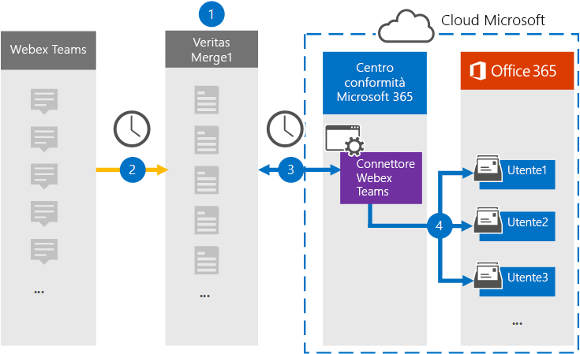

# Configurare un connettore per archiviare i dati di Webex TeamsSet up a connector to archive Webex Teams data

Usare un connettore Globanet nel Centro conformità Microsoft 365 per importare e archiviare i dati da Webex Teams alle cassette postali degli utenti nell'organizzazione di Microsoft 365.Use a Globanet connector in the Microsoft 365 compliance center to import and archive data from Webex Teams to user mailboxes in your Microsoft 365 organization. Globanet fornisce un [connettore Di Teams Webex](https://globanet.com/webex-teams/) configurato per acquisire elementi di comunicazione di Teams Webex e importarli in Microsoft 365.Globanet provides a [Webex Teams](https://globanet.com/webex-teams/) connector that is configured to capture Webex Teams communication items and import them to Microsoft 365. Il connettore converte il contenuto da Webex Teams, ad esempio chat 1:1, conversazioni di gruppo, conversazioni di canale e allegati dall'account Webex Teams dell'organizzazione, in un formato di messaggio di posta elettronica e quindi importa tali elementi nella cassetta postale dell'utente in Microsoft 365.The connector converts content from Webex Teams, such as 1:1 chats, group conversations, channel conversations, and attachments from your organization's Webex Teams account, to an email message format and then imports those items to the user's mailbox in Microsoft 365.

Dopo aver archiviato i dati di Webex Teams nelle cassette postali degli utenti, è possibile applicare le funzionalità di conformità di Microsoft 365, ad esempio il blocco per controversia legale, eDiscovery, i criteri di conservazione e le etichette di conservazione e la conformità delle comunicazioni.After Webex Teams data is stored in user mailboxes, you can apply Microsoft 365 compliance features such as Litigation Hold, eDiscovery, retention policies and retention labels, and communication compliance. L'uso di un connettore di Teams Webex per importare e archiviare i dati in Microsoft 365 può aiutare l'organizzazione a rimanere conforme ai criteri normativi e governativi.Using a Webex Teams connector to import and archive data in Microsoft 365 can help your organization stay compliant with government and regulatory policies.

## Panoramica dell'archiviazione dei dati di Webex TeamsOverview of archiving Webex Teams data

La panoramica seguente illustra il processo di utilizzo di un connettore per archiviare i dati di Teams Webex in Microsoft 365.The following overview explains the process of using a connector to archive Webex Teams data in Microsoft 365.

1. L'organizzazione collabora con Webex Teams per configurare un sito di Teams Webex.Your organization works with Webex Teams to set up and configure a Webex Teams site.

2. Una volta ogni 24 ore, gli elementi di Teams Webex vengono copiati nel sito Globanet Merge1.Once every 24 hours, Webex Teams items are copied to the Globanet Merge1 site. Il connettore converte inoltre gli elementi di Teams Webex in un formato di messaggio di posta elettronica.The connector also converts the Webex Teams items to an email message format.

3. Il connettore Di Teams Webex creato nel Centro conformità Microsoft 365, si connette a Globanet Merge1 ogni giorno e trasferisce gli elementi di Webex Teams in un percorso di archiviazione di Azure sicuro nel cloud Microsoft.The Webex Teams connector that you create in the Microsoft 365 compliance center, connects to the Globanet Merge1 every day, and transfers the Webex Teams items to a secure Azure Storage location in the Microsoft cloud.

4. Il connettore importa gli elementi nelle cassette postali di utenti specifici utilizzando il valore della proprietà *Email* del mapping automatico degli utenti, come descritto [nel passaggio 3.](#step-3-map-users-and-complete-the-connector-setup)The connector imports items to the mailboxes of specific users by using the value of the *Email* property of the automatic user mapping as described in [Step 3](#step-3-map-users-and-complete-the-connector-setup). Nelle cassette postali degli utenti viene creata una sottocartella nella cartella Posta in arrivo denominata **Webex Teams** e gli elementi vengono importati in tale cartella.A subfolder in the Inbox folder named **Webex Teams** is created in the user mailboxes, and the items are imported to that folder. Il connettore esegue questa operazione utilizzando il valore della *proprietà Email.*The connector does this by using the value of the *Email* property. Ogni elemento di Teams Webex contiene questa proprietà, che viene popolata con l'indirizzo di posta elettronica di ogni partecipante dell'elemento.Every Webex Teams item contains this property, which is populated with the email address of every participant of the item.

## Prima di iniziareBefore you begin

- Creare un account Globanet Merge1 per i connettori Microsoft.Create a Globanet Merge1 account for Microsoft connectors. Per creare questo account, contattare [il supporto clienti Di Globanet.](https://globanet.com/ms-connectors-contact)To create this account, contact [Globanet Customer Support](https://globanet.com/ms-connectors-contact). Si accederà a questo account quando si crea il connettore nel passaggio 1.You will sign into this account when you create the connector in Step 1.

- Creare un'applicazione in [https://developer.webex.com/](https://developer.webex.com) cui recuperare i dati dall'account di Teams Webex.Create an application at [https://developer.webex.com/](https://developer.webex.com) to fetch data from your Webex Teams account. Per istruzioni dettagliate sulla creazione dell'applicazione, vedere il Manuale dell'utente di [Merge1 Third-Party Connectors](https://docs.ms.merge1.globanetportal.com/Merge1%20Third-Party%20Connectors%20Webex%20Teams%20User%20Guide%20.pdf)For step-by step instructions about creating the application, see [Merge1 Third-Party Connectors User Guide](https://docs.ms.merge1.globanetportal.com/Merge1%20Third-Party%20Connectors%20Webex%20Teams%20User%20Guide%20.pdf)

   Quando si crea questa applicazione, la piattaforma Webex genera un set di credenziali univoche.When you create this application, the Webex platform generates a set of unique credentials. Queste credenziali vengono utilizzate nel passaggio 2 quando si configura il connettore di Teams Webex nel sito Di unione globale1.These credentials are used in Step 2 when you configure the Webex Teams connector on the Global Merge1 site.

- L'utente che crea il connettore di Teams Webex nel passaggio 1 (e lo completa nel passaggio 3) deve essere assegnato al ruolo di importazione/esportazione delle cassette postali in Exchange Online.The user who creates the Webex Teams connector in Step 1 (and completes it in Step 3) must be assigned to the Mailbox Import Export role in Exchange Online. Questo ruolo è necessario per aggiungere connettori nella pagina **Connettori** dati nel Centro conformità Microsoft 365.This role is required to add connectors on the **Data connectors** page in the Microsoft 365 compliance center. Per impostazione predefinita, questo ruolo non è assegnato a un gruppo di ruoli in Exchange Online.By default, this role is not assigned to a role group in Exchange Online. È possibile aggiungere il ruolo di importazione/esportazione delle cassette postali al gruppo di ruoli Gestione organizzazione in Exchange Online.You can add the Mailbox Import Export role to the Organization Management role group in Exchange Online. In or you can create a role group, assign the Mailbox Import Export role, and then add the appropriate users as members.Or you can create a role group, assign the Mailbox Import Export role, and then add the appropriate users as members. Per ulteriori informazioni, vedere le sezioni [Creazione](https://docs.microsoft.com/Exchange/permissions-exo/role-groups#create-role-groups) di gruppi di ruoli o Modifica gruppi [di](https://docs.microsoft.com/Exchange/permissions-exo/role-groups#modify-role-groups) ruoli nell'articolo "Gestire i gruppi di ruoli in Exchange Online".For more information, see the [Create role groups](https://docs.microsoft.com/Exchange/permissions-exo/role-groups#create-role-groups) or [Modify role groups](https://docs.microsoft.com/Exchange/permissions-exo/role-groups#modify-role-groups) sections in the article "Manage role groups in Exchange Online".

## Passaggio 1: Configurare il connettore Di Teams WebexStep 1: Set up the Webex Teams connector

Il primo passaggio consiste nell'ottenere l'accesso ai connettori **dati** e configurare il [connettore di Teams Webex.](https://globanet.com/webex-teams/)The first step is to gain access to the **Data Connectors** and set up the [Webex Teams](https://globanet.com/webex-teams/) connector.

1. Passare a [https://compliance.microsoft.com](https://compliance.microsoft.com/) e quindi fare clic su **Connettori dati**  >  **Webex Teams.**Go to [https://compliance.microsoft.com](https://compliance.microsoft.com/) and then click **Data connectors** > **Webex Teams**.

2. Nella pagina **di descrizione del prodotto Webex Teams** fare clic **su Aggiungi connettore.**On the **Webex Teams** product description page, click **Add connector**.

3. Nella pagina **Condizioni per il servizio** fare clic su **Accetta.**On the **Terms of service** page, click **Accept**.

4. Immettere un nome univoco che identifichi il connettore, quindi fare clic su **Avanti.**Enter a unique name that identifies the connector, and then click **Next**.

5. Accedere all'account Merge1 per configurare il connettore.Sign in to your Merge1 account to configure the connector.

## Passaggio 2: Configurare il connettore Di Teams Webex nel sito Globanet Merge1Step 2: Configure the Webex Teams connector on the Globanet Merge1 site

Il secondo passaggio consiste nel configurare il connettore di Teams Webex nel sito Merge1.The second step is to configure the Webex Teams connector on the Merge1 site. Per informazioni su come configurare il connettore Di Teams Webex, vedere il Manuale dell'utente di [Merge1 Third-Party Connectors.](https://docs.ms.merge1.globanetportal.com/Merge1%20Third-Party%20Connectors%20Webex%20Teams%20User%20Guide%20.pdf)For information about how to configure the Webex Teams connector, see [Merge1 Third-Party Connectors User Guide](https://docs.ms.merge1.globanetportal.com/Merge1%20Third-Party%20Connectors%20Webex%20Teams%20User%20Guide%20.pdf).

Dopo aver fatto **clic su & fine,** viene visualizzata la pagina **Mapping** utenti nella procedura guidata del connettore nel Centro conformità Microsoft 365.After you click **Save & Finish**, the **User mapping** page in the connector wizard in the Microsoft 365 compliance center is displayed.

## Passaggio 3: mappare gli utenti e completare la configurazione del connettoreStep 3: Map users and complete the connector setup

Per mappare gli utenti e completare la configurazione del connettore nel Centro conformità Microsoft 365, attenersi alla seguente procedura:To map users and complete the connector setup in the Microsoft 365 compliance center, follow these steps:

1. Nella pagina Mappa utenti di Teams Webex agli utenti di **Microsoft 365** abilitare il mapping automatico degli utenti.On the **Map Webex Teams users to Microsoft 365 users** page, enable automatic user mapping. Gli elementi di Teams Webex includono una proprietà denominata *Posta* elettronica, che contiene gli indirizzi di posta elettronica per gli utenti dell'organizzazione.The Webex Teams items include a property called *Email*, which contains email addresses for users in your organization. Se il connettore può associare questo indirizzo a un utente di Microsoft 365, gli elementi vengono importati nella cassetta postale dell'utente.If the connector can associate this address with a Microsoft 365 user, the items are imported to that user’s mailbox.

2. Fare **clic** su Avanti, rivedere le  impostazioni e quindi passare alla pagina Connettori dati per visualizzare l'avanzamento del processo di importazione per il nuovo connettore.Click **Next**, review your settings, and then go to the **Data connectors** page to see the progress of the import process for the new connector.

## Passaggio 4: monitorare il connettore di Teams WebexStep 4: Monitor the Webex Teams connector

Dopo aver creato il connettore Di Teams Webex, è possibile visualizzare lo stato del connettore nel Centro conformità Microsoft 365.After you create the Webex Teams connector, you can view the connector status in the Microsoft 365 compliance center.

1. Andare a [https://compliance.microsoft.com](https://compliance.microsoft.com) e fare clic su **Connettori dati** nel riquadro di spostamento sinistro.Go to [https://compliance.microsoft.com](https://compliance.microsoft.com) and click **Data connectors** in the left nav.

2. Fare clic **sulla scheda Connettori** e quindi selezionare il **connettore Di Teams Webex** per visualizzare la pagina a comparsa.Click the **Connectors** tab and then select the **Webex Teams** connector to display the flyout page. Questa pagina contiene le proprietà e le informazioni sul connettore.This page contains the properties and information about the connector.

3. In **Stato connettore con origine** fare clic sul collegamento Scarica **registro** per aprire (o salvare) il registro di stato per il connettore.Under **Connector status with source**, click the **Download log** link to open (or save) the status log for the connector. Questo log contiene informazioni sui dati importati nel cloud Microsoft.This log contains information about the data that has been imported to the Microsoft cloud.

## Problemi notiKnown issues

- Al momento, non è possibile importare allegati o elementi di dimensioni superiori a 10 MB.At this time, we don't support importing attachments or items that are larger than 10 MB. Il supporto per gli elementi più grandi sarà disponibile in un secondo momento.Support for larger items will be available at a later date.
