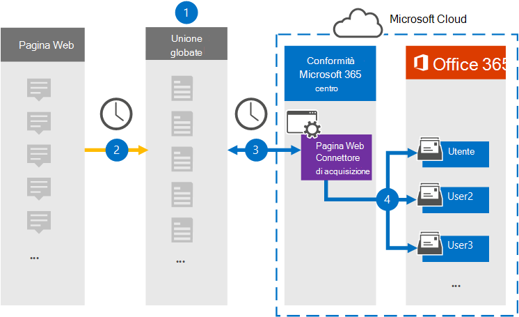

# Configurare un connettore per archiviare i dati della pagina WebSet up a connector to archive webpage data

Utilizzare un connettore Globanet nel Centro conformità Microsoft 365 per importare e archiviare i dati dalle pagine Web alle cassette postali degli utenti nell'organizzazione di Microsoft 365.Use a Globanet connector in the Microsoft 365 compliance center to import and archive data from webpages to user mailboxes in your Microsoft 365 organization. Globanet fornisce un [connettore di](https://globanet.com/webpage-capture) acquisizione pagine Web che acquisisce pagine Web specifiche (ed eventuali collegamenti in tali pagine) in un sito Web specifico o in un intero dominio.Globanet provides a [Webpage Capture](https://globanet.com/webpage-capture) connector that captures specific webpages (and any links on those pages) in a specific website or an entire domain. Il connettore converte il contenuto della pagina Web in formato PDF, PNG o personalizzato, quindi allega i file convertiti a un messaggio di posta elettronica e quindi importa tali elementi di posta elettronica nelle cassette postali degli utenti in Microsoft 365.The connector converts the webpage content to a PDF, PNG, or custom file format and then attaches the converted files to an email message and then imports those email items to user mailboxes in Microsoft 365.

Dopo aver archiviato il contenuto delle pagine Web nelle cassette postali degli utenti, è possibile applicare le funzionalità di conformità di Microsoft 365, ad esempio conservazione per controversia legale, eDiscovery, criteri di conservazione ed etichette di conservazione.After webpage content is stored in user mailboxes, you can apply Microsoft 365 compliance features such as Litigation Hold, eDiscovery, and retention policies and retention labels. L'utilizzo di un connettore di acquisizione pagine Web per importare e archiviare dati in Microsoft 365 può aiutare l'organizzazione a rimanere conforme ai criteri governativi e normativi.Using a Webpage Capture connector to import and archive data in Microsoft 365 can help your organization stay compliant with government and regulatory policies.

## Panoramica dell'archiviazione dei dati delle pagine WebOverview of archiving webpage data

Nella panoramica seguente viene illustrato il processo di utilizzo di un connettore per archiviare il contenuto delle pagine Web in Microsoft 365.The following overview explains the process of using a connector to archive webpage content in Microsoft 365.

1. L'organizzazione collabora con l'origine della pagina Web per configurare un sito di acquisizione pagine Web.Your organization works with the webpage source to set up and configure a Webpage Capture site.

2. Una volta ogni 24 ore, gli elementi delle origini della pagina Web vengono copiati nel sito Globanet Merge1.Once every 24 hours, the webpage sources items are copied to the Globanet Merge1 site. Il connettore inoltre converte e allega il contenuto di una pagina Web a un messaggio di posta elettronica.The connector also converts and attaches the content of a webpage to an email message.

3. Il connettore di acquisizione pagine Web creato nel Centro conformità Microsoft 365, si connette al sito Globanet Merge1 ogni giorno e trasferisce gli elementi della pagina Web in una posizione sicura di Archiviazione di Azure nel cloud Microsoft.The Webpage Capture connector that you create in the Microsoft 365 compliance center, connects to the Globanet Merge1 site every day and transfers the webpage items to a secure Azure Storage location in the Microsoft cloud.

4. Il connettore importa gli elementi della pagina Web convertiti nelle cassette postali di utenti specifici utilizzando il valore della proprietà *Email* del mapping automatico degli utenti, come descritto nel [passaggio 3.](#step-3-map-users-and-complete-the-connector-setup)The connector imports the converted webpage items to the mailboxes of specific users by using the value of the *Email* property of the automatic user mapping as described in [Step 3](#step-3-map-users-and-complete-the-connector-setup). Nelle cassette postali degli utenti viene creata una sottocartella nella cartella Posta in arrivo denominata **Acquisizione** pagine Web e gli elementi della pagina Web vengono importati in tale cartella.A subfolder in the Inbox folder named **Webpage Capture** is created in the user mailboxes, and the webpage items are imported to that folder. Il connettore esegue questa operazione utilizzando il valore della *proprietà Email.*The connector does this by using the value of the *Email* property. Ogni elemento della pagina Web contiene questa proprietà, che viene popolata con gli indirizzi di posta elettronica forniti quando si configura il connettore di acquisizione pagine Web [nel passaggio 2.](#step-2-configure-the-webpage-capture-connector-on-the-globanet-merge1-site)Every webpage item contains this property, which is populated with the email addresses provided when you configure the Webpage Capture connector in [Step 2](#step-2-configure-the-webpage-capture-connector-on-the-globanet-merge1-site).

## Prima di iniziareBefore you begin

- Creare un account Globanet Merge1 per i connettori Microsoft.Create a Globanet Merge1 account for Microsoft connectors. Per creare questo account, contattare il [Supporto clienti Globanet.](https://globanet.com/ms-connectors-contact/)To create this account, contact [Globanet Customer Support](https://globanet.com/ms-connectors-contact/). Si accederà a questo account quando si crea il connettore nel passaggio 1.You will sign into this account when you create the connector in Step 1.

- È necessario utilizzare il supporto di Globanet per configurare un formato di file personalizzato in cui convertire gli elementi della pagina Web.You need to work with Globanet support to set up a custom file format to convert the webpage items to. Per ulteriori informazioni, vedere il Manuale dell'utente di Merge1 Third-Party Connectors inFor more information, see the Merge1 Third-Party Connectors User Guide in 

- L'utente che crea il connettore di acquisizione pagine Web nel passaggio 1 (e lo completa nel passaggio 3) deve essere assegnato al ruolo Di esportazione importazione cassette postali in Exchange Online.The user who creates the Webpage Capture connector in Step 1 (and completes it in Step 3) must be assigned to the Mailbox Import Export role in Exchange Online. Questo ruolo è necessario per aggiungere connettori nella pagina **Connettori dati** nel Centro conformità Microsoft 365.This role is required to add connectors on the **Data connectors** page in the Microsoft 365 compliance center. Per impostazione predefinita, questo ruolo non viene assegnato a un gruppo di ruoli in Exchange Online.By default, this role is not assigned to a role group in Exchange Online. È possibile aggiungere il ruolo Esportazione importazione cassette postali al gruppo di ruoli Gestione organizzazione in Exchange Online.You can add the Mailbox Import Export role to the Organization Management role group in Exchange Online. In caso contrario, è possibile creare un gruppo di ruoli, assegnare il ruolo Importazione/Esportazione cassette postali e quindi aggiungere gli utenti appropriati come membri.Or you can create a role group, assign the Mailbox Import Export role, and then add the appropriate users as members. Per ulteriori informazioni, vedere le sezioni [Create role groups](/Exchange/permissions-exo/role-groups#create-role-groups) o Modify role [groups](/Exchange/permissions-exo/role-groups#modify-role-groups) nell'articolo "Manage role groups in Exchange Online".For more information, see the [Create role groups](/Exchange/permissions-exo/role-groups#create-role-groups) or [Modify role groups](/Exchange/permissions-exo/role-groups#modify-role-groups) sections in the article "Manage role groups in Exchange Online".

## Passaggio 1: Configurare il connettore di acquisizione pagine WebStep 1: Set up the Webpage Capture connector

Il primo passaggio consiste nell'accedere ai **connettori** dati e creare un connettore per i dati di origine della pagina Web.The first step is to access to the **Data Connectors** and create a connector for Web Page source data.

1. Passare a [https://compliance.microsoft.com](https://compliance.microsoft.com/) e quindi fare clic su **Connettori dati** Acquisizione pagina  >  **Web**.Go to [https://compliance.microsoft.com](https://compliance.microsoft.com/) and then click **Data connectors** > **Webpage Capture**.

2. Nella pagina **Descrizione prodotto acquisizione** pagina Web fare clic **su Aggiungi connettore.**On the **Webpage Capture** product description page, click **Add connector**.

3. Nella pagina **Condizioni di servizio** fare clic su **Accetta.**On the **Terms of service** page, click **Accept**.

4. Immettere un nome univoco che identifichi il connettore e quindi fare clic su **Avanti.**Enter a unique name that identifies the connector, and then click **Next**.

5. Accedere all'account Merge1 per configurare il connettore.Sign in to your Merge1 account to configure the connector.

## Passaggio 2: Configurare il connettore di acquisizione pagine Web nel sito Globanet Merge1Step 2: Configure the Webpage Capture connector on the Globanet Merge1 site

Il secondo passaggio consiste nel configurare il connettore di acquisizione pagine Web nel sito Globanet Merge1.The second step is to configure the Webpage Capture connector on the Globanet Merge1 site. Per informazioni su come configurare il connettore di acquisizione pagine Web, vedere [Merge1 Third-Party Connectors User Guide](https://docs.ms.merge1.globanetportal.com/Merge1%20Third-Party%20Connectors%20Web%20Page%20Capture%20User%20Guide%20.pdf).For information about how to configure the Webpage Capture connector, see [Merge1 Third-Party Connectors User Guide](https://docs.ms.merge1.globanetportal.com/Merge1%20Third-Party%20Connectors%20Web%20Page%20Capture%20User%20Guide%20.pdf).

Dopo aver fatto **clic su Salva & fine,** viene visualizzata la pagina **Mapping** utenti nella procedura guidata del connettore nel Centro conformità Microsoft 365.After you click **Save & Finish**, the **User mapping** page in the connector wizard in the Microsoft 365 compliance center is displayed.

## Passaggio 3: mappare gli utenti e completare la configurazione del connettoreStep 3: Map users and complete the connector setup

Per mappare gli utenti e completare la configurazione del connettore nel Centro conformità Microsoft 365, eseguire la procedura seguente:To map users and complete the connector setup in the Microsoft 365 compliance center, follow the steps below:

1. Nella pagina **Mappa pagina Web Acquisisci utenti a utenti di Microsoft 365** abilita il mapping automatico degli utenti.On the **Map Webpage Capture users to Microsoft 365 users** page, enable automatic user mapping. Gli elementi di acquisizione della pagina Web includono una proprietà denominata *Email*, che contiene gli indirizzi di posta elettronica per gli utenti dell'organizzazione.The Webpage Capture items include a property called *Email*, which contains email addresses for users in your organization. Se il connettore può associare questo indirizzo a un utente di Microsoft 365, gli elementi vengono importati nella cassetta postale dell'utente.If the connector can associate this address with a Microsoft 365 user, the items are imported to that user's mailbox.

2. Fare **clic** su Avanti, rivedere le impostazioni e passare alla pagina **Connettori** dati per visualizzare l'avanzamento del processo di importazione per il nuovo connettore.Click **Next**, review your settings, and go to the **Data connectors** page to see the progress of the import process for the new connector.

## Passaggio 4: Monitorare il connettore di acquisizione pagine WebStep 4: Monitor the Webpage Capture connector

Dopo aver creato il connettore di acquisizione pagine Web, è possibile visualizzare lo stato del connettore nel Centro conformità Microsoft 365.After you create the Webpage Capture connector, you can view the connector status in the Microsoft 365 compliance center.

1. Vai a [https://compliance.microsoft.com](https://compliance.microsoft.com) e fai clic su **Connettori dati** nel riquadro di spostamento sinistro.Go to [https://compliance.microsoft.com](https://compliance.microsoft.com) and click **Data connectors** in the left nav.

2. Fare clic **sulla scheda Connettori** e quindi selezionare il connettore **di acquisizione pagine** Web per visualizzare la pagina a comparsa.Click the **Connectors** tab and then select the **Webpage Capture** connector to display the flyout page. Questa pagina contiene le proprietà e le informazioni sul connettore.This page contains the properties and information about the connector.

3. In **Stato connettore con origine** fare clic sul collegamento Scarica **registro** per aprire (o salvare) il registro di stato per il connettore.Under **Connector status with source**, click the **Download log** link to open (or save) the status log for the connector. Questo registro contiene i dati importati nel cloud Microsoft.This log contains data that has been imported to the Microsoft cloud.

## Problemi notiKnown issues

- Al momento non è possibile importare allegati o elementi di dimensioni superiori a 10 MB.At this time, we don't support importing attachments or items that are larger than 10 MB. Il supporto per gli elementi più grandi sarà disponibile in un secondo momento.Support for larger items will be available at a later date.