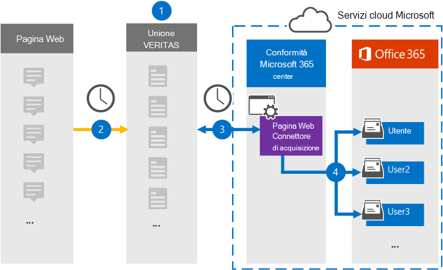

# Configurare un connettore per archiviare i dati della pagina Web

Utilizzare un connettore Globanet nel Centro conformità Microsoft 365 per importare e archiviare i dati dalle pagine Web alle cassette postali degli utenti nell'organizzazione di Microsoft 365. Globanet fornisce un [connettore di](https://globanet.com/webpage-capture) acquisizione pagine Web che acquisisce pagine Web specifiche (ed eventuali collegamenti in tali pagine) in un sito Web specifico o in un intero dominio. Il connettore converte il contenuto della pagina Web in formato PDF, PNG o personalizzato, quindi allega i file convertiti a un messaggio di posta elettronica e quindi importa tali elementi di posta elettronica nelle cassette postali degli utenti in Microsoft 365.

Dopo aver archiviato il contenuto delle pagine Web nelle cassette postali degli utenti, è possibile applicare le funzionalità di conformità di Microsoft 365, ad esempio conservazione per controversia legale, eDiscovery, criteri di conservazione ed etichette di conservazione. L'utilizzo di un connettore di acquisizione pagine Web per importare e archiviare dati in Microsoft 365 può aiutare l'organizzazione a rimanere conforme ai criteri governativi e normativi.

## Panoramica dell'archiviazione dei dati delle pagine Web

Nella panoramica seguente viene illustrato il processo di utilizzo di un connettore per archiviare il contenuto delle pagine Web in Microsoft 365.

1. L'organizzazione collabora con l'origine della pagina Web per configurare un sito di acquisizione pagine Web.

2. Una volta ogni 24 ore, gli elementi delle origini della pagina Web vengono copiati nel sito Globanet Merge1. Il connettore inoltre converte e allega il contenuto di una pagina Web a un messaggio di posta elettronica.

3. Il connettore di acquisizione pagine Web creato nel Centro conformità Microsoft 365, si connette al sito Globanet Merge1 ogni giorno e trasferisce gli elementi della pagina Web in una posizione sicura di Archiviazione di Azure nel cloud Microsoft.

4. Il connettore importa gli elementi della pagina Web convertiti nelle cassette postali di utenti specifici utilizzando il valore della proprietà *Email* del mapping automatico degli utenti, come descritto nel [passaggio 3.](#step-3-map-users-and-complete-the-connector-setup) Nelle cassette postali degli utenti viene creata una sottocartella nella cartella Posta in arrivo denominata **Acquisizione** pagine Web e gli elementi della pagina Web vengono importati in tale cartella. Il connettore esegue questa operazione utilizzando il valore della *proprietà Email.* Ogni elemento della pagina Web contiene questa proprietà, che viene popolata con gli indirizzi di posta elettronica forniti quando si configura il connettore di acquisizione pagine Web [nel passaggio 2.](#step-2-configure-the-webpage-capture-connector-on-the-globanet-merge1-site)

## Prima di iniziare

- Creare un account Globanet Merge1 per i connettori Microsoft. Per creare questo account, contattare il [Supporto clienti Globanet.](https://globanet.com/ms-connectors-contact/) Si accederà a questo account quando si crea il connettore nel passaggio 1.

- È necessario utilizzare il supporto di Globanet per configurare un formato di file personalizzato in cui convertire gli elementi della pagina Web. Per ulteriori informazioni, vedere il Manuale dell'utente di Merge1 Third-Party Connectors in 

- L'utente che crea il connettore di acquisizione pagine Web nel passaggio 1 (e lo completa nel passaggio 3) deve essere assegnato al ruolo Di esportazione importazione cassette postali in Exchange Online. Questo ruolo è necessario per aggiungere connettori nella pagina **Connettori dati** nel Centro conformità Microsoft 365. Per impostazione predefinita, questo ruolo non viene assegnato a un gruppo di ruoli in Exchange Online. È possibile aggiungere il ruolo Esportazione importazione cassette postali al gruppo di ruoli Gestione organizzazione in Exchange Online. In caso contrario, è possibile creare un gruppo di ruoli, assegnare il ruolo Importazione/Esportazione cassette postali e quindi aggiungere gli utenti appropriati come membri. Per ulteriori informazioni, vedere le sezioni [Create role groups](/Exchange/permissions-exo/role-groups#create-role-groups) o Modify role [groups](/Exchange/permissions-exo/role-groups#modify-role-groups) nell'articolo "Manage role groups in Exchange Online".

## Passaggio 1: Configurare il connettore di acquisizione pagine Web

Il primo passaggio consiste nell'accedere ai **connettori** dati e creare un connettore per i dati di origine della pagina Web.

1. Passare a [https://compliance.microsoft.com](https://compliance.microsoft.com/) e quindi fare clic su **Connettori dati** Acquisizione pagina  >  **Web**.

2. Nella pagina **Descrizione prodotto acquisizione** pagina Web fare clic **su Aggiungi connettore.**

3. Nella pagina **Condizioni di servizio** fare clic su **Accetta.**

4. Immettere un nome univoco che identifichi il connettore e quindi fare clic su **Avanti.**

5. Accedere all'account Merge1 per configurare il connettore.

## Passaggio 2: Configurare il connettore di acquisizione pagine Web nel sito Globanet Merge1

Il secondo passaggio consiste nel configurare il connettore di acquisizione pagine Web nel sito Globanet Merge1. Per informazioni su come configurare il connettore di acquisizione pagine Web, vedere [Merge1 Third-Party Connectors User Guide](https://docs.ms.merge1.globanetportal.com/Merge1%20Third-Party%20Connectors%20Web%20Page%20Capture%20User%20Guide%20.pdf).

Dopo aver fatto **clic su Salva & fine,** viene visualizzata la pagina **Mapping** utenti nella procedura guidata del connettore nel Centro conformità Microsoft 365.

## Passaggio 3: mappare gli utenti e completare la configurazione del connettore

Per mappare gli utenti e completare la configurazione del connettore nel Centro conformità Microsoft 365, eseguire la procedura seguente:

1. Nella pagina **Mappa pagina Web Acquisisci utenti a utenti di Microsoft 365** abilita il mapping automatico degli utenti. Gli elementi di acquisizione della pagina Web includono una proprietà denominata *Email*, che contiene gli indirizzi di posta elettronica per gli utenti dell'organizzazione. Se il connettore può associare questo indirizzo a un utente di Microsoft 365, gli elementi vengono importati nella cassetta postale dell'utente.

2. Fare **clic** su Avanti, rivedere le impostazioni e passare alla pagina **Connettori** dati per visualizzare l'avanzamento del processo di importazione per il nuovo connettore.

## Passaggio 4: Monitorare il connettore di acquisizione pagine Web

Dopo aver creato il connettore di acquisizione pagine Web, è possibile visualizzare lo stato del connettore nel Centro conformità Microsoft 365.

1. Vai a [https://compliance.microsoft.com](https://compliance.microsoft.com) e fai clic su **Connettori dati** nel riquadro di spostamento sinistro.

2. Fare clic **sulla scheda Connettori** e quindi selezionare il connettore **di acquisizione pagine** Web per visualizzare la pagina a comparsa. Questa pagina contiene le proprietà e le informazioni sul connettore.

3. In **Stato connettore con origine** fare clic sul collegamento Scarica **registro** per aprire (o salvare) il registro di stato per il connettore. Questo registro contiene i dati importati nel cloud Microsoft.

## Problemi noti

- Al momento non è possibile importare allegati o elementi di dimensioni superiori a 10 MB. Il supporto per gli elementi più grandi sarà disponibile in un secondo momento.