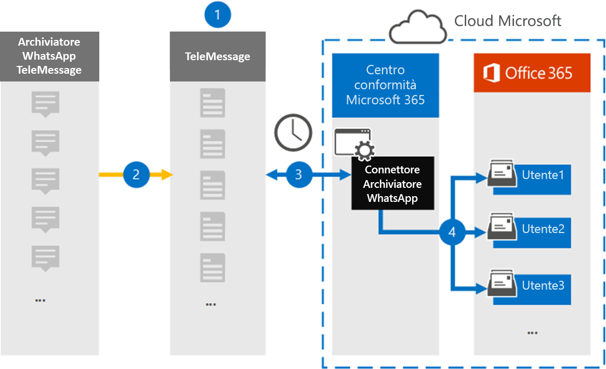

# Configurare un connettore per l'archiviazione dei dati WhatsAppSet up a connector to archive WhatsApp data

Utilizzare il connettore TeleMessage nel centro conformità di Microsoft 365 per importare e archiviare le chiamate, le chat, gli allegati, i file e i messaggi eliminati di WhatsApp.Use the TeleMessage connector in the Microsoft 365 compliance center to import and archive WhatsApp calls, chats, attachments, files, and deleted messages. Dopo aver configurato e configurato un connettore, si connette all'account del telemessaggio dell'organizzazione una volta al giorno e importa la comunicazione mobile dei dipendenti utilizzando l'Archiver TeleMessage WhatsApp Phone o il messaggio TeleMessage WhatsApp cloud Archiver alle cassette postali in Microsoft 365.After you set up and configure a connector, it connects to your organization's TeleMessage account once every day, and imports the mobile communication of employees using the TeleMessage WhatsApp Phone Archiver or TeleMessage WhatsApp Cloud Archiver to mailboxes in Microsoft 365.

Dopo che i dati di WhatsApp sono archiviati nelle cassette postali degli utenti, è possibile applicare le funzionalità di conformità di Microsoft 365, ad esempio i criteri di conservazione per controversia legale, ricerca contenuto e Microsoft 365, per i dati WhatsApp.After WhatsApp data is stored in user mailboxes, you can apply Microsoft 365 compliance features such as Litigation Hold, Content Search, and Microsoft 365 retention policies to WhatsApp data. Ad esempio, è possibile cercare i messaggi di WhatsApp usando la ricerca contenuto o associare la cassetta postale che contiene i messaggi di WhatsApp con un custode in un caso avanzato di eDiscovery.For example, you can search WhatsApp messages using Content Search or associate the mailbox that contains WhatsApp messages with a custodian in an Advanced eDiscovery case. L'utilizzo di un connettore WhatsApp per l'importazione e l'archiviazione dei dati in Microsoft 365 può aiutare l'organizzazione a rimanere conforme ai criteri governativi e normativi.Using a WhatsApp connector to import and archive data in Microsoft 365 can help your organization stay compliant with government and regulatory policies.

## Panoramica dell'archiviazione dei dati di WhatsAppOverview of archiving WhatsApp data

Nella panoramica seguente viene illustrato il processo di utilizzo di un connettore per l'archiviazione dei dati WhatsApp in Microsoft 365.The following overview explains the process of using a connector to archive WhatsApp data in Microsoft 365.

1. L'organizzazione collabora con TeleMessage per configurare un connettore di archiviazione WhatsApp.Your organization works with TeleMessage to set up a WhatsApp Archiver connector. Per ulteriori informazioni, vedere [WhatsApp Archiver](https://www.telemessage.com/office365-activation-for-whatsapp-archiver).For more information, see [WhatsApp Archiver](https://www.telemessage.com/office365-activation-for-whatsapp-archiver).

2. Una volta ogni 24 ore, i dati WhatsApp dell'organizzazione vengono copiati nel sito di telemessaggio.Once every 24 hours, your organization’s WhatsApp data is copied to the TeleMessage site.

3. Il connettore WhatsApp creato nel centro conformità di Microsoft 365 si connette al sito di telemessaggio ogni giorno e trasferisce i dati di WhatsApp dalle 24 ore precedenti in una posizione di archiviazione sicura di Azure nel cloud Microsoft.The WhatsApp connector that you create in the Microsoft 365 compliance center connects to the TeleMessage site every day and transfers WhatsApp data from the previous 24 hours to a secure Azure Storage location in the Microsoft Cloud. Il connettore converte anche i dati del contenuto WhatsApp in un formato di messaggio di posta elettronica.The connector also converts the content WhatsApp data to an email message format.

4. Il connettore importa i dati di WhatsApp nella cassetta postale di un utente specifico.The connector imports WhatsApp data to the mailbox of a specific user. Viene creata una nuova cartella denominata **WhatsApp Archiver** nella cassetta postale dell'utente specifico e gli elementi vengono importati.A new folder named **WhatsApp Archiver** is created in the specific user's mailbox and the items are imported to it. Il connettore esegue questo mapping utilizzando il valore della proprietà dell' *indirizzo di posta elettronica dell'utente* .The connector does this mapping by using the value of the *User’s Email address* property. Ogni messaggio WhatsApp contiene questa proprietà, che viene popolata con l'indirizzo di posta elettronica di ogni partecipante del messaggio.Every WhatsApp message contains this property, which is populated with the email address of every participant of the message.

   Oltre a eseguire il mapping automatico degli utenti utilizzando il valore della proprietà dell' *indirizzo di posta elettronica dell'utente* , è inoltre possibile implementare il mapping personalizzato caricando un file di mapping CSV.In addition to automatic user mapping using the value of the *User’s Email address* property, you can also implement custom mapping by uploading a CSV mapping file. Questo file di mapping contiene il numero di cellulare e l'indirizzo di posta elettronica Microsoft 365 corrispondente per gli utenti dell'organizzazione.This mapping file contains the mobile phone number and corresponding Microsoft 365 email address for users in your organization. Se si abilitano sia il mapping automatico degli utenti che il mapping personalizzato, per ogni elemento WhatsApp il connettore analizza il file di mapping personalizzato.If you enable both automatic user mapping and custom mapping, for every WhatsApp item the connector first looks at custom mapping file. Se non trova un utente valido di Microsoft 365 che corrisponde al numero di cellulare di un utente, il connettore utilizzerà i valori della proprietà dell'indirizzo di posta elettronica dell'elemento che sta tentando di importare.If it doesn't find a valid Microsoft 365 user that corresponds to a user's mobile phone number, the connector will use the values in the email address property of the item it's trying to import. Se il connettore non trova un utente valido di Microsoft 365 nel file di mapping personalizzato o nella proprietà dell'indirizzo di posta elettronica dell'elemento WhatsApp, l'elemento non verrà importato.If the connector doesn't find a valid Microsoft 365 user in either the custom mapping file or in the email address property of the WhatsApp item, the item won't be imported.

## Informazioni preliminariBefore you begin

Alcuni dei passaggi di implementazione necessari per archiviare i dati di comunicazione di WhatsApp sono esterni a Microsoft 365 e devono essere completati prima di poter creare il connettore nel centro conformità.Some of the implementation steps required to archive WhatsApp communication data are external to Microsoft 365 and must be completed before you can create the connector in the compliance center.

- Ordinare il [servizio di archiviazione WhatsApp da TeleMessage](https://www.telemessage.com/mobile-archiver/order-mobile-archiver-for-o365) e ottenere un account di amministrazione valido per l'organizzazione.Order the [WhatsApp Archiver service from TeleMessage](https://www.telemessage.com/mobile-archiver/order-mobile-archiver-for-o365) and get a valid administration account for your organization. Sarà necessario accedere a questo account quando si crea il connettore nel centro conformità.You'll need to sign into this account when you create the connector in the compliance center.

- Registrare tutti gli utenti che richiedono l'archiviazione di WhatsApp nell'account TeleMessage.Register all users that require WhatsApp archiving in the TeleMessage account. Quando si registrano gli utenti, assicurarsi di utilizzare lo stesso indirizzo di posta elettronica utilizzato per il proprio account Microsoft 365.When registering users, be sure to use the same email address that's used for their Microsoft 365 account.

- Installare l'app TeleMessage [WhatsApp Phone Archiver](https://www.telemessage.com/mobile-archiver/whatsapp-phone-archiver-2/) sui telefoni cellulari dei dipendenti e attivarla.Install the TeleMessage [WhatsApp Phone Archiver app](https://www.telemessage.com/mobile-archiver/whatsapp-phone-archiver-2/) on the mobile phones of your employees and activate it. In alternativa, è possibile installare le normali app WhatsApp o WhatsApp business sui telefoni cellulari dei dipendenti e attivare il servizio di archiviazione cloud di WhatsApp analizzando un codice QR sul sito Web di telemessaggio.Alternatively, you can install the regular WhatsApp or WhatsApp Business apps on the mobile phones of your employees and activate the WhatsApp Cloud Archiver service by scanning a QR code on the TeleMessage website. Per ulteriori informazioni, vedere [WhatsApp cloud Archiver](https://www.telemessage.com/mobile-archiver/whatsapp-archiver/whatsapp-cloud-archiver/).For more information, see [WhatsApp Cloud Archiver](https://www.telemessage.com/mobile-archiver/whatsapp-archiver/whatsapp-cloud-archiver/).

- All'utente che crea un connettore di rete Verizon deve essere assegnato il ruolo di importazione/esportazione delle cassette postali in Exchange Online.The user who creates a Verizon Network connector must be assigned the Mailbox Import Export role in Exchange Online. Questa operazione è necessaria per aggiungere connettori nella pagina **connettori dati** del centro conformità di Microsoft 365.This is required to add connectors in the **Data connectors** page in the Microsoft 365 compliance center. Per impostazione predefinita, questo ruolo non è assegnato ad alcun gruppo di ruoli in Exchange Online.By default, this role isn't assigned to any role group in Exchange Online. È possibile aggiungere il ruolo import export delle cassette postali al gruppo di ruoli Gestione organizzazione in Exchange Online.You can add the Mailbox Import Export role to the Organization Management role group in Exchange Online. In alternativa, è possibile creare un gruppo di ruoli, assegnare il ruolo di esportazione delle cassette postali e quindi aggiungere gli utenti corretti come membri.Or you can create a role group, assign the Mailbox Import Export role, and then add the appropriate users as members. Per ulteriori informazioni, vedere la sezione creare gruppi di [ruoli](https://docs.microsoft.com/Exchange/permissions-exo/role-groups#create-role-groups) o [modificare gruppi di ruoli](https://docs.microsoft.com/Exchange/permissions-exo/role-groups#modify-role-groups) nell'articolo "gestire i gruppi di ruoli in Exchange Online".For more information, see the [Create role groups](https://docs.microsoft.com/Exchange/permissions-exo/role-groups#create-role-groups) or [Modify role groups](https://docs.microsoft.com/Exchange/permissions-exo/role-groups#modify-role-groups) sections in the article "Manage role groups in Exchange Online".

## Creare un connettore di archiviazione WhatsAppCreate a WhatsApp Archiver connector

Dopo aver completato i prerequisiti descritti nella sezione precedente, è possibile creare il connettore WhatsApp nel centro conformità di Microsoft 365.After you've completed the prerequisites described in the previous section, you can create the WhatsApp connector in the Microsoft 365 compliance center. Il connettore utilizza le informazioni fornite per la connessione al sito di telemessaggio e trasferisce i dati WhatsApp nelle caselle della cassetta postale dell'utente corrispondente in Microsoft 365.The connector uses the information you provide to connect to the TeleMessage site and transfer the WhatsApp data to the corresponding user mailbox boxes in Microsoft 365.

1. Andare a [https://compliance.microsoft.com](https://compliance.microsoft.com/) e quindi fare clic su **connettori dati**  >  **WhatsApp Archiver**.Go to [https://compliance.microsoft.com](https://compliance.microsoft.com/) and then click **Data connectors** > **WhatsApp Archiver**.

2. Nella pagina Descrizione prodotto **archiviatore WhatsApp** fare clic su **Aggiungi connettore**On the **WhatsApp Archiver** product description page, click **Add connector**

3. Nella pagina **condizioni del servizio** fare clic su **Accetto**.On the **Terms of service** page, click **Accept**.

4. Nella pagina **accesso a telemessaggio** , in passaggio 3, immettere le informazioni necessarie nelle caselle seguenti e quindi fare clic su **Avanti**.On the **Login to TeleMessage** page, under Step 3, enter the required information in the following boxes and then click **Next**.

   - **Nome utente:** Nome utente del telemessaggio.**Username:** Your TeleMessage username.

   - **Password:** La password del telemessaggio.**Password:** Your TeleMessage password.

5. Dopo aver creato il connettore, è possibile chiudere la finestra popup e passare alla pagina successiva.After the connector is created, you can close the pop-up window and go to the next page.

6. Nella pagina **mapping utenti** abilitare il mapping automatico degli utenti e fare clic su **Avanti**.On the **User mapping** page, enable automatic user mapping and click **Next**. Nel caso in cui sia necessario un mapping personalizzato caricare un file CSV e fare clic su **Avanti**.In case you need custom mapping upload a CSV file, and click **Next**.

7. Esaminare le impostazioni e quindi fare clic su **fine** per creare il connettore.Review your settings, and then click **Finish** to create the connector.

8. Passare alla scheda Connettori della pagina **connettori dati** per visualizzare lo stato di avanzamento del processo di importazione per il nuovo connettore.Go to the Connectors tab in **Data connectors** page to see the progress of the import process for the new connector.

## Problemi notiKnown issues

- Al momento, non è supportato l'importazione di allegati o elementi di dimensioni superiori a 10 MB.At this time, we don't support importing attachments or items that are larger than 10 MB. Il supporto per gli elementi di grandi dimensioni sarà disponibile in un secondo momento.Support for larger items will be available at a later date.
