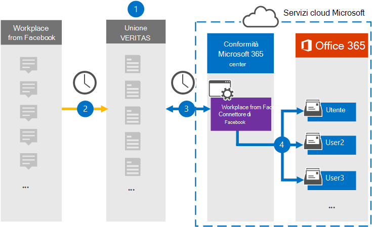

# Configurare un connettore per archiviare Workplace dai dati di FacebookSet up a connector to archive Workplace from Facebook data

Usare un connettore Globanet nel Centro conformità Microsoft 365 per importare e archiviare i dati da Workplace da Facebook alle cassette postali degli utenti nell'organizzazione di Microsoft 365.Use a Globanet connector in the Microsoft 365 compliance center to import and archive data from Workplace from Facebook to user mailboxes in your Microsoft 365 organization. Globanet fornisce un connettore [Workplace da Facebook](https://globanet.com/workplace/) configurato per acquisire elementi dall'origine dati di terze parti (regolarmente) e importare tali elementi in Microsoft 365.Globanet provides a [Workplace from Facebook](https://globanet.com/workplace/) connector that is configured to capture items from the third-party data source (on a regular basis) and import those items to Microsoft 365. Il connettore converte il contenuto come chat, allegati, post e video da Workplace in un formato di messaggio di posta elettronica e quindi importa tali elementi nelle cassette postali degli utenti in Microsoft 365.The connector converts the content such as chats, attachments, posts, and videos from Workplace to an email message format and then imports those items to user mailboxes in Microsoft 365.

Dopo aver archiviato i dati di Workplace nelle cassette postali degli utenti, è possibile applicare le funzionalità di conformità di Microsoft 365, ad esempio conservazione per controversia legale, eDiscovery, criteri di conservazione ed etichette di conservazione e conformità delle comunicazioni.After Workplace data is stored in user mailboxes, you can apply Microsoft 365 compliance features such as Litigation Hold, eDiscovery, retention policies and retention labels, and communication compliance. L'uso di Workplace dal connettore Facebook per importare e archiviare i dati in Microsoft 365 può aiutare l'organizzazione a rimanere conforme ai criteri normativi e governativi.Using Workplace from Facebook connector to import and archive data in Microsoft 365 can help your organization stay compliant with government and regulatory policies.

## Panoramica dell'archiviazione di Workplace dai dati di FacebookOverview of archiving Workplace from Facebook data

La panoramica seguente illustra il processo di utilizzo di un connettore per archiviare i dati di Workplace in Microsoft 365.The following overview explains the process of using a connector to archive Workplace data in Microsoft 365.

1. L'organizzazione collabora con Workplace da Facebook per configurare un sito di Workplace.Your organization works with Workplace from Facebook to set up and configure a Workplace site.

2. Una volta ogni 24 ore, gli elementi da Workplace vengono copiati nel sito Globanet Merge1.Once every 24 hours, items from Workplace are copied to the Globanet Merge1 site. Il connettore converte inoltre il contenuto di questi elementi in un formato di messaggio di posta elettronica.The connector also converts the content of these items to an email message format.

3. Il connettore Workplace da Facebook creato nel Centro conformità Microsoft 365, si connette a Globanet Merge1 ogni giorno e trasferisce gli elementi di Workplace in una posizione sicura di Archiviazione di Azure nel cloud Microsoft.The Workplace from Facebook connector that you create in the Microsoft 365 compliance center, connects to the Globanet Merge1 every day, and transfers the Workplace items to a secure Azure Storage location in the Microsoft cloud.

4. Il connettore importa gli elementi convertiti nelle cassette postali di utenti specifici utilizzando il valore della proprietà *Email* del mapping automatico degli utenti, come descritto nel passaggio 3.The connector imports the converted items to the mailboxes of specific users using the value of the *Email* property of the automatic user mapping as described in Step 3. Viene creata una sottocartella nella cartella Posta in arrivo denominata **Workplace da Facebook** e gli elementi di Workplace vengono importati in tale cartella.A subfolder in the Inbox folder named **Workplace from Facebook** is created, and the Workplace items are imported to that folder. Il connettore esegue questa operazione utilizzando il valore della *proprietà Email.*The connector does this by using the value of the *Email* property. Ogni elemento di Workplace contiene questa proprietà, che viene popolata con l'indirizzo di posta elettronica di ogni partecipante di chat o post.Every Workplace item contains this property, which is populated with the email address of every chat or post participant.

## Prima di iniziareBefore you begin

- Creare un account Globanet Merge1 per i connettori Microsoft.Create a Globanet Merge1 account for Microsoft connectors. Per creare questo account, contattare [il supporto clienti Di Globanet.](https://globanet.com/ms-connectors-contact)To create this account, contact [Globanet Customer Support](https://globanet.com/ms-connectors-contact). Si accederà a questo account quando si crea il connettore nel passaggio 1.You will sign into this account when you create the connector in Step 1.

- Creare un'integrazione personalizzata in per recuperare i dati da Workplace tramite LE API per https://my.workplace.com/work/admin/apps/ scopi di conformità ed eDiscovery.Create a custom integration at https://my.workplace.com/work/admin/apps/ to retrieve data from Workplace via APIs for compliance and eDiscovery purposes.

   Durante la creazione dell'integrazione, la piattaforma Workplace genera un set di credenziali univoche utilizzate per generare token utilizzati per l'autenticazione.When creating the integration, the Workplace platform generates a set of unique credentials used to generate tokens that are used for authentication. Questi token vengono utilizzati nella configurazione guidata del connettore Workplace da Facebook nel passaggio 2.These tokens are used in the Workplace from Facebook connector configuration wizard in Step 2. Per istruzioni dettagliate su come creare le applicazioni, vedere il manuale dell'utente [Merge1 Third-Party Connectors.](https://docs.ms.merge1.globanetportal.com/Merge1%20Third-Party%20Connectors%20Workplace%20from%20Facebook%20User%20Guide%20.pdf)For step-by step instructions about how to create the applications, see [Merge1 Third-Party Connectors User Guide](https://docs.ms.merge1.globanetportal.com/Merge1%20Third-Party%20Connectors%20Workplace%20from%20Facebook%20User%20Guide%20.pdf).

- L'utente che crea l'area di lavoro dal connettore Facebook nel passaggio 1 (e lo completa nel passaggio 3) deve essere assegnato al ruolo di importazione/esportazione delle cassette postali in Exchange Online.The user who creates the Workplace from Facebook connector in Step 1 (and completes it in Step 3) must be assigned to the Mailbox Import Export role in Exchange Online. Questo ruolo è necessario per aggiungere connettori nella pagina **Connettori** dati nel Centro conformità Microsoft 365.This role is required to add connectors on the **Data connectors** page in the Microsoft 365 compliance center. Per impostazione predefinita, questo ruolo non è assegnato a un gruppo di ruoli in Exchange Online.By default, this role is not assigned to a role group in Exchange Online. È possibile aggiungere il ruolo di importazione/esportazione delle cassette postali al gruppo di ruoli Gestione organizzazione in Exchange Online.You can add the Mailbox Import Export role to the Organization Management role group in Exchange Online. In or you can create a role group, assign the Mailbox Import Export role, and then add the appropriate users as members.Or you can create a role group, assign the Mailbox Import Export role, and then add the appropriate users as members. Per ulteriori informazioni, vedere le sezioni [Creazione](https://docs.microsoft.com/Exchange/permissions-exo/role-groups#create-role-groups) di gruppi di ruoli o Modifica gruppi [di](https://docs.microsoft.com/Exchange/permissions-exo/role-groups#modify-role-groups) ruoli nell'articolo "Gestire i gruppi di ruoli in Exchange Online".For more information, see the [Create role groups](https://docs.microsoft.com/Exchange/permissions-exo/role-groups#create-role-groups) or [Modify role groups](https://docs.microsoft.com/Exchange/permissions-exo/role-groups#modify-role-groups) sections in the article "Manage role groups in Exchange Online".

## Passaggio 1: Configurare l'area di lavoro dal connettore FacebookStep 1: Set up the Workplace from Facebook connector

Il primo passaggio consiste nell'accedere alla pagina **Connettori** dati nel Centro conformità Microsoft 365 e creare un connettore per i dati di Workplace.The first step is to access to the **Data Connectors** page in the Microsoft 365 compliance center and create a connector for Workplace data.

1. Passare a [https://compliance.microsoft.com](https://compliance.microsoft.com/) e quindi fare clic su **Connettori dati** Workplace da  >  **Facebook.**Go to [https://compliance.microsoft.com](https://compliance.microsoft.com/) and then click **Data connectors** > **Workplace from Facebook**.

2. Nella pagina **di descrizione del prodotto Workplace from Facebook,** fare clic **su Aggiungi connettore.**On the **Workplace from Facebook** product description page, click **Add connector**.

3. Nella pagina **Condizioni per il servizio** fare clic su **Accetta.**On the **Terms of service** page, click **Accept**.

4. Immettere un nome univoco che identifichi il connettore, quindi fare clic su **Avanti.**Enter a unique name that identifies the connector, and then click **Next**.

5. Accedere all'account Merge1 per configurare il connettore.Sign in to your Merge1 account to configure the connector.

## Passaggio 2: Configurare l'area di lavoro dal connettore Facebook nel sito Globanet Merge1Step 2: Configure the Workplace from Facebook connector on the Globanet Merge1 site

Il secondo passaggio consiste nel configurare l'area di lavoro dal connettore Facebook nel sito Merge1.The second step is to configure the Workplace from Facebook connector on the Merge1 site. Per informazioni su come configurare Workplace dal connettore Facebook, vedere la Guida per l'utente di [Merge1 Third-Party Connectors.](https://docs.ms.merge1.globanetportal.com/Merge1%20Third-Party%20Connectors%20Workplace%20from%20Facebook%20User%20Guide%20.pdf)For information about how to configure the Workplace from Facebook connector, see [Merge1 Third-Party Connectors User Guide](https://docs.ms.merge1.globanetportal.com/Merge1%20Third-Party%20Connectors%20Workplace%20from%20Facebook%20User%20Guide%20.pdf).

Dopo aver fatto **clic su & fine,** viene visualizzata la pagina **Mapping** utenti nella procedura guidata del connettore nel Centro conformità Microsoft 365.After you click **Save & Finish**, the **User mapping** page in the connector wizard in the Microsoft 365 compliance center is displayed.

## Passaggio 3: mappare gli utenti e completare la configurazione del connettoreStep 3: Map users and complete the connector setup

Per mappare gli utenti e completare la configurazione del connettore nel Centro conformità Microsoft 365, attenersi alla seguente procedura:To map users and complete the connector setup in the Microsoft 365 compliance center, follow these steps:

1. Nella pagina **Mapping utenti esterni a utenti di Microsoft 365** abilitare il mapping automatico degli utenti.On the **Map external users to Microsoft 365 users** page, enable automatic user mapping. Gli elementi di Workplace includono una proprietà denominata *Posta* elettronica che contiene gli indirizzi di posta elettronica per gli utenti dell'organizzazione.The Workplace items include a property called *Email* that contains email addresses for users in your organization. Se il connettore può associare questo indirizzo a un utente di Microsoft 365, gli elementi vengono importati nella cassetta postale dell'utente.If the connector can associate this address with a Microsoft 365 user, the items are imported to that user’s mailbox.

2. Fare **clic** su Avanti, rivedere le  impostazioni e quindi passare alla pagina Connettori dati per visualizzare l'avanzamento del processo di importazione per il nuovo connettore.Click **Next**, review your settings, and then go to the **Data connectors** page to see the progress of the import process for the new connector.

## Passaggio 4: monitorare l'area di lavoro dal connettore FacebookStep 4: Monitor the Workplace from Facebook connector

Dopo aver creato l'area di lavoro dal connettore Facebook, è possibile visualizzare lo stato del connettore nel Centro conformità Microsoft 365.After you create the Workplace from Facebook connector, you can view the connector status in the Microsoft 365 compliance center.

1. Andare a [https://compliance.microsoft.com](https://compliance.microsoft.com) e fare clic su **Connettori dati** nel riquadro di spostamento sinistro.Go to [https://compliance.microsoft.com](https://compliance.microsoft.com) and click **Data connectors** in the left nav.

2. Fare clic **sulla scheda Connettori,** quindi selezionare il connettore **Workplace from Facebook** per visualizzare la pagina a comparsa.Click the **Connectors** tab and then select the **Workplace from Facebook** connector to display the flyout page. Questa pagina contiene le proprietà e le informazioni sul connettore.This page contains the properties and information about the connector.

3. In **Stato connettore con origine** fare clic sul collegamento Scarica **registro** per aprire (o salvare) il registro di stato per il connettore.Under **Connector status with source**, click the **Download log** link to open (or save) the status log for the connector. Questo log contiene informazioni sui dati importati nel cloud Microsoft.This log contains information about the data that has been imported to the Microsoft cloud.

## Problemi notiKnown issues

- Al momento, non è possibile importare allegati o elementi di dimensioni superiori a 10 MB.At this time, we don't support importing attachments or items that are larger than 10 MB. Il supporto per gli elementi più grandi sarà disponibile in un secondo momento.Support for larger items will be available at a later date.
