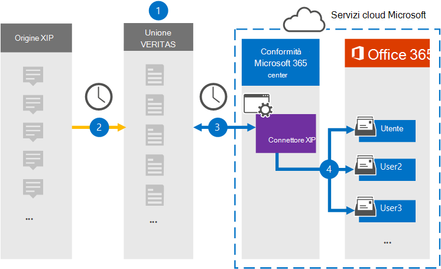

# Configurare un connettore per archiviare i dati di origine XIPSet up a connector to archive XIP source data

Utilizzare un connettore Veritas nel centro Microsoft 365 conformità per importare e archiviare i dati dalla piattaforma di origine XIP alle cassette postali degli utenti nell'Microsoft 365 organizzativa.Use a Veritas connector in the Microsoft 365 compliance center to import and archive data from the XIP source platform to user mailboxes in your Microsoft 365 organization. Veritas fornisce un [connettore XIP](https://globanet.com/xip/) che consente di utilizzare un file XIP per importare elementi Microsoft 365.Veritas provides a [XIP](https://globanet.com/xip/) connector that allows using an XIP file to import items to Microsoft 365. Un file XIP è simile a un file ZIP, ma consente di utilizzare una firma digitale.An XIP file is similar to a ZIP file, but allows for a digital signature to be used. La firma digitale viene verificata da Veritas Merge 1 prima dell'estrazione del file di origine XIP.The digital signature is verified by the Veritas Merge 1 before the XIP source file is extracted. Il connettore converte il contenuto dal file di origine XIP in un formato di messaggio di posta elettronica e quindi importa tali elementi nella cassetta postale dell'utente in Microsoft 365.The connector converts the content from the XIP source file to an email message format and then imports those items to the user's mailbox in Microsoft 365.

Dopo aver archiviato i dati di origine XIP nelle cassette postali degli utenti, è possibile applicare funzionalità di conformità Microsoft 365 quali conservazione per controversia legale, eDiscovery, criteri di conservazione ed etichette di conservazione e conformità delle comunicazioni.After XIP source data is stored in user mailboxes, you can apply Microsoft 365 compliance features such as Litigation Hold, eDiscovery, retention policies and retention labels, and communication compliance. L'utilizzo di un connettore XIP per importare e archiviare i dati in Microsoft 365 può aiutare l'organizzazione a rimanere conforme ai criteri governativi e normativi.Using an XIP connector to import and archive data in Microsoft 365 can help your organization stay compliant with government and regulatory policies.

## Panoramica dell'archiviazione dei dati di origine XIPOverview of archiving the XIP source data

Nella panoramica seguente viene illustrato il processo di utilizzo di un connettore per archiviare i dati di origine XIP in Microsoft 365.The following overview explains the process of using a connector to archive the XIP source data in Microsoft 365.

1. L'organizzazione collabora con l'origine XIP per configurare un sito XIP.Your organization works with the XIP source to set up and configure an XIP site.

2. Una volta ogni 24 ore, gli elementi di origine XIP vengono copiati nel sito Veritas Merge1.Once every 24 hours, XIP source items are copied to the Veritas Merge1 site. Il connettore converte anche il contenuto in un formato di messaggio di posta elettronica.The connector also converts the content to an email message format.

3. Il connettore XIP creato nel Centro conformità Microsoft 365 si connette ogni giorno al sito Veritas Merge1 e trasferisce i messaggi in una posizione Archiviazione di Azure sicura nel cloud Microsoft.The XIP connector that you create in the Microsoft 365 compliance center, connects to the Veritas Merge1 site every day and transfers the messages to a secure Azure Storage location in the Microsoft cloud.

4. Il connettore importa gli elementi dei messaggi convertiti nelle cassette postali di utenti specifici utilizzando il valore della proprietà *Email* del mapping automatico degli utenti, come descritto nel [passaggio 3.](#step-3-map-users-and-complete-the-connector-setup)The connector imports the converted message items to the mailboxes of specific users using the value of the *Email* property of the automatic user mapping as described in [Step 3](#step-3-map-users-and-complete-the-connector-setup). Nelle cassette postali degli utenti viene creata una sottocartella nella cartella Posta in arrivo denominata **XIP** e gli elementi vengono importati in tale cartella.A subfolder in the Inbox folder named **XIP** is created in the user mailboxes, and the items are imported to that folder. Il connettore determina in quale cassetta postale importare gli elementi utilizzando il valore della *proprietà Email.*The connector determines which mailbox to import items to by using the value of the *Email* property. Ogni elemento di origine contiene questa proprietà, che viene popolata con l'indirizzo di posta elettronica di ogni partecipante.Every source item contains this property, which is populated with the email address of every participant.

## Prima di iniziareBefore you begin

- Creare un account Veritas Merge1 per i connettori Microsoft.Create a Veritas Merge1 account for Microsoft connectors. Per creare un account, contattare il [Supporto clienti Veritas.](https://www.veritas.com/content/support/)To create an account, contact [Veritas Customer Support](https://www.veritas.com/content/support/). È necessario accedere a questo account quando si crea il connettore nel passaggio 1.You need to sign into this account when you create the connector in Step 1.

- L'utente che crea il connettore XIP nel passaggio 1 (e lo completa nel passaggio 3) deve essere assegnato al ruolo Esportazione importazione cassette postali in Exchange Online.The user who creates the XIP connector in Step 1 (and completes it in Step 3) must be assigned to the Mailbox Import Export role in Exchange Online. Questo ruolo è necessario per aggiungere connettori nella pagina Connettori dati nel Centro Microsoft 365 conformità.This role is required to add connectors on the Data connectors page in the Microsoft 365 compliance center. Per impostazione predefinita, questo ruolo non viene assegnato ad alcun gruppo di ruoli in Exchange Online.By default, this role is not assigned to any role group in Exchange Online. È possibile aggiungere il ruolo Esportazione importazione cassette postali al gruppo di ruoli Gestione organizzazione in Exchange Online.You can add the Mailbox Import Export role to the Organization Management role group in Exchange Online. In caso contrario, è possibile creare un gruppo di ruoli, assegnare il ruolo Importazione/Esportazione cassette postali e quindi aggiungere gli utenti appropriati come membri.Or you can create a role group, assign the Mailbox Import Export role, and then add the appropriate users as members. Per ulteriori informazioni, vedere le sezioni [Create role groups](/Exchange/permissions-exo/role-groups#create-role-groups) o Modify role [groups](/Exchange/permissions-exo/role-groups#modify-role-groups) nell'articolo "Manage role groups in Exchange Online".For more information, see the [Create role groups](/Exchange/permissions-exo/role-groups#create-role-groups) or [Modify role groups](/Exchange/permissions-exo/role-groups#modify-role-groups) sections in the article "Manage role groups in Exchange Online".

## Passaggio 1: Configurare il connettore XIPStep 1: Set up the XIP connector

Il primo passaggio consiste nell'accedere alla pagina **Connettori** dati nel Centro conformità Microsoft365 e creare un connettore per i dati di origine XIP.The first step is to access to the **Data Connectors** page in the Microsoft365 compliance center and create a connector for the XIP source data.

1. Passare a [https://compliance.microsoft.com](https://compliance.microsoft.com/) e quindi fare clic su **Connettori dati** \> **XIP.**Go to [https://compliance.microsoft.com](https://compliance.microsoft.com/) and then click **Data connectors** \> **XIP**.

2. Nella pagina **Descrizione prodotto XIP** fare clic **su Aggiungi nuovo connettore.**On the **XIP** product description page, click **Add new connector**.

3. Nella pagina **Condizioni di servizio** fare clic su **Accetta.**On the **Terms of service** page, click **Accept**.

4. Immettere un nome univoco che identifichi il connettore e quindi fare clic su **Avanti.**Enter a unique name that identifies the connector, and then click **Next**.

5. Accedere all'account Merge1 per configurare il connettore.Sign in to your Merge1 account to configure the connector.

## Passaggio 2: Configurare il connettore XIP nel sito Veritas Merge1Step 2: Configure the XIP connector on the Veritas Merge1 site

Il secondo passaggio consiste nel configurare il connettore XIP nel sito Merge1.The second step is to configure the XIP connector on the Merge1 site. Per informazioni su come configurare il connettore XIP, vedere [Merge1 Third-Party Connectors User Guide](https://docs.ms.merge1.globanetportal.com/Merge1%20Third-Party%20Connectors%20XIP%20User%20Guide%20.pdf).For information about how to configure the XIP connector, see [Merge1 Third-Party Connectors User Guide](https://docs.ms.merge1.globanetportal.com/Merge1%20Third-Party%20Connectors%20XIP%20User%20Guide%20.pdf).

Dopo aver fatto **clic su Salva & fine,** viene visualizzata la pagina **Mapping** utenti nella procedura guidata del connettore nel Centro Microsoft 365 conformità.After you click **Save & Finish**, the **User mapping** page in the connector wizard in the Microsoft 365 compliance center is displayed.

## Passaggio 3: mappare gli utenti e completare la configurazione del connettoreStep 3: Map users and complete the connector setup

Per mappare gli utenti e completare la configurazione del connettore, attenersi alla seguente procedura:To map users and complete the connector setup, follow these steps:

1. Nella pagina **Mapping utenti XIP Microsoft 365 utenti,** abilitare il mapping automatico degli utenti.On the **Map XIP users to Microsoft 365 users** page, enable automatic user mapping. Gli elementi di origine XIP includono una proprietà denominata *Email*, che contiene gli indirizzi di posta elettronica per gli utenti dell'organizzazione.The XIP source items include a property called *Email*, which contains email addresses for users in your organization. Se il connettore può associare questo indirizzo a un Microsoft 365 utente, gli elementi vengono importati nella cassetta postale dell'utente.If the connector can associate this address with a Microsoft 365 user, the items are imported to that user’s mailbox.

2. Fare **clic** su Avanti, rivedere le impostazioni e passare alla pagina **Connettori** dati per visualizzare l'avanzamento del processo di importazione per il nuovo connettore.Click **Next**, review your settings, and go to the **Data connectors** page to see the progress of the import process for the new connector.

## Passaggio 4: Monitorare il connettore XIPStep 4: Monitor the XIP connector

Dopo aver creato il connettore XIP, è possibile visualizzare lo stato del connettore nel Centro Microsoft 365 conformità.After you create the XIP connector, you can view the connector status in the Microsoft 365 compliance center.

1. Vai a [https://compliance.microsoft.com](https://compliance.microsoft.com/) e fai clic su **Connettori dati** nel riquadro di spostamento sinistro.Go to [https://compliance.microsoft.com](https://compliance.microsoft.com/) and click **Data connectors** in the left nav.

2. Fare clic **sulla scheda Connettori** e quindi selezionare il **connettore XIP** per visualizzare la pagina a comparsa, contenente le proprietà e le informazioni sul connettore.Click the **Connectors** tab and then select the **XIP** connector to display the flyout page, which contains the properties and information about the connector.

3. In **Stato connettore con origine** fare clic sul collegamento Scarica **registro** per aprire (o salvare) il registro di stato per il connettore.Under **Connector status with source**, click the **Download log** link to open (or save) the status log for the connector. Questo registro contiene i dati importati nel cloud Microsoft.This log contains data that has been imported to the Microsoft cloud.

## Problemi notiKnown issues

- Al momento non è possibile importare allegati o elementi di dimensioni superiori a 10 MB.At this time, we don't support importing attachments or items that are larger than 10 MB. Il supporto per gli elementi più grandi sarà disponibile in un secondo momento.Support for larger items will be available at a later date.