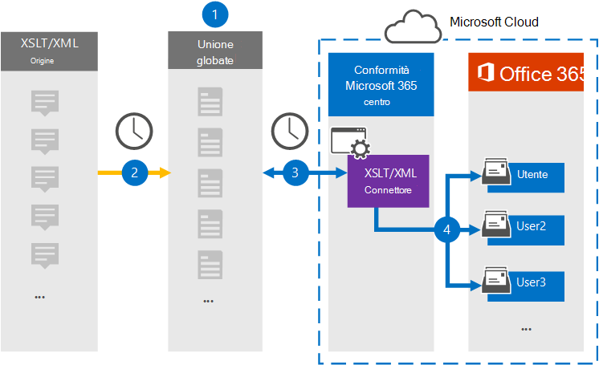

# Configurare un connettore per l'archiviazione di dati XSLT/XML (anteprima)

Utilizzare un connettore di Globanet nel centro conformità di Microsoft 365 per importare e archiviare i dati dall'origine della pagina Web alle cassette postali degli utenti nell'organizzazione Microsoft 365. Globanet fornisce un [connettore XSLT/XML](https://globanet.com/xslt-xml) che consente di sviluppare rapidamente i file creati utilizzando XSLT (trasformazioni in lingua del foglio di stile estensibile) per trasformare file XML in altri formati di file (come HTML o testo) che possono essere importati in Microsoft 365. Il connettore converte il contenuto di un elemento dall'origine XSLT/XML in un formato di messaggio di posta elettronica e quindi importa l'elemento convertito in cassette postali di Microsoft 365.

Dopo che i dati XSLT/XML sono archiviati nelle cassette postali degli utenti, è possibile applicare le funzionalità di conformità di Microsoft 365 come il blocco per controversia legale, eDiscovery e i criteri di conservazione e le etichette di conservazione. L'utilizzo di un connettore XSLT/XML per l'importazione e l'archiviazione dei dati in Microsoft 365 può aiutare l'organizzazione a rimanere conforme ai criteri governativi e normativi.

## Panoramica dell'archiviazione dei dati XSLT/XML

Nella panoramica seguente viene illustrato il processo di utilizzo di un connettore per l'archiviazione dei dati di origine XML e XSLT in Microsoft 365.

1. L'organizzazione opera con l'origine XSLT/XML per configurare un sito XSLT/XML e configurarlo.

2. Una volta ogni 24 ore, i messaggi di chat provenienti dall'origine XSLT/XML vengono copiati nel sito Merge1 di Globanet. Il connettore converte anche il contenuto in un formato di messaggio di posta elettronica.

3. Il connettore XSLT/XML creato nel centro conformità Microsoft 365, si connette al sito di Globanet Merge1 ogni giorno e trasferisce i messaggi a una posizione di archiviazione sicura di Azure nel cloud Microsoft.

4. Il connettore importa gli elementi del messaggio convertiti nelle cassette postali di utenti specifici utilizzando il valore della proprietà di *posta elettronica* del mapping automatico degli utenti, come descritto nel passaggio 3. Una nuova sottocartella nella cartella posta in arrivo denominata **XSLT/XML** viene creata nelle cassette postali degli utenti e gli elementi del messaggio vengono importati in tale cartella. Il connettore esegue questa operazione utilizzando il valore della proprietà di *posta elettronica* . Ogni messaggio contiene questa proprietà, che viene popolata con l'indirizzo di posta elettronica di ogni partecipante del messaggio.

## Prima di iniziare

- Creare un account Merge1 di Globanet per i connettori Microsoft. A tale scopo, contattare il [supporto clienti di Globanet](https://globanet.com/contact-us/). È necessario accedere a questo account quando si crea il connettore nel passaggio 1.

- L'utente che crea il connettore XSLT/XML nel passaggio 1 (e lo completa nel passaggio 3) deve essere assegnato al ruolo di importazione/esportazione delle cassette postali in Exchange Online. Questo ruolo è necessario per aggiungere connettori nella pagina **dei connettori dati** nel centro conformità di Microsoft 365. Per impostazione predefinita, questo ruolo non è assegnato a nessun gruppo di ruoli in Exchange Online. È possibile aggiungere il ruolo import export delle cassette postali al gruppo di ruoli Gestione organizzazione in Exchange Online. In alternativa, è possibile creare un gruppo di ruoli, assegnare il ruolo di esportazione delle cassette postali e quindi aggiungere gli utenti corretti come membri. Per ulteriori informazioni, vedere la sezione creare gruppi di [ruoli](https://docs.microsoft.com/Exchange/permissions-exo/role-groups#create-role-groups) o [modificare gruppi di ruoli](https://docs.microsoft.com/Exchange/permissions-exo/role-groups#modify-role-groups) nell'articolo "gestire i gruppi di ruoli in Exchange Online".

## Passaggio 1: configurare un connettore XSLT/XML

Il primo passaggio consiste nell'accedere ai **connettori di dati** nel centro conformità di Microsoft 365 e creare un connettore per i dati XSLT/XML.

1. Andare a [https://compliance.microsoft.com](https://compliance.microsoft.com/) e quindi fare clic su **connettori dati**  >  **XSLT/XML**.

2. Nella pagina Descrizione prodotto **XSLT/XML** fare clic su **Aggiungi nuovo connettore**.

3. Nella pagina **condizioni del servizio** fare clic su **Accetto**.

4. Immettere un nome univoco che identifichi il connettore e quindi fare clic su **Avanti**.

5. Accedere al proprio account di Merge1 per configurare il connettore.

## Passaggio 2: configurare un connettore XSLT/XML

Il secondo passaggio consiste nel configurare il connettore XSLT/XML nel sito di Merge1. Per informazioni su come configurare il connettore XSLT/XML nel sito di Globanet Merge1, vedere [Merge1 di terze parti dei connettori utente](https://docs.ms.merge1.globanetportal.com/Merge1%20Third-Party%20Connectors%20XSLT-XML%20User%20Guide%20.pdf).

Dopo aver fatto clic su **salva & fine**, è possibile tornare al centro conformità di Microsoft 365 alla pagina **mapping utenti** nella procedura guidata del connettore.

## Passaggio 3: mappare gli utenti e completare la configurazione del connettore

1. Per eseguire il mapping degli utenti e completare la configurazione del connettore nel centro conformità di Microsoft 365, attenersi alla procedura seguente:

2. Nella pagina mapping degli utenti **XSLT/XML a Microsoft 365** , abilitare la mappatura automatica degli utenti. Gli elementi XSLT/XML includono una proprietà denominata *posta elettronica*, che contiene gli indirizzi di posta elettronica per gli utenti dell'organizzazione. Se il connettore può associare questo indirizzo a un utente di Microsoft 365, gli elementi vengono importati nella cassetta postale dell'utente.

3. Nella pagina **consenso amministratore** fare clic su **Fornisci consenso**. L'utente verrà reindirizzato al sito Microsoft. Fare clic su **accetta** per fornire il consenso.

   L'organizzazione deve autorizzare il servizio di importazione di Office 365 per accedere ai dati delle cassette postali nell'organizzazione. Per fornire il consenso dell'amministratore, è necessario essere connessi con le credenziali di un amministratore globale di Microsoft 365 e quindi accettare la richiesta di consenso. Se non è stato eseguito l'accesso come amministratore globale, è possibile accedere a [Questa pagina](https://login.microsoftonline.com/common/oauth2/authorize?client_id=570d0bec-d001-4c4e-985e-3ab17fdc3073&response_type=code&redirect_uri=https://portal.azure.com/&nonce=1234&prompt=admin_consent) ed eseguire l'accesso con le credenziali di amministratore globale per accettare la richiesta.

4. Fare clic su **Avanti**, rivedere le impostazioni e passare alla pagina **connettori dati** per visualizzare lo stato di avanzamento del processo di importazione per il nuovo connettore.

## Passaggio 4: monitorare il connettore XSLT/XML

Dopo aver creato il connettore XSLT/XML, è possibile visualizzare lo stato del connettore nel centro conformità di Microsoft 365.

1. Andare a [https://compliance.microsoft.com](https://compliance.microsoft.com) e fare clic su **connettori dati** nel NAV sinistro.

2. Fare clic sulla scheda **connettori** e quindi selezionare il connettore **XSLT/XML** per visualizzare la pagina del riquadro a comparsa, che contiene le proprietà e le informazioni sul connettore.

3. In **stato connettore con origine**fare clic sul collegamento **Scarica log** per aprire o salvare il registro di stato del connettore. Questo log contiene dati che sono stati importati nel cloud Microsoft.

## Problemi noti

- Al momento, non è supportato l'importazione di allegati o elementi di dimensioni superiori a 10 MB. Il supporto per gli elementi di grandi dimensioni sarà disponibile in un secondo momento.
