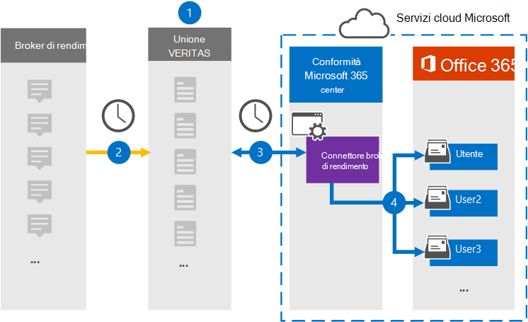

# Configurare un connettore per archiviare i dati yieldbroker

Utilizzare un connettore Globanet nel Centro conformità Microsoft 365 per importare e archiviare i dati da Yieldbroker alle cassette postali degli utenti nell'organizzazione di Microsoft 365. Globanet fornisce un connettore [Yieldbroker](https://globanet.com/yieldbroker/) configurato per acquisire elementi dall'origine dati di terze parti e importare tali elementi in Microsoft 365. Il connettore converte il contenuto da Yieldbroker in un formato di messaggio di posta elettronica e quindi importa tali elementi nella cassetta postale dell'utente in Microsoft 365.

Dopo l'archiviazione di Yieldbroker nelle cassette postali degli utenti, è possibile applicare le funzionalità di conformità di Microsoft 365, ad esempio conservazione per controversia legale, eDiscovery, criteri di conservazione ed etichette di conservazione. L'utilizzo di un connettore Yieldbroker per importare e archiviare i dati in Microsoft 365 può aiutare l'organizzazione a rimanere conforme ai criteri normativi e governativi.

## Panoramica dell'archiviazione dei dati yieldbroker

Nella panoramica seguente viene illustrato il processo di utilizzo di un connettore per archiviare i dati yieldbroker in Microsoft 365.

1. L'organizzazione collabora con Yieldbroker per configurare un sito Yieldbroker.

2. Una volta ogni 24 ore, gli elementi Yieldbroker vengono copiati nel sito Globanet Merge1. Il connettore converte anche il contenuto in un formato di messaggio di posta elettronica.

3. Il connettore Yieldbroker creato nel Centro conformità Microsoft 365, si connette ogni giorno al sito Globanet Merge1 e trasferisce i messaggi in una posizione sicura di Archiviazione di Azure nel cloud Microsoft.

4. Il connettore importa gli elementi Yieldbroker convertiti nelle cassette postali di utenti specifici utilizzando il valore della proprietà *Email* del mapping automatico degli utenti, come descritto nel [passaggio 3.](#step-3-map-users-and-complete-the-connector-setup) Nelle cassette postali degli utenti viene creata una sottocartella nella cartella Posta in arrivo denominata **Yieldbroker** e gli elementi vengono importati in tale cartella. Il connettore determina in quale cassetta postale importare gli elementi utilizzando il valore della *proprietà Email.* Ogni Yieldbroker contiene questa proprietà, che viene popolata con l'indirizzo di posta elettronica di ogni partecipante dell'elemento.

## Prima di iniziare

- Creare un account Globanet Merge1 per i connettori Microsoft. Per creare un account, contattare il [Supporto clienti Globanet.](https://globanet.com/contact-us/) È necessario accedere a questo account quando si crea il connettore nel passaggio 1.

- L'utente che crea il connettore Yieldbroker nel passaggio 1 (e lo completa nel passaggio 3) deve essere assegnato al ruolo Esportazione importazione cassette postali in Exchange Online. Questo ruolo è necessario per aggiungere connettori nella pagina Connettori dati nel Centro conformità Microsoft 365. Per impostazione predefinita, questo ruolo non viene assegnato ad alcun gruppo di ruoli in Exchange Online. È possibile aggiungere il ruolo Esportazione importazione cassette postali al gruppo di ruoli Gestione organizzazione in Exchange Online. In caso contrario, è possibile creare un gruppo di ruoli, assegnare il ruolo Importazione/Esportazione cassette postali e quindi aggiungere gli utenti appropriati come membri. Per ulteriori informazioni, vedere le sezioni [Create role groups](/Exchange/permissions-exo/role-groups#create-role-groups) o Modify role [groups](/Exchange/permissions-exo/role-groups#modify-role-groups) nell'articolo "Manage role groups in Exchange Online".

## Passaggio 1: Configurare il connettore Yieldbroker

Il primo passaggio consiste nell'accedere alla pagina **Connettori** dati nel Centro conformità Microsoft 365 e creare un connettore per Yieldbroker.

1. Passare a [https://compliance.microsoft.com](https://compliance.microsoft.com/) e quindi fare clic su **Connettori dati** &gt; **Yieldbroker**.

2. Nella pagina **Descrizione prodotto Yieldbroker** fare clic **su Aggiungi nuovo connettore.**

3. Nella pagina **Condizioni di servizio** fare clic su **Accetta.**

4. Immettere un nome univoco che identifichi il connettore e quindi fare clic su **Avanti.**

5. Accedere all'account Merge1 per configurare il connettore.

## Passaggio 2: Configurare il connettore Yieldbroker nel sito Globanet Merge1

Il secondo passaggio consiste nel configurare il connettore Yieldbroker nel sito Merge1. Per informazioni su come configurare Yieldbroker, vedere [Merge1 Third-Party Connectors User Guide](https://docs.ms.merge1.globanetportal.com/Merge1%20Third-Party%20Connectors%20Yieldbroker%20User%20Guide%20.pdf).

Dopo aver fatto **clic su Salva & fine,** viene visualizzata la pagina **Mapping** utenti nella procedura guidata del connettore nel Centro conformità Microsoft 365.

## Passaggio 3: mappare gli utenti e completare la configurazione del connettore

Per mappare gli utenti e completare la configurazione del connettore, attenersi alla seguente procedura:

1. Nella pagina **Mapping utenti Yieldbroker agli utenti di Microsoft 365** abilitare il mapping automatico degli utenti. Gli elementi Yieldbroker includono una proprietà denominata *Email*, che contiene gli indirizzi di posta elettronica per gli utenti dell'organizzazione. Se il connettore può associare questo indirizzo a un utente di Microsoft 365, gli elementi vengono importati nella cassetta postale dell'utente.

2. Fare **clic** su Avanti, rivedere le impostazioni e passare alla pagina **Connettori** dati per visualizzare l'avanzamento del processo di importazione per il nuovo connettore.

## Passaggio 4: Monitorare il connettore Yieldbroker

Dopo aver creato il connettore Yieldbroker, è possibile visualizzare lo stato del connettore nel Centro conformità Microsoft 365.

1. Vai a [https://compliance.microsoft.com](https://compliance.microsoft.com/) e fai clic su **Connettori dati** nel riquadro di spostamento sinistro.

2. Fare clic **sulla scheda Connettori** e quindi selezionare il **connettore Yieldbroker** per visualizzare la pagina a comparsa, contenente le proprietà e le informazioni sul connettore.

3. In **Stato connettore con origine** fare clic sul collegamento Scarica **registro** per aprire (o salvare) il registro di stato per il connettore. Questo registro contiene i dati importati nel cloud Microsoft.

## Problemi noti

- Al momento non è possibile importare allegati o elementi di dimensioni superiori a 10 MB. Il supporto per gli elementi più grandi sarà disponibile in un secondo momento.