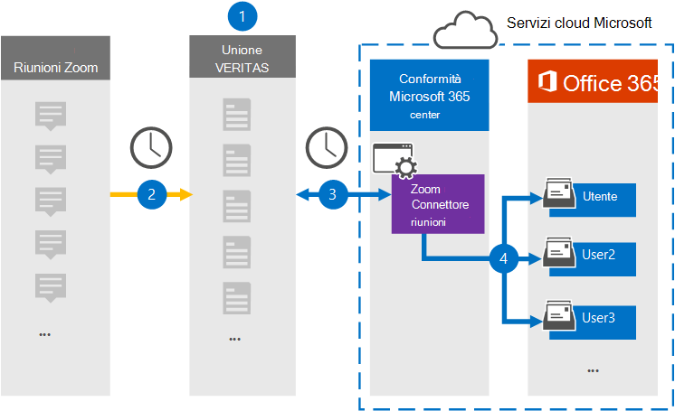

# Configurare un connettore per archiviare i dati delle riunioni dello zoomSet up a connector to archive Zoom Meetings data

Utilizzare un connettore di Globanet nel centro conformità di Microsoft 365 per importare e archiviare i dati dalle riunioni di zoom alle cassette postali degli utenti nell'organizzazione Microsoft 365.Use a Globanet connector in the Microsoft 365 compliance center to import and archive data from Zoom Meetings to user mailboxes in your Microsoft 365 organization. Globanet fornisce un connettore per [riunioni zoom](https://globanet.com/zoom/) configurato per acquisire elementi dall'origine dati di terze parti (su base regolare) e importare tali elementi in Microsoft 365.Globanet provides a [Zoom Meetings](https://globanet.com/zoom/) connector that is configured to capture items from the third-party data source (on a regular basis) and import those items to Microsoft 365. Il connettore converte il contenuto delle riunioni (tra cui chat, file registrati e metadati) dall'account di riunioni zoom a un formato di messaggio di posta elettronica e quindi importa tali elementi nelle cassette postali degli utenti in Microsoft 365.The connector converts the content of the meetings (including chats, recorded files, and metadata) from the Zoom Meetings account to an email message format and then imports those items to user mailboxes in Microsoft 365.

Dopo che i dati delle riunioni dello zoom sono archiviati nelle cassette postali degli utenti, è possibile applicare le funzionalità di conformità di Microsoft 365 come conservazione per controversia legale, eDiscovery, criteri di conservazione e etichette di mantenimento e conformità della comunicazione.After Zoom Meetings data is stored in user mailboxes, you can apply Microsoft 365 compliance features such as Litigation Hold, eDiscovery, retention policies and retention labels, and communication compliance. L'utilizzo di un connettore zoom meetings per l'importazione e l'archiviazione dei dati in Microsoft 365 può aiutare l'organizzazione a rimanere conforme ai criteri governativi e normativi.Using a Zoom Meetings connector to import and archive data in Microsoft 365 can help your organization stay compliant with government and regulatory policies.

## Panoramica dei dati relativi alle riunioni dello zoom di archiviazioneOverview of archiving Zoom Meetings data

Nella panoramica seguente viene illustrato il processo di utilizzo di un connettore per archiviare i dati delle riunioni dello zoom in Microsoft 365.The following overview explains the process of using a connector to archive Zoom Meetings data in Microsoft 365.

1. L'organizzazione funziona con le riunioni dello zoom per impostare e configurare un sito di riunioni zoom.Your organization works with Zoom Meetings to set up and configure a Zoom Meetings site.

2. Una volta ogni 24 ore, gli elementi della riunione dalle riunioni dello zoom vengono copiati nel sito Merge1 di Globanet.Once every 24 hours, meeting items from Zoom Meetings are copied to the Globanet Merge1 site. Il connettore converte anche il contenuto delle riunioni in un formato di messaggio di posta elettronica.The connector also converts the content of the meetings to an email message format.

3. Il connettore di riunioni zoom creato nel centro conformità di Microsoft 365, si connette a Globanet Merge1 ogni giorno e trasferisce i messaggi di riunione in una posizione di archiviazione sicura di Azure nel cloud Microsoft.The Zoom Meetings connector that you create in the Microsoft 365 compliance center, connects to the Globanet Merge1 every day, and transfers the meeting messages to a secure Azure Storage location in the Microsoft cloud.

4. Il connettore importa gli elementi riunione convertiti nelle cassette postali di utenti specifici utilizzando il valore della proprietà di *posta elettronica* e il mapping automatico degli utenti, come descritto nel passaggio 3.The connector imports the converted meeting items to the mailboxes of specific users using the value of the *Email* property and automatic user mapping, as described in Step 3. Una nuova sottocartella nella cartella posta in arrivo denominata **riunioni zoom** viene creata nelle cassette postali degli utenti e gli elementi della riunione vengono importati in tale cartella.A new subfolder in the Inbox folder named **Zoom Meetings** is created in user mailboxes, and the meeting items are imported to that folder. Il connettore esegue questa operazione utilizzando il valore della proprietà di *posta elettronica* .The connector does this by using the value of the *Email* property. Ogni elemento della riunione contiene questa proprietà, che viene popolata con l'indirizzo di posta elettronica di tutti i partecipanti alla riunione.Every meeting item contains this property, which is populated with the email address of every participant of the meeting.

## Prima di iniziareBefore you begin

- Creare un account Merge1 di Globanet per i connettori Microsoft.Create a Globanet Merge1 account for Microsoft connectors. A tale scopo, contattare il [supporto clienti di Globanet](https://globanet.com/ms-connectors-contact).To do this, contact [Globanet Customer Support](https://globanet.com/ms-connectors-contact). È necessario accedere a questo account quando si crea il connettore nel passaggio 1.You need to sign into this account when you create the connector in Step 1.

- Ottenere il nome utente e la password per l'account aziendale dello zoom o dello zoom dell'organizzazione.Obtain the username and password for your organization's Zoom Business or Zoom Enterprise account. È necessario accedere a questo account nel passaggio 2 quando si configura il connettore di riunioni zoom.You'll need to sign into this account in Step 2 when you configure the Zoom Meetings connector.

- Creare le applicazioni seguenti nel [Marketplace zoom](https://marketplace.zoom.us):Create the following applications in the [Zoom Marketplace](https://marketplace.zoom.us):

  - Applicazione OAuthOAuth application

  - Applicazione JWTJWT application

  Dopo aver creato queste applicazioni, la piattaforma zoom genera un set di credenziali univoche utilizzate per generare i token.After you create these applications, the Zoom platform generates a set of unique credentials used to generate the tokens. Questi token vengono utilizzati per autenticare il connettore quando si connette all'account di zoom e gli elementi vengono copiati nel sito di Merge1.These tokens are used to authenticate the connector when it connects to your Zoom account and copies items to the Merge1 site. Questi token verranno utilizzati quando si configura il connettore dello zoom nel passaggio 2.You will use these tokens when you configure the Zoom connector in Step 2.

  Per istruzioni dettagliate su come creare le applicazioni OAuth e JWT, vedere [Merge1 Third-Party Connectors user guide](https://docs.ms.merge1.globanetportal.com/Merge1%20Third-Party%20Connectors%20Zoom%20Meetings%20User%20Guide%20.pdf).For step-by step instructions on how to create the OAuth and JWT applications, see [Merge1 Third-Party Connectors User Guide](https://docs.ms.merge1.globanetportal.com/Merge1%20Third-Party%20Connectors%20Zoom%20Meetings%20User%20Guide%20.pdf).

- L'utente che crea il connettore di riunioni zoom nel passaggio 1 (e lo completa nel passaggio 3) deve essere assegnato al ruolo di esportazione delle cassette postali in Exchange Online.The user who creates the Zoom Meetings connector in Step 1 (and completes it in Step 3) must be assigned to the Mailbox Import Export role in Exchange Online. Questo ruolo è necessario per aggiungere connettori nella pagina **dei connettori dati** nel centro conformità di Microsoft 365.This role is required to add connectors on the **Data connectors** page in the Microsoft 365 compliance center. Per impostazione predefinita, questo ruolo non è assegnato a nessun gruppo di ruoli in Exchange Online.By default, this role is not assigned to any role group in Exchange Online. È possibile aggiungere il ruolo import export delle cassette postali al gruppo di ruoli Gestione organizzazione in Exchange Online.You can add the Mailbox Import Export role to the Organization Management role group in Exchange Online. In alternativa, è possibile creare un gruppo di ruoli, assegnare il ruolo di esportazione delle cassette postali e quindi aggiungere gli utenti corretti come membri.Or you can create a role group, assign the Mailbox Import Export role, and then add the appropriate users as members. Per ulteriori informazioni, vedere la sezione creare gruppi di [ruoli](https://docs.microsoft.com/Exchange/permissions-exo/role-groups#create-role-groups) o [modificare gruppi di ruoli](https://docs.microsoft.com/Exchange/permissions-exo/role-groups#modify-role-groups) nell'articolo "gestire i gruppi di ruoli in Exchange Online".For more information, see the [Create role groups](https://docs.microsoft.com/Exchange/permissions-exo/role-groups#create-role-groups) or [Modify role groups](https://docs.microsoft.com/Exchange/permissions-exo/role-groups#modify-role-groups) sections in the article "Manage role groups in Exchange Online".

## Passaggio 1: configurare il connettore per riunioni zoomStep 1: Set up the Zoom Meetings connector

Il primo passaggio consiste nell'accedere ai **connettori di dati** nel centro conformità di Microsoft 365 e creare un connettore di riunioni zoom.The first step is to access the **Data Connectors** in the Microsoft 365 compliance center and create a Zoom Meetings connector.

1. Passare a [https://compliance.microsoft.com](https://compliance.microsoft.com/) e quindi fare clic su riunioni zoom **dei connettori dati**  >  **Zoom Meetings**.Go to [https://compliance.microsoft.com](https://compliance.microsoft.com/) and then click **Data connectors** > **Zoom Meetings**.

2. Nella pagina Descrizione del prodotto **riunioni di zoom** fare clic su **Aggiungi connettore**.On the **Zoom Meetings** product description page, click **Add connector**.

3. Nella pagina **condizioni del servizio** fare clic su **Accetto**.On the **Terms of service** page, click **Accept**.

4. Immettere un nome univoco che identifichi il connettore e quindi fare clic su **Avanti**.Enter a unique name that identifies the connector, and then click **Next**.

5. Accedere al proprio account di Merge1 per configurare il connettore.Sign in to your Merge1 account to configure the connector.

## Passaggio 2: configurare il connettore di riunioni zoomStep 2: Configure the Zoom Meetings connector

Il secondo passaggio consiste nel configurare il connettore di riunioni zoom nel sito di Merge1.The second step is to configure the Zoom Meetings connector on the Merge1 site. Per ulteriori informazioni su come configurare il connettore zoom meetings nel sito Globanet Merge1, vedere [Merge1 di terze parti dei connettori utente](https://docs.ms.merge1.globanetportal.com/Merge1%20Third-Party%20Connectors%20Zoom%20Meetings%20User%20Guide%20.pdf).For more information about how to configure the Zoom Meetings connector on the Globanet Merge1 site, see [Merge1 Third-Party Connectors User Guide](https://docs.ms.merge1.globanetportal.com/Merge1%20Third-Party%20Connectors%20Zoom%20Meetings%20User%20Guide%20.pdf).

Dopo aver fatto clic su **salva & fine**, è possibile tornare al centro conformità di Microsoft 365 alla pagina **mapping utenti** nella procedura guidata del connettore.After you click **Save & Finish**, you are directed back to the Microsoft 365 compliance center, to the **User mapping** page in the connector wizard.

## Passaggio 3: mappare gli utenti e completare la configurazione del connettoreStep 3: Map users and complete the connector setup

1. Nella pagina mapping **utenti esterni a Microsoft 365** , abilitare il mapping automatico degli utenti.On the **Map external users to Microsoft 365 users** page, enable automatic user mapping.

   Gli elementi di riunioni zoom includono una proprietà denominata *posta elettronica* che contiene gli indirizzi di posta elettronica per gli utenti dell'organizzazione.Zoom Meetings items include a property called *Email* that contains email addresses for users in your organization. Se il connettore è in grado di associare l'indirizzo a un utente di Microsoft 365, gli elementi vengono importati nella cassetta postale dell'utente.If the connector can associate this address with a Microsoft 365 user, the items are imported to that user's mailbox

2. Nella pagina **consenso amministratore** fare clic sul pulsante **Fornisci consenso** .On the **Admin Consent** page, click the **Provide Consent** button. L'utente verrà reindirizzato al sito Microsoft.You will be redirected to the Microsoft site. Fare clic su **accetta** per fornire il consenso.Click **Accept** to provide the consent.
  
   L'organizzazione deve autorizzare il servizio di importazione di Office 365 per accedere ai dati delle cassette postali nell'organizzazione.Your organization must consent to allow the Office 365 Import service to access mailbox data in your organization. Per fornire il consenso dell'amministratore, è necessario essere connessi con le credenziali di un amministratore globale di Microsoft 365 e quindi accettare la richiesta di consenso.To provide admin consent, you must be signed in with the credentials of a Microsoft 365 global admin, and then accept the consent request. Se non è stato eseguito l'accesso come amministratore globale, è possibile accedere a [Questa pagina](https://login.microsoftonline.com/common/oauth2/authorize?client_id=570d0bec-d001-4c4e-985e-3ab17fdc3073&response_type=code&redirect_uri=https://portal.azure.com/&nonce=1234&prompt=admin_consent) ed eseguire l'accesso con le credenziali di amministratore globale per accettare la richiesta.If you aren't signed in as a global admin, you can go to [this page](https://login.microsoftonline.com/common/oauth2/authorize?client_id=570d0bec-d001-4c4e-985e-3ab17fdc3073&response_type=code&redirect_uri=https://portal.azure.com/&nonce=1234&prompt=admin_consent) and sign in using global admin credentials to accept the request.

3. Fare clic su **Avanti**, rivedere le impostazioni e passare alla pagina **connettori dati** per visualizzare lo stato di avanzamento del processo di importazione per il nuovo connettore.Click **Next**, review your settings, and go to the **Data connectors** page to see the progress of the import process for the new connector.

## Passaggio 4: monitorare il connettore di riunioni zoomStep 4: Monitor the Zoom Meetings connector

Dopo aver creato il connettore di riunioni zoom, è possibile visualizzare lo stato del connettore nel centro conformità di Microsoft 365.After you create the Zoom Meetings connector, you can view the connector status in the Microsoft 365 compliance center.

1. Andare a [https://compliance.microsoft.com](https://compliance.microsoft.com) e fare clic su **connettori dati** nel NAV sinistro.Go to [https://compliance.microsoft.com](https://compliance.microsoft.com) and click **Data connectors** in the left nav.

2. Fare clic sulla scheda **connettori** e quindi selezionare il connettore **ingrandimento riunioni** per visualizzare la pagina del riquadro a comparsa, che contiene le proprietà e le informazioni sul connettore.Click the **Connectors** tab and then select the **Zoom Meetings** connector to display the flyout page, which contains the properties and information about the connector.

3. In **stato connettore con origine**fare clic sul collegamento **Scarica log** per aprire o salvare il registro di stato del connettore.Under **Connector status with source**, click the **Download log** link to open (or save) the status log for the connector. Questo log contiene informazioni sui dati che sono stati importati nel cloud Microsoft.This log contains information about the data that has been imported to the Microsoft cloud.

## Problemi notiKnown issues

- Al momento, non è supportato l'importazione di allegati o elementi di dimensioni superiori a 10 MB.At this time, we don't support importing attachments or items that are larger than 10 MB. Il supporto per gli elementi di grandi dimensioni sarà disponibile in un secondo momento.Support for larger items will be available at a later date.

- Per il funzionamento del connettore di riunioni zoom, è necessario abilitare le registrazioni quando si configurano le riunioni dello zoom.For the Zoom Meetings connector to work, you must enable recordings when setting up Zoom Meetings.
