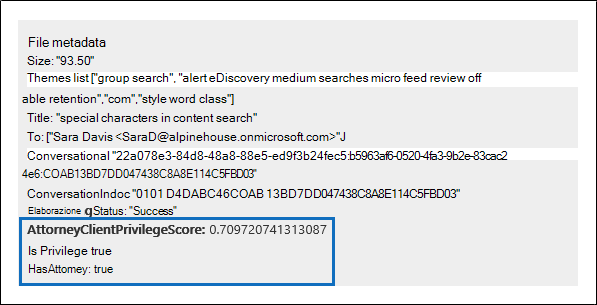
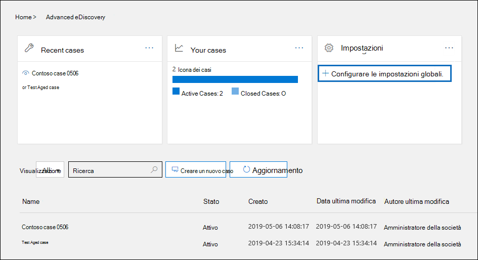

# Configurare il rilevamento dei privilegi avvocato-client in Advanced eDiscoverySet up attorney-client privilege detection in Advanced eDiscovery

Un aspetto importante e costoso della fase di revisione di un processo di eDiscovery consiste nell'esaminare i documenti per il contenuto con privilegi.A major and costly aspect of the review phase of any eDiscovery process is reviewing documents for privileged content. Advanced eDiscovery fornisce il rilevamento basato sull'apprendimento automatico del contenuto con privilegi per rendere più efficiente questo processo.Advanced eDiscovery provides machine learning-based detection of privileged content to make this process more efficient. Questa funzionalità è denominata *rilevamento dei privilegi di avvocato-client*.This feature is called *attorney-client privilege detection*.

## Come funzionaHow does it work?

Quando è abilitato il rilevamento dei privilegi di avvocato-client, tutti i documenti in un set di revisione verranno elaborati dal modello di rilevamento del privilegio avvocato-client quando si [analizzano i dati](analyzing-data-in-review-set.md) nel set di revisione.When attorney-client privilege detection is enabled, all documents in a review set will be processed by the attorney-client privilege detection model when you [analyze the data](analyzing-data-in-review-set.md) in the review set. Il modello cerca due elementi:The model looks for two things:

- Contenuto con privilegi: il modello utilizza l'apprendimento automatico per determinare la probabilità che il documento contenga contenuti di natura legale.Privileged content – The model uses machine learning to determine the likelihood that the document contains content that is legal in nature.

- Partecipanti – nell'ambito della configurazione del rilevamento dei privilegi del procuratore-client, è necessario inviare un elenco di avvocati per la propria organizzazione.Participants – As part of setting up attorney-client privilege detection, you have to submit a list of attorneys for your organization. Il modello confronta quindi i partecipanti del documento con l'elenco degli avvocati per determinare se un documento ha almeno un partecipante al procuratore.The model then compares the participants of the document with the attorney list to determine if a document has at least one attorney participant.

Il modello produce le tre proprietà seguenti per ogni documento:The model produces the following three properties for every document:

- **AttorneyClientPrivilegeScore:** La probabilità che il documento sia di natura legale; i valori per il punteggio sono compresi tra **0** e **1**.**AttorneyClientPrivilegeScore:** The likelihood the document is legal in nature; the values for the score are between **0** and **1**.

- **HasAttorney:** Questa proprietà è impostata su **true** se uno dei partecipanti al documento è elencato nell'elenco procuratore; in caso contrario, il valore è **false**.**HasAttorney:** This property is set to **true** if one of the document participants is listed in the attorney list; otherwise the value is **false**. Il valore viene impostato su **false** anche se l'organizzazione non ha caricato un elenco di avvocati.The value is also set to **false** if your organization didn't upload an attorney list.

- **Privilegio:** Questa proprietà è impostata su **true** se il valore di **AttorneyClientPrivilegeScore** è al di sopra della soglia *o* se il documento ha un partecipante al procuratore; in caso contrario, il valore è impostato su **false**.**IsPrivilege:** This property is set to **true** if the value for **AttorneyClientPrivilegeScore** is above the threshold *or* if the document has an attorney participant; otherwise the value is set to **false**.

Queste proprietà e i relativi valori corrispondenti vengono aggiunte ai metadati del file dei documenti in un set di revisione, come illustrato nella schermata seguente:These properties (and their corresponding values) are added to the file metadata of the documents in a review set, as shown in the following screenshot:

Queste tre proprietà sono anche ricercabili all'interno di un set di revisione.These three properties are also searchable within a review set. Per ulteriori informazioni, vedere [eseguire una query sui dati in un set di revisione](review-set-search.md).For more information, see [Query the data in a review set](review-set-search.md).

## Configurare il modello di rilevamento dei privilegi avvocato-clientSet up the attorney-client privilege detection model

Per abilitare il modello di rilevamento dei privilegi avvocato-client, è necessario che l'organizzazione lo accenda e quindi carichi un elenco di avvocati.To enable the attorney-client privilege detection model, your organization has to turn it on and then upload an attorney list.

### Passaggio 1: attivazione del rilevamento dei privilegi di avvocato-clientStep 1: Turn on attorney-client privilege detection

Una persona che è un amministratore di eDiscovery nell'organizzazione (un membro del sottogruppo di amministratore di eDiscovery nel gruppo di ruoli di gestione di eDiscovery) deve rendere disponibile il modello nei casi di eDiscovery avanzati.A person who is an eDiscovery Administrator in your organization (a member of the eDiscovery Administrator subgroup in the eDiscovery Manager role group) must make the model available in your Advanced eDiscovery cases.

1. Nel centro sicurezza & conformità, accedere a **eDiscovery > Advanced eDiscovery**.In the Security & Compliance Center, go to **eDiscovery > Advanced eDiscovery**.

2. Nella Home page di **Advanced eDiscovery** , nel riquadro **Impostazioni** , fare clic su **Configura impostazioni di analisi globali**.On the **Advanced eDiscovery** home page, in the **Settings** tile, click **Configure global analytics settings**.

   

3. Nella scheda **impostazioni di analisi** , selezionare **Gestisci impostazione privilegio avvocato-client**.On the **Analytics settings** tab, select **Manage attorney-client privilege setting**.

4. Nella pagina del riquadro a comparsa dei **privilegi avvocato-client** , utilizzare l'interruttore per attivare la funzionalità e quindi selezionare **Salva**.On the **Attorney-client privilege** flyout page, use the toggle to turn on the feature and then select **Save**.

### Passaggio 2: caricare un elenco di avvocati (facoltativo)Step 2: Upload a list of attorneys (optional)

Per sfruttare al meglio il modello di rilevamento dei privilegi avvocato-client e utilizzare i risultati del **procuratore** o del rilevamento **potenzialmente privilegiato** descritto in precedenza, si consiglia di caricare un elenco di indirizzi di posta elettronica per gli avvocati e gli addetti legali che lavorano per la propria organizzazione.To take full advantage of the attorney-client privilege detection model and use the results of the **Has Attorney** or **Potentially Privileged** detection that was previously described, we recommend that you upload a list of email addresses for the lawyers and legal personnel who work for your organization. 

Per caricare un elenco di avvocati per l'utilizzo da parte del modello di rilevamento dei privilegi avvocato-client:To upload an attorney list for use by the attorney-client privilege detection model:

1. Creare un file. csv (senza una riga di intestazione) e aggiungere l'indirizzo di posta elettronica per ogni persona appropriata su una riga distinta.Create a .csv file (without a header row) and add the email address for each appropriate person on a separate line. Salvare il file nel computer locale.Save this file to your local computer.

2. Nella Home page di **Advanced eDiscovery** fare clic su **Configura caratteristiche sperimentali**nella sezione **Impostazioni** e quindi selezionare **Gestisci impostazione privilegio avvocato-client**.On the **Advanced eDiscovery** home page, in the **Settings** tile, select **Configure experimental features**, and then select **Manage attorney-client privilege setting**.

   Viene visualizzata la pagina **Privilege avvocato-client** e l'interruttore di **rilevamento dei privilegi del procuratore-client** è attivato.The **Attorney-client privilege** page is displayed, and the **Attorney-client privilege detection** toggle is turned on.

   

3. Selezionare **Sfoglia** e quindi individuare e selezionare il file. csv creato nel passaggio 1.Select **Browse** and then find and select the .csv file that you created in step 1.

4. Selezionare **Salva** per caricare l'elenco degli avvocati.Select **Save** to upload the attorney list.

## Utilizzare il modello di rilevamento dei privilegi avvocato-clientUse the attorney-client privilege detection model

Seguire la procedura descritta in questa sezione per utilizzare il rilevamento dei privilegi di avvocato-client per i documenti in un set di revisione.Follow the steps in this section to use attorney-client privilege detection for documents in a review set.

### Passaggio 1: creare un gruppo di smart tag con il modello di rilevamento dei privilegi avvocato-clientStep 1: Create a smart tag group with attorney-client privilege detection model

Uno dei modi principali per visualizzare i risultati del rilevamento dei privilegi del procuratore-client nel processo di revisione consiste nell'utilizzare un gruppo di smart tag.One of the primary ways to see the results of attorney-client privilege detection in your review process is by using a smart tag group. Un gruppo di smart tag indica i risultati del rilevamento dei privilegi avvocato-client e Visualizza i risultati in linea accanto ai tag in un gruppo di smart tag.A smart tag group indicates the results of the attorney-client privilege detection and shows the results in-line next to the tags in a smart tag group. In questo modo è possibile identificare rapidamente i documenti potenzialmente privilegiati durante la revisione del documento.This lets you quickly identify potentially privileged documents during document review. Inoltre, è possibile utilizzare i tag del gruppo smart tag per contrassegnare i documenti come privilegiati o non privilegiati.Additionally, you can also use the tags in the smart tag group to tag documents as privileged or non-privileged. Per ulteriori informazioni sugli smart tag, vedere [configurare gli smart tag in Advanced eDiscovery](smart-tags.md).For more information about smart tags, see [Set up smart tags in Advanced eDiscovery](smart-tags.md).

1. Nel set di revisione che contiene i documenti analizzati nel passaggio 1, selezionare **Gestisci Revisione set** e quindi selezionare **Gestisci Tag**.In the review set that contains the documents that you analyzed in Step 1, select **Manage review set** and then select **Manage tags**.
 
2. In **tag**selezionare l'elenco a discesa accanto a **Aggiungi gruppo** e quindi fare clic su **Aggiungi gruppo smart tag**.Under **Tags**, select the pull-down next to **Add group** and then select **Add smart tag group**.

   

3. Nella pagina **scegliere un modello per la smart tag** scegliere **Seleziona** accanto a **privilegio avvocato-client**.On the **Choose a model for your smart tag** page, choose **Select** next to **Attorney-client privilege**.

   Viene visualizzato un gruppo di tag denominato **procuratore-Client Privilege** .A tag group named **Attorney-client privilege** is displayed. Contiene due tag figlio denominati **positivi** e **negativi**, che corrispondono ai possibili risultati prodotti dal modello.It contains two child tags named **Positive** and **Negative**, which correspond to the possible results produced by the model.

   

3. Rinominare il gruppo e i tag dei tag in base alle proprie esigenze per la revisione.Rename the tag group and tags as appropriate for your review. Ad esempio, è possibile rinominare **positivamente** con **privilegi** e **negativi** a **non privilegiati**.For example, you can rename **Positive** to **Privileged** and **Negative** to **Not privileged**.

### Passaggio 2: analizzare un set di RevisioneStep 2: Analyze a review set

Quando si analizzano i documenti in un set di revisione, viene eseguito anche il modello di rilevamento dei privilegi di avvocato-client e le proprietà corrispondenti (descritte in [modalità di funzionamento?](#how-does-it-work) verranno aggiunte a tutti i documenti del set di revisione.When you analyze the documents in a review set, the attorney-client privilege detection model will also run and the corresponding properties (described in [How does it work?](#how-does-it-work) will be added to every document in the review set. Per ulteriori informazioni sull'analisi dei dati nel set di revisione, vedere [analyze data in a Review set in Advanced eDiscovery](analyzing-data-in-review-set.md).For more information about analyzing data in review set, see [Analyze data in a review set in Advanced eDiscovery](analyzing-data-in-review-set.md).

### Passaggio 3: utilizzare il gruppo smart tag per la revisione dei contenuti con privilegiStep 3: Use the smart tag group for review of privileged content

Dopo aver analizzato il set di revisione e aver configurato gli smart tag, il passaggio successivo consiste nel rivedere i documenti.After analyzing the review set and setting up smart tags, the next step is to review the documents. Se il modello ha determinato che il documento è potenzialmente privilegiato, lo smart tag corrispondente nel **Pannello di tagging** indicherà i risultati seguenti ottenuti dal rilevamento dei privilegi avvocato-client:If the model has determined the document is potentially privileged, the corresponding smart tag in the **Tagging panel** will indicate the following results produced by the attorney-client privilege detection:

- Se il documento contiene contenuto che potrebbe essere di natura legale, il **contenuto legale** dell'etichetta viene visualizzato accanto allo smart tag corrispondente, che in questo caso è il tag **positivo** predefinito.If the document has content that may be legal in nature, the label **Legal content** is displayed next to the corresponding smart tag (which in this case is the default **Positive** tag).

- Se il documento ha un partecipante che si trova nell'elenco di avvocati dell'organizzazione, viene visualizzato il **procuratore** di etichette accanto allo smart tag corrispondente (che in questo caso è anche il tag **positivo** predefinito).If the document has a participant who is found in your organization's attorney list, the label **Attorney** is displayed next to the corresponding smart tag (which in this case is also the default **Positive** tag).

- Se il documento contiene contenuto che potrebbe essere di natura legale *e* ha un partecipante trovato nell'elenco degli avvocati, vengono visualizzati sia il **contenuto legale** che le etichette del **procuratore** .If the document has content that may be legal in nature *and* has a participant found in the attorney list, both the **Legal content**  and **Attorney** labels are displayed. 

Se il modello determina che un documento non contiene contenuto di natura legale o che non contiene un partecipante all'elenco degli avvocati, non viene visualizzata alcuna etichetta nel pannello di tagging.If the model determines that a document doesn't contain content that is legal in nature or doesn't contain a participant from the attorney list, then neither label is displayed in the tagging panel.

Ad esempio, nelle schermate seguenti vengono visualizzati due documenti.For example, the following screenshots show two documents. Il primo contiene contenuto di natura legale e ha un partecipante trovato nell'elenco degli avvocati.The first one contains content that is legal in nature and has a participant found in the list of attorneys. La seconda non contiene né e pertanto non Visualizza etichette.The second contains neither and therefore doesn't display any labels.

Dopo aver esaminato un documento per verificare se contiene contenuto con privilegi, è possibile contrassegnare il documento con il tag appropriato.After you review a document to see if it contains privileged content, you can tag the document with the appropriate tag.
