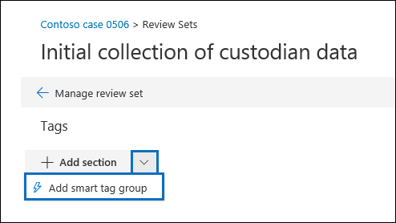

# Configurare il rilevamento dei privilegi avvocato-client in Advanced eDiscoverySet up attorney-client privilege detection in Advanced eDiscovery

Un aspetto importante e diss costose della fase di revisione di qualsiasi processo di eDiscovery è la revisione dei documenti per i contenuti privilegiati.A major and costly aspect of the review phase of any eDiscovery process is reviewing documents for privileged content. Advanced eDiscovery offre il rilevamento basato sull'apprendimento automatico dei contenuti privilegiati per rendere più efficiente questo processo.Advanced eDiscovery provides machine learning-based detection of privileged content to make this process more efficient. Questa funzionalità è denominata *rilevamento dei privilegi avvocato-client.*This feature is called *attorney-client privilege detection*.

## Come funziona?How does it work?

Quando il rilevamento dei privilegi avvocato-client è abilitato, tutti i documenti in un  insieme da rivedere verranno elaborati dal modello di rilevamento dei privilegi avvocato-client quando si analizzano i dati nel set da rivedere.When attorney-client privilege detection is enabled, all documents in a review set will be processed by the attorney-client privilege detection model when you [analyze the data](analyzing-data-in-review-set.md) in the review set. Il modello cerca due elementi:The model looks for two things:

- Contenuto con privilegi: il modello usa l'apprendimento automatico per determinare la probabilità che il documento contenga contenuto di natura legale.Privileged content – The model uses machine learning to determine the likelihood that the document contains content that is legal in nature.

- Partecipanti: nell'ambito della configurazione del rilevamento dei privilegi avvocato-client, è necessario inviare un elenco di avvocati per l'organizzazione.Participants – As part of setting up attorney-client privilege detection, you have to submit a list of attorneys for your organization. Il modello confronta quindi i partecipanti al documento con l'elenco degli avvocati per determinare se un documento ha almeno un avvocato partecipante.The model then compares the participants of the document with the attorney list to determine if a document has at least one attorney participant.

Il modello produce le tre proprietà seguenti per ogni documento:The model produces the following three properties for every document:

- **AttorneyClientPrivilegeScore:** La probabilità che il documento sia di natura legale; i valori per il punteggio sono compresi tra **0** e **1.****AttorneyClientPrivilegeScore:** The likelihood the document is legal in nature; the values for the score are between **0** and **1**.

- **HasAttorney:** Questa proprietà è **impostata** su true se uno dei partecipanti al documento è elencato nell'elenco degli avvocati. in caso contrario, il valore è **false.****HasAttorney:** This property is set to **true** if one of the document participants is listed in the attorney list; otherwise the value is **false**. Il valore è impostato su **false anche se** l'organizzazione non ha caricato un elenco di avvocati.The value is also set to **false** if your organization didn't upload an attorney list.

- **IsPrivilege:** Questa proprietà è **impostata** su true se il valore di **AttorneyClientPrivilegeScore** è superiore alla soglia o se il documento ha un partecipante avvocato;  in caso contrario, il valore è impostato su **false.****IsPrivilege:** This property is set to **true** if the value for **AttorneyClientPrivilegeScore** is above the threshold *or* if the document has an attorney participant; otherwise the value is set to **false**.

Queste proprietà (e i valori corrispondenti) vengono aggiunte ai metadati dei file dei documenti in un insieme da rivedere, come illustrato nello screenshot seguente:These properties (and their corresponding values) are added to the file metadata of the documents in a review set, as shown in the following screenshot:

È inoltre possibile eseguire ricerche in queste tre proprietà all'interno di un insieme da rivedere.These three properties are also searchable within a review set. Per ulteriori informazioni, vedere [Eseguire query sui dati in un insieme da rivedere.](review-set-search.md)For more information, see [Query the data in a review set](review-set-search.md).

## Configurare il modello di rilevamento dei privilegi avvocato-clientSet up the attorney-client privilege detection model

Per abilitare il modello di rilevamento dei privilegi avvocato-cliente, l'organizzazione deve attivarlo e quindi caricare un elenco di avvocati.To enable the attorney-client privilege detection model, your organization has to turn it on and then upload an attorney list.

### Passaggio 1: attivare il rilevamento dei privilegi avvocato-clientStep 1: Turn on attorney-client privilege detection

Una persona che è un amministratore di eDiscovery nell'organizzazione (membro del sottogruppo Amministratore di eDiscovery nel gruppo di ruoli Gestore di eDiscovery) deve rendere il modello disponibile nei casi di Advanced eDiscovery.A person who is an eDiscovery Administrator in your organization (a member of the eDiscovery Administrator subgroup in the eDiscovery Manager role group) must make the model available in your Advanced eDiscovery cases.

1. Nel Centro sicurezza & conformità passare a **eDiscovery > Advanced eDiscovery.**In the Security & Compliance Center, go to **eDiscovery > Advanced eDiscovery**.

2. Nella home page **di Advanced eDiscovery,** nel riquadro **Impostazioni,** fare clic **su Configura impostazioni di analisi globale.**On the **Advanced eDiscovery** home page, in the **Settings** tile, click **Configure global analytics settings**.

   

3. Nella scheda **Impostazioni di analisi** selezionare Gestisci **l'impostazione dei privilegi avvocato-client.**On the **Analytics settings** tab, select **Manage attorney-client privilege setting**.

4. Nella pagina del riquadro a comparsa **Privilegio avvocato-client,** utilizzare l'interruttore per attivare la funzionalità e quindi selezionare **Salva.**On the **Attorney-client privilege** flyout page, use the toggle to turn on the feature and then select **Save**.

### Passaggio 2: caricare un elenco di avvocati (facoltativo)Step 2: Upload a list of attorneys (optional)

Per sfruttare al meglio il modello di rilevamento dei privilegi avvocato-cliente e utilizzare i risultati del rilevamento Has **Attorney** o **Potentially Privileged** descritto in precedenza, è consigliabile caricare un elenco di indirizzi di posta elettronica per i legali e il personale legale che lavorano per l'organizzazione.To take full advantage of the attorney-client privilege detection model and use the results of the **Has Attorney** or **Potentially Privileged** detection that was previously described, we recommend that you upload a list of email addresses for the lawyers and legal personnel who work for your organization. 

Per caricare un elenco di avvocati per l'uso da parte del modello di rilevamento dei privilegi avvocato-client:To upload an attorney list for use by the attorney-client privilege detection model:

1. Creare un file CSV (senza una riga di intestazione) e aggiungere l'indirizzo di posta elettronica per ogni persona appropriata su una riga separata.Create a .csv file (without a header row) and add the email address for each appropriate person on a separate line. Salvare il file nel computer locale.Save this file to your local computer.

2. Nella home page **di Advanced eDiscovery,** nel **riquadro** Impostazioni, selezionare Configura funzionalità **sperimentali** e quindi selezionare Gestisci l'impostazione dei privilegi **avvocato-client.**On the **Advanced eDiscovery** home page, in the **Settings** tile, select **Configure experimental features**, and then select **Manage attorney-client privilege setting**.

   Viene **visualizzata la pagina Privilegi avvocato-client** e l'interruttore di rilevamento dei privilegi **avvocato-client** è attivato.The **Attorney-client privilege** page is displayed, and the **Attorney-client privilege detection** toggle is turned on.

   

3. Selezionare **Sfoglia,** quindi trovare e selezionare il file CSV creato nel passaggio 1.Select **Browse** and then find and select the .csv file that you created in step 1.

4. Selezionare **Salva** per caricare l'elenco degli avvocati.Select **Save** to upload the attorney list.

## Usare il modello di rilevamento dei privilegi avvocato-clientUse the attorney-client privilege detection model

Seguire i passaggi descritti in questa sezione per usare il rilevamento dei privilegi avvocato-client per i documenti in un insieme da rivedere.Follow the steps in this section to use attorney-client privilege detection for documents in a review set.

### Passaggio 1: Creare un gruppo di smart tag con modello di rilevamento dei privilegi avvocato-clientStep 1: Create a smart tag group with attorney-client privilege detection model

Uno dei modi principali per visualizzare i risultati del rilevamento dei privilegi avvocato-client nel processo di revisione è l'uso di un gruppo di smart tag.One of the primary ways to see the results of attorney-client privilege detection in your review process is by using a smart tag group. Un gruppo di smart tag indica i risultati del rilevamento dei privilegi avvocato-client e mostra i risultati in linea accanto ai tag in un gruppo di smart tag.A smart tag group indicates the results of the attorney-client privilege detection and shows the results in-line next to the tags in a smart tag group. Ciò consente di identificare rapidamente i documenti potenzialmente privilegiati durante la revisione dei documenti.This lets you quickly identify potentially privileged documents during document review. È inoltre possibile utilizzare i tag nel gruppo di smart tag per contrassegnare i documenti come privilegiati o non privilegiati.Additionally, you can also use the tags in the smart tag group to tag documents as privileged or non-privileged. Per ulteriori informazioni sugli smart tag, vedere [Configurare gli smart tag in Advanced eDiscovery.](smart-tags.md)For more information about smart tags, see [Set up smart tags in Advanced eDiscovery](smart-tags.md).

1. Nel set di revisioni contenente i documenti analizzati nel passaggio 1, selezionare **Gestisci insieme** revisione e quindi **Gestisci tag.**In the review set that contains the documents that you analyzed in Step 1, select **Manage review set** and then select **Manage tags**.
 
2. In **Tag** selezionare l'elenco a discesa accanto ad **Aggiungi gruppo** e quindi selezionare Aggiungi gruppo smart **tag.**Under **Tags**, select the pull-down next to **Add group** and then select **Add smart tag group**.

   

3. Nella pagina **Scegliere un modello per lo smart tag** scegliere **Seleziona** accanto a **Privilegio avvocato-client.**On the **Choose a model for your smart tag** page, choose **Select** next to **Attorney-client privilege**.

   Viene visualizzato un gruppo **di tag denominato Privilegio** avvocato-client.A tag group named **Attorney-client privilege** is displayed. Contiene due tag figlio denominati **Positive** e **Negative,** che corrispondono ai possibili risultati prodotti dal modello.It contains two child tags named **Positive** and **Negative**, which correspond to the possible results produced by the model.

   

3. Rinominare il gruppo di tag e i tag in base alle esigenze della recensione.Rename the tag group and tags as appropriate for your review. Ad esempio, è possibile rinominare **Positivo** in **Privilegiato** e **Negativo** a **Non privilegiato.**For example, you can rename **Positive** to **Privileged** and **Negative** to **Not privileged**.

### Passaggio 2: analizzare un insieme di recensioniStep 2: Analyze a review set

Quando si analizzano i documenti in un insieme da rivedere, verrà eseguito anche il modello di rilevamento dei privilegi avvocato-client e le proprietà corrispondenti (descritte in Come [funziona?](#how-does-it-work) verranno aggiunte a ogni documento nel set da rivedere.When you analyze the documents in a review set, the attorney-client privilege detection model will also run and the corresponding properties (described in [How does it work?](#how-does-it-work) will be added to every document in the review set. Per ulteriori informazioni sull'analisi dei dati in un insieme da rivedere, vedere Analizzare i [dati in un insieme da rivedere in Advanced eDiscovery.](analyzing-data-in-review-set.md)For more information about analyzing data in review set, see [Analyze data in a review set in Advanced eDiscovery](analyzing-data-in-review-set.md).

### Passaggio 3: Utilizzare il gruppo di smart tag per la revisione del contenuto con privilegiStep 3: Use the smart tag group for review of privileged content

Dopo aver analizzato il set di revisione e aver configurato gli smart tag, il passaggio successivo consiste nel rivedere i documenti.After analyzing the review set and setting up smart tags, the next step is to review the documents. Se il modello ha determinato che il documento è potenzialmente privilegiato, lo smart tag corrispondente nel pannello **Tagging** indicherà i risultati seguenti prodotti dal rilevamento dei privilegi avvocato-client:If the model has determined the document is potentially privileged, the corresponding smart tag in the **Tagging panel** will indicate the following results produced by the attorney-client privilege detection:

- Se il documento include contenuto di natura  legale, l'etichetta Contenuto legale viene visualizzata accanto al corrispondente smart tag, che in questo caso è il tag **Positivo** predefinito.If the document has content that may be legal in nature, the label **Legal content** is displayed next to the corresponding smart tag (which in this case is the default **Positive** tag).

- Se il documento contiene un partecipante presente nell'elenco  degli avvocati dell'organizzazione, l'etichetta Avvocato viene visualizzata accanto allo smart tag corrispondente (che in questo caso è anche il tag **Positivo** predefinito).If the document has a participant who is found in your organization's attorney list, the label **Attorney** is displayed next to the corresponding smart tag (which in this case is also the default **Positive** tag).

- Se il documento contiene contenuto di natura legale e un partecipante  è presente  nell'elenco degli avvocati, vengono visualizzati sia il contenuto legale che le etichette degli avvocati. If the document has content that may be legal in nature *and* has a participant found in the attorney list, both the **Legal content**  and **Attorney** labels are displayed. 

Se il modello determina che un documento non contiene contenuto di natura legale o che non contiene un partecipante nell'elenco degli avvocati, nel riquadro di tagging non viene visualizzata alcuna etichetta.If the model determines that a document doesn't contain content that is legal in nature or doesn't contain a participant from the attorney list, then neither label is displayed in the tagging panel.

Ad esempio, gli screenshot seguenti mostrano due documenti.For example, the following screenshots show two documents. Il primo contiene contenuti di natura legale e in cui un partecipante è presente nell'elenco degli avvocati.The first one contains content that is legal in nature and has a participant found in the list of attorneys. Il secondo non contiene nessuno dei due e pertanto non visualizza alcuna etichetta.The second contains neither and therefore doesn't display any labels.

Dopo aver esaminato un documento per verificare se contiene contenuto privilegiato, è possibile contrassegnare il documento con il tag appropriato.After you review a document to see if it contains privileged content, you can tag the document with the appropriate tag.
