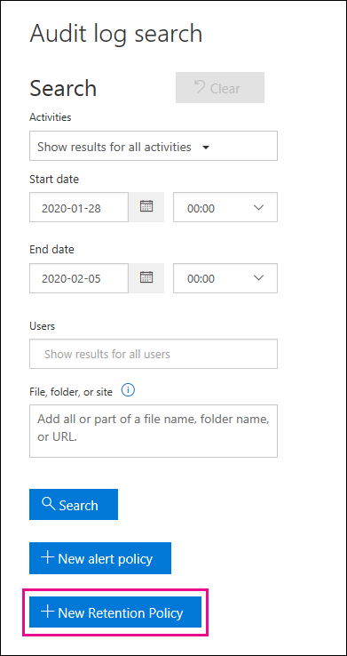

# <a name="manage-audit-log-retention-policies"></a>Gestire i criteri di conservazione dei log di controllo

È possibile creare e gestire i criteri di conservazione dei log di controllo nel Centro sicurezza e conformità. I criteri di conservazione dei log di controllo fanno parte delle nuove funzionalità di Audit avanzato di Microsoft 365. Un criterio di conservazione dei log di controllo consente di specificare quanto a lungo conservare i log di controllo nell'organizzazione. È possibile conservare i log di controllo per un massimo di un anno. È possibile creare criteri in base ai criteri seguenti:

- Tutte le attività in uno o più servizi di Microsoft 365

- Attività specifiche (in un servizio specifico) eseguite da tutti gli utenti o da utenti specifici

- Un livello di priorità che specifica quale criterio ha la precedenza se sono presenti più criteri nell'organizzazione

## <a name="default-audit-log-retention-policy"></a>Criterio di conservazione dei log di controllo predefinito

Audit avanzato in Microsoft 365 include un criterio di conservazione dei log di controllo predefinito per tutte le organizzazioni. Questo criterio conserva tutti i record di controllo di Exchange, SharePoint e Azure Active Directory per un anno. Questo criterio predefinito conserva i record di controllo che contengono il valore **AzureActiveDirectory**, **Exchange** o **SharePoint** per la proprietà **Workload**, ossia il servizio in cui si è verificata l'attività. Il criterio predefinito non può essere modificato. Per un elenco dei tipi di record per ogni carico di lavoro inclusi nel criterio predefinito, vedere la sezione [Altre informazioni](#more-information) in questo articolo.

> [!NOTE]
> Il criterio di conservazione dei log di controllo predefinito si applica solo ai record di controllo per le attività eseguite dagli utenti a cui è assegnata una licenza di Office 365 o Microsoft 365 E5 o che hanno una licenza per il componente aggiuntivo Microsoft 365 E5 Compliance. Se nell'organizzazione sono presenti utenti non di E5, i record di controllo corrispondenti vengono conservati per 90 giorni.

## <a name="before-you-begin"></a>Informazioni preliminari

- Per creare o modificare i criteri di conservazione dei log di controllo, è necessario avere il ruolo Configurazione organizzazione nel Centro sicurezza e conformità.

- Un'organizzazione può avere un massimo di 50 criteri di conservazione dei log di controllo.

- Per conservare un log di controllo di per più di 90 giorni, l'utente che ha generato il log di controllo deve avere una licenza di Office 365 o Microsoft 365 E5 o una licenza per il componente aggiuntivo Microsoft 365 E5 Compliance.

- Tutti i criteri di conservazione dei log di controllo personalizzati (creati dall'organizzazione) hanno priorità rispetto al criterio di conservazione predefinito. Se ad esempio si crea un criterio di conservazione dei log di controllo per l'attività delle cassette postali di Exchange con un periodo di conservazione più breve di un anno, i record di controllo delle attività delle cassette postali di Exchange verranno conservati per la durata più breve specificata dal criterio personalizzato.

## <a name="create-an-audit-log-retention-policy-in-the-security--compliance-center"></a>Creare un criterio di conservazione dei log di controllo nel Centro sicurezza e conformità

1. Passare a [https://protection.office.com](https://protection.office.com) e accedere con un account utente a cui è stato assegnato il ruolo Configurazione organizzazione nel Centro sicurezza e conformità. 

2. Nel riquadro sinistro del Centro sicurezza e conformità fare clic su **Cerca** > **Ricerca log di controllo**.

    Viene visualizzata la pagina **Ricerca log di controllo**.

    

3. Fare clic su **Nuovo criterio di conservazione** e quindi completare i campi seguenti nella pagina a comparsa:

    

   a. **Nome:** il nome del criterio di conservazione dei log di controllo. Il nome deve essere univoco nell'organizzazione.
   
   b. **Descrizione:** facoltativo, ma è utile per fornire informazioni sul criterio, ad esempio il tipo di record o carico di lavoro, gli utenti specificati nel criterio e la durata.

   c. **Tipi di record:** il tipo di record di controllo a cui si applica il criterio. Se si selezionano più tipi di record non è possibile selezionare le attività, perché il criterio verrà applicato a tutte le attività per i tipi di record selezionati. Inoltre, se si lascia vuota questa proprietà, è necessario selezionare un utente nella casella **Utenti**.

   d. **Attività:** usare questa casella per scegliere le attività dal tipo di record selezionato. È possibile scegliere attività specifiche a cui applicare il criterio. Se non si scelgono attività specifiche, il criterio verrà applicato a tutte le attività del tipo di record selezionato.

   e. **Utenti:** selezionare uno o più utenti ai quali applicare il criterio. Se si lascia la casella vuota, il criterio verrà applicato a tutti gli utenti. Se si lascia vuoto il campo **Tipi di record**, è necessario selezionare un utente.

   f. **Durata:** la quantità di tempo per cui conservare i log di controllo che soddisfano i criteri del criterio.

   g. **Priorità:** questo valore determina l'ordine con cui vengono elaborati i criteri di conservazione dei log di controllo nell'organizzazione. Un valore più alto indica una priorità più elevata. Ad esempio, un criterio con un valore di priorità **5** avrà la priorità su un criterio con un valore di priorità **0**. Come descritto in precedenza, i criteri di conservazione dei log di controllo personalizzati hanno la precedenza sul criterio predefinito per l'organizzazione.

6. Fare clic su **Salva** per creare il nuovo criterio di conservazione dei log di controllo. 

Al momento non esiste alcuna indicazione che il criterio di conservazione sia stato creato correttamente. Vedere la sezione successiva sulla visualizzazione delle proprietà dei criteri di conservazione dei log di controllo.

## <a name="create-an-audit-log-retention-policy-in-powershell"></a>Creare un criterio di conservazione dei log di controllo in PowerShell

Per creare criteri di conservazione dei log di controllo si può anche usare PowerShell per Centro sicurezza e conformità di Office 365. 

1. [Connettersi a PowerShell in Centro sicurezza e conformità](https://docs.microsoft.com/powershell/exchange/office-365-scc/connect-to-scc-powershell/connect-to-scc-powershell).

2. Eseguire il comando seguente per creare un criterio di conservazione dei log di controllo. 

   ```powershell
   New-UnifiedAuditLogRetentionPolicy -Name "Microsoft Teams Audit Policy" -Description "One year retention policy for all Microsoft Teams activities" -RecordTypes MicrosoftTeams -RetentionDuration TwelveMonths -Priority 100
   ```
    
    In questo esempio viene creato un criterio di conservazione dei log di controllo denominato "Microsoft Teams Audit Policy" con queste impostazioni:

   - Una descrizione del criterio.

   - Conserva tutte le attività di Microsoft Teams (come definito dal parametro *RecordType*).

   - Conserva i log di controllo di Microsoft Teams per un anno.

   - Una priorità di 100.

Ecco un altro esempio relativo alla creazione di un criterio di conservazione dei log di controllo. Questo criterio conserva i log di controllo per l'attività "L'utente ha effettuato l'accesso" per sei mesi per l'utente admin@contoso.onmicrosoft.com.

```powershell
New-UnifiedAuditLogRetentionPolicy -Name "SixMonth retention for admin logons" -RecordTypes AzureActiveDirectoryStsLogon -Operations UserLoggedIn -UserIds admin@contoso.onmicrosoft.com -RetentionDuration SixMonths -Priority 25
```

Per altre informazioni, vedere [New-UnifiedAuditLogRetentionPolicy](https://docs.microsoft.com/powershell/module/exchange/policy-and-compliance-audit/new-unifiedauditlogretentionpolicy).

## <a name="view-audit-log-retention-policies"></a>Visualizzare i criteri di conservazione dei log di controllo

Al momento, l'unico modo per visualizzare i criteri di conservazione dei log di controllo personalizzati consiste nell'usare il cmdlet **Get-UnifiedAuditRetentionPolicy** in PowerShell per Centro sicurezza e conformità. Ecco un comando di esempio che consente di visualizzare le impostazioni (configurate nel passaggio precedente) per i criteri di conservazione dei log di controllo nell'organizzazione. Questo comando ordina i criteri dalla priorità più alta a quella più bassa.

```powershell
Get-UnifiedAuditLogRetentionPolicy | Sort-Object -Property Priority -Descending | FL Priority,Name,Description,RecordTypes,Operations,UserIds,RetentionDuration
```

> [!NOTE]
> Al momento, il cmdlet **Get-UnifiedAuditLogRetentionPolicy** non restituisce il criterio dei log di controllo predefinito per l'organizzazione.

Per altre informazioni, vedere [Get-UnifiedAuditLogRetentionPolicy](https://docs.microsoft.com/powershell/module/exchange/policy-and-compliance-audit/get-unifiedauditlogretentionpolicy).

## <a name="more-information"></a>Altre informazioni

- Usare il cmdlet **set-UnifiedAuditLogRetentionPolicy** in PowerShell per Centro sicurezza e conformità per modificare un criterio di conservazione dei log di controllo esistente. Per altre informazioni, vedere [Set-UnifiedAuditLogRetentionPolicy](https://docs.microsoft.com/powershell/module/exchange/policy-and-compliance-audit/set-unifiedauditlogretentionpolicy).

- Usare il cmdlet **Remove-UnifiedAuditLogRetentionPolicy** in PowerShell per Centro sicurezza e conformità per eliminare un criterio di conservazione dei log di controllo. La rimozione completa di un criterio può richiedere fino a 30 minuti. Per altre informazioni, vedere [Remove-UnifiedAuditLogRetentionPolicy](https://docs.microsoft.com/powershell/module/exchange/policy-and-compliance-audit/remove-unifiedauditlogretentionpolicy).

- Come illustrato in precedenza, i record di controllo per le operazioni in Azure Active Directory, Exchange e SharePoint vengono conservati per un anno. Nella tabella seguente sono elencati tutti i tipi di record, per ognuno di questi servizi, inclusi nel criterio di conservazione dei log di controllo predefinito. Ciò significa che i log di controllo per qualsiasi operazione con questo tipo di record vengono conservati per un anno, a meno che non abbia la precedenza un criterio di conservazione dei log di controllo personalizzato per un tipo di record, un'operazione o un utente specifico. Il valore Enum per ogni tipo di record, che viene visualizzato come valore per la proprietà RecordType in un record di controllo, compare tra parentesi.

   |AzureActiveDirectory |Exchange  |SharePoint|
   |:---------|:---------|:---------|
   |AzureActiveDirectory (8)|ExchangeAdmin (1)|ComplianceDLPSharePoint (11)|
   |AzureActiveDirectoryAccountLogon (9)|ExchangeItem (2)|ComplianceDLPSharePointClassification (33)|
   |AzureActiveDirectoryStsLogon (15)|Campaign (62)|Project (35)|
   ||ComplianceDLPExchange (13)|SharePoint (4)|
   ||ComplianceSupervisionExchange (68)|SharePointCommentOperation (37)|
   ||CustomerKeyServiceEncryption (69)|SharePointContentTypeOperation (55)|
   ||ExchangeAggregatedOperation (19)|SharePointFieldOperation (56)|
   ||ExchangeItemAggregated (50)|SharePointFileOperation (6)|
   ||ExchangeItemGroup (3)|SharePointListOperation (36)|
   ||InformationBarrierPolicyApplication (53)|SharePointSharingOperation (14)|
   ||||
