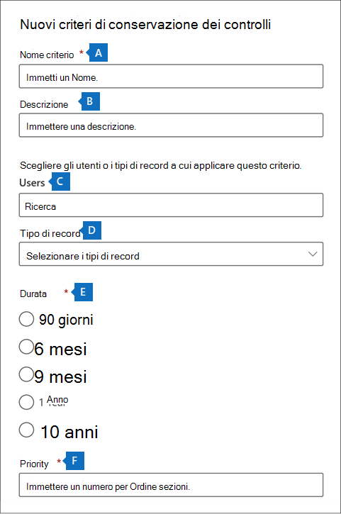

# <a name="manage-audit-log-retention-policies"></a>Gestire i criteri di conservazione dei log di controllo

È possibile creare e gestire i criteri di conservazione dei log di controllo nel Centro sicurezza e conformità. I criteri di conservazione dei log di controllo fanno parte delle nuove funzionalità di Audit avanzato di Microsoft 365. Un criterio di conservazione dei log di controllo consente di specificare quanto a lungo conservare i log di controllo nell'organizzazione. È possibile conservare i log di controllo per un massimo di 10 anni. È possibile creare criteri in base ai criteri seguenti:

- Tutte le attività in uno o più servizi di Microsoft 365

- Attività specifiche (in un servizio Microsoft 365 specifico) eseguite da tutti gli utenti o da utenti specifici

- Un livello di priorità che specifica quale criterio ha la precedenza se sono presenti più criteri nell'organizzazione

## <a name="default-audit-log-retention-policy"></a>Criterio di conservazione dei log di controllo predefinito

Audit avanzato in Microsoft 365 include un criterio di conservazione dei log di controllo predefinito per tutte le organizzazioni. Questo criterio conserva tutti i record di controllo di Exchange Online, SharePoint Online, OneDrive for Business e Azure Active Directory per un anno. Questo criterio predefinito conserva i record di controllo che contengono il valore di **Exchange**, **SharePoint**, **OneDrive**, **AzureActiveDirectory** per la proprietà **Carico di lavoro**, ossia il servizio in cui si è verificata l'attività. Il criterio predefinito non può essere modificato. Per un elenco dei tipi di record per ogni carico di lavoro inclusi nel criterio predefinito, vedere la sezione [Altre informazioni](#more-information) in questo articolo.

> [!NOTE]
> Il criterio di conservazione dei log di controllo predefinito si applica solo ai record di controllo per le attività eseguite dagli utenti a cui è assegnata una licenza di Office 365 o Microsoft 365 E5 o che hanno una licenza per il componente aggiuntivo Microsoft 365 E5 Compliance o Microsoft 365 E5 eDiscovery and Audit. Se nell'organizzazione sono presenti utenti o utenti guest non di E5, i record di controllo corrispondenti vengono conservati per 90 giorni.

## <a name="before-you-create-an-audit-log-retention-policy"></a>Prima di creare un criterio di conservazione dei log di controllo

- Per creare o modificare i criteri di conservazione dei log di controllo, è necessario avere il ruolo Configurazione organizzazione nel Centro sicurezza e conformità.

- Un'organizzazione può avere un massimo di 50 criteri di conservazione dei log di controllo.

- Per conservare un log di controllo per più di 90 giorni (e fino a un anno), l'utente che genera il log di controllo (eseguendo un’attività controllata) deve avere una licenza di Office 365 E5 o Microsoft 365 E5 oppure una licenza per il componente aggiuntivo Audit Microsoft 365 E5 Compliance o E5 eDiscovery. Per conservare i log di controllo per 10 anni, all'utente che genera il log di controllo deve anche essere assegnata una licenza per il componente aggiuntivo di conservazione dei log di controllo di 10 anni oltre a una licenza E5.

- Tutti i criteri di conservazione dei log di controllo personalizzati, creati dall'organizzazione, hanno priorità sui criteri di conservazione predefiniti. Ad esempio, se si crea un criterio di conservazione dei log di controllo per l'attività delle cassette postali di Exchange con un periodo di conservazione più breve di un anno, i record di controllo delle attività delle cassette postali di Exchange verranno conservati per la durata più breve specificata dal criterio personalizzato.

## <a name="create-an-audit-log-retention-policy"></a>Creare un criterio di conservazione dei log di controllo

1. Passare a [https://compliance.microsoft.com](https://compliance.microsoft.com) e accedere con un account utente a cui è stato assegnato il ruolo Configurazione organizzazione nella pagina autorizzazioni nel Centro sicurezza e conformità.

2. Nel riquadro sinistro del Centro conformità Microsoft 365, fare clic su **Mostra tutto**, quindi su **Audit**.

3. Fare clic sulla scheda **Criteri di conservazione dei log di controllo**.

4. Fare clic su **Crea criteri di conservazione dei log di controllo** e completare poi i campi nel riquadro a comparsa:

    

   1. **Nome del criterio:** il nome del criterio di conservazione dei log di controllo. Il nome deve essere univoco nell'organizzazione e non può essere modificato dopo la creazione del criterio.

   2. **Descrizione:** facoltativo, ma è utile per fornire informazioni sul criterio, ad esempio il tipo di record o carico di lavoro, gli utenti specificati nel criterio e la durata.

   3. **Utenti:** selezionare uno o più utenti ai quali applicare il criterio. Se si lascia la casella vuota, il criterio verrà applicato a tutti gli utenti. Se si lascia vuoto il campo **Tipo di record**, è necessario selezionare un utente.

   4. **Tipo di record:** il tipo di record di controllo a cui si applica il criterio. Se si lascia vuota questa proprietà, è necessario selezionare un utente nella casella **Utenti**. È possibile selezionare un tipo di record singolo o più tipi di record:

   - Se si seleziona un solo tipo di record, il campo **Attività** viene visualizzato dinamicamente. Si può usare l'elenco a discesa per selezionare le attività del tipo di record selezionato a cui applicare il criterio. Se non si scelgono attività specifiche, il criterio verrà applicato a tutte le attività del tipo di record selezionato.

   - Se si selezionano più tipi di record, non è possibile selezionare le attività. Il criterio si applica a tutte le attività dei tipi di record selezionati.

   5. **Durata:** la quantità di tempo per cui conservare i log di audit che soddisfano i criteri del criterio.

   6. **Priorità:** questo valore determina l'ordine con cui vengono elaborati i criteri di conservazione dei log di controllo nell'organizzazione. Un valore più basso indica una priorità più alta. Le priorità valide sono valori numerici compresi tra **1** e **10000**. Il valore **1** ha la priorità più alta e il valore **10000** ha quella più bassa. Ad esempio, un criterio con un valore **5** avrà la priorità su un criterio con un valore **10**. Come descritto in precedenza, i criteri di conservazione dei log di controllo personalizzati hanno la precedenza sul criterio predefinito per l'organizzazione.

5. Fare clic su **Salva** per creare il nuovo criterio di conservazione dei log di controllo.

   Il nuovo criterio viene visualizzato nell'elenco nella scheda **Criteri di conservazione log di controllo**.

## <a name="manage-audit-log-retention-policies"></a>Gestire i criteri di conservazione dei log di controllo

I criteri di conservazione dei log di controllo sono elencati nella scheda **Criteri di conservazione dei log di controllo**, denominata anche *dashboard*. È possibile usare il dashboard per visualizzare, modificare ed eliminare i criteri di conservazione dei log di controllo.

### <a name="view-policies-in-the-dashboard"></a>Visualizzazione dei criteri nel dashboard

I criteri di conservazione dei log di controllo sono elencati nel dashboard. Uno dei vantaggi della visualizzazione dei criteri nel dashboard è che è possibile fare clic sulla colonna **Priorità** per elencare i criteri in base alla priorità con cui vengono applicati. Come spiegato in precedenza, un valore più alto indica una priorità più elevata.


È anche possibile selezionare un criterio per visualizzarne le impostazioni nel riquadro a comparsa.

> [!NOTE]
> I criteri di conservazione predefiniti dei log di controllo per l'organizzazione non vengono visualizzati nel dashboard.

### <a name="edit-policies-in-the-dashboard"></a>Modifica dei criteri nel dashboard

Per modificare un criterio, selezionarlo in modo da visualizzare il riquadro a comparsa. È possibile modificare una o più impostazioni poi salvare le modifiche.


> [!IMPORTANT]
> Se si usa il cmdlet **New-UnifiedAuditLogRetentionPolicy**, è possibile creare un criterio di conservazione dei log di controllo per i tipi di record o le attività non disponibili nello strumento **Crea criteri di conservazione dei log di controllo** del dashboard. In questo caso, non sarà possibile modificare il criterio, ad esempio modificare la durata di conservazione o aggiungere e rimuovere attività, dal dashboard **Criteri di conservazione dei log di controllo**. Nel centro conformità si potrà solo visualizzare ed eliminare il criterio. Per modificarlo sarà necessario usare il cmdlet [Set-UnifiedAuditLogRetentionPolicy](/powershell/module/exchange/set-unifiedauditlogretentionpolicy) in PowerShell per Centro sicurezza e conformità.<br/><br/>**Suggerimento:** nella parte superiore del riquadro a comparsa viene visualizzato un messaggio per i criteri che devono essere modificati tramite PowerShell.

### <a name="delete-policies-in-the-dashboard"></a>Eliminare i criteri nel dashboard

Per eliminare un criterio, fare clic sull’icona **Elimina**  e confermare che si desidera eliminare il criterio. I criteri vengono rimossi dal dashboard, ma potrebbero essere necessari fino a 30 minuti prima che il criterio venga rimosso dall'organizzazione.

## <a name="create-and-manage-audit-log-retention-policies-in-powershell"></a>Creare e gestire i criteri di conservazione del log di controllo in PowerShell

Per creare e gestire i criteri di conservazione dei log di controllo è possibile anche usare PowerShell per Centro sicurezza e conformità. Uno dei motivi per cui usare PowerShell è la possibilità di creare un criterio per un tipo di record o un'attività non disponibile nell'interfaccia utente.

### <a name="create-an-audit-log-retention-policy-in-powershell"></a>Creare un criterio di conservazione dei log di controllo in PowerShell

Seguire questa procedura per creare criteri di conservazione del log di controllo in PowerShell:

1. [Connettersi a PowerShell in Centro sicurezza e conformità](/powershell/exchange/connect-to-scc-powershell).

2. Eseguire il comando seguente per creare un criterio di conservazione dei log di controllo.

   ```powershell
   New-UnifiedAuditLogRetentionPolicy -Name "Microsoft Teams Audit Policy" -Description "One year retention policy for all Microsoft Teams activities" -RecordTypes MicrosoftTeams -RetentionDuration TenYears -Priority 100
   ```

    In questo esempio viene creato un criterio di conservazione dei log di controllo denominato "Microsoft Teams Audit Policy" con queste impostazioni:

   - Una descrizione del criterio.

   - Conserva tutte le attività di Microsoft Teams (come definito dal parametro *RecordType*).

   - Conserva i log di controllo di Microsoft Teams per 10 anni.

   - Una priorità di 100.

Ecco un altro esempio relativo alla creazione di un criterio di conservazione dei log di controllo. Questo criterio conserva i log di controllo per l'attività "L'utente ha effettuato l'accesso" per sei mesi per l'utente admin@contoso.onmicrosoft.com.

```powershell
New-UnifiedAuditLogRetentionPolicy -Name "SixMonth retention for admin logons" -RecordTypes AzureActiveDirectoryStsLogon -Operations UserLoggedIn -UserIds admin@contoso.onmicrosoft.com -RetentionDuration SixMonths -Priority 25
```

Per altre informazioni, vedere [New-UnifiedAuditLogRetentionPolicy](/powershell/module/exchange/new-unifiedauditlogretentionpolicy).

### <a name="view-policies-in-powershell"></a>Visualizzazione dei criteri in PowerShell

Usare il cmdlet [Get-UnifiedAuditLogRetentionPolicy](/powershell/module/exchange/get-unifiedauditlogretentionpolicy) in PowerShell per Centro sicurezza e conformità per visualizzare i criteri di conservazione dei log di controllo.

Ecco un comando di esempio per visualizzare le impostazioni di tutti i criteri di conservazione dei log di controllo nell'organizzazione. Questo comando ordina i criteri dalla priorità più alta a quella più bassa.

```powershell
Get-UnifiedAuditLogRetentionPolicy | Sort-Object -Property Priority -Descending | FL Priority,Name,Description,RecordTypes,Operations,UserIds,RetentionDuration
```

> [!NOTE]
> Il cmdlet **Get-UnifiedAuditLogRetentionPolicy** non restituisce il criterio di conservazione dei log di controllo predefinito per l'organizzazione.

### <a name="edit-policies-in-powershell"></a>Modificare i criteri in PowerShell

Usare il cmdlet [Set-UnifiedAuditLogRetentionPolicy](/powershell/module/exchange/set-unifiedauditlogretentionpolicy) in PowerShell per Centro sicurezza e conformità per modificare un criterio di conservazione dei log di controllo esistente.

### <a name="delete-policies-in-powershell"></a>Eliminare criteri in PowerShell

Usare il cmdlet [Remove-UnifiedAuditLogRetentionPolicy](/powershell/module/exchange/remove-unifiedauditlogretentionpolicy) in PowerShell per Centro sicurezza e conformità per eliminare un criterio di conservazione dei log di controllo. La rimozione dei criteri dall'organizzazione può richiedere fino a 30 minuti.

## <a name="more-information"></a>Altre informazioni

Come illustrato in precedenza, i record di controllo per le operazioni in Azure Active Directory, Exchange Online, SharePoint Online e OneDrive for Business vengono conservati per un anno per impostazione predefinita. Nella tabelle seguenti sono elencati tutti i tipi di record, per ognuno di questi servizi, inclusi nel criterio di conservazione dei log di controllo predefinito. Ciò significa che i log di controllo per qualsiasi operazione con questo tipo di record vengono conservati per un anno, a meno che non abbia la precedenza un criterio di conservazione dei log di controllo personalizzato per un tipo di record, un'operazione o un utente specifico. Il valore Enum per ogni tipo di record, che viene visualizzato come valore per la proprietà RecordType in un record di controllo, compare tra parentesi.

|AzureActiveDirectory |Exchange  |SharePoint o OneDrive|
|:---------|:---------|:---------|
|AzureActiveDirectory (8)|ExchangeAdmin (1)|ComplianceDLPSharePoint (11)|
|AzureActiveDirectoryAccountLogon (9)|ExchangeItem (2)|ComplianceDLPSharePointClassification (33)|
|AzureActiveDirectoryStsLogon (15)|Campaign (62)|Project (35)|
||ComplianceDLPExchange (13)|SharePoint (4)|
||ComplianceSupervisionExchange (68)|SharePointCommentOperation (37)|
||CustomerKeyServiceEncryption (69)|SharePointContentTypeOperation (55)|
||ExchangeAggregatedOperation (19)|SharePointFieldOperation (56)|
||ExchangeItemAggregated (50)|SharePointFileOperation (6)|
||ExchangeItemGroup (3)|SharePointListOperation (36)|
||InformationBarrierPolicyApplication (53)|SharePointSharingOperation (14)|
||||
