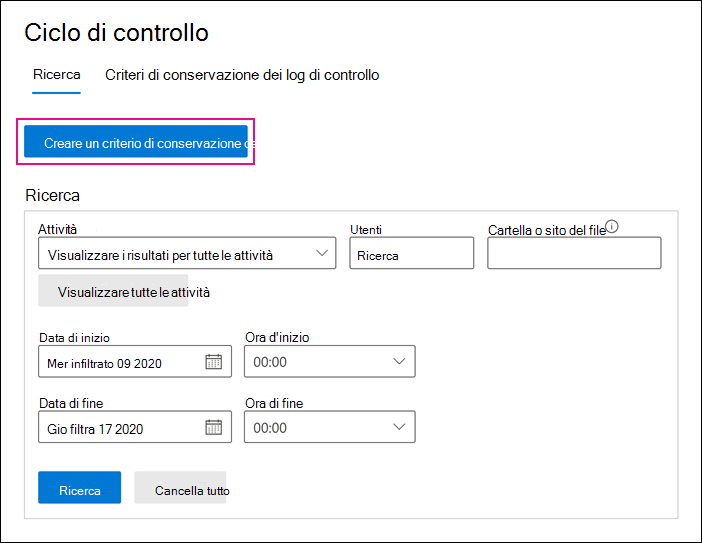

# <a name="manage-audit-log-retention-policies"></a><span data-ttu-id="25c67-104">Gestire i criteri di conservazione dei log di controllo</span><span class="sxs-lookup"><span data-stu-id="25c67-104">Manage audit log retention policies</span></span>

<span data-ttu-id="25c67-105">È possibile creare e gestire i criteri di conservazione dei log di controllo nel Centro sicurezza e conformità.</span><span class="sxs-lookup"><span data-stu-id="25c67-105">You can create and manage audit log retention policies in the Security & Compliance Center.</span></span> <span data-ttu-id="25c67-106">I criteri di conservazione dei log di controllo fanno parte delle nuove funzionalità di Audit avanzato di Microsoft 365.</span><span class="sxs-lookup"><span data-stu-id="25c67-106">Audit log retention policies are part of the new Advanced Audit capabilities in Microsoft 365.</span></span> <span data-ttu-id="25c67-107">Un criterio di conservazione dei log di controllo consente di specificare quanto a lungo conservare i log di controllo nell'organizzazione.</span><span class="sxs-lookup"><span data-stu-id="25c67-107">An audit log retention policy lets you specify how long to retain audit logs in your organization.</span></span> <span data-ttu-id="25c67-108">È possibile conservare i log di controllo per un massimo di 10 anni.</span><span class="sxs-lookup"><span data-stu-id="25c67-108">You can retain audit logs for up to 10 years.</span></span> <span data-ttu-id="25c67-109">È possibile creare criteri in base ai criteri seguenti:</span><span class="sxs-lookup"><span data-stu-id="25c67-109">You can create policies based on the following criteria:</span></span>

- <span data-ttu-id="25c67-110">Tutte le attività in uno o più servizi di Microsoft 365</span><span class="sxs-lookup"><span data-stu-id="25c67-110">All activities in one or more Microsoft 365 services</span></span>

- <span data-ttu-id="25c67-111">Attività specifiche (in un servizio Microsoft 365 specifico) eseguite da tutti gli utenti o da utenti specifici</span><span class="sxs-lookup"><span data-stu-id="25c67-111">Specific activities (in a Microsoft 365 service) performed by all users or by specific users</span></span>

- <span data-ttu-id="25c67-112">Un livello di priorità che specifica quale criterio ha la precedenza se sono presenti più criteri nell'organizzazione</span><span class="sxs-lookup"><span data-stu-id="25c67-112">A priority level that specifies which policy takes precedence in you have multiple policies in your organization</span></span>

## <a name="default-audit-log-retention-policy"></a><span data-ttu-id="25c67-113">Criterio di conservazione dei log di controllo predefinito</span><span class="sxs-lookup"><span data-stu-id="25c67-113">Default audit log retention policy</span></span>

<span data-ttu-id="25c67-114">Audit avanzato in Microsoft 365 include un criterio di conservazione dei log di controllo predefinito per tutte le organizzazioni.</span><span class="sxs-lookup"><span data-stu-id="25c67-114">Advanced Audit in Microsoft 365 provides a default audit log retention policy for all organizations.</span></span> <span data-ttu-id="25c67-115">Questo criterio conserva tutti i record di controllo di Exchange, SharePoint e Azure Active Directory per un anno.</span><span class="sxs-lookup"><span data-stu-id="25c67-115">This policy retains all Exchange, SharePoint, and Azure Active Directory audit records for one year.</span></span> <span data-ttu-id="25c67-116">Questo criterio predefinito conserva i record di controllo che contengono il valore **AzureActiveDirectory**, **Exchange** o **SharePoint** per la proprietà **Workload**, ossia il servizio in cui si è verificata l'attività.</span><span class="sxs-lookup"><span data-stu-id="25c67-116">This default policy retains audit records that contain the value of **AzureActiveDirectory**, **Exchange**, or **SharePoint** for the **Workload** property (which is the service in which the activity occurred).</span></span> <span data-ttu-id="25c67-117">Il criterio predefinito non può essere modificato.</span><span class="sxs-lookup"><span data-stu-id="25c67-117">The default policy can't be modified.</span></span> <span data-ttu-id="25c67-118">Per un elenco dei tipi di record per ogni carico di lavoro inclusi nel criterio predefinito, vedere la sezione [Altre informazioni](#more-information) in questo articolo.</span><span class="sxs-lookup"><span data-stu-id="25c67-118">See the [More information](#more-information) section in this article for a list of record types for each workload that are included in the default policy.</span></span>

> [!NOTE]
> <span data-ttu-id="25c67-119">Il criterio di conservazione dei log di controllo predefinito si applica solo ai record di controllo per le attività eseguite dagli utenti a cui è assegnata una licenza di Office 365 o Microsoft 365 E5 o che hanno una licenza per il componente aggiuntivo Microsoft 365 E5 Compliance o Microsoft 365 E5 eDiscovery and Audit.</span><span class="sxs-lookup"><span data-stu-id="25c67-119">The default audit log retention policy only applies to audit records for activity performed by users who are assigned an Office 365 or Microsoft 365 E5 license or have a Microsoft 365 E5 Compliance or E5 eDiscovery and Audit add-on license.</span></span> <span data-ttu-id="25c67-120">Se nell'organizzazione sono presenti utenti non di E5, i record di controllo corrispondenti vengono conservati per 90 giorni.</span><span class="sxs-lookup"><span data-stu-id="25c67-120">If you have non-E5 users in your organization, their corresponding audit records are retained for 90 days.</span></span>

## <a name="before-you-create-an-audit-log-retention-policy"></a><span data-ttu-id="25c67-121">Prima di creare un criterio di conservazione dei log di controllo</span><span class="sxs-lookup"><span data-stu-id="25c67-121">Before you create an audit log retention policy</span></span>

- <span data-ttu-id="25c67-122">Per creare o modificare i criteri di conservazione dei log di controllo, è necessario avere il ruolo Configurazione organizzazione nel Centro sicurezza e conformità.</span><span class="sxs-lookup"><span data-stu-id="25c67-122">You have to be assigned the Organization Configuration role in the Security & Compliance Center to create or modify an audit retention policy.</span></span>

- <span data-ttu-id="25c67-123">Un'organizzazione può avere un massimo di 50 criteri di conservazione dei log di controllo.</span><span class="sxs-lookup"><span data-stu-id="25c67-123">You can have a maximum of 50 audit log retention policies in your organization.</span></span>

- <span data-ttu-id="25c67-124">Per conservare un log di controllo di per più di 90 giorni, l'utente che ha generato il log di controllo deve avere una licenza di Office 365 E5 o Microsoft 365 E5 o una licenza per il componente aggiuntivo Audit Microsoft 365 E5 Compliance o E5 eDiscovery.</span><span class="sxs-lookup"><span data-stu-id="25c67-124">To retain an audit log for longer than 90 days, the user who generated the audit log must be assigned an Office 365 E5 or Microsoft 365 E5 license or have a Microsoft 365 E5 Compliance or E5 eDiscovery and Audit add-on license.</span></span>

- <span data-ttu-id="25c67-125">Tutti i criteri di conservazione dei log di controllo personalizzati (creati dall'organizzazione) hanno priorità rispetto al criterio di conservazione predefinito.</span><span class="sxs-lookup"><span data-stu-id="25c67-125">All custom audit log retention policies (created by your organization) take priority over the default retention policy.</span></span> <span data-ttu-id="25c67-126">Se ad esempio si crea un criterio di conservazione dei log di controllo per l'attività delle cassette postali di Exchange con un periodo di conservazione più breve di un anno, i record di controllo delle attività delle cassette postali di Exchange verranno conservati per la durata più breve specificata dal criterio personalizzato.</span><span class="sxs-lookup"><span data-stu-id="25c67-126">For example, if you create an audit log retention policy for Exchange mailbox activity that has a retention period that's shorter than one year, audit records for Exchange mailbox activities will be retained for the shorter duration specified by the custom policy.</span></span>

## <a name="create-an-audit-log-retention-policy-in-the-compliance-center"></a><span data-ttu-id="25c67-127">Creare un criterio di conservazione dei log di controllo nel centro conformità</span><span class="sxs-lookup"><span data-stu-id="25c67-127">Create an audit log retention policy in the compliance center</span></span>

1. <span data-ttu-id="25c67-128">Passare a [https://compliance.microsoft.com](https://compliance.microsoft.com) e accedere con un account utente a cui è stato assegnato il ruolo Configurazione organizzazione nel Centro sicurezza e conformità.</span><span class="sxs-lookup"><span data-stu-id="25c67-128">Go to [https://compliance.microsoft.com](https://compliance.microsoft.com) and sign in with user account that's assigned the Organization Configuration role in the Security & Compliance Center.</span></span>

2. <span data-ttu-id="25c67-129">Nel riquadro sinistro del Centro conformità Microsoft 365, fare clic su **Mostra tutto**, quindi su **Audit**.</span><span class="sxs-lookup"><span data-stu-id="25c67-129">In the left pane of the Microsoft 365 compliance center, click **Show all**, and then click **Audit**.</span></span>

    <span data-ttu-id="25c67-130">Viene visualizzata la pagina **Audit**.</span><span class="sxs-lookup"><span data-stu-id="25c67-130">The **Audit** page is displayed.</span></span>

    

3. <span data-ttu-id="25c67-132">Fare clic su **Crea criteri di conservazione dei log di controllo** e completare poi questi campi nel riquadro a comparsa:</span><span class="sxs-lookup"><span data-stu-id="25c67-132">Click **Create audit retention policy**, and then complete the following fields on the flyout page:</span></span>

    

   1. <span data-ttu-id="25c67-134">**Nome:** il nome del criterio di conservazione dei log di controllo.</span><span class="sxs-lookup"><span data-stu-id="25c67-134">**Name:** The name of the audit log retention policy.</span></span> <span data-ttu-id="25c67-135">Il nome deve essere univoco nell'organizzazione.</span><span class="sxs-lookup"><span data-stu-id="25c67-135">This name must be unique in your organization.</span></span>

   2. <span data-ttu-id="25c67-136">**Descrizione:** facoltativo, ma è utile per fornire informazioni sul criterio, ad esempio il tipo di record o carico di lavoro, gli utenti specificati nel criterio e la durata.</span><span class="sxs-lookup"><span data-stu-id="25c67-136">**Description:** Optional, but helpful to provide information about the policy, such as the record type or workload, users specified in the policy, and the duration.</span></span>

   3. <span data-ttu-id="25c67-137">**Utenti:** selezionare uno o più utenti ai quali applicare il criterio.</span><span class="sxs-lookup"><span data-stu-id="25c67-137">**Users:** Select one or more users to apply the policy to.</span></span> <span data-ttu-id="25c67-138">Se si lascia la casella vuota, il criterio verrà applicato a tutti gli utenti.</span><span class="sxs-lookup"><span data-stu-id="25c67-138">If you leave this box blank, then the policy will apply to all users.</span></span> <span data-ttu-id="25c67-139">Se si lascia vuoto il campo **Tipo di record**, è necessario selezionare un utente.</span><span class="sxs-lookup"><span data-stu-id="25c67-139">If you leave the **Record type** blank, then you must select a user.</span></span>

   4. <span data-ttu-id="25c67-140">**Tipo di record:** il tipo di record di controllo a cui si applica il criterio.</span><span class="sxs-lookup"><span data-stu-id="25c67-140">**Record type:** The audit record type the policy applies to.</span></span> <span data-ttu-id="25c67-141">Se si lascia vuota questa proprietà, è necessario selezionare un utente nella casella **Utenti**.</span><span class="sxs-lookup"><span data-stu-id="25c67-141">If you leave this property blank, you must select a user in the **Users** box.</span></span> <span data-ttu-id="25c67-142">È possibile selezionare un tipo di record singolo o più tipi di record:</span><span class="sxs-lookup"><span data-stu-id="25c67-142">You can select a single record type or multiple record types:</span></span>

   - <span data-ttu-id="25c67-143">Se si seleziona un solo tipo di record, il campo **Attività** viene visualizzato dinamicamente.</span><span class="sxs-lookup"><span data-stu-id="25c67-143">If you select a single record type, the **Activities** field is dynamically displayed.</span></span> <span data-ttu-id="25c67-144">Si può usare l'elenco a discesa per selezionare le attività del tipo di record selezionato a cui applicare il criterio.</span><span class="sxs-lookup"><span data-stu-id="25c67-144">You can use the drop-down list to select activities from the selected record type to apply the policy to.</span></span> <span data-ttu-id="25c67-145">Se non si scelgono attività specifiche, il criterio verrà applicato a tutte le attività del tipo di record selezionato.</span><span class="sxs-lookup"><span data-stu-id="25c67-145">If you don't choose specific activities, the policy will apply to all activities of the selected record type.</span></span>

   - <span data-ttu-id="25c67-146">Se si selezionano più tipi di record, non è possibile selezionare le attività.</span><span class="sxs-lookup"><span data-stu-id="25c67-146">If you select multiple record types, you don't have the ability to select activities.</span></span> <span data-ttu-id="25c67-147">Il criterio si applica a tutte le attività dei tipi di record selezionati.</span><span class="sxs-lookup"><span data-stu-id="25c67-147">The policy will apply to all activities of the selected record types.</span></span>

   5. <span data-ttu-id="25c67-148">**Durata:** la quantità di tempo per cui conservare i log di audit che soddisfano i criteri del criterio.</span><span class="sxs-lookup"><span data-stu-id="25c67-148">**Duration:** The amount of time to retain the audit logs that meet the criteria of the policy.</span></span>

   6. <span data-ttu-id="25c67-149">**Priorità:** questo valore determina l'ordine con cui vengono elaborati i criteri di conservazione dei log di controllo nell'organizzazione.</span><span class="sxs-lookup"><span data-stu-id="25c67-149">**Priority:** This value determines the order in which audit log retention policies in your organization are processed.</span></span> <span data-ttu-id="25c67-150">Un valore più alto indica una priorità più elevata.</span><span class="sxs-lookup"><span data-stu-id="25c67-150">A higher value indicates a higher priority.</span></span> <span data-ttu-id="25c67-151">Ad esempio, un criterio con un valore di priorità **5** avrà la priorità su un criterio con un valore di priorità **0**.</span><span class="sxs-lookup"><span data-stu-id="25c67-151">For example, a policy with a priority value of **5** would take priority over a policy with a priority value of **0**.</span></span> <span data-ttu-id="25c67-152">Come descritto in precedenza, i criteri di conservazione dei log di controllo personalizzati hanno la precedenza sul criterio predefinito per l'organizzazione.</span><span class="sxs-lookup"><span data-stu-id="25c67-152">As previously explained, any custom audit log retention policy takes priority over the default policy for your organization.</span></span>

4. <span data-ttu-id="25c67-153">Fare clic su **Salva** per creare il nuovo criterio di conservazione dei log di controllo.</span><span class="sxs-lookup"><span data-stu-id="25c67-153">Click **Save** to create the new audit log retention policy.</span></span>

## <a name="create-an-audit-log-retention-policy-in-powershell"></a><span data-ttu-id="25c67-154">Creare un criterio di conservazione dei log di controllo in PowerShell</span><span class="sxs-lookup"><span data-stu-id="25c67-154">Create an audit log retention policy in PowerShell</span></span>

<span data-ttu-id="25c67-155">Per creare criteri di conservazione dei log di controllo si può anche usare PowerShell per Centro sicurezza e conformità.</span><span class="sxs-lookup"><span data-stu-id="25c67-155">You can also use Security & Compliance Center PowerShell to create audit log retention policies.</span></span>

1. <span data-ttu-id="25c67-156">[Connettersi a PowerShell in Centro sicurezza e conformità](https://docs.microsoft.com/powershell/exchange/connect-to-scc-powershell).</span><span class="sxs-lookup"><span data-stu-id="25c67-156">[Connect to Security & Compliance Center PowerShell](https://docs.microsoft.com/powershell/exchange/connect-to-scc-powershell).</span></span>

2. <span data-ttu-id="25c67-157">Eseguire il comando seguente per creare un criterio di conservazione dei log di controllo.</span><span class="sxs-lookup"><span data-stu-id="25c67-157">Run the following command to create an audit log retention policy.</span></span>

   ```powershell
   New-UnifiedAuditLogRetentionPolicy -Name "Microsoft Teams Audit Policy" -Description "One year retention policy for all Microsoft Teams activities" -RecordTypes MicrosoftTeams -RetentionDuration TenYears -Priority 100
   ```

    <span data-ttu-id="25c67-158">In questo esempio viene creato un criterio di conservazione dei log di controllo denominato "Microsoft Teams Audit Policy" con queste impostazioni:</span><span class="sxs-lookup"><span data-stu-id="25c67-158">This example creates an audit log retention policy named "Microsoft Teams Audit Policy" with these settings:</span></span>

   - <span data-ttu-id="25c67-159">Una descrizione del criterio.</span><span class="sxs-lookup"><span data-stu-id="25c67-159">A description of the policy.</span></span>

   - <span data-ttu-id="25c67-160">Conserva tutte le attività di Microsoft Teams (come definito dal parametro *RecordType*).</span><span class="sxs-lookup"><span data-stu-id="25c67-160">Retains all Microsoft Teams activities (as defined by the *RecordType* parameter).</span></span>

   - <span data-ttu-id="25c67-161">Conserva i log di controllo di Microsoft Teams per 10 anni.</span><span class="sxs-lookup"><span data-stu-id="25c67-161">Retains Microsoft Teams audit logs for 10 years.</span></span>

   - <span data-ttu-id="25c67-162">Una priorità di 100.</span><span class="sxs-lookup"><span data-stu-id="25c67-162">A priority of 100.</span></span>

<span data-ttu-id="25c67-163">Ecco un altro esempio relativo alla creazione di un criterio di conservazione dei log di controllo.</span><span class="sxs-lookup"><span data-stu-id="25c67-163">Here's another example of creating an audit log retention policy.</span></span> <span data-ttu-id="25c67-164">Questo criterio conserva i log di controllo per l'attività "L'utente ha effettuato l'accesso" per sei mesi per l'utente admin@contoso.onmicrosoft.com.</span><span class="sxs-lookup"><span data-stu-id="25c67-164">This policy retains audit logs for the "User logged in" activity for six months for the user admin@contoso.onmicrosoft.com.</span></span>

```powershell
New-UnifiedAuditLogRetentionPolicy -Name "SixMonth retention for admin logons" -RecordTypes AzureActiveDirectoryStsLogon -Operations UserLoggedIn -UserIds admin@contoso.onmicrosoft.com -RetentionDuration SixMonths -Priority 25
```

<span data-ttu-id="25c67-165">Per altre informazioni, vedere [New-UnifiedAuditLogRetentionPolicy](https://docs.microsoft.com/powershell/module/exchange/new-unifiedauditlogretentionpolicy).</span><span class="sxs-lookup"><span data-stu-id="25c67-165">For more information, see [New-UnifiedAuditLogRetentionPolicy](https://docs.microsoft.com/powershell/module/exchange/new-unifiedauditlogretentionpolicy).</span></span>

## <a name="view-audit-log-retention-policies"></a><span data-ttu-id="25c67-166">Visualizzare i criteri di conservazione dei log di controllo</span><span class="sxs-lookup"><span data-stu-id="25c67-166">View audit log retention policies</span></span>

<span data-ttu-id="25c67-167">Al momento, l'unico modo per visualizzare i criteri di conservazione dei log di controllo personalizzati consiste nell'usare il cmdlet **Get-UnifiedAuditRetentionPolicy** in PowerShell per Centro sicurezza e conformità.</span><span class="sxs-lookup"><span data-stu-id="25c67-167">At this time, the only way to view custom audit log retention policies is to use the **Get-UnifiedAuditRetentionPolicy** cmdlet in Security & Compliance Center PowerShell.</span></span> <span data-ttu-id="25c67-168">Ecco un comando di esempio che consente di visualizzare le impostazioni (configurate nel passaggio precedente) per i criteri di conservazione dei log di controllo nell'organizzazione.</span><span class="sxs-lookup"><span data-stu-id="25c67-168">Here's a sample command to display the settings (that you configured in the previous step) for the audit log retention policies in your organization.</span></span> <span data-ttu-id="25c67-169">Questo comando ordina i criteri dalla priorità più alta a quella più bassa.</span><span class="sxs-lookup"><span data-stu-id="25c67-169">This command sorts the policies from the highest to lowest priority.</span></span>

```powershell
Get-UnifiedAuditLogRetentionPolicy | Sort-Object -Property Priority -Descending | FL Priority,Name,Description,RecordTypes,Operations,UserIds,RetentionDuration
```

> [!NOTE]
> <span data-ttu-id="25c67-170">Al momento, il cmdlet **Get-UnifiedAuditLogRetentionPolicy** non restituisce il criterio dei log di controllo predefinito per l'organizzazione.</span><span class="sxs-lookup"><span data-stu-id="25c67-170">At this time, the **Get-UnifiedAuditLogRetentionPolicy** cmdlet doesn't return the default audit log policy for your organization.</span></span>

<span data-ttu-id="25c67-171">Per altre informazioni, vedere [Get-UnifiedAuditLogRetentionPolicy](https://docs.microsoft.com/powershell/module/exchange/get-unifiedauditlogretentionpolicy).</span><span class="sxs-lookup"><span data-stu-id="25c67-171">For more information, see [Get-UnifiedAuditLogRetentionPolicy](https://docs.microsoft.com/powershell/module/exchange/get-unifiedauditlogretentionpolicy).</span></span>

## <a name="more-information"></a><span data-ttu-id="25c67-172">Altre informazioni</span><span class="sxs-lookup"><span data-stu-id="25c67-172">More information</span></span>

- <span data-ttu-id="25c67-173">Usare il cmdlet **set-UnifiedAuditLogRetentionPolicy** in PowerShell per Centro sicurezza e conformità per modificare un criterio di conservazione dei log di controllo esistente.</span><span class="sxs-lookup"><span data-stu-id="25c67-173">Use the **Set-UnifiedAuditLogRetentionPolicy** cmdlet in Security & Compliance Center PowerShell to modify an existing audit log retention policy.</span></span> <span data-ttu-id="25c67-174">Per altre informazioni, vedere [Set-UnifiedAuditLogRetentionPolicy](https://docs.microsoft.com/powershell/module/exchange/set-unifiedauditlogretentionpolicy).</span><span class="sxs-lookup"><span data-stu-id="25c67-174">For more information, see [Set-UnifiedAuditLogRetentionPolicy](https://docs.microsoft.com/powershell/module/exchange/set-unifiedauditlogretentionpolicy).</span></span>

- <span data-ttu-id="25c67-175">Usare il cmdlet **Remove-UnifiedAuditLogRetentionPolicy** in PowerShell per Centro sicurezza e conformità per eliminare un criterio di conservazione dei log di controllo.</span><span class="sxs-lookup"><span data-stu-id="25c67-175">Use the **Remove-UnifiedAuditLogRetentionPolicy** cmdlet in Security & Compliance Center PowerShell to delete an audit log retention policy.</span></span> <span data-ttu-id="25c67-176">La rimozione di un criterio può richiedere fino a 30 minuti.</span><span class="sxs-lookup"><span data-stu-id="25c67-176">It might take up to 30 minutes for the policy to be removed.</span></span> <span data-ttu-id="25c67-177">Per altre informazioni, vedere [Remove-UnifiedAuditLogRetentionPolicy](https://docs.microsoft.com/powershell/module/exchange/remove-unifiedauditlogretentionpolicy).</span><span class="sxs-lookup"><span data-stu-id="25c67-177">For more information, see [Remove-UnifiedAuditLogRetentionPolicy](https://docs.microsoft.com/powershell/module/exchange/remove-unifiedauditlogretentionpolicy).</span></span>

- <span data-ttu-id="25c67-178">Come illustrato in precedenza, i record di controllo per le operazioni in Azure Active Directory, Exchange e SharePoint vengono conservati per un anno.</span><span class="sxs-lookup"><span data-stu-id="25c67-178">As previously stated, audit records for operations in Azure Active Directory, Exchange, and SharePoint are retained for one year.</span></span> <span data-ttu-id="25c67-179">Nella tabelle seguenti sono elencati tutti i tipi di record, per ognuno di questi servizi, inclusi nel criterio di conservazione dei log di controllo predefinito.</span><span class="sxs-lookup"><span data-stu-id="25c67-179">The following table lists all the record types (for each of these services) included in the default audit log retention policy.</span></span> <span data-ttu-id="25c67-180">Ciò significa che i log di controllo per qualsiasi operazione con questo tipo di record vengono conservati per un anno, a meno che non abbia la precedenza un criterio di conservazione dei log di controllo personalizzato per un tipo di record, un'operazione o un utente specifico.</span><span class="sxs-lookup"><span data-stu-id="25c67-180">This means that audit logs for any operation with this record type are retained for one year unless a custom audit log retention policy takes precedence for a specific record type, operation, or user.</span></span> <span data-ttu-id="25c67-181">Il valore Enum per ogni tipo di record, che viene visualizzato come valore per la proprietà RecordType in un record di controllo, compare tra parentesi.</span><span class="sxs-lookup"><span data-stu-id="25c67-181">The Enum value (which is displayed as the value for the RecordType property in an audit record) for each record type is shown in parentheses.</span></span>

   |<span data-ttu-id="25c67-182">AzureActiveDirectory</span><span class="sxs-lookup"><span data-stu-id="25c67-182">AzureActiveDirectory</span></span> |<span data-ttu-id="25c67-183">Exchange</span><span class="sxs-lookup"><span data-stu-id="25c67-183">Exchange</span></span>  |<span data-ttu-id="25c67-184">SharePoint</span><span class="sxs-lookup"><span data-stu-id="25c67-184">SharePoint</span></span>|
   |:---------|:---------|:---------|
   |<span data-ttu-id="25c67-185">AzureActiveDirectory (8)</span><span class="sxs-lookup"><span data-stu-id="25c67-185">AzureActiveDirectory (8)</span></span>|<span data-ttu-id="25c67-186">ExchangeAdmin (1)</span><span class="sxs-lookup"><span data-stu-id="25c67-186">ExchangeAdmin (1)</span></span>|<span data-ttu-id="25c67-187">ComplianceDLPSharePoint (11)</span><span class="sxs-lookup"><span data-stu-id="25c67-187">ComplianceDLPSharePoint (11)</span></span>|
   |<span data-ttu-id="25c67-188">AzureActiveDirectoryAccountLogon (9)</span><span class="sxs-lookup"><span data-stu-id="25c67-188">AzureActiveDirectoryAccountLogon (9)</span></span>|<span data-ttu-id="25c67-189">ExchangeItem (2)</span><span class="sxs-lookup"><span data-stu-id="25c67-189">ExchangeItem (2)</span></span>|<span data-ttu-id="25c67-190">ComplianceDLPSharePointClassification (33)</span><span class="sxs-lookup"><span data-stu-id="25c67-190">ComplianceDLPSharePointClassification (33)</span></span>|
   |<span data-ttu-id="25c67-191">AzureActiveDirectoryStsLogon (15)</span><span class="sxs-lookup"><span data-stu-id="25c67-191">AzureActiveDirectoryStsLogon (15)</span></span>|<span data-ttu-id="25c67-192">Campaign (62)</span><span class="sxs-lookup"><span data-stu-id="25c67-192">Campaign (62)</span></span>|<span data-ttu-id="25c67-193">Project (35)</span><span class="sxs-lookup"><span data-stu-id="25c67-193">Project (35)</span></span>|
   ||<span data-ttu-id="25c67-194">ComplianceDLPExchange (13)</span><span class="sxs-lookup"><span data-stu-id="25c67-194">ComplianceDLPExchange (13)</span></span>|<span data-ttu-id="25c67-195">SharePoint (4)</span><span class="sxs-lookup"><span data-stu-id="25c67-195">SharePoint (4)</span></span>|
   ||<span data-ttu-id="25c67-196">ComplianceSupervisionExchange (68)</span><span class="sxs-lookup"><span data-stu-id="25c67-196">ComplianceSupervisionExchange (68)</span></span>|<span data-ttu-id="25c67-197">SharePointCommentOperation (37)</span><span class="sxs-lookup"><span data-stu-id="25c67-197">SharePointCommentOperation (37)</span></span>|
   ||<span data-ttu-id="25c67-198">CustomerKeyServiceEncryption (69)</span><span class="sxs-lookup"><span data-stu-id="25c67-198">CustomerKeyServiceEncryption (69)</span></span>|<span data-ttu-id="25c67-199">SharePointContentTypeOperation (55)</span><span class="sxs-lookup"><span data-stu-id="25c67-199">SharePointContentTypeOperation (55)</span></span>|
   ||<span data-ttu-id="25c67-200">ExchangeAggregatedOperation (19)</span><span class="sxs-lookup"><span data-stu-id="25c67-200">ExchangeAggregatedOperation (19)</span></span>|<span data-ttu-id="25c67-201">SharePointFieldOperation (56)</span><span class="sxs-lookup"><span data-stu-id="25c67-201">SharePointFieldOperation (56)</span></span>|
   ||<span data-ttu-id="25c67-202">ExchangeItemAggregated (50)</span><span class="sxs-lookup"><span data-stu-id="25c67-202">ExchangeItemAggregated (50)</span></span>|<span data-ttu-id="25c67-203">SharePointFileOperation (6)</span><span class="sxs-lookup"><span data-stu-id="25c67-203">SharePointFileOperation (6)</span></span>|
   ||<span data-ttu-id="25c67-204">ExchangeItemGroup (3)</span><span class="sxs-lookup"><span data-stu-id="25c67-204">ExchangeItemGroup (3)</span></span>|<span data-ttu-id="25c67-205">SharePointListOperation (36)</span><span class="sxs-lookup"><span data-stu-id="25c67-205">SharePointListOperation (36)</span></span>|
   ||<span data-ttu-id="25c67-206">InformationBarrierPolicyApplication (53)</span><span class="sxs-lookup"><span data-stu-id="25c67-206">InformationBarrierPolicyApplication (53)</span></span>|<span data-ttu-id="25c67-207">SharePointSharingOperation (14)</span><span class="sxs-lookup"><span data-stu-id="25c67-207">SharePointSharingOperation (14)</span></span>|
   ||||
