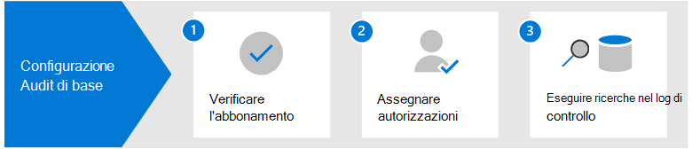

# Soluzioni di controllo in Microsoft 365

Le soluzioni di controllo di Microsoft 365 rappresentano una soluzione integrata per aiutare le organizzazioni a rispondere in modo efficace a eventi di sicurezza, indagini forensi, indagini interne e obblighi di conformità. Migliaia di operazioni dell'utente e dell'amministratore eseguite in decine di servizi e soluzioni Microsoft 365 vengono acquisite, registrate e conservate nei log di audit unificati della tua organizzazione. I record di controllo di questi eventi possono essere ricercati da operazioni di sicurezza, amministratori IT, team di rischio Insider e investigatori legali e di conformità della tua organizzazione. Questa funzionalità fornisce visibilità sulle attività eseguite nella tua organizzazione Microsoft 365.

## Soluzioni di controllo di Microsoft 365

Microsoft 365 fornisce due soluzioni di controllo: Audit di base e Audit avanzato.

### Audit di base

Audit di base ti consente di registrare e ricercare le attività controllate e di eseguire le tue indagini forensi, IT, di conformità e legali.

- **Abilitato per impostazione predefinita**. Audit di base è attivato per impostazione predefinita per tutte le organizzazioni che hanno sottoscritto l'abbonamento appropriato. Ciò significa che i record delle attività controllate saranno acquisiti e ricercabili. Come unica configurazione viene richiesto di assegnare i permessi necessari per accedere allo strumento di ricerca log di audit (e il cmdlet corrispondente) e assicurarsi che agli utenti sia fornita la giusta licenza per le funzionalità di Audit avanzato.
- **Migliaia di eventi di audit ricercabili**. Puoi cercare un'ampia gamma di attività controllate che si verificano nella maggior parte dei servizi Microsoft 365 nella tua organizzazione. Per un elenco parziale delle attività che puoi cercare, vedi [Attività controllate](search-the-audit-log-in-security-and-compliance.md#audited-activities). Per un elenco dei servizi e delle funzioni che supportano le attività controllate, vedi [Tipo di record del log di audit](/office/office-365-management-api/office-365-management-activity-api-schema#auditlogrecordtype).
- **Strumento di ricerca log di audit nel Centro conformità Microsoft 365**. Usa lo strumento di ricerca log di audit nel Centro conformità Microsoft 365 per cercare i record di controllo. Puoi cercare attività specifiche, attività eseguite da utenti specifici e attività che si sono verificate con un intervallo di date. Ecco uno screenshot dello strumento di ricerca log di audit nel Centro conformità.

   

- **Cmdlet Search-UnifiedAuditLog**. Puoi anche usare il cmdlet **Search-UnifiedAuditLog** di PowerShell di Exchange Online (il cmdlet sottostante per lo strumento di ricerca) per cercare eventi di audit o per usarli in uno script. Per altre informazioni, vedi:

  - [Riferimento cmdlet Search-UnifiedAuditLog](/powershell/module/exchange/search-unifiedauditlog).
  - [Usare uno script PowerShell per la ricerca nel log di audit](audit-log-search-script.md)

- **Esportare i record di controllo in un file CSV**. Dopo aver eseguito lo strumento di ricerca log di audit nel Centro conformità, puoi esportare i record di controllo restituiti dalla ricerca in un file CSV. In questo modo puoi usare Microsoft Excel per ordinare e filtrare in base a diverse proprietà dei record di controllo. Puoi anche usare la funzionalità di trasformazione Power Query per Excel per dividere ogni proprietà dell'oggetto JSON AuditData in una colonna specifica. In questo modo puoi visualizzare e confrontare in modo efficace dati simili per eventi diversi. Per ulteriori informazioni, vedi [Esportare, configurare e visualizzare i record del log di audit](export-view-audit-log-records.md).

- **Accedere ai log di audit tramite l'API Office 365 Management Activity**. Un terzo metodo per accedere e recuperare i record di controllo è tramite l'API Office 365 Management Activity. In questo modo le organizzazioni possono conservare i dati di controllo per periodi più lunghi dei 90 giorni predefiniti e importare i dati di controllo in una soluzione SIEM. Per ulteriori informazioni, vedi [Riferimento API Office 365 Management Activity](/office/office-365-management-api/office-365-management-activity-api-reference).

- **Conservazione del log di audit per 90 giorni**. Quando un'attività di controllo viene eseguita da un utente o da un amministratore, viene generato un record di controllo che viene archiviato nel log di controllo per l'organizzazione. In Audit di base, i record vengono conservati per 90 giorni, quindi puoi cercare le attività che si sono verificate negli ultimi tre mesi.

### Audit avanzato

Audit avanzato si basa sulle funzionalità di Audit di base fornendo criteri di conservazione del log di audit, conservazione più lunga dei record di controllo, eventi cruciali a valore elevato e accesso a larghezza di banda più elevata all'API Office 365 Management Activity.

- **Criteri di conservazione dei log di audit**. Puoi creare criteri di conservazione dei log di audit personalizzati per conservare i record di controllo per periodi di tempo più lunghi fino a un anno (e fino a 10 anni per gli utenti con la licenza per un componente aggiuntivo richiesto). Puoi creare un criterio per conservare i record di controllo in base al servizio in cui si verificano le attività controllate, specifiche attività controllate o in base all'utente che esegue un'attività controllata.

- **Conservazione più lunga dei record di controllo**. Per impostazione predefinita, i record di controllo di Exchange, SharePoint e Azure Active Directory vengono conservati per un anno. Per impostazione predefinita, i record di controllo per tutte le altre attività vengono conservati per 90 giorni. Puoi usare i criteri di conservazione del log di audit per configurare periodi di conservazione più lunghi.

- **Eventi cruciali con valore elevato**. I record di controllo per eventi cruciali consentono alle organizzazioni di svolgere indagini forensi e di conformità fornendo visibilità a eventi come l'accesso a elementi della posta elettronica o la risposta e l'inoltro di elementi della posta elettronica e le ricerche degli utenti in Exchange Online e SharePoint Online. Questi eventi cruciali consentono di indagare sulle possibili violazioni e stabilire la portata della compromissione.

- **Larghezza di banda più elevata per l'API Office 365 Management Activity**. Audit avanzato offre alle organizzazioni più larghezza di banda per accedere ai log di controllo tramite l'API Office 365 Management Activity. Nonostante a tutte le organizzazioni (con Audit di base o Audit avanzato) sia stata inizialmente assegnata una previsione di 2.000 richieste al minuto, questo limite aumenterà in modo dinamico in base al numero di postazioni di un'organizzazione e all'abbonamento di licenza. Di fatto, le organizzazioni con Audit avanzato hanno una larghezza di banda doppia rispetto alle organizzazioni con Audit di base.

Per informazioni più dettagliate sulle funzionalità di Audit avanzato, vedi [ Audit avanzato in Microsoft 365](advanced-audit.md).

## Confronto tra funzionalità chiave

La tabella seguente contiene un confronto delle funzionalità principali disponibili in Audit di base e Audit avanzato. Tutte le funzionalità di Audit di base sono incluse in Audit avanzato.

|Capacità|Audit di base|Audit avanzato|
|:------|:-------------|:-------------|
|Abilitato per impostazione predefinita|||
|Migliaia di eventi di controllo ricercabili|||
|Strumento di ricerca log di audit nel Centro conformità Microsoft 365|||
|cmdlet Search-UnifiedAuditLog|||
|Esportazione dei record di controllo in un file CSV|||
|Accesso ai log di audit tramite l'API Office 365 Management Activity 1|||
|Conservazione dei log di audit per 90 giorni|||
|Conservazione dei log di audit per 1 anno|||
|Conservazione dei log di audit per 10 anni 2|||
|Criteri di conservazione dei log di audit|||
|Eventi cruciali e ad alto valore|||
||||
> [!NOTE]
> 1 Audit avanzato include un accesso a larghezza di banda più elevata all'API Office 365 Management Activity, che consente di accedere più rapidamente ai dati di controllo. 2 Oltre alle licenze necessarie per Audit avanzato (descritte nella prossima sezione), all'utente deve essere assegnata una licenza aggiuntiva per la conservazione del log di audit per 10 anni per poter conservare i record di controllo per 10 anni.

## Requisiti di licenza

Le sezioni seguenti identificano i requisiti di licenza per Audit di base e Audit avanzato. Le funzionalità di Audit di base sono incluse in Audit avanzato.

### Audit di base

- Abbonamento a Microsoft 365 Enterprise E3
- Microsoft 365 Business Premium
- Abbonamento a Microsoft 365 Education A3
- Abbonamento a Microsoft 365 Government G3
- Abbonamento a Microsoft 365 Government G1
- Abbonamento a Office 365 Enterprise E3
- Abbonamento a Office 365 Enterprise E1
- Abbonamento a Office 365 Education A1
- Abbonamento a Office 365 Education A3

### Audit avanzato

- Abbonamento a Microsoft 365 Enterprise E5
- Abbonamento a Microsoft 365 Enterprise E3 + componente aggiuntivo Microsoft 365 E5 Compliance
- Abbonamento a Microsoft 365 Enterprise E3 + componente aggiuntivo Microsoft 365 E5 eDiscovery and Audit
- Abbonamento a Microsoft 365 Education A5
- Abbonamento a Microsoft 365 Education A3 + componente aggiuntivo Microsoft 365 A5 Compliance
- Abbonamento a Microsoft 365 Education A3 + componente aggiuntivo Microsoft 365 A5 eDiscovery and Audit
- Abbonamento a Microsoft 365 Government G5
- Abbonamento a Microsoft 365 Government G5 + componente aggiuntivo Microsoft 365 G5 Compliance
- Abbonamento a Microsoft 365 Government G5 + componente aggiuntivo Microsoft 365 G5 eDiscovery and Audit
- Abbonamento a Office 365 Enterprise E5
- Abbonamento a Office 365 Education A5
- Abbonamento a Office 365 Enterprise E3 + componente aggiuntivo Office 365 Advanced Compliance (non più disponibile per i nuovi abbonamenti)

## Configurare soluzioni di controllo di Microsoft 365

Per iniziare a usare le soluzioni di controllo in Microsoft 365, vedi le indicazioni seguenti per la configurazione.

### Configurare Audit di base

Il primo passaggio consiste nel configurare Audit di base, quindi avviare l'esecuzione di ricerche nel log di audit.

1. Verifica che l'organizzazione abbia sottoscritto un abbonamento che supporti Audit di base e, se applicabile, un abbonamento che supporti Audit avanzato.

2. Assegna autorizzazioni in Exchange Online agli utenti dell'organizzazione che useranno lo strumento di ricerca log di audit nel Centro conformità Microsoft 365 o il cmdlet **Search-UnifiedAuditLog**. In particolare, è necessario assegnare agli utenti il ruolo dei log di audit di sola lettura o dei log di audit in Exchange Online.

3. Cerca il log di audit. Dopo aver completato i passaggi 1 e 2, gli utenti dell'organizzazione possono usare lo strumento di ricerca log di audit (o il cmdlet corrispondente) per cercare le attività controllate.

Per istruzioni più dettagliate, vedi [Configurare Audit di base](set-up-basic-audit.md).

### Configurare Audit avanzato

Se l'organizzazione ha sottoscritto un abbonamento che supporta Audit avanzato, attieniti ai passaggi seguenti per configurare e usare le funzionalità aggiuntive di Audit avanzato.

1. Configura Audit avanzato per gli utenti. Questo passaggio è costituito dalle attività seguenti:

   - Verifica dell'assegnazione della licenza o del componente aggiuntivo appropriato per Audit avanzato agli utenti.
  
   - Attivazione dell'app o del piano di servizio Audit avanzato per tali utenti.
  
   - Abilitazione del controllo di eventi cruciali e quindi attivazione dell'app o del piano di servizio di Audit avanzato per tali utenti.

2. Abilita la registrazione di eventi cruciali quando gli utenti eseguono ricerche in Exchange Online e SharePoint Online.

3. Configura i criteri di conservazione del log di audit. Oltre ai criteri predefiniti che conservano i record di controllo di Exchange, SharePoint e Azure AD per un anno, puoi creare altri criteri di conservazione del log di audit per soddisfare i requisiti delle operazioni di sicurezza, dell'IT e dei team di conformità dell'organizzazione.

4. Cerca eventi cruciali e altre attività durante indagini forensi. Dopo aver completato i passaggi 1 e 2, puoi cercare eventi cruciali e altre attività nel log di audit durante indagini forensi relative ad account compromessi e ad altri tipi di indagini sulla sicurezza o sulla conformità.

Per istruzioni più dettagliate, vedi [Configurare Audit avanzato](set-up-advanced-audit.md).

## Formazione

Formare il team delle operazioni di sicurezza, gli amministratori IT e il team di indagine della conformità nelle nozioni fondamentali per Audit di base e Audit avanzato consente all'organizzazione di iniziare a sfruttare più rapidamente le funzionalità di controllo per facilitare le indagini. Per consentire agli utenti dell'organizzazione di iniziare a eseguire il controllo, Microsoft 365 offre la risorsa seguente: [Descrivere le funzionalità di eDiscovery e di controllo di Microsoft 365](/learn/modules/describe-ediscovery-capabilities-of-microsoft-365).
