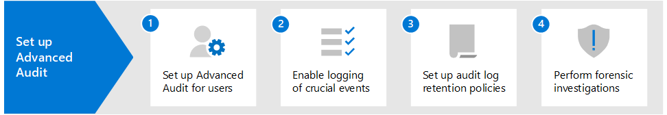

# Soluzioni di controllo in Microsoft 365Auditing solutions in Microsoft 365

Le soluzioni di controllo di Microsoft 365 rappresentano una soluzione integrata per aiutare le organizzazioni a rispondere in modo efficace a eventi di sicurezza, indagini forensi, indagini interne e obblighi di conformità.Microsoft 365 auditing solutions provide an integrated solution to help organizations effectively respond to security events, forensic investigations, internal investigations, and compliance obligations. Migliaia di operazioni dell'utente e dell'amministratore eseguite in decine di servizi e soluzioni Microsoft 365 vengono acquisite, registrate e conservate nei log di audit unificati della tua organizzazione.Thousands of user and admin operations performed in dozens of Microsoft 365 services and solutions are captured, recorded, and retained in your organization's unified audit log. I record di controllo di questi eventi possono essere ricercati da operazioni di sicurezza, amministratori IT, team di rischio Insider e investigatori legali e di conformità della tua organizzazione.Audit records for these events are searchable by security ops, IT admins, insider risk teams, and compliance and legal investigators in your organization. Questa funzionalità fornisce visibilità sulle attività eseguite nella tua organizzazione Microsoft 365.This capability provides visibility into the activities performed across your Microsoft 365 organization.

## Soluzioni di controllo di Microsoft 365Microsoft 365 auditing solutions

Microsoft 365 fornisce due soluzioni di controllo: Controllo di base e Audit avanzato.Microsoft 365 provides two auditing solutions: Basic auditing and Advanced Audit.

### Controllo di baseBasic auditing

Controllo di base ti dà la possibilità di registrare e cercare le attività controllate e di eseguire le tue indagini forensi, IT, di conformità e legali.Basic auditing provides with you with the ability to log and search for audited activities and power your forensic, IT, compliance, and legal investigations.

- **Abilitato per impostazione predefinita**.**Enabled by default**. Controllo di base è attivato per impostazione predefinita per tutte le organizzazioni con l'abbonamento appropriato.Basic auditing is turned on by default for all organizations with the appropriate subscription. Ciò significa che i record delle attività controllate saranno acquisiti e ricercabili.That means records for audited activities will be captured and searchable. Come unica configurazione viene richiesto di assegnare i permessi necessari per accedere allo strumento di ricerca log di audit (e il cmdlet corrispondente) e assicurarsi che agli utenti sia fornita la giusta licenza per le funzionalità di Audit avanzato.The only setup that required is to assign the necessary permissions to access the audit log search tool (and the corresponding cmdlet) and make sure that user's are assigned the right license for Advanced Audit features.
- **Migliaia di eventi di audit ricercabili**.**Thousands of searchable audit events**. Puoi cercare un'ampia gamma di attività controllate che si verificano nella maggior parte dei servizi Microsoft 365 nella tua organizzazione.You can search for a wide-range of audited activities that occur is most of the Microsoft 365 services in your organization. Per un elenco parziale delle attività che puoi cercare, vedi [Attività controllate](search-the-audit-log-in-security-and-compliance.md#audited-activities).For a partial list of the activities you can search for, see [Audited activities](search-the-audit-log-in-security-and-compliance.md#audited-activities). Per un elenco dei servizi e delle funzioni che supportano le attività controllate, vedi [Tipo di record del log di audit](/office/office-365-management-api/office-365-management-activity-api-schema#auditlogrecordtype).For a list of the services and features that support audited activities, see [Audit log record type](/office/office-365-management-api/office-365-management-activity-api-schema#auditlogrecordtype).
- **Strumento di ricerca log di audit nel Centro conformità Microsoft 365**.**Audit search tool in the Microsoft 365 compliance center**. Usa lo strumento di ricerca log di audit nel Centro conformità Microsoft 365 per cercare i record di controllo.Use the Audit log search tool in the Microsoft 365 compliance center to search for audit records. Puoi cercare attività specifiche, attività eseguite da utenti specifici e attività che si sono verificate con un intervallo di date.You can search for specific activities, for activities performed by specific users, and activities that occurred with a date range. Ecco uno screenshot dello strumento di ricerca log di audit nel Centro conformità.Here's a screenshot of the Audit search tool in the compliance center.

   

- **Cmdlet Search-UnifiedAuditLog**.**Search-UnifiedAuditLog cmdlet**. Puoi anche usare il cmdlet **Search-UnifiedAuditLog** di PowerShell di Exchange Online (il cmdlet sottostante per lo strumento di ricerca) per cercare eventi di audit o per usarli in uno script.You can also use the **Search-UnifiedAuditLog** cmdlet in Exchange Online PowerShell (the underlying cmdlet for the search tool) to search for audit events or to use in a script. Per altre informazioni, vedi:For more information, see:

  - [Search-UnifiedAuditLogSearch-UnifiedAuditLog](/powershell/module/exchange/search-unifiedauditlog)
  - [Usare uno script PowerShell per la ricerca nel log di auditUse a PowerShell script to search the audit log](audit-log-search-script.md)

- **Esportare i record di controllo in un file CSV**.**Export audit records to a CSV file**. Dopo aver eseguito lo strumento di ricerca log di audit nel Centro conformità, puoi esportare i record di controllo restituiti dalla ricerca in un file CSV.After run the Audit log search tool in the compliance center, you can export the audit records returned by the search to a CSV file. In questo modo puoi usare Microsoft Excel per ordinare e filtrare in base a diverse proprietà dei record di controllo.This lets you use Microsoft Excel sort and filter on different audit record properties. Puoi anche usare la funzionalità di trasformazione Power Query per Excel per dividere ogni proprietà dell'oggetto JSON AuditData in una colonna specifica.You can also use Excel Power Query transform functionality to split each property in the AuditData JSON object into its own column. In questo modo puoi visualizzare e confrontare in modo efficace dati simili per eventi diversi.This lets you effectively view and compare similar data for different events. Per ulteriori informazioni, vedi [Esportare, configurare e visualizzare i record del log di audit](export-view-audit-log-records.md).For more information, see [Export, configure, and view audit log records](export-view-audit-log-records.md).

- **Accedere ai log di audit tramite l'API Office 365 Management Activity**.**Access to audit logs via Office 365 Management Activity API**. Un terzo metodo per accedere e recuperare i record di controllo è tramite l'API Office 365 Management Activity.A third method for accessing and retrieving audit records is to use the Office 365 Management Activity API. In questo modo le organizzazioni possono conservare i dati di controllo per periodi più lunghi dei 90 giorni predefiniti e importare i dati di controllo in una soluzione SIEM.This lets organizations retain auditing data for longer periods than the default 90 days and lets them import their auditing data to a SIEM solution. Per informazioni, vedi [Riferimento API Office 365 Management Activity](/office/office-365-management-api/office-365-management-activity-api-reference).For information, see [Office 365 Management Activity API reference](/office/office-365-management-api/office-365-management-activity-api-reference).

- **Conservazione del log di audit per 90 giorni**.**90-day audit log retention**. Quando un'attività di controllo viene eseguita da un utente o da un amministratore, viene generato un record di controllo che viene archiviato nel log di controllo per l'organizzazione.When an audited activity is performed by a user or admin, an audit record is generated and stored in the audit log for your organization. In Controllo di base, i record vengono conservati per 90 giorni, quindi puoi cercare le attività che si sono verificate negli ultimi tre mesi.In Basic auditing, records are retained for 90 days, which means you can search for activities that occurred within the past three months.

### Audit avanzatoAdvanced Audit

Audit avanzato si basa sulle funzionalità di Controllo di base fornendo criteri di conservazione del log di audit, conservazione più lunga dei record di controllo, eventi cruciali a valore elevato e accesso a larghezza di banda più elevata all'API Office 365 Management Activity.Advanced Audit builds on the capabilities of Basic auditing by providing audit log retention policies, longer retention of audit records, high-value crucial events, and higher bandwidth access to the Office 365 Management Activity API.

- **Criteri di conservazione dei log di audit**.**Audit log retention policies**. Puoi creare criteri di conservazione dei log di audit personalizzati per conservare i record di controllo per periodi di tempo più lunghi fino a un anno (e fino a 10 anni per gli utenti con la licenza per un componente aggiuntivo richiesto).You can create customized audit log retention policies to retain audit records for longer periods of time up to one year (and up to 10 years for users with required add-on license). Puoi creare un criterio per conservare i record di controllo in base al servizio in cui si verificano le attività controllate, specifiche attività controllate o in base all'utente che esegue un'attività controllata.You can create a policy to retain audit records based the service where the audited activities occur, specific audited activities, or the user who performs an audited activity.

- **Conservazione più lunga dei record di controllo**.**Longer retention of audit records**. Per impostazione predefinita, i record di controllo di Exchange, SharePoint e Azure Active Directory vengono conservati per un anno.Exchange, SharePoint, and Azure Active Directory audit records are retained for one year by default. Per impostazione predefinita, i record di controllo per tutte le altre attività vengono conservati per 90 giorni. Puoi usare i criteri di conservazione del log di audit per configurare periodi di conservazione più lunghi.Audit records for all other activities are retained for 90 days by default, by you can use audit log retention policies to configure longer retention periods.

- **Eventi cruciali con valore elevato**.**High-value, crucial events**. Record di controllo per eventi cruciali consentono alle organizzazioni di svolgere indagini forensi e di conformità fornendo visibilità a eventi come l'accesso a elementi della posta elettronica, la risposta e l'inoltro di elementi della posta elettronica e le ricerche degli utenti in Exchange Online e SharePoint Online.Audit records for crucial events can help your organization conduct forensic and compliance investigations by providing visibility to events such as when mail items were accessed, or when mail items were replied to and forwarded, and when and what a user searched for in Exchange Online and SharePoint Online. Questi eventi cruciali consentono di indagare sulle possibili violazioni e stabilire la portata della compromissione.These crucial events can help you investigate possible breaches and determine the scope of compromise.

- **Larghezza di banda più elevata per l'API Office 365 Management Activity**.**Higher bandwidth to the Office 365 Management Activity API**. Audit avanzato offre alle organizzazioni più larghezza di banda per accedere ai log di controllo tramite l'API Office 365 Management Activity.Advanced Audit provides organizations with more bandwidth to access auditing logs through the Office 365 Management Activity API. Nonostante a tutte le organizzazioni (che hanno Controllo di base o Audit avanzato) sia stata inizialmente assegnata una previsione di 2.000 richieste al minuto, questo limite aumenterà in modo dinamico in base al numero di postazioni di un'organizzazione e all'abbonamento di licenza.Although all organizations (that have Basic auditing or Advanced Audit) are initially allocated a baseline of 2,000 requests per minute, this limit will dynamically increase depending on an organization's seat count and their licensing subscription. Di fatto, le organizzazioni con Audit avanzato hanno una larghezza di banda doppia rispetto alle organizzazioni con Controllo di base.This results in organizations with Advanced Audit getting about twice the bandwidth as organizations with Basic auditing.

Per informazioni più dettagliate sulle funzionalità di Audit avanzato, vedi [ Audit avanzato in Microsoft 365](advanced-audit.md).For more detailed information about Advanced Audit features, see [Advanced Audit in Microsoft 365](advanced-audit.md).

## Confronto tra funzionalità chiaveComparison of key capabilities

La tabella seguente contiene un confronto delle funzionalità chiave disponibili in Controllo di base e Audit avanzato.The following table compares the key capabilities available in Basic auditing and Advanced Audit. Tutte le funzionalità di Controllo di base sono incluse in Audit avanzato.All Basic auditing functionality is included in Advanced Audit.

|FunzionalitàCapability|Controllo di baseBasic auditing|Audit avanzatoAdvanced Audit|
|:------|:-------------|:-------------|
|Abilitato per impostazione predefinitaEnabled by default|||
|Migliaia di eventi di controllo ricercabiliThousands of searchable audit events|||
|Strumento di ricerca log di audit nel Centro conformità Microsoft 365Audit search tool in the Microsoft 365 compliance center|||
|Cmdlet **Search-UnifiedAuditLog****Search-UnifiedAuditLog** cmdlet|||
|Esportazione dei record di controllo in un file CSVExport audit records to CSV file|||
|Accesso ai log di audit tramite l'API Office 365 Management Activity 1Access to audit logs via Office 365 Management Activity API 1|||
|Conservazione dei log di audit per 90 giorni90-day audit log retention|||
|Conservazione dei log di audit per 1 anno1-year audit log retention|||
|Conservazione dei log di audit per 10 anni 210-year audit log retention 2|||
|Criteri di conservazione dei log di auditAudit log retention policies|||
|Eventi cruciali e ad alto valoreHigh-value, crucial events|||
||||
> [!NOTE]
> 1 Audit avanzato include un accesso a larghezza di banda più elevata all'API Office 365 Management Activity, che consente di accedere più rapidamente ai dati di controllo.1 Advanced Audit includes higher bandwidth access to the Office 365 Management Activity API, which provides faster access to audit data. 2 Oltre alle licenze necessarie per Audit avanzato (descritte nella prossima sezione), all'utente deve essere assegnata una licenza aggiuntiva per la conservazione del log di audit per 10 anni per poter conservare i record di controllo per 10 anni.2 In addition to the required licensing for Advanced Audit (described in the next section), a user must be assigned a 10-Year Audit Log Retention add on license to retain their audit records for 10 years.

## Requisiti di licenzaLicensing requirements

Le sezioni seguenti identificano i requisiti di licenza per Controllo di base e Audit avanzato.The following sections identify the licensing requirements for Basic auditing and Advanced Audit. Le funzionalità di Controllo di base sono incluse in Controllo avanzato.Basic auditing functionality is included with Advanced Auditing.

### Controllo di baseBasic auditing

- Abbonamento a Microsoft 365 Enterprise E3Microsoft 365 Enterprise E3 subscription
- Microsoft 365 Business PremiumMicrosoft 365 Business Premium
- Abbonamento a Microsoft 365 Education A3Microsoft 365 Education A3 subscription
- Abbonamento a Microsoft 365 Government G3Microsoft 365 Government G3 subscription
- Abbonamento a Microsoft 365 Government G1Microsoft 365 Government G1 subscription
- Abbonamento a Office 365 Enterprise E3Office 365 Enterprise E3 subscription
- Abbonamento a Office 365 Enterprise E1Office 365 Enterprise E1 subscription
- Abbonamento a Office 365 Education A1Office 365 Education A1 subscription
- Abbonamento a Office 365 Education A3Office 365 Education A3 subscription

### Audit avanzatoAdvanced Audit

- Abbonamento a Microsoft 365 Enterprise E5Microsoft 365 Enterprise E5 subscription
- Abbonamento a Microsoft 365 Enterprise E3 + componente aggiuntivo Microsoft 365 E5 ComplianceMicrosoft 365 Enterprise E3 subscription + the Microsoft 365 E5 Compliance add-on
- Abbonamento a Microsoft 365 Enterprise E3 + componente aggiuntivo Microsoft 365 E5 eDiscovery and AuditMicrosoft 365 Enterprise E3 subscription + the Microsoft 365 E5 eDiscovery and Audit add-on
- Abbonamento a Microsoft 365 Education A5Microsoft 365 Education A5 subscription
- Abbonamento a Microsoft 365 Education A3 + componente aggiuntivo Microsoft 365 A5 ComplianceMicrosoft 365 Education A3 subscription + the Microsoft 365 A5 Compliance add-on
- Abbonamento a Microsoft 365 Education A3 + componente aggiuntivo Microsoft 365 A5 eDiscovery and AuditMicrosoft 365 Education A3 subscription + the Microsoft 365 A5 eDiscovery and Audit add-on
- Abbonamento a Microsoft 365 Government G5Microsoft 365 Government G5 subscription
- Abbonamento a Microsoft 365 Government G5 + componente aggiuntivo Microsoft 365 G5 ComplianceMicrosoft 365 Government G5 subscription + the Microsoft 365 G5 Compliance add-on
- Abbonamento a Microsoft 365 Government G5 + componente aggiuntivo Microsoft 365 G5 eDiscovery and AuditMicrosoft 365 Government G5 subscription + the Microsoft 365 G5 eDiscovery and Audit add-on
- Abbonamento a Office 365 Enterprise E5Office 365 Enterprise E5 subscription
- Abbonamento a Office 365 Education A5Office 365 Education A5 subscription
- Abbonamento a Office 365 Enterprise E3 + componente aggiuntivo Office 365 Advanced Compliance (non più disponibile per i nuovi abbonamenti)Office 365 Enterprise E3 subscription + the Office 365 Advanced Compliance add-on (no longer available for new subscriptions)

## Configurare soluzioni di controllo di Microsoft 365Set up Microsoft 365 auditing solutions

Per iniziare a usare le soluzioni di controllo in Microsoft 365, vedi le indicazioni seguenti per la configurazione.To get started using the auditing solutions in Microsoft 365, see the following setup guidance.

### Configurare Controllo di baseSet up Basic auditing

Il primo passaggio consiste nel configurare Controllo di base e quindi avviare l'esecuzione di ricerche nel log di audit.The first step is to set up Basic auditing and then start running audit log searches.

1. Verifica che l'organizzazione abbia un abbonamento che supporti Controllo di base e, se applicabile, un abbonamento che supporti Audit avanzato.Verify that your organization has a subscription that supports Basic auditing and if applicable, a subscription that supports Advanced Audit.

2. Assegna autorizzazioni in Exchange Online agli utenti dell'organizzazione che useranno lo strumento di ricerca log di audit nel Centro conformità Microsoft 365 o il cmdlet **Search-UnifiedAuditLog**.Assign permissions in Exchange Online to people in your organization who will use the audit log search tool in the Microsoft 365 compliance center or the **Search-UnifiedAuditLog** cmdlet. In particolare, gli usi devono essere assegnati al ruolo dei log di audit di sola lettura o dei log di audit in Exchange Online.Specifically, uses must be assigned the View-Only Audit Logs or Audit Logs role in Exchange Online.

3. Esegui ricerche nel log di audit.Search the audit log. Dopo aver completato i passaggi 1 e 2, gli utenti dell'organizzazione possono usare lo strumento di ricerca log di audit (o il cmdlet corrispondente) per cercare le attività controllate.After completing step 1 and step 2, users in your organization can use the audit log search tool (or corresponding cmdlet) to search for audited activities.

### Configurare Audit avanzatoSet up Advanced Audit

Se l'organizzazione ha un abbonamento che supporta Audit avanzato, esegui la procedura seguente per configurare e usare le funzionalità aggiuntive di Audit avanzato.If your organization has a subscription that supports Advanced Audit, perform the follow steps to set up and use the additional capabilities in Advanced Audit.

1. Configura Audit avanzato per gli utenti.Set up Advanced Audit for users. Questo passaggio è costituito dalle attività seguenti:This step consists of the following tasks:

   - Verifica dell'assegnazione della licenza o del componente aggiuntivo appropriato per Audit avanzato agli utenti.Verifying that users are assigned the appropriate license or add-on license for Advanced Audit.
  
   - Attivazione dell'app o del piano di servizio Audit avanzato per tali utenti.Turning on the Advanced Audit app/service plan must be for those users.
  
   - Abilitazione del controllo di eventi cruciali e quindi attivazione dell'app o del piano di servizio di Audit avanzato per tali utenti.Enabling the auditing of crucial events and then turning on the Advanced Auditing app/service plan for those users.

2. Abilita la registrazione di eventi cruciali quando gli utenti eseguono ricerche in Exchange Online e SharePoint Online.Enable crucial events to be logged when users perform searches in Exchange Online and SharePoint Online.

3. Configura criteri di conservazione dei log di audit.Set up audit log retention policies. Oltre ai criteri predefiniti che conservano i record di controllo di Exchange, SharePoint e Azure AD per un anno, puoi creare altri criteri di conservazione del log di audit per soddisfare i requisiti delle operazioni di sicurezza, dell'IT e dei team di conformità dell'organizzazione.In additional to the default policy that retains Exchange, SharePoint, and Azure AD audit records for one year, you can create additional audit log retention policies to meet the requirements of your organization's security operations, IT, and compliance teams.

4. Cerca eventi cruciali e altre attività durante indagini forensi.Search for crucial events and other activities when conducting forensic investigations. Dopo aver completato i passaggi 1 e 2, puoi cercare eventi cruciali e altre attività nel log di audit durante indagini forensi relative ad account compromessi e ad altri tipi di indagini sulla sicurezza o sulla conformità.After completing step 1 and step 2, you can search the audit log for crucial events and other activities during forensic investigations of compromised accounts and other types of security or compliance investigations.

## FormazioneTraining

Formare il team delle operazioni di sicurezza, gli amministratori IT e il team di indagine della conformità in Controllo di base e Audit avanzato consente all'organizzazione di iniziare a usare più rapidamente le funzionalità di controllo per facilitare le indagini.Training your security operations team, IT administrators, and compliance investigators team in Basic auditing and Advanced Audit can help your organization get started more quickly using auditing to help with your investigations. Per consentire agli utenti dell'organizzazione di iniziare a eseguire il controllo, Microsoft 365 offre la risorsa seguente: [Descrivere le funzionalità di controllo in Microsoft 365](/learn/modules/describe-audit-capabilities-microsoft-365).Microsoft 365 provides the following resource to help these users in your organization getting started with auditing: [Describe the audit capabilities in Microsoft 365](/learn/modules/describe-audit-capabilities-microsoft-365).
